## 1 OpenMP 概述

### 1.1 从 MPI 到 OpenMP

在并行编程中，存在两种主流的编程模型：

**MPI（Message Passing Interface）** 采用进程进行消息传递：

- 每个进程的存储空间都是 **私有** 的，进程间没有共享存储
- 进程间的所有通信都需要显式调用例如 `Send` / `Recv` 等函数完成
- 程序通常采用 **SPMD**（Single Program Multiple Data）方式编写

**OpenMP（Open Multi-Processing）** 则是一种支持 **共享内存** 的应用开发接口和规范：

- 程序由一系列 **线程** 控制，线程继承了进程的资源（指令、内存等）
- 线程之间通过 **共享变量** 进行交互，直接读写即可达成通信目的
- 线程通过 **同步机制** 进行协同
- 不需要消息传递，直接读写变量

!!! abstract "定义 1（OpenMP）"
    OpenMP 是一种支持共享内存的应用开发接口和规范，包含 **编程指导语句** 、**库函数** 和 **环境变量** 三部分。

    - 常用于共享内存的多核处理器中进行并行计算
    - 简单、可移植性好
    - 支持 Fortran、C/C++ 等多种编程语言
    - 支持多种指令集架构和操作系统

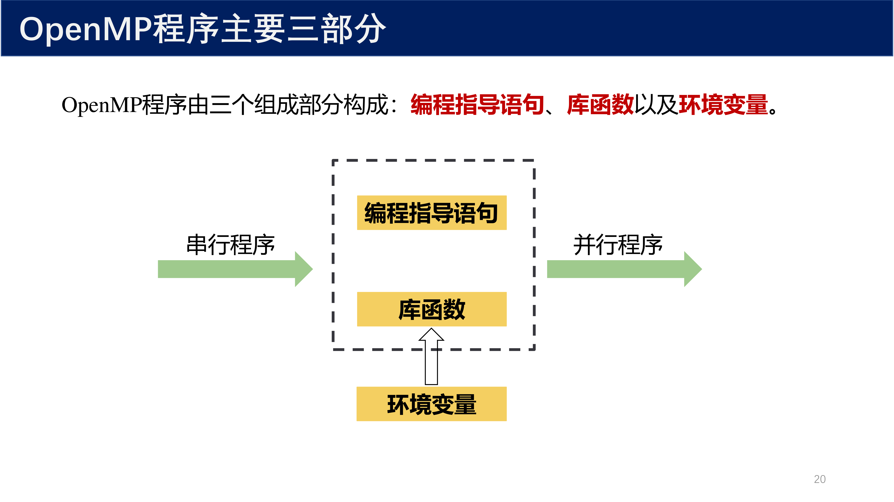{ width="800" }

### 1.2 OpenMP 的发展历史

OpenMP 由主要的计算机硬件和软件厂商共同制定：

| 年份 | 版本 | 主要特性 |
|------|------|----------|
| 1997 | Fortran 1.0 | 初始版本 |
| 1998 | C/C++ 1.0 | C/C++ 支持 |
| 2000 | Fortran 2.0 | 扩展特性 |
| 2002 | C/C++ 2.0 | 扩展特性 |
| 2005 | 合并标准 | 与 Fortran 和 C/C++ 标准规范结合 |
| 2008 | OpenMP 3.0 | 引入 task 和 collapse |
| 2013 | OpenMP 4.0 | 引入 simd、target 和 taskgroup |
| 2015 | OpenMP 4.5 | target enter/exit data 和 taskloop |

### 1.3 Hello World 程序

OpenMP 的 Hello World 程序展示了最基本的并行方式：

```cpp
#include <iostream>
#include <omp.h>

int main() {
    omp_set_num_threads(5);  // 设置线程数为 5
    
    #pragma omp parallel
    {
        std::cout << "Hello from thread " 
                  << omp_get_thread_num() << std::endl;
    }
    
    return 0;
}
```

编译与运行：

```bash
g++ -fopenmp -o hello hello.cpp
./hello
```

!!! warning "注意"
    由于多个线程并发输出，实际运行的结果中各行输出的顺序是 **不确定的** 。每次运行的结果可能都不一样。作为程序员，必须确保所有可能的交错都能产生正确结果。

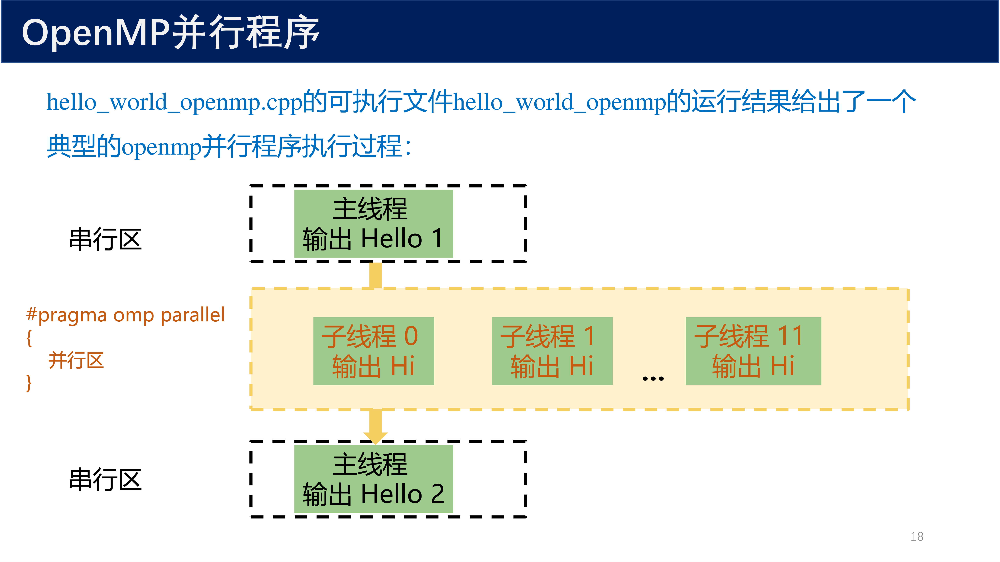{ width="800" }

## 2 Fork-Join 并行模式

### 2.1 并发性与并行

!!! abstract "定义 2（并发性）"
    如果有多个计算机的指令流，来自任何一个流的指令相比于来自其它流的指令是无序的，则这两个或多个指令流被称为是 **并发** 的。

并行和并发具有不同的含义：

- **并行（Parallelism）** ：通过硬件同时进行多个计算
- **并发（Concurrency）** ：逻辑上的同时执行，不要求物理上同时进行

编译 OpenMP 程序时，通过 `-fopenmp` 告诉编译器创建多线程程序。每个线程的语句都遵循程序定义的顺序，但在不同线程之间没有指定顺序。

### 2.2 Fork-Join 模式详解

OpenMP 主要采用 **Fork-Join 模式** 进行并行：

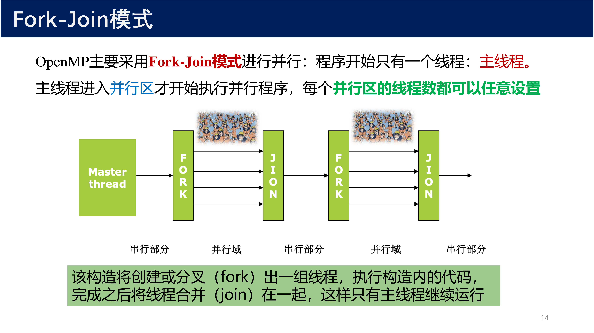{ width="800" }

执行流程：

1. 程序开始只有一个线程：**主线程**
2. 主线程进入 **并行区** 时，创建（fork）出一组线程
3. 所有线程共同执行并行区内的代码
4. 完成之后，线程合并（join），只有主线程继续运行
5. 每个并行区的线程数都可以任意设置

```cpp
// 串行区
#pragma omp parallel
{
    // 并行区：所有线程执行此处代码
}
// 串行区：只有主线程继续
```

## 3 OpenMP 编程三要素

OpenMP 程序由三个组成部分构成：

### 3.1 编程指导语句

OpenMP 所定义的指令依据编程语言不同采取不同形式。

**C/C++ 格式：**

```cpp
#pragma omp parallel [clause[[,] clause]…]
{
    // code executed by each thread
}
```

**Fortran 格式：**

```fortran
!$omp parallel [clause[[,] clause]…]
    ! code executed by each thread
!$omp end parallel
```

常见的编程指导语句包括：

- `parallel` — 创建并行区
- `for` / `do` — 共享工作循环构造
- `parallel for` / `parallel do` — 组合式并行循环构造
- `sections` — 任务分段构造
- `single` — 单线程执行构造
- `critical` — 临界区
- `barrier` — 线程同步栅栏

### 3.2 库函数

库函数是 OpenMP 默认提供的 API，用以辅助编程：

| 库函数 | 功能 |
|--------|------|
| `omp_set_num_threads(n)` | 设置并行区的线程数 |
| `omp_get_num_threads()` | 获取当前线程组中的线程数 |
| `omp_get_thread_num()` | 获取当前线程的 ID（0 开始） |
| `omp_get_max_threads()` | 获取可用的最大线程数 |
| `omp_get_num_procs()` | 获取处理器核心数 |

```cpp
int tid = omp_get_thread_num();      // 当前线程 ID
int nthreads = omp_get_num_threads(); // 线程组大小
```

### 3.3 环境变量

OpenMP 的库函数大多有对应的环境变量：

| 环境变量 | 功能 |
|----------|------|
| `OMP_NUM_THREADS` | 设置默认线程数 |
| `OMP_SCHEDULE` | 设置默认调度策略 |

```bash
# 设置环境变量
export OMP_NUM_THREADS=4

# 查看环境变量
echo $OMP_NUM_THREADS

# 清除环境变量
unset OMP_NUM_THREADS
```

### 3.4 线程数的确定优先级

并行区中的线程数按照下面 **从低到高** 的优先级确定：

1. **系统默认** — 一般是可用的处理器核数
2. **`OMP_NUM_THREADS`** 环境变量设定
3. **`omp_set_num_threads`** 库函数设定
4. **`num_threads`** 从句设定
5. **`if`** 从句（条件并行）

!!! tip "优先级记忆技巧"
    越靠近代码的设定优先级越高：系统默认 < 环境变量 < 库函数 < 指令从句 < 条件判断。

### 3.5 条件并行：if 从句

`if` 从句可以实现 **条件并行** ，只有当条件满足时才开启多线程：

```cpp
#pragma omp parallel for num_threads(4) if(n > 1000)
for (int i = 0; i < n; i++) {
    // 只有当 n > 1000 时才并行执行
}
```

如果 `if` 条件不满足，即使有 `num_threads` 设置，也会以单线程执行。

## 4 SPMD 设计模式

### 4.1 SPMD 核心思想

!!! abstract "定义 3（SPMD）"
    **SPMD**（Single Program, Multiple Data）：单程序多数据。同一程序复制到各个处理器上，不同的数据分布在不同的处理器上，各处理器均运行相同的程序，但对不同的数据执行操作。

SPMD 在 MPI 中被广泛使用，也可以应用在 OpenMP 中。核心步骤：

1. 启用两个或多个执行相同代码的线程
2. 每个线程确定其 ID 和线程组中的线程数
3. 依据 ID 和线程数在线程之间分配工作

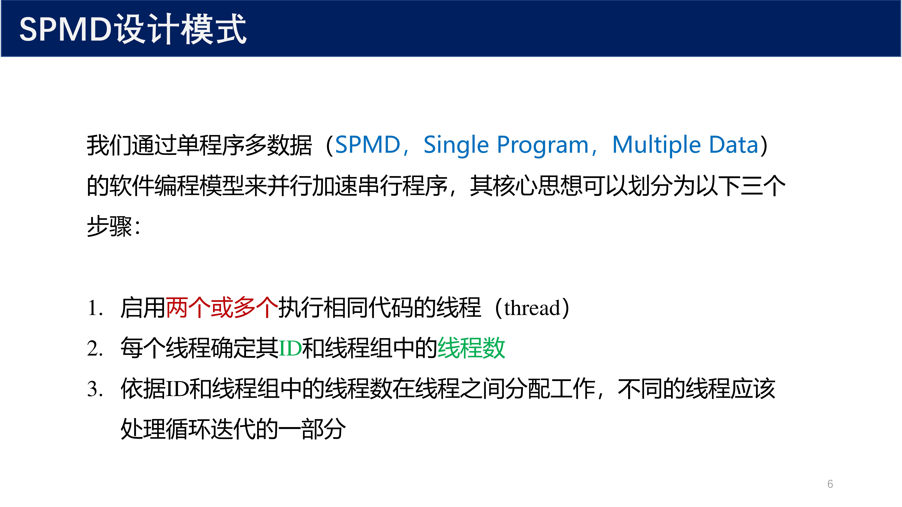{ width="800" }

### 4.2 手动实现循环并行

以计算 $\pi$ 为例，数学上：

$$
\int_0^1 \frac{4.0}{1 + x^2} dx = \pi
$$

将积分近似为多个矩形面积的和：

$$
\sum_{i=0}^{N} F(x_i) \Delta x \approx \pi
$$

**方法 1：周期性分布（Cyclic Distribution）**

```cpp
int tid = omp_get_thread_num();
int nthreads = omp_get_num_threads();
double sum = 0.0;

for (int i = tid; i < N; i += nthreads) {
    double x = (i + 0.5) * step;
    sum += 4.0 / (1.0 + x * x);
}
```

每个线程处理每隔 `nthreads` 个数据，实现负载的周期性分配。

**方法 2：块状分解（Block Decomposition）**

```cpp
int tid = omp_get_thread_num();
int nthreads = omp_get_num_threads();
int istart = tid * N / nthreads;
int iend = (tid + 1) * N / nthreads;
double sum = 0.0;

for (int i = istart; i < iend; i++) {
    double x = (i + 0.5) * step;
    sum += 4.0 / (1.0 + x * x);
}
```

将数据划分为连续的块，每个线程负责一块。

!!! info "两种分布方式对比"
    - **周期性分布** ：线程轮流获取数据，负载均匀但缓存局部性较差
    - **块状分布** ：连续数据分配给同一线程，缓存局部性好但可能出现负载不均

## 5 共享工作的循环构造

### 5.1 基本语法

OpenMP 提供了 **共享工作循环构造** ，让编译器自动划分循环迭代：

```cpp
#pragma omp for [clause[[,] clause]…]
for (int i = 0; i < N; i++) {
    // loop body
}
```

循环必须满足以下条件：

- 循环索引是基本整数类型
- 初始化表达式 `init-expr` 给循环变量赋初值
- 关系表达式 `test-expr` 使用 `<`、`<=`、`>`、`>=` 等运算符
- 增量表达式 `incr-expr` 使用 `++`、`--` 或固定常量的加减

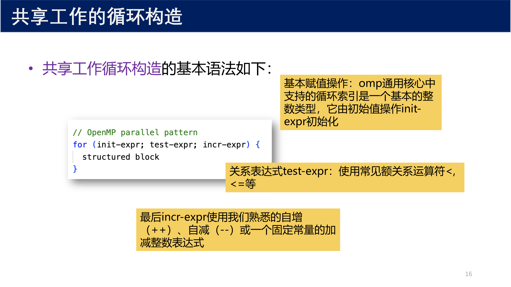{ width="800" }

### 5.2 parallel for 组合构造

最常见的模式是将 `parallel` 和 `for` 组合使用：

```cpp
#pragma omp parallel
{
    #pragma omp for
    for (int i = 0; i < N; i++) {
        // loop body
    }
}
```

可以简化为 **组合式构造** ：

```cpp
#pragma omp parallel for
for (int i = 0; i < N; i++) {
    // loop body
}
```

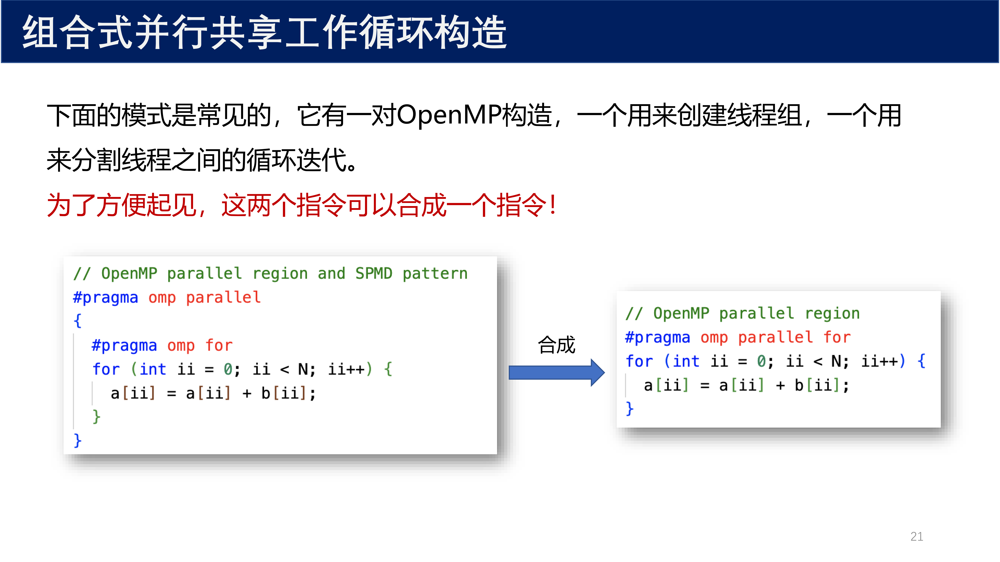{ width="800" }

!!! tip "组合构造的优势"
    `parallel for` 是最常见的 OpenMP 编程样式，代码更简洁，同时创建线程并分配循环迭代。

### 5.3 循环控制变量的私有化

考虑循环控制变量索引 $i$：

- 每个线程在执行其循环迭代时都会读取和修改 $i$ 的值
- 如果该变量在线程之间共享，读取和更新将以不可预知的方式发生冲突，导致 **数据竞争**
- OpenMP 要求编译器为每个线程创建循环控制索引变量的 **私有副本**

!!! warning "注意"
    本规则只适用于紧接着共享工作循环构造的循环。其它嵌套在里面的循环，其索引不会被自动私有化。

### 5.4 隐式同步

对于所有的共享工作构造，在构造的末尾都有一个 **隐式栅栏** ：所有线程都会在共享工作循环构造的结尾处等待，直到所有在该构造运行的线程组结束。

可以使用 `nowait` 从句来取消隐式同步：

```cpp
#pragma omp for nowait
for (int i = 0; i < N; i++) {
    // 循环结束后不等待其他线程
}
```

## 6 规约

### 6.1 什么是规约

!!! abstract "定义 4（规约）"
    **规约** 是将一组数据通过指定二元运算（如 $+$、$\times$、`max`、`min`）合并成一个值的并行计算操作。

规约在日常编程中极为常见。考虑如下求和问题：

```cpp
double sum = 0.0;
for (int i = 0; i < N; i++) {
    sum += array[i];  // 循环携带依赖性
}
```

变量 `sum` 出现了 **循环携带依赖性** ，在不改变循环主体结构的情况下，无法直接通过共享工作循环构造并行化。

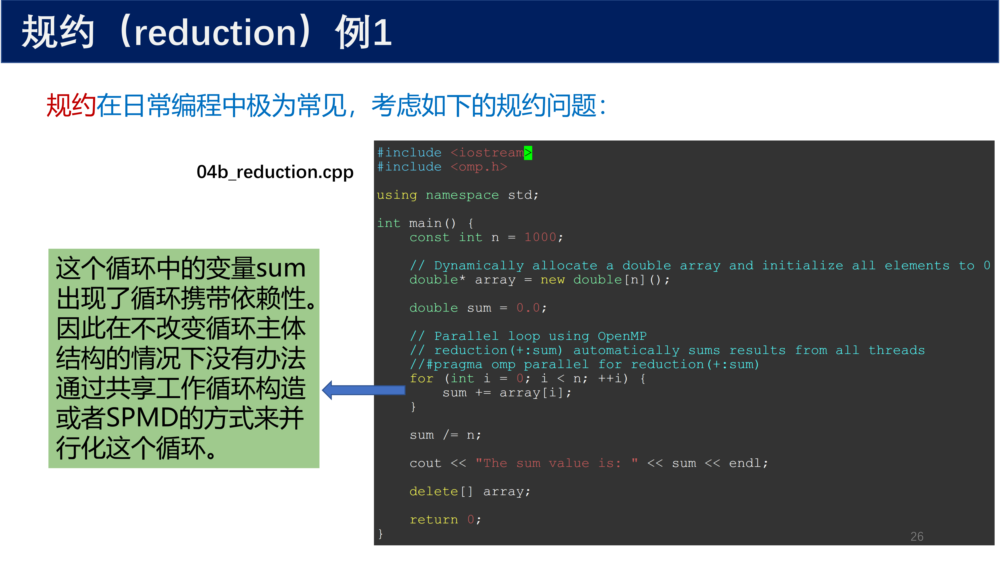{ width="800" }

### 6.2 reduction 子句

OpenMP 提供了 `reduction` 子句来处理规约操作：

```cpp
double sum = 0.0;
#pragma omp parallel for reduction(+:sum)
for (int i = 0; i < N; i++) {
    sum += array[i];
}
```

执行过程：

1. OpenMP 为每一个线程创建 `sum` 的一个 **私有副本**（初始化为对应运算符的初始值）
2. 每个线程计算 `array[i]` 的部分和并更新局部变量 `sum`
3. 循环完成之后，将各线程的部分和与全局的 `sum` 原始值 **合并** 得到最终结果

### 6.3 为什么缺少 reduction 会导致结果随机

!!! warning "核心问题：数据竞争（Data Race）"
    `sum += array[i]` 在底层 **不是原子操作** ，而是被分解为"读-改-写"三步。多个线程同时执行时，它们的指令会任意交错，导致某些线程的更新被覆盖。

#### 拆解 `sum += array[i]`

这条语句在 CPU 层面被分解为 3 步：

```
1. LOAD:   从内存读取 sum 到寄存器   →  reg = sum
2. ADD:    寄存器加上 array[i]        →  reg = reg + array[i]
3. STORE:  将结果写回内存             →  sum = reg
```

#### 并发执行的时间线

假设 2 个线程，初始 `sum = 0`，分别要加 `array[0] = 1` 和 `array[1] = 2`。期望结果是 `sum = 3`。

**情况 A：幸运地正确（概率极低）**

```
Thread 0:  LOAD sum=0 ── ADD reg=1 ── STORE sum=1
Thread 1:                    LOAD sum=1 ── ADD reg=3 ── STORE sum=3
```

**情况 B：典型的错误（丢失更新）**

```
Thread 0:  LOAD sum=0 ── ADD reg=1 ── STORE sum=1
Thread 1:  LOAD sum=0 ── ADD reg=2 ── STORE sum=2
                                          ↑
                                    覆盖了 Thread 0 的结果！
```

结果 `sum = 2`（期望 3，丢失了 Thread 0 的 `+1`）。

**情况 C：另一种错误**

```
Thread 0:  LOAD sum=0 ── ADD reg=1
Thread 1:                    LOAD sum=0 ── ADD reg=2 ── STORE sum=2
Thread 0:  STORE sum=1  ← 覆盖了 Thread 1！
```

结果 `sum = 1`（期望 3，丢失了 Thread 1 的 `+2`）。

#### "随机"的真正含义

!!! abstract "数据竞争的特征"
    - **非确定性**：由于线程调度由操作系统决定，每次运行的指令交错顺序不同
    - **静默性**：不崩溃、不报错、很难调试
    - **难以复现**：在调试器里可能表现正常（Heisenbug）
    - **概率性**：线程越多、竞争越激烈，错误概率越高

假设 $n = 1000$，所有 `array[i] = 1`，正确结果应为 1000。

| 运行次数 | 可能结果 | 原因 |
|---------|---------|------|
| 第 1 次 | `sum = 523` | 某些更新被覆盖 |
| 第 2 次 | `sum = 487` | 不同的交错模式 |
| 第 3 次 | `sum = 512` | 又一种交错 |

实际结果在 $[n/T, n]$ 之间随机分布，且 **几乎不可能等于 $n$** 。

#### 加了 reduction 后为什么正确

`reduction(+:sum)` 的本质是编译器为每个线程创建 **私有的 `sum` 副本** ：

```cpp
// 编译器实际生成的伪代码
double sum_local[thread_count] = {0};  // 每个线程私有

#pragma omp parallel
{
    int tid = omp_get_thread_num();
    
    #pragma omp for
    for (int i = 0; i < n; ++i) {
        sum_local[tid] += array[i];   // 各写各的，无竞争
    }
}

// 串行合并
sum = 0;
for (int t = 0; t < thread_count; ++t) {
    sum += sum_local[t];
}
```

**关键区别**：

- 没有 `reduction`：所有线程 **共享同一个 `sum`** → 竞争
- 有 `reduction`：每个线程有 **私有的 `sum` 副本** → 无竞争

!!! tip "检测数据竞争的方法"
    使用 ThreadSanitizer（TSan）：
    ```bash
    g++ -fsanitize=thread -fopenmp program.cpp
    ```
    或者多次运行观察结果是否变化——如果每次结果不同，几乎肯定是数据竞争。

### 6.4 规约运算符与初始值

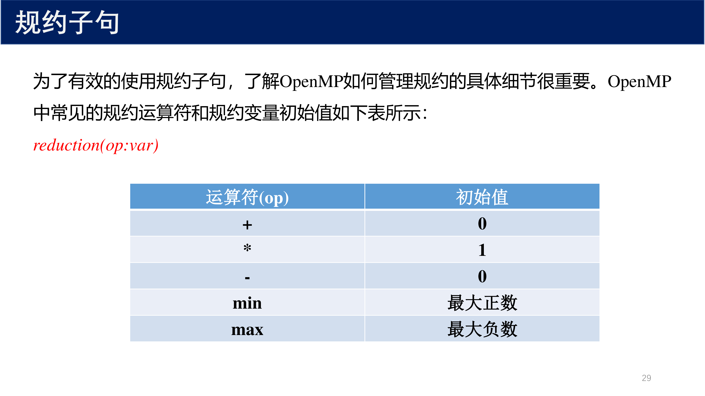{ width="800" }

| 运算符 (op) | 初始值 | 说明 |
|-------------|--------|------|
| `+` | $0$ | 求和 |
| `*` | $1$ | 求积 |
| `-` | $0$ | 减法 |
| `min` | 最大正数 | 求最小值 |
| `max` | 最大负数 | 求最大值 |

## 7 循环调度

### 7.1 schedule 子句概述

当我们使用共享工作循环构造时，实际上让编译器自动选择如何在线程之间分割循环。OpenMP 提供了 `schedule` 子句来控制这种分割方案。

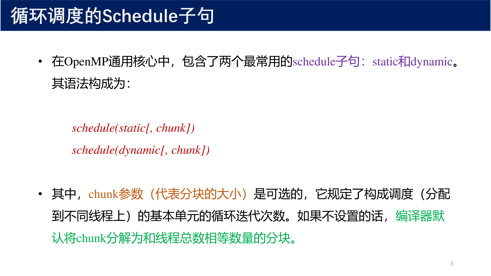{ width="800" }

基本语法：

```cpp
#pragma omp for schedule(static[, chunk])
#pragma omp for schedule(dynamic[, chunk])
#pragma omp for schedule(guided[, chunk])
#pragma omp for schedule(auto)
```

其中 `chunk` 参数（分块大小）是可选的，规定了构成调度的基本单元的循环迭代次数。

!!! abstract "定义 5（调度方式）"
    OpenMP 中的 `schedule` 从句用于指定并行循环中迭代的调度方式，共有四种：

    - **static** ：将循环迭代均分到线程之间，适用于迭代次数固定且迭代时间相对较短的情况
    - **dynamic** ：将循环迭代动态分配给线程，适用于迭代次数不固定且迭代时间相对较长的情况
    - **guided** ：与 dynamic 类似，但线程每次获取的迭代块大小会随着迭代推进逐步减小
    - **auto** ：让系统自动选择最适合的调度方式

### 7.2 static 静态调度

**不设置 chunk 参数（默认块状分配）：**

```cpp
#pragma omp parallel for schedule(static)
for (int i = 0; i < 6; i++) {
    // 6 个数据分配给 3 个线程
}
```

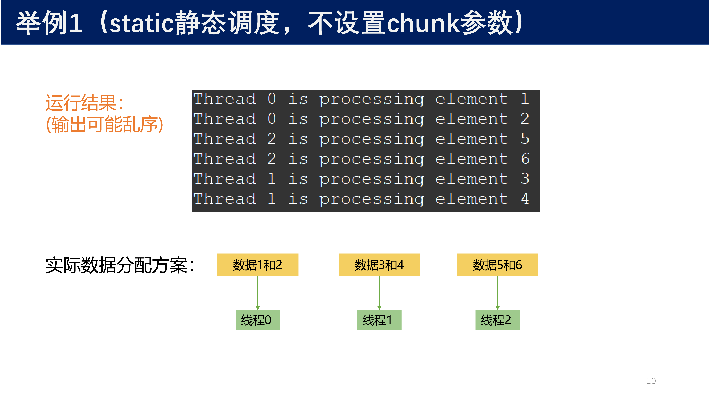{ width="800" }

默认行为：编译器将数据分解为和线程总数相等数量的分块。

- 数据 1, 2 → 线程 0
- 数据 3, 4 → 线程 1
- 数据 5, 6 → 线程 2

**设置 chunk = 2：**

```cpp
#pragma omp parallel for schedule(static, 2)
for (int i = 0; i < 8; i++) {
    // 每 2 个相邻计算作为一块，分发给线程
}
```

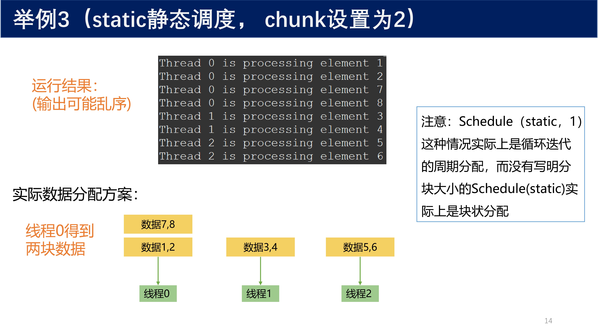{ width="800" }

- 数据 1, 2 → 线程 0
- 数据 3, 4 → 线程 1
- 数据 5, 6 → 线程 2
- 数据 7, 8 → 线程 0（循环分配）

!!! info "static 调度策略公式"
    如果指定了分块大小，OpenMP 会将循环分解为连续的指定大小的迭代分块，然后按循环方式分配给各线程。

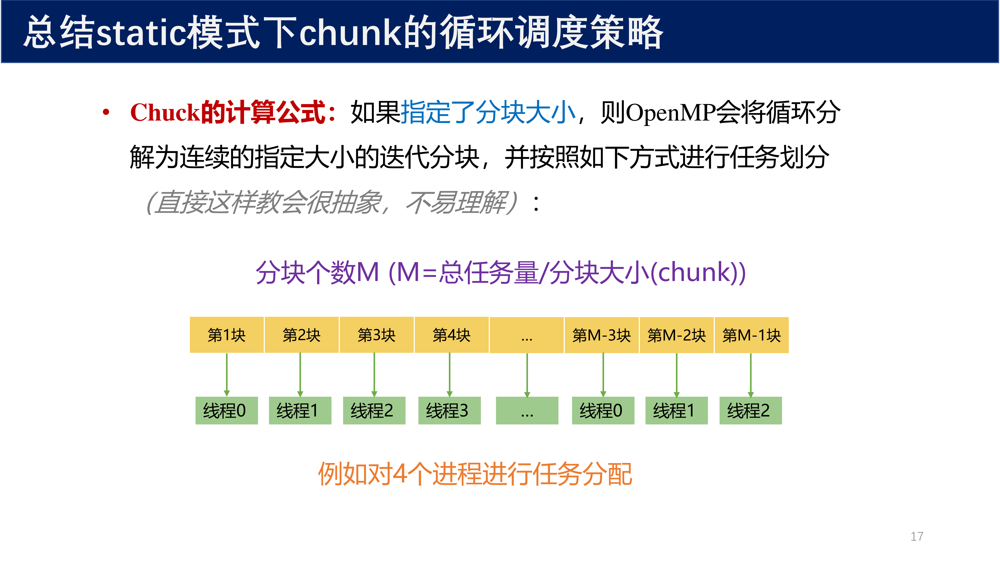{ width="800" }

**何时使用 static 调度？**

- 每次迭代的工作量是 **可预测且均衡** 的
- 运行时调度开销最小，编译时即可确定调度逻辑
- 适合负载均匀、迭代时间固定的场景

### 7.3 dynamic 动态调度

当循环中各个线程的运行时间差异较大时，静态调度可能面临问题：

- **情况一** ：循环迭代的工作量变化很大（如自适应网格细分、粒子模拟）
- **情况二** ：系统中处理器以不同速度运行

```cpp
#pragma omp parallel for schedule(dynamic)
for (int i = 0; i < N; i++) {
    // 动态分配迭代任务
}
```

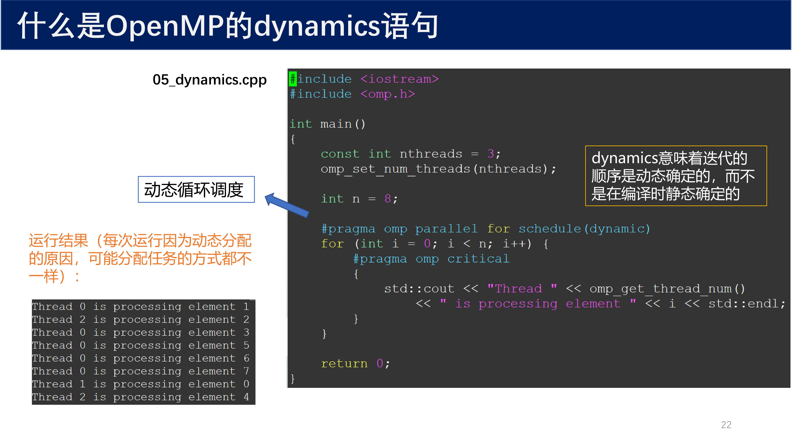{ width="800" }

`dynamic` 意味着迭代的顺序是 **动态确定** 的，而不是在编译时静态确定。每次有线程空闲时，从任务池中动态获取下一个 chunk 的任务。

**动态调度举例：判断质数**

```cpp
#pragma omp parallel for schedule(dynamic)
for (int n = 2; n <= MAX; n++) {
    bool is_prime = true;
    for (int i = 2; i * i <= n; i++) {
        if (n % i == 0) {
            is_prime = false;
            break;  // 偶数只需判断 2 即可退出
        }
    }
    // 每个数的计算量高度可变
}
```

每次迭代的工作量是 **高度可变** 的：偶数只要判断 2 就可以退出，但奇数可能要算很多次。动态调度可以更好地均衡各线程的负载。

!!! warning "注意"
    `dynamic` 调度的运行时调度开销比 `static` 高得多。只有在负载确实不均匀时，动态调度的收益才能弥补其开销。

### 7.4 调度方案对比

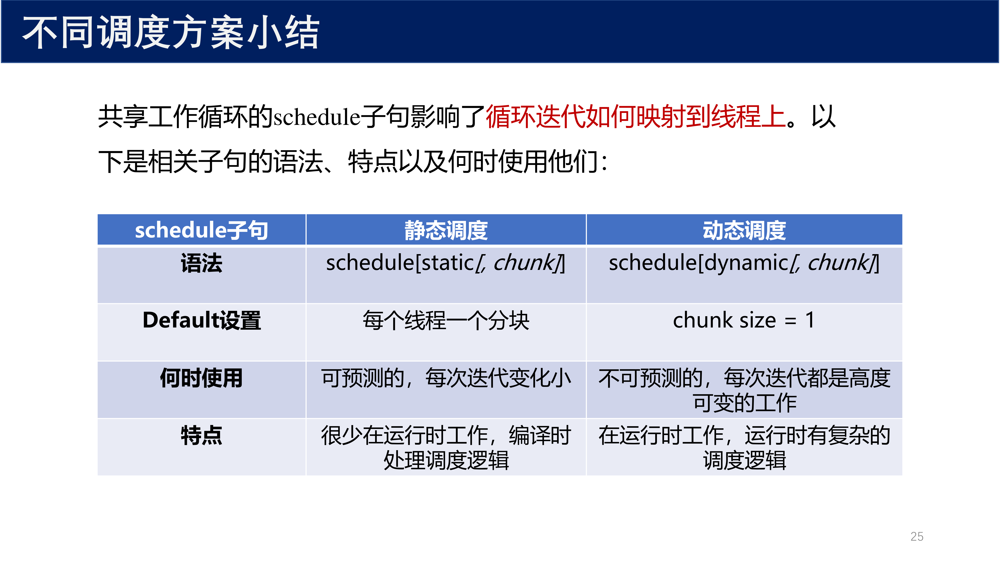{ width="800" }

| 特性 | static 静态调度 | dynamic 动态调度 |
|------|-----------------|------------------|
| **语法** | `schedule(static[, chunk])` | `schedule(dynamic[, chunk])` |
| **默认 chunk** | 每个线程一个分块（`ndata / nthreads`） | `chunk = 1` |
| **调度时机** | 编译时确定 | 运行时动态分配 |
| **负载均衡** | 固定分配，可能出现不均衡 | 自动负载均衡 |
| **运行时开销** | 很小 | 较大 |
| **适用场景** | 可预测的、每次迭代变化小的均匀负载 | 不可预测的、每次迭代高度可变的工作 |

## 8 OpenMP 数据环境

### 8.1 数据环境与缺省存储属性

!!! abstract "定义 6（OpenMP 数据环境）"
    在 OpenMP 共享区域中执行的线程既可以访问 **共享的地址空间** ，也可以访问该线程的 **私有空间** 。

OpenMP 通用核心中的大部分变量可被划分为如下两种存储属性：

- **私有（private）** ：如果一个变量可以被一个线程所访问，而线程组内的其他线程没有办法看到这个变量，那么这个变量就是私有的，或者等价于线程的局部变量
- **共享（shared）** ：线程组中所有线程都可以访问该变量（既可以读也可以写）

OpenMP 是一个 **共享内存** 的编程模型。在并行区域外定义的变量，默认是 **共享的** ；而在并行区域内、`parallel` 块内定义的局部变量，默认是 **私有的** 。

从操作系统视角理解：

- **程序启动** ：操作系统创建一个进程来运行程序，进程包含 $n$ 个线程，还包括这 $n$ 个线程可见的内存块（通常是堆）
- **堆变量** 默认是共享的，但可以通过 OpenMP 的数据属性子句改变它在并行区域内的可见性行为
- **线程栈** 中的变量默认是私有的，仅对所属线程可见

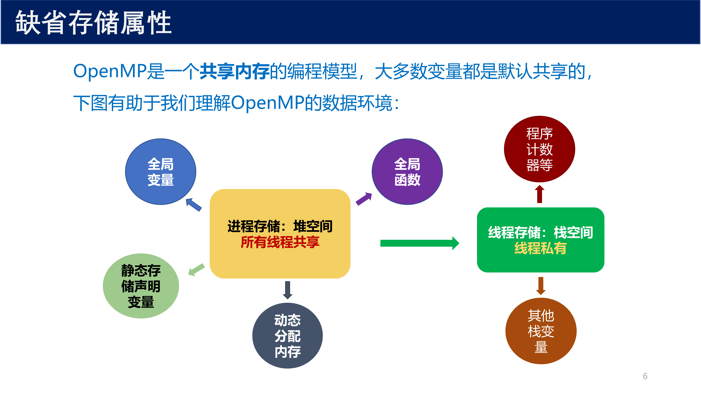{ width="800" }

!!! tip "变量作用域判定规则"
    - 并行区域 **外** 定义的全局变量、静态变量、动态分配内存 → 默认 **共享**
    - 并行区域 **内** 定义的局部自动变量 → 默认 **私有**
    - `static` 变量在函数内部定义时，注意它不是线程的私有变量

### 8.2 shared 子句

当线程遇到 OpenMP 构造的时候会创建一个新的数据环境，同时 OpenMP 中数据环境子句会将原先老的数据环境中的变量映射到新区域的数据环境中。

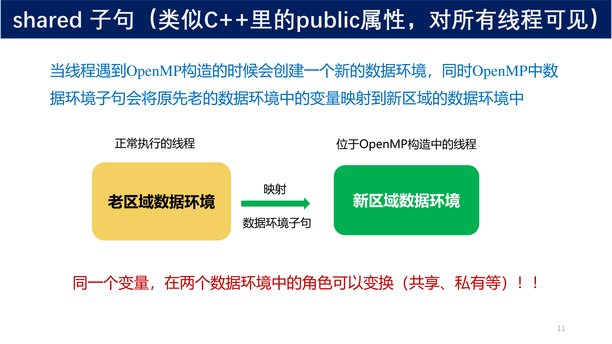{ width="800" }

!!! warning "重要"
    同一个变量，在两个数据环境中的角色可以变换（共享、私有等）！

`shared` 子句用于显式声明共享变量（类似 C++ 里的 `public` 属性，对所有线程可见）：

```cpp
#pragma omp parallel shared(a)
{
    // a 对所有线程可见
}
```

虽然并行区域外定义的变量默认就是共享的，但将共享变量与 `shared` 子句一起列出是 **好的编程实践** 。

!!! warning "注意"
    即使用 `shared` 来修饰，在 `for` 循环里的 **循环迭代变量** 强制是私有变量，这是 OpenMP 的语法规定。

### 8.3 private 子句

`private` 语句用于在并行执行的代码块中声明一个 **私有变量** ：

```cpp
#pragma omp parallel private(x)
{
    // 每个线程都拥有私有变量 x 的独立副本
    int x = 0;
}
```

!!! abstract "定义 7（private）"
    私有变量是 **每个线程独立拥有** 的变量，每个线程都有自己的副本。在并行执行的代码块中，私有变量的值在不同线程之间是相互独立的，不会相互影响。

**关键特性：**

- `private` 变量在并行区域内与并行区域外的同名原始变量 **没有存储关联**
- 进入并行区域时，`private` 变量的值是 **未初始化的**（不会自动继承外部值）
- 退出并行区域后，外部同名变量的值 **保持不变**

```cpp
int a = 0;
#pragma omp parallel private(a)
{
    a = omp_get_thread_num() + 1;  // 每个线程的 a 互不影响
}
// 此处 a 仍然是 0（外部变量未被修改）
```

### 8.4 firstprivate 与 lastprivate

#### firstprivate

`firstprivate` 子句与 `private` 类似，但会根据变量 **原始的值来初始化** 私有变量副本：

```cpp
int a = 10;
#pragma omp parallel firstprivate(a)
{
    // 每个线程的 a 初始值都是 10
    a = a + 90;  // 线程内修改为 100
}
// 外部 a 仍然是 10
```

#### lastprivate

`lastprivate` 会把 **最后** 一个迭代（或 `sections` 的最后一个 section）中私有变量的值 **带出并行区域** ：

```cpp
int a = 10;
#pragma omp parallel for lastprivate(a)
for (int i = 0; i < 4; ++i) {
    a = i + 1;  // 各线程私有
}
// 循环结束后，a 的值为最后一次迭代（i=3）时的值：4
```

| 子句 | 进入并行区 | 退出并行区 |
|------|-----------|-----------|
| `private` | 未初始化 | 外部变量不变 |
| `firstprivate` | 用外部值初始化 | 外部变量不变 |
| `lastprivate` | 未初始化 | 用最后一次迭代的值更新外部变量 |

### 8.5 default 子句

OpenMP 程序中最常见的错误来源之一是变量有错误的存储属性。`default` 子句可以强制要求显式声明：

```cpp
#pragma omp parallel for default(none) \
    shared(arr, len) \
    reduction(max:max_val) \
    reduction(min:min_val) \
    reduction(*:product)
for (int i = 0; i < len; i++) {
    // 所有变量必须显式声明属性
}
```

!!! tip "default(none)"
    `default(none)` 标识传递到并行区域的所有变量 **必须明确列在** `private`、`firstprivate`、`reduction` 或 `shared` 中。编译器会将任何没有在数据环境子句中列出的变量标记为错误，有助于 debug。

### 8.6 threadprivate 与全局变量私有化

#### threadprivate 核心定义

!!! abstract "定义 8（threadprivate）"
    `threadprivate` 用于声明 **线程局部存储（Thread-Local Storage, TLS）** ，让每个线程拥有某个 **全局/静态变量** 的 **独立私有副本** ，且这个副本在 **多个并行区域之间持久保存** 。

```cpp
int count;           // 普通全局变量，默认所有线程共享
#pragma omp threadprivate(count)  // 每个线程有自己独立的 count
```

#### 为什么需要 threadprivate

`private` 变量仅在当前 `parallel` 区域内有效，区域结束后即销毁。而 `threadprivate` 的副本 **跨多个并行区域持久存在** ，适用于线程需要"记忆"状态的场景：

```cpp
int thread_id_counter = 0;
#pragma omp threadprivate(thread_id_counter)

void task1() {
    #pragma omp parallel
    {
        thread_id_counter++;  // 线程 A: 0→1, 线程 B: 0→1（各自独立）
    }
}

void task2() {
    #pragma omp parallel
    {
        // thread_id_counter 仍然保留 task1 中的值！
        printf("Thread %d count: %d\n", omp_get_thread_num(), thread_id_counter);
    }
}
```

如果没有 `threadprivate`，用 `private` 的话，`task2` 中的计数器会被重新初始化，丢失 `task1` 的结果。

#### 使用限制

`threadprivate` **只能用于** 全局变量或 `static` 变量：

| 可以 | 不可以 |
|------|--------|
| 全局变量（文件作用域） | 函数内普通局部变量 |
| `static` 局部变量 | 动态分配的内存（`new`/`malloc`） |
| `static` 类成员变量 | 非 static 的类成员 |

```cpp
// 文件顶部：全局变量
int buffer[1024];
#pragma omp threadprivate(buffer)

void func() {
    static int seed = 0;
    #pragma omp threadprivate(seed)     // 正确

    int local_var;
    #pragma omp threadprivate(local_var) // 编译错误！
}
```

#### private vs firstprivate vs threadprivate

| 特性 | `private` | `firstprivate` | `threadprivate` |
|------|-----------|----------------|-----------------|
| **作用对象** | 任意变量 | 任意变量 | 全局/static 变量 |
| **生命周期** | 仅当前 `parallel` 区域 | 仅当前 `parallel` 区域 | **跨多个并行区域持久存在** |
| **初始值** | 未定义 | 拷贝进入前的外部值 | 线程上一次留下的值 |
| **结束行为** | 销毁，外部变量不变 | 销毁，外部变量不变 | **保留，下次继续用** |
| **内存位置** | 线程栈上临时分配 | 线程栈上临时分配 | 线程专属的 TLS 存储区 |

用时间线直观对比：

- `private(x)`：每次重新创建，无记忆（`x=???` → 销毁 → `x=???` → 销毁）
- `firstprivate(x)`：每次从外部拷贝，无记忆（`x=外部值` → 销毁 → `x=外部值` → 销毁）
- `threadprivate(x)`：线程的长期"私有财产"（`x=初始值` → 保留 → `x=上次值` → 保留）

#### 典型应用场景

**场景 1：线程私有的随机数种子**

```cpp
static unsigned int seed;
#pragma omp threadprivate(seed)

void parallel_random() {
    #pragma omp parallel
    {
        seed = omp_get_thread_num() * 12345;

        #pragma omp for
        for (int i = 0; i < n; ++i) {
            int r = rand_r(&seed);  // 线程安全，各自用自己的种子
        }
    }
}
```

**场景 2：线程私有的工作缓冲区**

```cpp
double thread_buffer[1024];
#pragma omp threadprivate(thread_buffer)

void process_data(double* input, int n) {
    #pragma omp parallel for
    for (int i = 0; i < n; ++i) {
        prepare_data(input[i], thread_buffer);
        compute(thread_buffer);  // 无竞争，无需锁
    }
}
```

**场景 3：跨并行区域的累加器**

```cpp
int local_hit_count = 0;
#pragma omp threadprivate(local_hit_count)

void phase1() {
    #pragma omp parallel for
    for (...) {
        if (hit()) local_hit_count++;
    }
}

void phase2() {
    #pragma omp parallel for
    for (...) {
        if (hit2()) local_hit_count++;  // 累加 phase1 的结果
    }
}
```

#### copyin：初始化 threadprivate 变量

`threadprivate` 变量在程序开始时未初始化（或继承主线程的初始值）。如果要在进入并行区域时把主线程的当前值广播给所有线程，用 `copyin`：

```cpp
int threshold = 100;
#pragma omp threadprivate(threshold)

void update_threshold(int new_val) {
    threshold = new_val;  // 主线程修改
}

void parallel_work() {
    #pragma omp parallel copyin(threshold)
    {
        // 所有线程的 threshold 都是 new_val
        if (score > threshold) { ... }
    }
}
```

| 子句 | 作用 |
|------|------|
| `copyin(var)` | 把 **主线程** 的 `var` 值复制到 **所有线程** 的 `threadprivate` 副本 |

#### copyprivate

`copyprivate` 是 `single` 指令的 **专属子句** ，不能单独存在。它确保在 `single` 区域结束时，一个线程的私有变量的值被复制到其他所有线程的同名私有变量中：

```cpp
#pragma omp single copyprivate(a, b)
{
    a = 10;
    b = 20;  // 只有 single 执行的线程修改
}
// single 结束后，所有线程的 a=10, b=20
```

#### 底层实现原理

`threadprivate` 在运行时通过 **线程局部存储（TLS）** 实现：

```
主线程:    [全局变量区: count=10]
线程 1:    [TLS 区: count=5]   ← 线程 1 自己的副本
线程 2:    [TLS 区: count=8]   ← 线程 2 自己的副本
线程 3:    [TLS 区: count=2]   ← 线程 3 自己的副本
```

访问时通过线程 ID 索引到对应的 TLS 区。现代编译器通常通过 `__thread` / `thread_local` 等 TLS 机制实现。

#### 常见错误

!!! warning "错误 1：对非 static 局部变量使用"
    ```cpp
    void func() {
        int x = 0;
        #pragma omp threadprivate(x)  // 编译错误！
    }
    ```

!!! warning "错误 2：初始值未定义"
    ```cpp
    int counter;
    #pragma omp threadprivate(counter)
    #pragma omp parallel
    {
        counter++;  // 危险！初始值未定义
    }
    ```
    **解决**：显式初始化或用 `copyin`
    ```cpp
    int counter = 0;
    #pragma omp threadprivate(counter)
    #pragma omp parallel copyin(counter)
    {
        counter++;
    }
    ```

!!! warning "错误 3：与 private 混淆使用"
    ```cpp
    #pragma omp threadprivate(buf)
    #pragma omp parallel private(buf)  // 错误！不能同时用
    ```

## 9 OpenMP 3.0 与任务

### 9.1 single 构造回顾

`single` 构造是线程组中 **一个线程** 执行的共享工作构造，其他线程在构造结束时隐含的栅栏处等待。这个栅栏可以通过 `nowait` 子句来禁用：

```cpp
#pragma omp parallel
{
    #pragma omp single
    {
        // 只有一个线程执行此代码块
        std::cout << "Running with " << omp_get_num_threads() 
                  << " threads." << std::endl;
    }
    
    #pragma omp for
    for (int i = 0; i < N; i++) {
        array[i] = i * i;
    }
}
```

`single` 构造对于需要在多个线程之间共享变量或执行特定初始化或收尾操作的代码块非常有用。

### 9.2 不规则问题

对于大多数 OpenMP 程序员来说，**循环级并行** 是 OpenMP 的精髓。开发模式为：通过在串行程序中找到计算密集型的循环，并通过共享工作循环构造将其转化为并行应用程序。

但另有一类重要问题是 **不规则问题** （例如稀疏数据结构、链表遍历），并不反映到循环上：

```cpp
p = head;
while (p != NULL) {
    processwork(p);
    p = p->next;
}
```

!!! warning "为什么不能用 omp for？"
    - 共享循环工作构造只适合于带有 **循环增量** 和 **循环边界条件** 不变的 `for` 循环
    - `while` 循环的长度在编译时是 **未知的** ，不可转为 `for` 循环
    - 链表中的元素是依赖于数据的，而且是 **动态的**

**简单的链表并行（传统方法）：**

- 步骤 1：遍历链表，统计列表中的项数，分配数组存放节点指针
- 步骤 2：将每个节点的指针存放到数组中（第二次遍历）
- 步骤 3：用工作循环构造并行处理节点（第三次遍历）

由于需要遍历三次数据，这样的算法增加了大量额外开销。OpenMP 3.0 引入了更好的解决方法：**task 构造** 。

### 9.3 task 构造

OpenMP **任务** 是独立于线程的工作单元，通过 `task` 子句来显式创建。任务是由两部分组成的独立工作单元：

- 任务相关联的结构化块中的代码，以及该结构化块中调用的外部函数
- 任务相关联的数据环境

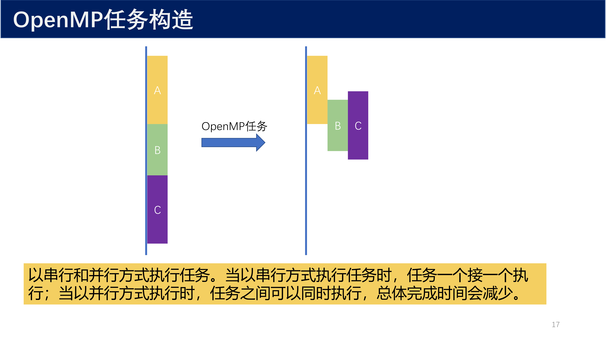{ width="800" }

**基本语法：**

```cpp
#pragma omp task [clause[, clause]...]
{
    // 任务代码块
}
```

可选子句包括 `schedule`、`reduction`、`nowait`、`shared`、`private`、`firstprivate` 等。

**计算 $\pi$ 的 task 并行版示例：**

```cpp
double comp_pi(int nstart, int nfinish, double step, int min_blk) {
    double x = 0.0, sum = 0.0;
    
    if (nfinish - nstart < min_blk) {
        // 计算量小于阈值，直接计算
        for (int i = nstart; i < nfinish; ++i) {
            x = (i + 0.5) * step;
            sum += 4.0 / (1.0 + x * x);
        }
    } else {
        // 否则拆分为两个 task
        int iblk = nfinish - nstart;
        double sum1 = 0.0, sum2 = 0.0;
        
        #pragma omp task shared(sum1)
        sum1 = comp_pi(nstart, nfinish - iblk/2, step, min_blk);
        
        #pragma omp task shared(sum2)
        sum2 = comp_pi(nfinish - iblk/2, nfinish, step, min_blk);
        
        #pragma omp taskwait
        sum = sum1 + sum2;
    }
    return sum;
}

int main() {
    omp_set_num_threads(4);
    int n = 1024, min_blk = 256;
    double step = 1.0 / (double)n;
    double sum = 0.0;
    
    #pragma omp parallel
    {
        #pragma omp single
        sum = comp_pi(0, n, step, min_blk);
    }
    
    double pi = step * sum;
    return 0;
}
```

!!! tip "task 使用要点"
    - `task` 通常与 `single` 一起使用：一个线程创建任务，其他线程从任务队列中抽取执行
    - `#pragma omp taskwait` 用于等待当前任务的所有子任务完成

**任务依赖关系：**

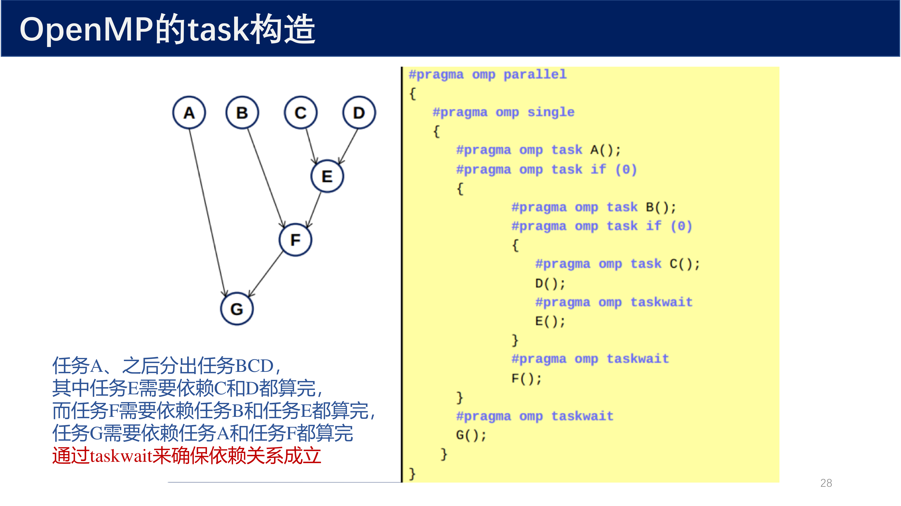{ width="800" }

```cpp
#pragma omp parallel
{
    #pragma omp single
    {
        #pragma omp task
        A();
        
        #pragma omp task
        B();
        
        #pragma omp task
        C();
        D();  // 同步执行
        
        #pragma omp taskwait
        E();  // 等待 C、D 完成
        
        #pragma omp taskwait
        F();  // 等待 B、E 完成
        
        #pragma omp taskwait
        G();  // 等待 A、F 完成
    }
}
```

### 9.4 task 的数据环境

任务（task）的数据环境与线程相比有如下不同：

- 任务的数据环境 **绑定的是任务** ，而不是线程
- 如果一个变量在任务构造上是 `shared`，那么在任务内部对该变量的引用指向同一个内存地址空间
- 如果一个变量在任务构造上是 `private`，那么构造内部对它的引用是指向任务执行时新创建的 **未初始化** 存储空间
- 如果一个变量在任务构造上是 `firstprivate`，那么构造内部对它的引用是指向任务执行时新创建的具有同名变量的存储空间，该空间使用构造时 `firstprivate` 变量进行初始化

### 9.5 sections 构造

在 OpenMP 3.0 支持 `task` 之前，OpenMP 还支持 `sections` 构造，用于将工作在固定数量的线程之间显式地划分：

```cpp
#pragma omp parallel sections
{
    #pragma omp section
    {
        std::cout << "Hello from section 1" << std::endl;
    }
    #pragma omp section
    {
        std::cout << "Hello from section 2" << std::endl;
    }
    #pragma omp section
    {
        std::cout << "Hello from section 3" << std::endl;
    }
}
```

每个 `section` 中的代码将在不同的线程中并行执行。`sections` 构造支持的从句：`private`、`firstprivate`、`lastprivate`、`reduction`、`nowait`。

!!! info "sections vs task"
    - `sections` 构造用于将工作在 **固定数量** 的线程之间显式地划分，每个 `section` 仅由一个线程执行，类似于一个并行的 `switch`
    - `task` 是更灵活的异步执行机制，可被 **任何线程** 抽取并执行，支持动态负载均衡

## 10 总结

!!! abstract "OpenMP 核心要点"
    - **进程 vs 线程** ：进程拥有独立资源，线程共享资源。线程的创建/销毁/调度开销远小于进程
    - **Fork-Join 模式** ：程序以单线程开始，进入并行区时 fork 出多线程，结束后 join 回主线程
    - **编程三要素** ：编程指导语句、库函数、环境变量
    - **线程数优先级** ：系统默认 < 环境变量 < 库函数 < `num_threads` < `if` 条件
    - **SPMD 模式** ：同一段代码，多线程按 ID 手动分配数据执行
    - **共享工作循环** ：`omp for` 自动划分循环，`parallel for` 是最常用组合写法
    - **reduction 规约** ：自动合并线程结果，解决竞态，常用 `+`、`*`、`max`、`min`
    - **隐式同步** ：工作共享构造末尾有隐式栅栏，可用 `nowait` 取消
    - **static 调度** ：静态预分配，开销小，适合均匀负载
    - **dynamic 调度** ：动态分配，负载均衡好，适合不均匀负载，但开销较大
    - **数据环境** ：堆变量默认共享，栈变量默认私有；可用 `shared`、`private`、`firstprivate`、`lastprivate` 显式控制
    - **全局变量私有化** ：`threadprivate` 为每个线程创建全局变量的独立副本；`copyin` 广播主线程值；`copyprivate` 在 `single` 后广播
    - **task 构造** ：OpenMP 3.0 引入，用于处理不规则问题和递归并行；独立于线程的异步执行单元，配合 `taskwait` 实现依赖控制
    - **sections 构造** ：将固定数量的代码段分配给不同线程执行，类似于并行的 `switch`
