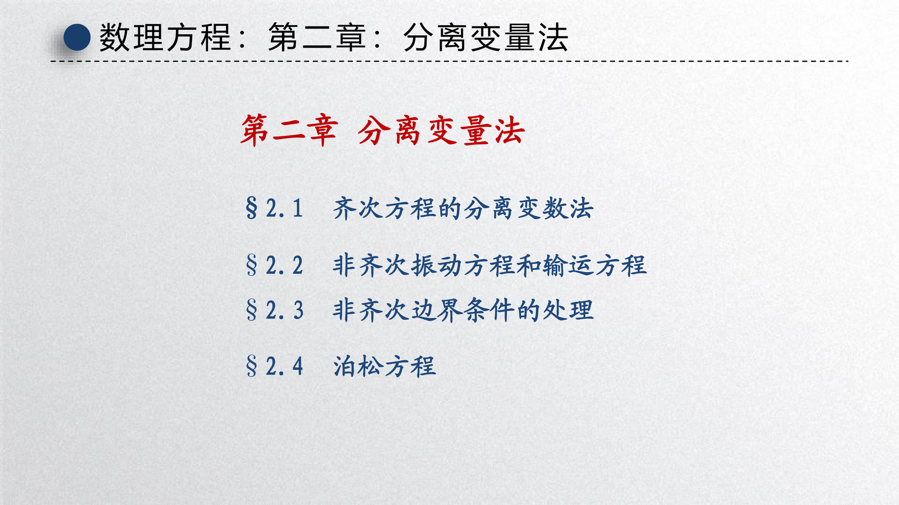
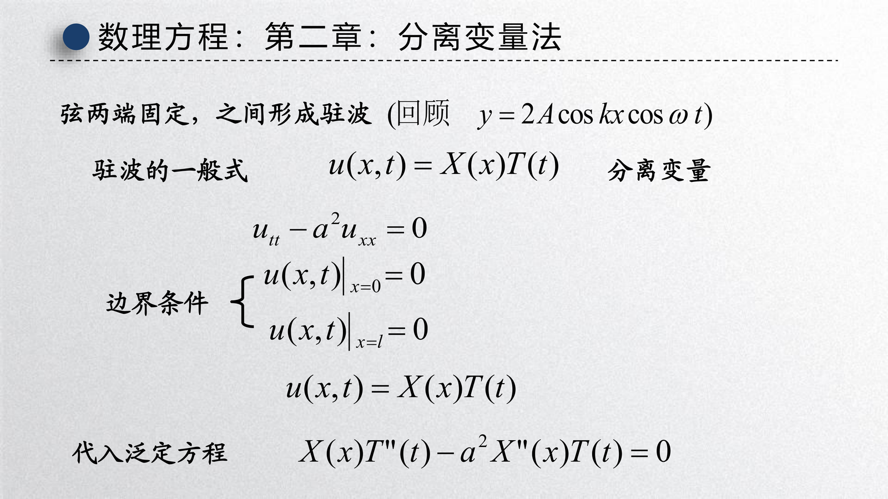
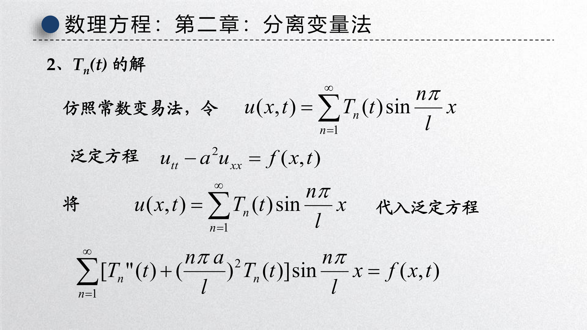
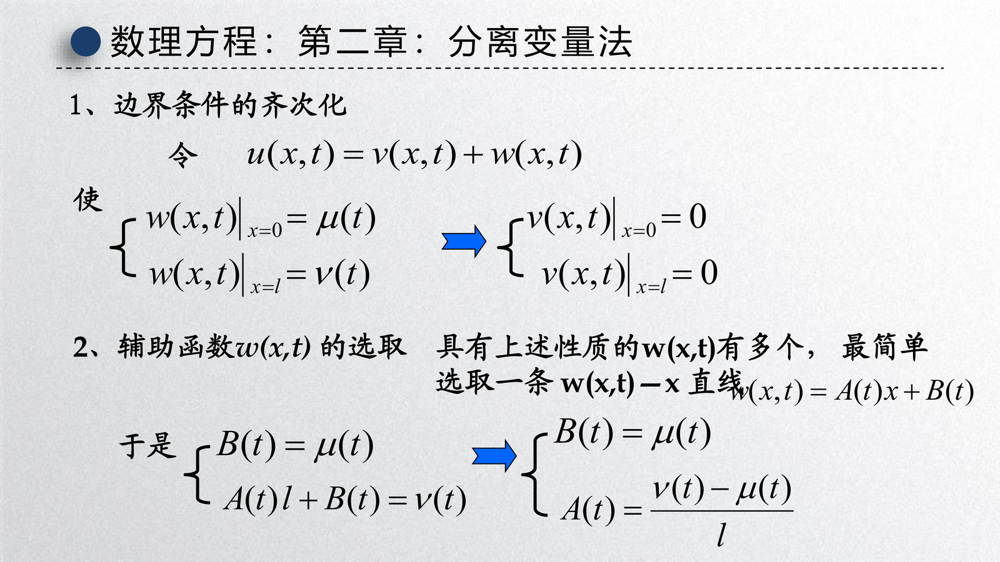
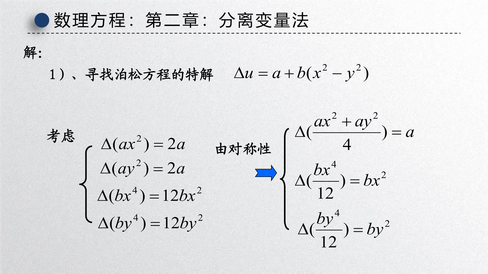

[第二章课件：分离变量法](slides/!%20工程数学_数理方程_第二章_分离变量法_20260512.pdf)

{ width="750" }

如果说第一章回答的是“方程从哪里来”，那么这一章回答的就是“**定解问题到底怎么解**”。课件把思路分成四块：

- 齐次方程的分离变量法
- 非齐次振动方程与输运方程
- 非齐次边界条件的处理
- 泊松方程的求解思路

整章的核心理念只有一句话：**把 PDE 拆成若干个 ODE，再把这些 ODE 的解按正交基叠加回来**。这就是分离变量法、Fourier 级数法以及后面特殊函数理论的共同起点。

---

## 1 分离变量法的基本思想

### 1.1 为什么要“分离”

考虑两端固定弦的齐次波动问题

$$
u_{tt} - a^2 u_{xx} = 0, \qquad 0 < x < l, \ t > 0,
$$

配以边界条件

$$
u(0,t) = 0, \qquad u(l,t) = 0
$$

和初始条件

$$
u(x,0) = \varphi(x), \qquad u_t(x,0) = \psi(x).
$$

课件从驻波形式出发，设

$$
u(x,t) = X(x)T(t).
$$

这种假设的含义是：空间形状与时间变化可以拆开，一个负责“模态形状”，一个负责“模态振荡”。

{ width="750" }

将 $u = XT$ 代入波动方程，得

$$
XT'' - a^2 X''T = 0.
$$

两边除以 $a^2XT$，得到

$$
\frac{T''}{a^2 T} = \frac{X''}{X} = -\lambda.
$$

于是原 PDE 被拆成两个 ODE：

$$
X'' + \lambda X = 0,
$$

$$
T'' + a^2 \lambda T = 0.
$$

同时边界条件变为

$$
X(0) = 0, \qquad X(l) = 0.
$$

### 1.2 特征值问题为什么会出现

一旦做出分离假设，空间部分不再是普通初值问题，而变成了 **边值问题**

$$
X'' + \lambda X = 0, \qquad X(0)=X(l)=0.
$$

这就是课件里反复强调的 **本征值问题 / 特征值问题**。只有某些特殊的 $\lambda$，它才有非零解。

分析三种情况：

1. $\lambda < 0$
2. $\lambda = 0$
3. $\lambda > 0$

前两种情形只能得到零解，只有 $\lambda > 0$ 时存在非平凡解。于是可得

$$
\lambda_n = \left(\frac{n\pi}{l}\right)^2, \qquad n=1,2,\ldots
$$

以及对应特征函数

$$
X_n(x) = \sin \frac{n\pi x}{l}.
$$

时间部分对应为

$$
T_n(t) = A_n \cos \frac{an\pi t}{l} + B_n \sin \frac{an\pi t}{l}.
$$

因此单个模态解写成

$$
u_n(x,t)
=
\left(
A_n \cos \frac{an\pi t}{l}
+
B_n \sin \frac{an\pi t}{l}
\right)
\sin \frac{n\pi x}{l}.
$$

!!! abstract "分离变量法的关键结论"
    在齐次边界条件下，空间部分给出一个正交特征函数系，时间部分则给出每个模态随时间的振荡或衰减规律。原问题的解通常是这些模态的线性叠加。

### 1.3 叠加原理与 Fourier 系数

由于波动方程与边界条件都是线性的，所以总解可以写成

$$
u(x,t)
=
\sum_{n=1}^{\infty}
\left(
A_n \cos \frac{an\pi t}{l}
+
B_n \sin \frac{an\pi t}{l}
\right)
\sin \frac{n\pi x}{l}.
$$

初始条件决定系数：

$$
\varphi(x)
=
\sum_{n=1}^{\infty} A_n \sin \frac{n\pi x}{l},
$$

$$
\psi(x)
=
\sum_{n=1}^{\infty} \frac{an\pi}{l} B_n \sin \frac{n\pi x}{l}.
$$

因此

$$
A_n = \frac{2}{l}\int_0^l \varphi(x)\sin \frac{n\pi x}{l}\,\mathrm{d}x,
$$

$$
B_n = \frac{2}{an\pi}\int_0^l \psi(x)\sin \frac{n\pi x}{l}\,\mathrm{d}x.
$$

这正是 Fourier 正弦级数在 PDE 中的典型用法。

---

## 2 齐次边界条件下的标准套路

### 2.1 波动方程

对两端固定的弦，分离变量后得到的是驻波模态。每一阶模态都像一个独立振子：

- 空间形状固定为 $\sin \dfrac{n\pi x}{l}$
- 时间上按频率 $\dfrac{an\pi}{l}$ 做简谐振动

因此总解就是无穷多个驻波的叠加。

!!! tip "为什么边界条件要求齐次"
    若边界条件形如 $u(0,t)=0,\ u(l,t)=0$，则代入 $u=XT$ 后会直接变成 $X(0)=X(l)=0$，从而得到纯空间的特征值问题。
    
    如果边界条件本身依赖于时间且不为零，空间和时间就无法直接分离，这也是本章后半部分要专门做“齐次化”的原因。

### 2.2 热方程

对于齐次热方程

$$
u_t - a^2 u_{xx} = 0,
$$

配相同的齐次边界条件，设 $u=XT$，可得

$$
X'' + \lambda X = 0, \qquad T' + a^2 \lambda T = 0.
$$

空间特征函数仍然是

$$
X_n(x) = \sin \frac{n\pi x}{l},
$$

但时间部分不再振荡，而是指数衰减：

$$
T_n(t) = C_n e^{-a^2 \left(\frac{n\pi}{l}\right)^2 t}.
$$

所以

$$
u(x,t)
=
\sum_{n=1}^{\infty}
C_n e^{-a^2 \left(\frac{n\pi}{l}\right)^2 t}
\sin \frac{n\pi x}{l}.
$$

这体现了热方程的耗散性：高频模态衰减得更快，温度分布会越来越平滑。

### 2.3 拉普拉斯方程

对于矩形区域上的拉普拉斯方程

$$
u_{xx} + u_{yy} = 0,
$$

设 $u(x,y)=X(x)Y(y)$，可得

$$
\frac{X''}{X} = -\frac{Y''}{Y} = -\lambda.
$$

于是通常得到一边是三角函数，另一边是双曲函数。再根据边界条件选择正弦、余弦、$\sinh$、$\cosh$ 的组合。

!!! info "同一个方法，不同的时间行为"
    - 波动方程：时间模态是正弦余弦
    - 热方程：时间模态是指数衰减
    - 拉普拉斯方程：没有时间变量，空间上两方向分别承担振荡与增长 / 衰减

---

## 3 非齐次振动方程与输运方程

### 3.1 非齐次振动方程的 Fourier 级数法

课件第 2.2 节考虑的是边界仍然齐次，但方程右端有外力：

$$
u_{tt} - a^2 u_{xx} = f(x,t),
\qquad
u(0,t)=u(l,t)=0.
$$

{ width="750" }

虽然外力项让 $u=XT$ 的“单模态分离”不再直接成立，但仍可以用特征函数展开：

$$
u(x,t) = \sum_{n=1}^{\infty} T_n(t)\sin \frac{n\pi x}{l},
$$

同时将外力也展开成

$$
f(x,t) = \sum_{n=1}^{\infty} f_n(t)\sin \frac{n\pi x}{l},
$$

其中

$$
f_n(t) = \frac{2}{l}\int_0^l f(x,t)\sin \frac{n\pi x}{l}\,\mathrm{d}x.
$$

代入后，每个模态满足一个受迫 ODE：

$$
T_n''(t) + a^2 \left(\frac{n\pi}{l}\right)^2 T_n(t) = f_n(t).
$$

这样，原来的 PDE 被拆成了一组彼此独立的二阶常微分方程。

### 3.2 模态方程的求解

这组 ODE 的通解由两部分组成：

- 齐次解：来自系统固有振动
- 特解：来自外力驱动

因此可以写成

$$
T_n(t)
=
A_n \cos \omega_n t
+
B_n \sin \omega_n t
+
T_n^{(p)}(t),
\qquad
\omega_n = \frac{an\pi}{l}.
$$

如果使用常数变易法或 Duhamel 思想，则特解可写成卷积形式：

$$
T_n^{(p)}(t)
=
\frac{1}{\omega_n}
\int_0^t
f_n(\tau)\sin \bigl[\omega_n (t-\tau)\bigr]
\,\mathrm{d}\tau.
$$

所以完整解的结构就是：

$$
u = \text{自由振动} + \text{受迫响应}.
$$

### 3.3 输运方程

课件同一节还讨论了输运方程。其典型形式为

$$
u_t + c u_x = f(x,t).
$$

它和波动 / 热方程不同，是一阶 PDE，通常不靠特征值展开，而是沿特征线

$$
x - ct = \text{常数}
$$

来求解。

当初始条件为 $u(x,0)=\varphi(x)$ 时，齐次方程

$$
u_t + c u_x = 0
$$

的解为

$$
u(x,t) = \varphi(x-ct),
$$

即初始形状以速度 $c$ 整体平移。若有源项，则可写成

$$
u(x,t)
=
\varphi(x-ct)
+
\int_0^t f\bigl(x-c(t-\tau), \tau\bigr)\,\mathrm{d}\tau.
$$

!!! tip "输运方程最值得记住的直觉"
    它不“扩散”、也不“反射”，而是把初始信息沿特征线直接搬运出去，因此最核心的概念是 **特征线** 与 **平移传播**。

---

## 4 非齐次边界条件的处理

### 4.1 为什么先要齐次化

当边界条件是

$$
u(0,t)=\mu(t), \qquad u(l,t)=\nu(t),
$$

时，若直接设 $u=XT$，边界条件会把 $x$ 和 $t$ 混在一起，无法得到单纯的空间特征值问题。

因此课件的标准做法是：

1. 先构造一个辅助函数 $w(x,t)$，使它单独满足原边界条件。
2. 再令

$$
u(x,t) = v(x,t) + w(x,t),
$$

使新的未知函数 $v$ 满足齐次边界条件。

{ width="750" }

### 4.2 辅助函数的选取

课件选择最简单的线性函数

$$
w(x,t) = A(t)x + B(t),
$$

并由

$$
w(0,t)=\mu(t), \qquad w(l,t)=\nu(t)
$$

解出

$$
B(t)=\mu(t), \qquad
A(t)=\frac{\nu(t)-\mu(t)}{l}.
$$

因此一个常用选择是

$$
w(x,t)
=
\mu(t) + \frac{x}{l}\bigl[\nu(t)-\mu(t)\bigr].
$$

这样定义后，$v=u-w$ 自动满足

$$
v(0,t)=0, \qquad v(l,t)=0.
$$

### 4.3 齐次化后的新问题

将 $u=v+w$ 代回原 PDE 后，$v$ 会满足一个新的非齐次方程，但边界已经齐次，因此又回到了上一节可以处理的框架：

- 空间上用特征函数展开
- 时间上解一组模态 ODE

这说明“齐次化边界”不是目的，而是为了重新获得 **正交特征函数展开** 的资格。

---

## 5 泊松方程的处理思路

### 5.1 基本想法：先找特解，再解齐次部分

课件第 2.4 节讨论泊松方程：

$$
\Delta u = f(x,y)
$$

的边值问题。它的思路和常微分方程完全一致：

1. 先找一个特解 $v$，使 $\Delta v = f$
2. 再令

$$
u = v + w,
$$

则 $w$ 满足拉普拉斯方程

$$
\Delta w = 0
$$

以及修正后的边界条件

$$
w|_{\partial\Omega} = g - v|_{\partial\Omega}.
$$

这样，泊松方程就被转化成一个更熟悉的拉普拉斯边值问题。

{ width="750" }

### 5.2 课件中的两个典型区域

课件给出了两种常见区域：

- **圆域**：利用极坐标和对称性，先猜测合适的多项式型特解，再把剩余问题化成拉普拉斯方程
- **矩形域**：同样先构造特解，再用分离变量法求解拉普拉斯方程部分

其共同结构都是：

$$
u = \text{一个方便验证的特解} + \text{满足齐次方程的校正项}.
$$

### 5.3 为什么泊松方程常和分离变量法一起讲

因为真正难的不是“写出 $\Delta u = f$”，而是：

- 源项怎样被吸收进特解
- 边界怎样被保留下来
- 剩余的拉普拉斯方程如何用正交展开解决

所以泊松方程这一节，本质上是在训练一种非常重要的分解思想：

$$
\text{非齐次问题}
\longrightarrow
\text{特解} + \text{齐次问题}.
$$

---

## 6 本章方法论总结

### 6.1 一套通用流程

课件整章其实反复在做同一件事，可以概括成下面的流程：

1. 先检查边界是否齐次。
2. 若齐次，则优先尝试分离变量。
3. 由空间边值问题得到特征值和特征函数。
4. 利用正交性展开初始条件或外力项。
5. 对每个模态分别求解 ODE。
6. 若方程或边界非齐次，则先做“特解分解”或“边界齐次化”。

### 6.2 这一章真正想建立的能力

不是死记某一个公式，而是形成下面三种判断：

- 什么时候可以直接分离
- 什么时候要先做齐次化
- 什么时候要先找特解再展开

!!! summary "复习与考试重点"
    - **齐次边界 + 线性 PDE** 是分离变量法最自然的适用场景。
    - 分离变量后，空间部分产生 **特征值问题**，特征函数构成正交基。
    - 波动方程的时间模态是正弦 / 余弦，热方程的时间模态是指数衰减。
    - 非齐次振动方程可先对外力做 Fourier 展开，把 PDE 化成模态 ODE。
    - 非齐次边界条件的核心技巧是构造辅助函数 $w$，把边界齐次化。
    - 泊松方程通常先找特解，再把剩余部分转化成拉普拉斯方程处理。

!!! summary "和第三章的衔接"
    在区间、矩形这类直角坐标区域里，特征函数往往是正弦、余弦、双曲函数；但一旦区域变成圆域或球域，分离后出现的 ODE 就不再是初等函数，而会引出下一章的 **贝塞尔函数** 与 **勒让德多项式**。
