[第五章课件：基本解和解的积分表达式](slides/!%20工程数学_数理方程_第五章_基本解和解的积分表达式_20260602.pdf)

{ width="750" }

回顾前面学过的方法：

- **行波法** ：只能处理无界空间的波动问题，有局限性。
- **分离变量法** ：适用于有界区域的各种定解问题，但解是无穷级数形式，且对非齐次问题处理较繁琐。

这一章引入 **Green 函数法** ，它的核心优势在于：

- **直接求特解** ，无需先解齐次问题再叠加；
- 适用于 **各种区域** （有界、无界、半空间等）；
- 将定解问题的解表示为含有 Green 函数的 **有限积分** ，物理意义清晰。

---

## 1 Green 公式

### 1.1 第一 Green 公式与第二 Green 公式

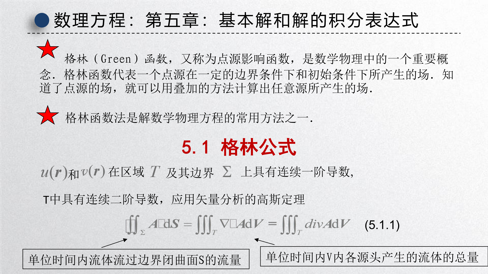{ width="750" }

设区域 $T$ 的边界为 $\Sigma$，函数 $u(\boldsymbol{r})$ 和 $v(\boldsymbol{r})$ 在 $T$ 上具有连续二阶偏导数，在 $\Sigma$ 上具有连续一阶偏导数。由 Gauss 散度定理：

$$
\iint_{\Sigma} \boldsymbol{A} \cdot \mathrm{d}\boldsymbol{S} = \iiint_{T} \nabla \cdot \boldsymbol{A} \, \mathrm{d}V,
$$

令 $\boldsymbol{A} = u \nabla v$，利用 $\nabla(u v) = u \nabla v + v \nabla u$，得

$$
\iint_{\Sigma} u \frac{\partial v}{\partial n} \, \mathrm{d}S = \iiint_{T} u \Delta v \, \mathrm{d}V + \iiint_{T} \nabla u \cdot \nabla v \, \mathrm{d}V. \tag{5.1.1}
$$

这就是 **第一 Green 公式** 。同理，交换 $u$ 和 $v$ 的位置，得

$$
\iint_{\Sigma} v \frac{\partial u}{\partial n} \, \mathrm{d}S = \iiint_{T} v \Delta u \, \mathrm{d}V + \iiint_{T} \nabla u \cdot \nabla v \, \mathrm{d}V. \tag{5.1.2}
$$

两式相减，得到 **第二 Green 公式** ：

$$
\boxed{
\iint_{\Sigma} \left(u \frac{\partial v}{\partial n} - v \frac{\partial u}{\partial n}\right) \mathrm{d}S = \iiint_{T} \big(u \Delta v - v \Delta u\big) \, \mathrm{d}V
} \tag{5.1.3}
$$

其中 $\dfrac{\partial}{\partial n}$ 表示沿边界 $\Sigma$ **外法向** 的偏导数。

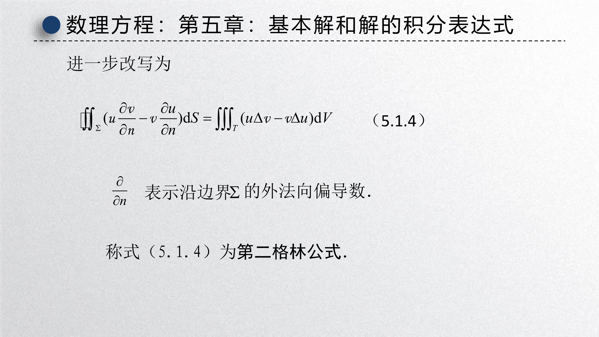{ width="750" }

第二 Green 公式是这一章全部推导的基石。它建立了 **体积分** （区域内的源与场的关系）与 **面积分** （边界上的场与通量的关系）之间的联系。

---

## 2 泊松方程的 Green 函数法

### 2.1 泊松方程的定解问题

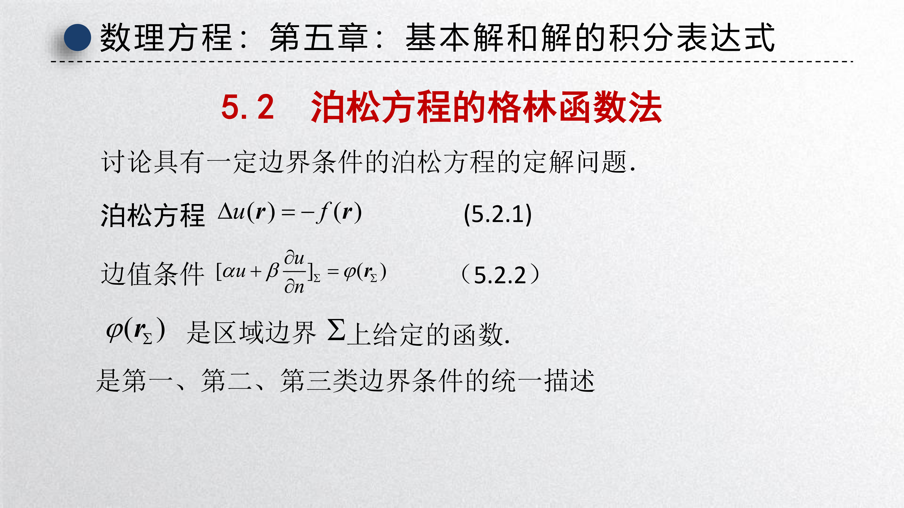{ width="750" }

考虑 Poisson 方程的边值问题：

$$
\begin{cases}
\Delta u(\boldsymbol{r}) = -f(\boldsymbol{r}), & \boldsymbol{r} \in T, \\[6pt]
\displaystyle\left[\alpha u + \beta \frac{\partial u}{\partial n}\right]_{\Sigma} = \varphi(\boldsymbol{r}_{\Sigma}),
\end{cases} \tag{5.2.1}
$$

其中 $\alpha, \beta$ 不同时为零。当：

- $\beta = 0$ 时，为 **第一类边值问题** （Dirichlet）；
- $\alpha = 0$ 时，为 **第二类边值问题** （Neumann）；
- $\alpha, \beta \neq 0$ 时，为 **第三类边值问题** （Robin）。

---

### 2.2 Green 函数的引入与物理意义

为了求解上述定解问题，引入一个与之对应的 **Green 函数** $G(\boldsymbol{r}, \boldsymbol{r}_0)$，它满足

$$
\begin{cases}
\Delta G(\boldsymbol{r}, \boldsymbol{r}_0) = -\delta(\boldsymbol{r} - \boldsymbol{r}_0), & \boldsymbol{r} \in T, \\[6pt]
\displaystyle\left[\alpha G + \beta \frac{\partial G}{\partial n}\right]_{\Sigma} = 0.
\end{cases} \tag{5.2.2}
$$

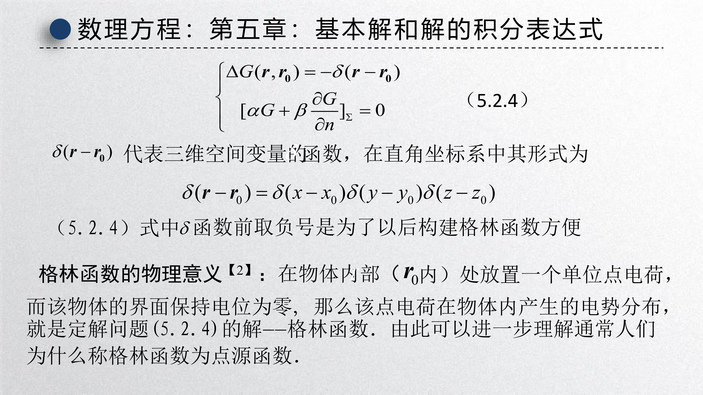{ width="750" }

!!! abstract "Green 函数的物理意义"

    Green 函数 $G(\boldsymbol{r}, \boldsymbol{r}_0)$ 表示：在区域 $T$ 内 $\boldsymbol{r}_0$ 处放置一个 **单位点源** （如单位点电荷），而在边界 $\Sigma$ 上维持 **齐次边界条件** （如接地，电势为零），此时在点 $\boldsymbol{r}$ 处产生的场的分布。

    因此，Green 函数又被称为 **点源影响函数** 。知道了点源的场，就可以通过 **叠加原理** 计算出任意分布源所产生的场。

    在静电学中，这对应于：在接地导体内部某点放置单位点电荷，求导体内各点的电势分布。

---

### 2.3 Green 函数的互易定理

Green 函数具有 **对称性** （互易性）：

$$
\boxed{G(\boldsymbol{r}, \boldsymbol{r}_0) = G(\boldsymbol{r}_0, \boldsymbol{r})} \tag{5.2.3}
$$

这表示：在 $\boldsymbol{r}_0$ 处的点源在 $\boldsymbol{r}$ 处产生的影响，等于在 $\boldsymbol{r}$ 处的点源在 $\boldsymbol{r}_0$ 处产生的影响。物理上，这体现了线性系统的互易原理。

---

### 2.4 基本积分公式

在第二 Green 公式 (5.1.3) 中取 $v = G(\boldsymbol{r}, \boldsymbol{r}_0)$，并利用 $\Delta G = -\delta(\boldsymbol{r} - \boldsymbol{r}_0)$ 和 $\delta$ 函数的筛选性质

$$
\iiint_{T} u(\boldsymbol{r}) \, \delta(\boldsymbol{r} - \boldsymbol{r}_0) \, \mathrm{d}V = u(\boldsymbol{r}_0),
$$

得到 **Poisson 方程的基本积分公式** ：

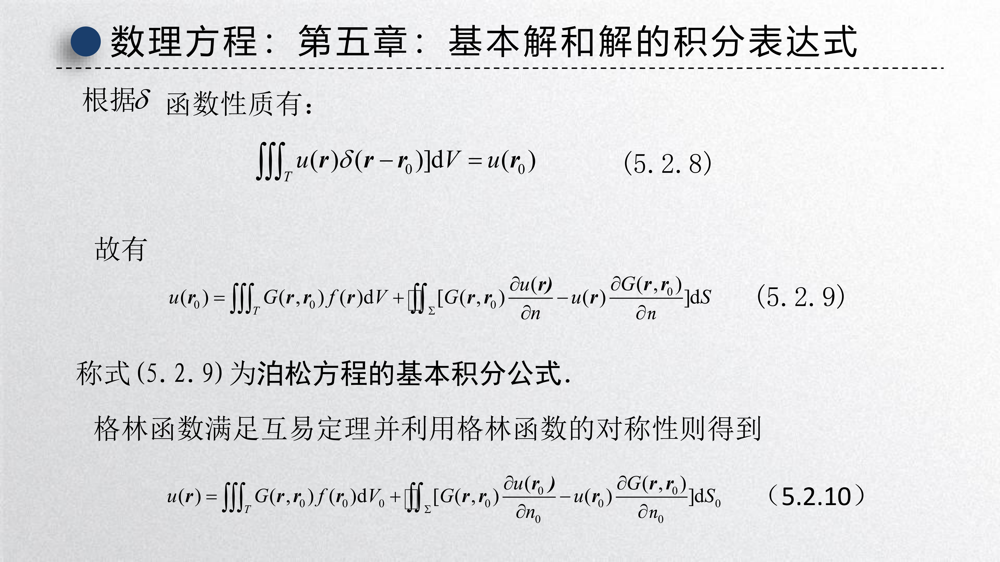{ width="750" }

$$
\boxed{
u(\boldsymbol{r}_0) = \iiint_{T} G(\boldsymbol{r}, \boldsymbol{r}_0) \, f(\boldsymbol{r}) \, \mathrm{d}V + \iint_{\Sigma} \left[G(\boldsymbol{r}, \boldsymbol{r}_0) \frac{\partial u(\boldsymbol{r})}{\partial n} - u(\boldsymbol{r}) \frac{\partial G(\boldsymbol{r}, \boldsymbol{r}_0)}{\partial n}\right] \mathrm{d}S
} \tag{5.2.4}
$$

利用 Green 函数的互易性 $G(\boldsymbol{r}, \boldsymbol{r}_0) = G(\boldsymbol{r}_0, \boldsymbol{r})$，也可写成

$$
u(\boldsymbol{r}) = \iiint_{T} G(\boldsymbol{r}, \boldsymbol{r}_0) \, f(\boldsymbol{r}_0) \, \mathrm{d}V_0 + \iint_{\Sigma} \left[G(\boldsymbol{r}, \boldsymbol{r}_0) \frac{\partial u(\boldsymbol{r}_0)}{\partial n_0} - u(\boldsymbol{r}_0) \frac{\partial G(\boldsymbol{r}, \boldsymbol{r}_0)}{\partial n_0}\right] \mathrm{d}S_0. \tag{5.2.5}
$$

这个公式将解 $u$ 表示为两部分之和：

- **体积分** ：区域内分布源 $f$ 产生的贡献；
- **面积分** ：边界上的场值和法向导数产生的贡献。

---

### 2.5 三类边值问题的解

根据 Green 函数满足的齐次边界条件，可以分别化简上述积分公式。

#### 第一类边值问题（Dirichlet）

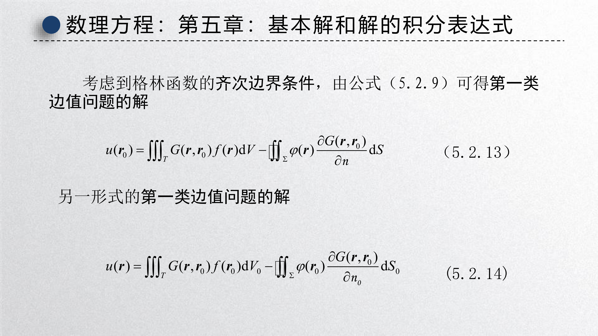{ width="750" }

定解问题：

$$
\begin{cases}
\Delta u = -f(\boldsymbol{r}), \\[4pt]
u\big|_{\Sigma} = \varphi(\boldsymbol{r}_{\Sigma}).
\end{cases} \tag{5.2.6}
$$

对应的 Green 函数满足：

$$
\begin{cases}
\Delta G = -\delta(\boldsymbol{r} - \boldsymbol{r}_0), \\[4pt]
G\big|_{\Sigma} = 0.
\end{cases} \tag{5.2.7}
$$

由于 $G|_{\Sigma} = 0$，积分公式 (5.2.4) 中的面积分项化简，得到 **第一类边值问题的解** ：

$$
\boxed{
u(\boldsymbol{r}) = \iiint_{T} G(\boldsymbol{r}, \boldsymbol{r}_0) \, f(\boldsymbol{r}_0) \, \mathrm{d}V_0 - \iint_{\Sigma} \varphi(\boldsymbol{r}_0) \frac{\partial G(\boldsymbol{r}, \boldsymbol{r}_0)}{\partial n_0} \, \mathrm{d}S_0
} \tag{5.2.8}
$$

对于 Laplace 方程（$f \equiv 0$），解简化为

$$
u(\boldsymbol{r}) = -\iint_{\Sigma} \varphi(\boldsymbol{r}_0) \frac{\partial G(\boldsymbol{r}, \boldsymbol{r}_0)}{\partial n_0} \, \mathrm{d}S_0. \tag{5.2.9}
$$

---

#### 第二类边值问题（Neumann）

定解问题：

$$
\begin{cases}
\Delta u = -f(\boldsymbol{r}), \\[4pt]
\displaystyle\frac{\partial u}{\partial n}\bigg|_{\Sigma} = \varphi(\boldsymbol{r}_{\Sigma}).
\end{cases} \tag{5.2.10}
$$

对应的 Green 函数满足：

$$
\begin{cases}
\Delta G = -\delta(\boldsymbol{r} - \boldsymbol{r}_0), \\[4pt]
\displaystyle\frac{\partial G}{\partial n}\bigg|_{\Sigma} = 0.
\end{cases} \tag{5.2.11}
$$

由于 $\dfrac{\partial G}{\partial n}\big|_{\Sigma} = 0$，面积分项化简，得到 **第二类边值问题的解** ：

$$
\boxed{
u(\boldsymbol{r}) = \iiint_{T} G(\boldsymbol{r}, \boldsymbol{r}_0) \, f(\boldsymbol{r}_0) \, \mathrm{d}V_0 + \iint_{\Sigma} \varphi(\boldsymbol{r}_0) \, G(\boldsymbol{r}, \boldsymbol{r}_0) \, \mathrm{d}S_0
} \tag{5.2.12}
$$

---

#### 第三类边值问题（Robin）

定解问题：

$$
\begin{cases}
\Delta u = -f(\boldsymbol{r}), \\[4pt]
\displaystyle\left[\alpha u + \beta \frac{\partial u}{\partial n}\right]_{\Sigma} = \varphi(\boldsymbol{r}_{\Sigma}).
\end{cases} \tag{5.2.13}
$$

对应的 Green 函数满足齐次 Robin 条件：

$$
\left[\alpha G + \beta \frac{\partial G}{\partial n}\right]_{\Sigma} = 0. \tag{5.2.14}
$$

将原边值条件与 Green 函数的边值条件适当组合，消去面积分中的 $u$ 或 $\dfrac{\partial u}{\partial n}$，得到 **第三类边值问题的解** ：

$$
\boxed{
u(\boldsymbol{r}) = \iiint_{T} G(\boldsymbol{r}, \boldsymbol{r}_0) \, f(\boldsymbol{r}_0) \, \mathrm{d}V_0 + \frac{1}{\beta} \iint_{\Sigma} \varphi(\boldsymbol{r}_0) \, G(\boldsymbol{r}, \boldsymbol{r}_0) \, \mathrm{d}S_0
} \tag{5.2.15}
$$

!!! tip "Green 函数法的统一框架"

    三类边值问题的解都可以统一写成

    $$
    u(\boldsymbol{r}) = \underbrace{\iiint_{T} G(\boldsymbol{r}, \boldsymbol{r}_0) \, f(\boldsymbol{r}_0) \, \mathrm{d}V_0}_{\text{体内源的贡献}} + \underbrace{\text{（边界积分项）}}_{\text{边界条件的影响}}
    $$

    差别只在于边界积分项的具体形式，这由 Green 函数满足的边界条件决定。

---

## 3 无界空间的 Green 函数 —— 基本解

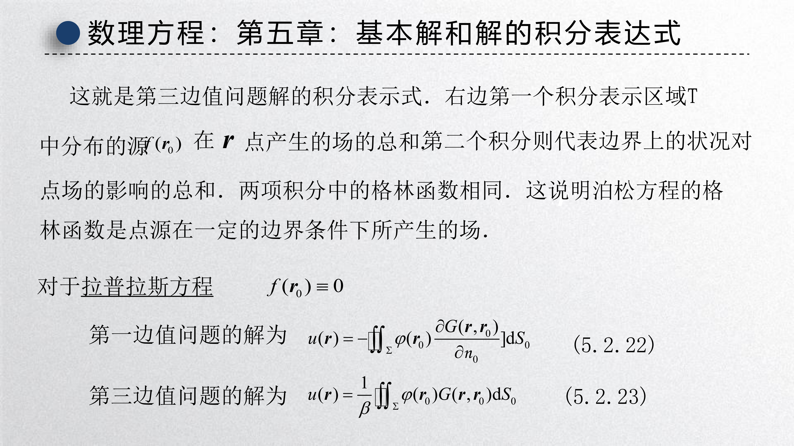{ width="750" }

对于无界区域，边界 $\Sigma$ 在无穷远处，面积分项趋于零（假设场在无穷远处足够快地衰减）。此时基本积分公式简化为

$$
u(\boldsymbol{r}) = \iiint_{T} G(\boldsymbol{r}, \boldsymbol{r}_0) \, f(\boldsymbol{r}_0) \, \mathrm{d}V_0. \tag{5.3.1}
$$

这就是 **位势积分公式** 。此时 Green 函数满足

$$
\Delta G(\boldsymbol{r}, \boldsymbol{r}_0) = -\delta(\boldsymbol{r} - \boldsymbol{r}_0), \qquad \boldsymbol{r}, \boldsymbol{r}_0 \in \mathbb{R}^3. \tag{5.3.2}
$$

在无界空间中，$G$ 仅依赖于距离 $|\boldsymbol{r} - \boldsymbol{r}_0|$，称为 **基本解** 。

---

### 3.1 三维球对称情形

取 $\boldsymbol{r}_0 = 0$，设 $G = G(r)$，其中 $r = |\boldsymbol{r}|$。对 (5.3.2) 在半径为 $r$ 的球内积分：

$$
\iiint_{T} \Delta G \, \mathrm{d}V = -\iiint_{T} \delta(\boldsymbol{r}) \, \mathrm{d}V = -1.
$$

左边用 Gauss 定理化为球面积分：

$$
\iiint_{T} \Delta G \, \mathrm{d}V = \iint_{S} \frac{\partial G}{\partial r} \, r^2 \sin\theta \, \mathrm{d}\theta \, \mathrm{d}\varphi = 4\pi r^2 \frac{\mathrm{d}G}{\mathrm{d}r}.
$$

因此

$$
4\pi r^2 \frac{\mathrm{d}G}{\mathrm{d}r} = -1 \quad \Rightarrow \quad \frac{\mathrm{d}G}{\mathrm{d}r} = -\frac{1}{4\pi r^2}.
$$

积分得

$$
G(r) = \frac{1}{4\pi r} + C.
$$

由无穷远处 $G \to 0$（当 $r \to \infty$），得 $C = 0$。因此 **三维 Laplace 方程的基本解** 为

$$
\boxed{G(\boldsymbol{r}, \boldsymbol{r}_0) = \frac{1}{4\pi |\boldsymbol{r} - \boldsymbol{r}_0|}} \tag{5.3.3}
$$

代入 (5.3.1)，得到三维 Poisson 方程在无界空间中的解：

$$
\boxed{
u(\boldsymbol{r}) = \frac{1}{4\pi} \iiint \frac{f(\boldsymbol{r}_0)}{|\boldsymbol{r} - \boldsymbol{r}_0|} \, \mathrm{d}V_0
} \tag{5.3.4}
$$

这正是 **静电场的电位公式** ：$f$ 是电荷密度，$u$ 是电势。

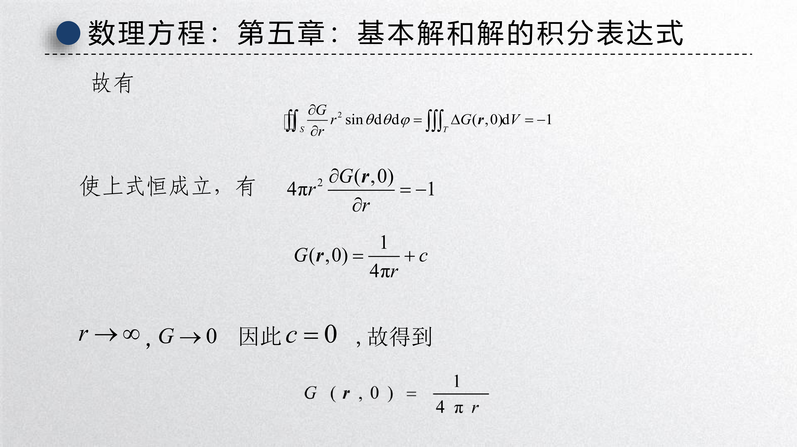{ width="750" }

---

### 3.2 二维轴对称情形

在二维情形下，用单位长度的圆柱体代替球。类似地，在半径为 $r$ 的圆内积分，利用 Green 公式：

$$
\iint_{T} \Delta G \, \mathrm{d}S = \oint_{C} \frac{\partial G}{\partial r} \, r \, \mathrm{d}\varphi = 2\pi r \frac{\mathrm{d}G}{\mathrm{d}r} = -1.
$$

因此

$$
\frac{\mathrm{d}G}{\mathrm{d}r} = -\frac{1}{2\pi r} \quad \Rightarrow \quad G(r) = \frac{1}{2\pi} \ln\frac{1}{r} + C.
$$

取 $C = 0$，得到 **二维 Laplace 方程的基本解** ：

$$
\boxed{G(\boldsymbol{r}, \boldsymbol{r}_0) = \frac{1}{2\pi} \ln\frac{1}{|\boldsymbol{r} - \boldsymbol{r}_0|}} \tag{5.3.5}
$$

二维 Poisson 方程在无界空间中的解为

$$
\boxed{
u(\boldsymbol{r}) = \frac{1}{2\pi} \iint f(\boldsymbol{r}_0) \ln\frac{1}{|\boldsymbol{r} - \boldsymbol{r}_0|} \, \mathrm{d}S_0
} \tag{5.3.6}
$$

!!! warning "二维与三维的区别"

    - **三维** ：$G \sim \dfrac{1}{r}$，随距离衰减
    - **二维** ：$G \sim \ln\dfrac{1}{r}$，衰减更慢（对数衰减）

    这一差异来源于空间维度的不同，在物理上表现为：三维空间中点源的场随距离平方反比衰减（库仑定律），而二维空间中点源的场随距离对数衰减（线电荷的电势）。

---

## 4 用电像法确定 Green 函数

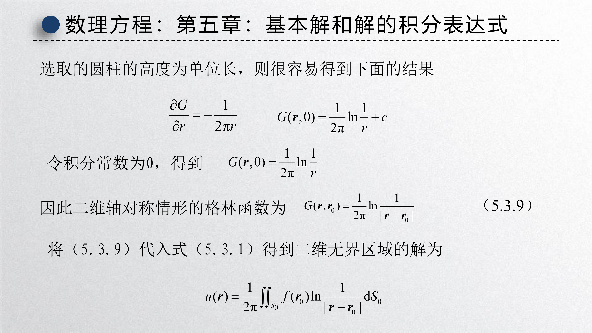{ width="750" }

Green 函数法的核心难点在于： **如何求出 Green 函数本身** 。对于某些具有简单对称性的区域，可以利用 **电像法** （镜像法）构造 Green 函数。

电像法的物理思想来自静电学：为了满足边界上的齐次 Dirichlet 条件（电势为零），可以在边界外适当位置放置一个 **虚像电荷** ，使真实电荷与虚像电荷在边界上产生的电势相互抵消。

---

### 4.1 上半平面的 Green 函数

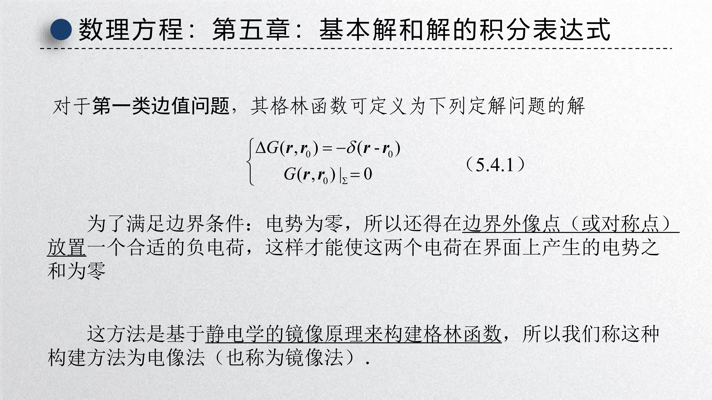{ width="750" }

 **问题** ：在上半平面 $y > 0$ 内，求 Laplace 方程第一类边值问题的 Green 函数。

 **物理模型** ：在 $M_0(x_0, y_0)$（$y_0 > 0$）处放置一单位正点电荷。为满足边界 $y = 0$ 上电势为零，在关于边界的对称点 $M_1(x_0, -y_0)$ 处放置一单位负点电荷。

两电荷在上半平面内任一点 $M(x,y)$ 产生的电势为

$$
G(\boldsymbol{r}, \boldsymbol{r}_0) = \frac{1}{2\pi} \ln\frac{1}{|\boldsymbol{r} - \boldsymbol{r}_0|} - \frac{1}{2\pi} \ln\frac{1}{|\boldsymbol{r} - \boldsymbol{r}_1|},
$$

即

$$
\boxed{
G(x,y; x_0, y_0) = \frac{1}{4\pi} \ln\frac{(x-x_0)^2 + (y+y_0)^2}{(x-x_0)^2 + (y-y_0)^2}
} \tag{5.4.1}
$$

容易验证：

- $\Delta G = -\delta(x-x_0)\delta(y-y_0)$（在上半平面内，$M_1$ 处的像电荷不产生奇点）；
- $G|_{y=0} = 0$（在边界上，两项抵消）。

---

#### 例 1：上半平面的 Laplace 方程第一边值问题

定解问题：

$$
\begin{cases}
u_{xx} + u_{yy} = 0, & (y > 0), \\[6pt]
u\big|_{y=0} = \varphi(x).
\end{cases}
$$

 **解** ：由公式 (5.2.9)，$u(\boldsymbol{r}) = -\displaystyle\iint_{\Sigma} \varphi(\boldsymbol{r}_0) \dfrac{\partial G}{\partial n_0} \, \mathrm{d}S_0$。计算 Green 函数在边界上的法向导数：

边界外法线方向为 $-y$ 方向，故

$$
\frac{\partial G}{\partial n_0}\bigg|_{y_0=0} = -\frac{\partial G}{\partial y_0}\bigg|_{y_0=0} = -\frac{y}{\pi\big[(x-x_0)^2 + y^2\big]}.
$$

代入得到 **上半平面的 Poisson 积分公式** ：

$$
\boxed{
u(x,y) = \frac{y}{\pi} \int_{-\infty}^{+\infty} \frac{\varphi(x_0)}{(x-x_0)^2 + y^2} \, \mathrm{d}x_0
} \tag{5.4.2}
$$

这与第四章用 Fourier 变换法得到的结果完全一致。

---

#### 例 2：上半平面的 Poisson 方程第一边值问题

定解问题：

$$
\begin{cases}
u_{xx} + u_{yy} = -f(x,y), & (-\infty < x < +\infty, \ y > 0), \\[6pt]
u\big|_{y=0} = \varphi(x).
\end{cases}
$$

 **解** ：由公式 (5.2.8)，解由两项组成：

$$
u(x,y) = \int_{-\infty}^{+\infty}\!\int_0^{+\infty} G(x,y; x_0, y_0) \, f(x_0, y_0) \, \mathrm{d}x_0 \mathrm{d}y_0 - \int_{-\infty}^{+\infty} \varphi(x_0) \frac{\partial G}{\partial n_0}\bigg|_{y_0=0} \mathrm{d}x_0.
$$

代入 Green 函数 (5.4.1) 及其法向导数，得

$$
\boxed{
\begin{aligned}
u(x,y) =& \ \frac{1}{4\pi} \int_{-\infty}^{+\infty}\!\int_0^{+\infty} \ln\frac{(x-x_0)^2 + (y+y_0)^2}{(x-x_0)^2 + (y-y_0)^2} \, f(x_0, y_0) \, \mathrm{d}x_0 \mathrm{d}y_0 \\[6pt]
& + \frac{y}{\pi} \int_{-\infty}^{+\infty} \frac{\varphi(x_0)}{(x-x_0)^2 + y^2} \, \mathrm{d}x_0
\end{aligned}
}
$$

---

### 4.2 上半空间的 Green 函数

 **问题** ：在上半空间 $z > 0$ 内，求 Laplace 方程第一类边值问题的 Green 函数。

 **物理模型** ：在 $M_0(x_0, y_0, z_0)$（$z_0 > 0$）处放置单位正点电荷，在关于平面 $z = 0$ 的对称点 $M_1(x_0, y_0, -z_0)$ 处放置单位负点电荷。

利用三维基本解 $G = \dfrac{1}{4\pi r}$，得

$$
\boxed{
\begin{aligned}
G(\boldsymbol{r}, \boldsymbol{r}_0) =& \ \frac{1}{4\pi\sqrt{(x-x_0)^2 + (y-y_0)^2 + (z-z_0)^2}} \\[6pt]
& - \frac{1}{4\pi\sqrt{(x-x_0)^2 + (y-y_0)^2 + (z+z_0)^2}}
\end{aligned}
} \tag{5.4.3}
$$

计算法向导数 $\dfrac{\partial G}{\partial n_0}\big|_{z_0=0} = -\dfrac{\partial G}{\partial z_0}\big|_{z_0=0}$，得

$$
\frac{\partial G}{\partial n_0}\bigg|_{z_0=0} = -\frac{z}{2\pi\big[(x-x_0)^2 + (y-y_0)^2 + z^2\big]^{3/2}}.
$$

代入 Laplace 方程第一边值问题的解公式，得到 **半空间的 Poisson 积分公式** ：

$$
\boxed{
u(x,y,z) = \frac{z}{2\pi} \int_{-\infty}^{+\infty}\!\int_{-\infty}^{+\infty} \frac{\varphi(x_0, y_0)}{\big[(x-x_0)^2 + (y-y_0)^2 + z^2\big]^{3/2}} \, \mathrm{d}x_0 \mathrm{d}y_0
} \tag{5.4.4}
$$

---

### 4.3 圆形区域的 Green 函数

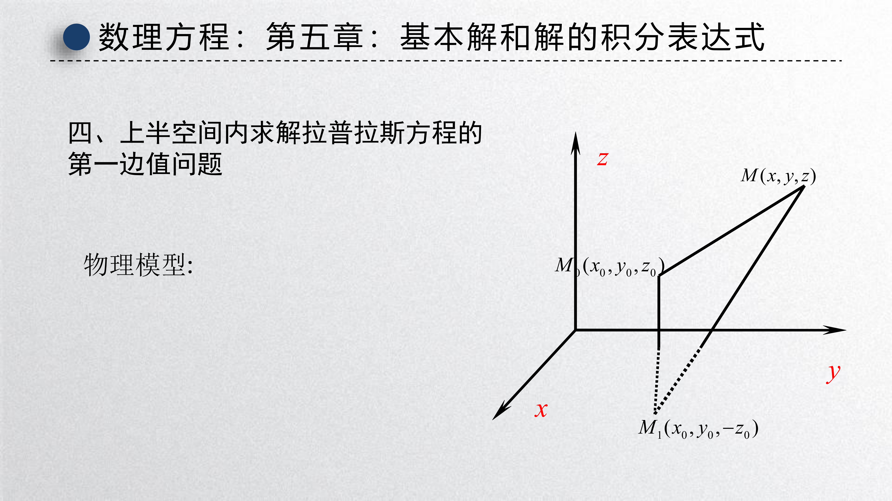{ width="750" }

 **问题** ：在圆 $\rho \leq a$ 内，求 Laplace 方程第一类边值问题的 Green 函数。

 **物理模型** ：在圆内任一点 $M_0(\boldsymbol{\rho}_0)$（$|\boldsymbol{\rho}_0| = \rho_0 < a$）放置单位正线电荷。根据电像法，需在圆外某点 $M_1$（位于 $OM_0$ 的延长线上）放置一适当强度的负线电荷，使得圆周 $\rho = a$ 上电势为零。

设像电荷的位置为 $\boldsymbol{b}$（$|\boldsymbol{b}| = b > a$），强度为 $\lambda$。两线电荷在圆内任一点 $P(\boldsymbol{\rho})$ 产生的电势为

$$
u(\boldsymbol{\rho}) = \frac{1}{2\pi} \ln\frac{1}{|\boldsymbol{\rho} - \boldsymbol{\rho}_0|} + \frac{\lambda}{2\pi} \ln\frac{1}{|\boldsymbol{\rho} - \boldsymbol{b}|} + C.
$$

由边界条件 $u|_{\rho=a} = 0$，即当 $|\boldsymbol{\rho}| = a$ 时 $u = 0$，利用余弦定理：

$$
|\boldsymbol{\rho} - \boldsymbol{\rho}_0|^2 = a^2 + \rho_0^2 - 2a\rho_0 \cos(\theta - \varphi),
$$

$$
|\boldsymbol{\rho} - \boldsymbol{b}|^2 = a^2 + b^2 - 2ab \cos(\theta - \varphi).
$$

代入边界条件，要求对任意 $\theta$ 成立。通过比较系数，解得

$$
\lambda = -1, \qquad b = \frac{a^2}{\rho_0}.
$$

即像电荷位于 $OM_0$ 延长线上距圆心 $b = a^2/\rho_0$ 处，强度为 $-1$。

因此， **圆内第一类边值问题的 Green 函数** 为

$$
\boxed{
G(\boldsymbol{\rho}, \boldsymbol{\rho}_0) = \frac{1}{2\pi} \ln\frac{1}{|\boldsymbol{\rho} - \boldsymbol{\rho}_0|} - \frac{1}{2\pi} \ln\frac{1}{\big|\boldsymbol{\rho} - \dfrac{a^2}{\rho_0^2}\boldsymbol{\rho}_0\big|}
} \tag{5.4.5}
$$

利用极坐标，可写成

$$
\boxed{
G(\boldsymbol{\rho}, \boldsymbol{\rho}_0) = \frac{1}{4\pi} \ln\frac{\rho^2\rho_0^2 + a^4 - 2\rho\rho_0 a^2 \cos(\theta - \varphi_0)}{a^2\big[\rho^2 + \rho_0^2 - 2\rho\rho_0 \cos(\theta - \varphi_0)\big]}
} \tag{5.4.6}
$$

其中 $\rho = |\boldsymbol{\rho}|$，$\rho_0 = |\boldsymbol{\rho}_0|$。

---

#### 例 3：圆内的 Poisson 方程第一边值问题

定解问题：

$$
\begin{cases}
\Delta u = -f(\boldsymbol{\rho}), & (\rho < a), \\[6pt]
u\big|_{\rho=a} = \varphi(\theta).
\end{cases}
$$

 **解** ：由公式 (5.2.8)，取垂直于圆方向单位长积分，将体积分化为面积分，面积分化为线积分：

$$
u(\boldsymbol{\rho}) = \iint_{S} G(\boldsymbol{\rho}, \boldsymbol{\rho}_0) \, f(\boldsymbol{\rho}_0) \, \mathrm{d}S_0 - \oint_{C} \varphi(\theta_0) \frac{\partial G}{\partial n_0}\bigg|_{\rho_0=a} \, \mathrm{d}l_0.
$$

计算 Green 函数在圆周上的法向导数：

$$
\frac{\partial G}{\partial n_0}\bigg|_{\rho_0=a} = \frac{\partial G}{\partial \rho_0}\bigg|_{\rho_0=a} = -\frac{a^2 - \rho^2}{2\pi a\big[a^2 + \rho^2 - 2a\rho \cos(\theta - \varphi_0)\big]}.
$$

代入得到圆内第一边值问题的解：

$$
\boxed{
\begin{aligned}
u(\rho, \theta) =& \ \frac{1}{4\pi} \int_0^a\!\int_0^{2\pi} \ln\frac{\rho^2\rho_0^2 + a^4 - 2\rho\rho_0 a^2 \cos(\theta - \varphi_0)}{a^2\big[\rho^2 + \rho_0^2 - 2\rho\rho_0 \cos(\theta - \varphi_0)\big]} \, f(\rho_0) \, \rho_0 \, \mathrm{d}\rho_0 \mathrm{d}\varphi_0 \\[6pt]
& + \frac{1}{2\pi} \int_0^{2\pi} \frac{a^2 - \rho^2}{a^2 + \rho^2 - 2a\rho \cos(\theta - \varphi_0)} \, \varphi(\varphi_0) \, \mathrm{d}\varphi_0
\end{aligned}
}
$$

---

#### 例 4：圆内的 Laplace 方程第一边值问题

当 $f \equiv 0$ 时，解简化为

$$
\boxed{
u(\rho, \theta) = \frac{1}{2\pi} \int_0^{2\pi} \frac{a^2 - \rho^2}{a^2 + \rho^2 - 2a\rho \cos(\theta - \varphi_0)} \, \varphi(\varphi_0) \, \mathrm{d}\varphi_0
} \tag{5.4.7}
$$

这就是著名的 **Poisson 积分公式** （圆内情形）。核函数

$$
P(\rho, \theta - \varphi_0) = \frac{a^2 - \rho^2}{a^2 + \rho^2 - 2a\rho \cos(\theta - \varphi_0)}
$$

称为 **Poisson 核** 。它满足：

- $P > 0$（对 $\rho < a$）；
- $\displaystyle\frac{1}{2\pi} \int_0^{2\pi} P \, \mathrm{d}\varphi_0 = 1$；
- 当 $\rho \to a$ 时，$P$ 趋于 $\delta$ 函数。

!!! tip "电像法的适用范围"

    电像法适用于具有简单对称性的区域：

    - **平面边界** （半空间、半平面）：像电荷关于平面对称
    - **球面边界** （球内、球外）：像电荷位于反演点，强度需调整
    - **圆柱面边界** （圆内、圆外）：像线电荷位于反演点

    对于更复杂的边界形状，通常需要借助分离变量法、保角变换或数值方法求 Green 函数。

---

## 5 总结

!!! abstract "核心公式汇总"

    **第二 Green 公式** 

    $$
    \iint_{\Sigma} \left(u \frac{\partial v}{\partial n} - v \frac{\partial u}{\partial n}\right) \mathrm{d}S = \iiint_{T} \big(u \Delta v - v \Delta u\big) \, \mathrm{d}V
    $$

    **基本积分公式** 

    $$
    u(\boldsymbol{r}) = \iiint_{T} G f \, \mathrm{d}V_0 + \iint_{\Sigma} \left(G \frac{\partial u}{\partial n_0} - u \frac{\partial G}{\partial n_0}\right) \mathrm{d}S_0
    $$

    **基本解** 

    - 三维：$G = \dfrac{1}{4\pi |\boldsymbol{r} - \boldsymbol{r}_0|}$
    - 二维：$G = \dfrac{1}{2\pi} \ln\dfrac{1}{|\boldsymbol{r} - \boldsymbol{r}_0|}$

    **Poisson 积分公式** 

    - 上半平面：$u(x,y) = \dfrac{y}{\pi} \displaystyle\int_{-\infty}^{+\infty} \dfrac{\varphi(x_0)}{(x-x_0)^2 + y^2} \, \mathrm{d}x_0$
    - 圆内：$u(\rho,\theta) = \dfrac{1}{2\pi} \displaystyle\int_0^{2\pi} \dfrac{a^2 - \rho^2}{a^2 + \rho^2 - 2a\rho\cos(\theta-\varphi_0)} \, \varphi(\varphi_0) \, \mathrm{d}\varphi_0$

!!! tip "Green 函数法的核心思想"

    1. 将任意源 $f$ 的响应分解为无数点源的响应之和（叠加原理）。
    2. Green 函数就是 **单位点源** 在特定边界条件下的响应。
    3. 通过 Green 函数的互易性，将问题转化为积分计算。
    4. 电像法利用对称性，通过虚像电荷构造 Green 函数。

!!! warning "使用 Green 函数法的注意事项"

    - Green 函数法将求解 PDE 的问题转化为 **求 Green 函数** + **计算积分** 两个问题。
    - Green 函数的求解通常比原问题简单，因为它有齐次边界条件。
    - 积分计算有时也很复杂，需要利用对称性、特殊函数或数值方法。
    - 对于非线性问题，叠加原理失效，Green 函数法不再适用。
