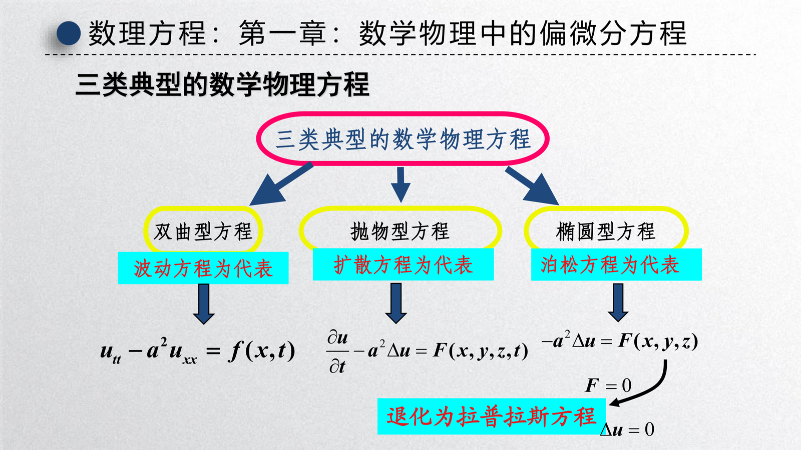
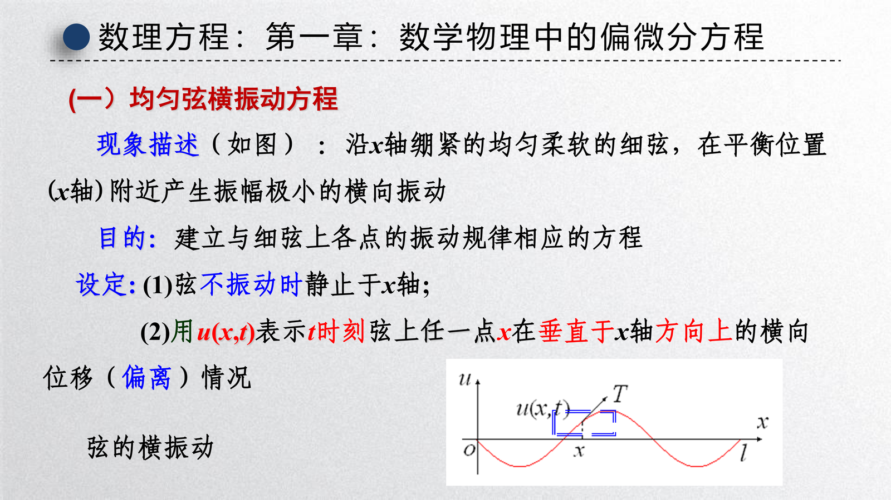
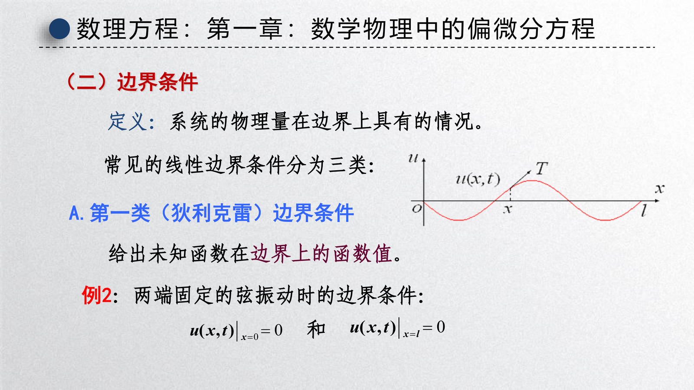
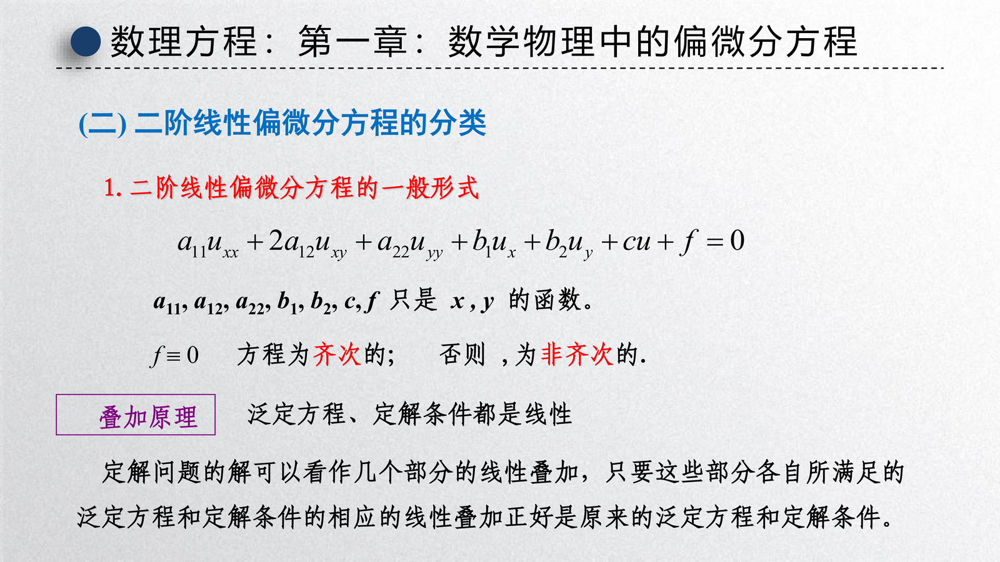
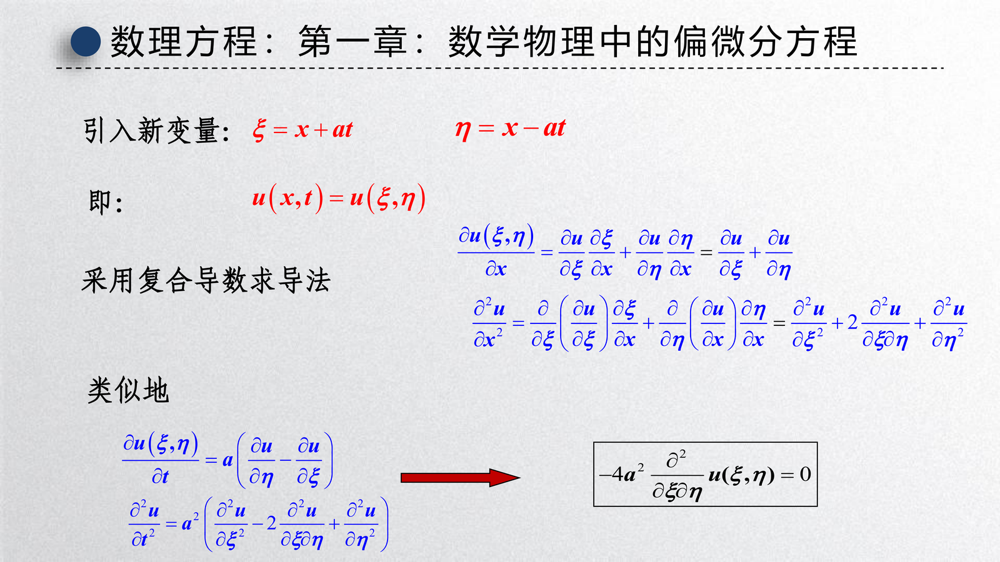

[第一章课件：数学物理中的偏微分方程](slides/!%20工程数学_数理方程_第一章_数学物理中的偏微分方程_20260423.pdf)

{ width="750" }

这一章的核心任务，是回答一个非常基础但也非常重要的问题：**为什么物理问题最后会落到偏微分方程上**。课件先从波动、热传导、静电势这几类最典型的现象出发，说明“泛定方程”刻画的是普遍规律，而“初始条件 + 边界条件”刻画的是具体问题；随后再说明二阶线性偏微分方程为什么会自然分成双曲型、抛物型、椭圆型三大类。

从学习路径上看，这一章更像是整门课的总导论：

- 先学 **怎么建模**
- 再学 **怎样补足定解条件**
- 然后理解 **方程类型与物理性质的关系**
- 最后通过 **达朗贝尔公式** 看见波动方程的显式解长什么样

---

## 1 从物理问题到数理方程

### 1.1 泛定方程与定解问题

!!! abstract "定义 1（数学物理方程 / 泛定方程）"
    从物理规律导出的函数方程，尤其是偏微分方程与积分方程，称为 **数学物理方程**。若一个方程只反映某类现象的共同规律，而不包含具体边界与历史信息，就称其为 **泛定方程**。

!!! abstract "定义 2（定解条件与定解问题）"
    给定边界条件、初始条件，并在指定区域中求出未知物理量 $u$ 的问题，称为 **定解问题**。边界条件与初始条件的总体称为 **定解条件**。

这两个概念可以概括成一句话：

- 泛定方程回答“**系统服从什么规律**”
- 定解条件回答“**这个具体系统现在在哪、过去怎样、边界怎样**”

因此，同一个波动方程可以对应很多完全不同的弦振动问题；它们的差别不在泛定方程，而在初始位移、初始速度和边界约束。

### 1.2 数学建模的一般步骤

课件给出的思路非常典型，可以总结成四步：

1. 明确要研究的物理量是什么，例如位移、温度、电势。
2. 选取一个足够小的微元，分析相邻部分对它的作用。
3. 利用守恒律、牛顿定律、Fourier 定律等物理规律列方程。
4. 根据系统边界状态和初始状态补上定解条件。

!!! tip "建模时最容易忽略的点"
    微元分析并不是形式步骤，它决定了最终方程里会出现哪些导数项。
    
    - 力学问题常对应时间二阶导数
    - 扩散问题常对应时间一阶导数
    - 稳态场问题往往不含时间导数

### 1.3 三类典型方程

课件用三种代表模型概括了数理方程课程的主线：

- **双曲型**：以波动方程为代表，描述传播与振动
- **抛物型**：以热传导方程为代表，描述扩散和平滑
- **椭圆型**：以拉普拉斯 / 泊松方程为代表，描述稳态场

这三类不是“长得不一样”而已，而是反映了三种不同物理行为：

- 波动会保留传播方向和有限传播速度
- 热扩散会迅速抹平尖峰
- 稳态场则没有显式时间演化，只关心空间分布平衡

---

## 2 典型方程的建立

### 2.1 均匀弦的横振动方程

{ width="750" }

设细弦平衡时沿 $x$ 轴放置，$u(x,t)$ 表示时刻 $t$、位置 $x$ 处的横向位移。课件采用的近似假设包括：

- 弦柔软，不抵抗弯曲
- 振幅很小，只保留小角度的一阶量
- 弦重相对张力可以忽略
- 张力在微小振动近似下可视为常量

取微元 $[x, x+\mathrm{d}x]$，由牛顿第二定律在竖直方向列式，可得到

$$
\rho \, \mathrm{d}x \, u_{tt}
=
T \sin \alpha_2 - T \sin \alpha_1 + F(x,t)\,\mathrm{d}x,
$$

再利用小角度近似 $\sin\alpha \approx \tan\alpha \approx u_x$，便得到

$$
\rho u_{tt} = T u_{xx} + F(x,t).
$$

令 $a^2 = \dfrac{T}{\rho}$，就得到一维弦振动方程

$$
u_{tt} - a^2 u_{xx} = f(x,t).
$$

其中：

- 齐次情形 $f(x,t)=0$ 表示无外力振动
- 非齐次情形 $f(x,t)\neq 0$ 表示存在持续外部激励

!!! info "为什么波动方程有时间二阶导数"
    因为振动问题本质上由牛顿第二定律支配，质量乘加速度天然对应 $u_{tt}$。这也解释了为什么波动问题通常需要 **两个** 初始条件：一个给位移，一个给速度。

### 2.2 热传导方程

设 $u(x,t)$ 表示细杆温度。热学建模的核心是把两个原则结合起来：

- **能量守恒**：微元内部热量变化 = 流入热量 - 流出热量 + 热源供给
- **Fourier 定律**：热流密度与温度梯度成正比，方向与温度下降方向一致

在一维情形下，Fourier 定律写成

$$
q = -k u_x,
$$

把它代入能量平衡可得

$$
c \rho u_t = k u_{xx} + Q(x,t),
$$

即

$$
u_t - a^2 u_{xx} = F(x,t), \qquad a^2 = \frac{k}{c\rho}.
$$

与波动方程相比，这里时间导数只有一阶，意味着热方程描述的是“状态向平衡单向演化”的过程，而不是来回传播的振动。

### 2.3 拉普拉斯方程与泊松方程

如果研究的是稳态温度场、静电势场、稳定势流等问题，那么物理量不再随时间变化，于是时间导数消失。典型方程是

$$
\Delta u = 0
$$

和

$$
\Delta u = f.
$$

前者称为 **拉普拉斯方程**，后者称为 **泊松方程**。

它们的物理意义可以概括为：

- $\Delta u = 0$：区域内部没有源项，场处于纯平衡状态
- $\Delta u = f$：区域内部存在热源、电荷密度或其他体源

!!! tip "波动、热传导、稳态场三者的差别"
    - 波动方程研究“传播”
    - 热方程研究“扩散”
    - 拉普拉斯 / 泊松方程研究“平衡”

---

## 3 定解条件

### 3.1 初始条件

课件特别强调：初始条件描述的是 **初始时刻整个系统的分布**，而不是某一个点的单独数值。

对一维波动方程，常见初始条件写成

$$
u(x,0) = \varphi(x), \qquad u_t(x,0) = \psi(x).
$$

其中：

- $\varphi(x)$ 表示初始位移
- $\psi(x)$ 表示初始速度

对热方程，只需要一个初始条件：

$$
u(x,0) = \varphi(x),
$$

因为方程只含一阶时间导数。

而拉普拉斯 / 泊松方程没有时间项，所以没有“初始时刻”这个概念，自然也不需要初始条件。

!!! warning "不要把初始条件理解成边界上的条件"
    初始条件针对的是 **整个空间区域在 $t=0$ 时刻的分布**，而边界条件针对的是 **空间边界在所有时刻的约束**。两者作用完全不同。

### 3.2 边界条件

{ width="750" }

边界条件刻画系统在边界上的状态。线性问题里最常见的三类边界条件是：

1. 第一类边界条件（Dirichlet 条件）：直接给出未知函数在边界上的值。
2. 第二类边界条件（Neumann 条件）：给出法向导数或热流、通量等。
3. 第三类边界条件（Robin 条件）：给出函数值与法向导数的线性组合。

例如，两端固定的弦满足

$$
u(0,t) = 0, \qquad u(l,t) = 0.
$$

这是最典型的 Dirichlet 条件。若一端绝热，则热传导模型常出现

$$
u_x(0,t) = 0,
$$

这就是 Neumann 条件。若边界与外界按牛顿冷却定律交换热量，则会出现 Robin 条件。

!!! abstract "定解问题的完整形态"
    一个真正可求解的数学物理问题，通常必须由三部分共同组成：
    
    - 区域
    - 泛定方程
    - 定解条件

---

## 4 二阶线性偏微分方程的分类

### 4.1 一般形式

二维二阶线性偏微分方程常写成

$$
A u_{xx} + 2B u_{xy} + C u_{yy} + D u_x + E u_y + Fu = G.
$$

分类主要取决于二阶主部

$$
A u_{xx} + 2B u_{xy} + C u_{yy}.
$$

与二次型判别式

$$
B^2 - AC
$$

的符号。

### 4.2 三种类型

{ width="750" }

!!! abstract "分类判据"
    对方程
    
    $$
    A u_{xx} + 2B u_{xy} + C u_{yy} + \cdots = G
    $$
    
    有：
    
    - 若 $B^2 - AC > 0$，则为 **双曲型**
    - 若 $B^2 - AC = 0$，则为 **抛物型**
    - 若 $B^2 - AC < 0$，则为 **椭圆型**

三类典型方程正好对应：

- 波动方程：双曲型
- 热传导方程：抛物型
- 拉普拉斯方程：椭圆型

这种分类不是纯代数游戏，而是在告诉我们方程的解会表现出什么性质：

- 双曲型允许特征传播与有限传播速度
- 抛物型体现耗散与平滑
- 椭圆型更强调边界对整体解的全局影响

### 4.3 标准形与变量变换

课件还说明：通过适当坐标变换，可以把二阶主部化成更简单的标准形。其意义是：

- 在双曲型里，往往能找到沿特征方向的坐标
- 在抛物型里，通常只保留一个二阶方向
- 在椭圆型里，可化为类似 $u_{\xi\xi} + u_{\eta\eta}$ 的形式

这为后面使用分离变量法、积分变换法或特征线法打下基础。

---

## 5 达朗贝尔公式与行波

{ width="750" }

课件最后用无限长弦的齐次波动方程，展示了一个非常经典的显式求解结果。考虑

$$
u_{tt} - a^2 u_{xx} = 0,
$$

配以初始条件

$$
u(x,0) = \varphi(x), \qquad u_t(x,0) = \psi(x).
$$

令

$$
\xi = x + at, \qquad \eta = x - at,
$$

则方程可化为

$$
u_{\xi\eta} = 0.
$$

积分后得到通解

$$
u(x,t) = F(x+at) + G(x-at),
$$

再由初始条件确定 $F,G$，可得 **达朗贝尔公式**

$$
u(x,t)
=
\frac{1}{2}\bigl[\varphi(x+at) + \varphi(x-at)\bigr]
+
\frac{1}{2a}\int_{x-at}^{x+at} \psi(s)\,\mathrm{d}s.
$$

### 5.1 物理解释

这个公式极其重要，因为它把抽象 PDE 的解直接解释成两部分：

- $\varphi(x+at)$：向左传播的波
- $\varphi(x-at)$：向右传播的波
- 积分项：初始速度对解的累积贡献

因此，一维波动方程的解本质上是 **左右行波的叠加**。

!!! tip "为什么达朗贝尔公式只适合无限长弦"
    公式直接使用了 $x \pm at$ 作为传播变量，默认波可以无限传播而不碰到端点。
    
    一旦弦长有限、端点固定，就会发生反射，边界条件不能被自动满足，此时更合适的方法通常是下一章的 **分离变量法**。

### 5.2 从公式看波动问题的本质

从达朗贝尔公式可以读出两件事：

1. 波动方程的解由初始位移和初始速度完全决定。
2. 解在时空中的变化，是初始信息沿特征方向传播的结果。

这和热方程形成鲜明对比。热方程里，局部峰值会被快速抹平；而波动方程里，初始形状会沿着两侧“搬运”出去。

---

## 6 本章小结

!!! summary "复习与考试重点"
    - **建模主线**：物理规律给出泛定方程，边界条件和初始条件补成定解问题。
    - **三类模型**：波动方程、热传导方程、拉普拉斯 / 泊松方程分别对应传播、扩散、稳态平衡。
    - **初始条件数量**：波动方程需要两个，热方程需要一个，拉普拉斯方程不需要。
    - **边界条件三类**：Dirichlet 给函数值，Neumann 给法向导数，Robin 给线性组合。
    - **分类判据**：二阶线性方程按 $B^2-AC$ 分成双曲型、抛物型、椭圆型。
    - **达朗贝尔公式**：无限长弦的波动解是左右行波叠加，是理解“特征传播”的最直接例子。

!!! summary "和后续章节的关系"
    - 第一章解决“**方程从哪来、类型是什么**”。
    - 第二章解决“**边值问题怎么解，尤其是分离变量法怎么用**”。
    - 第三章解决“**在圆域、球域等非直角坐标中，为什么会出现贝塞尔函数和勒让德多项式**”。
