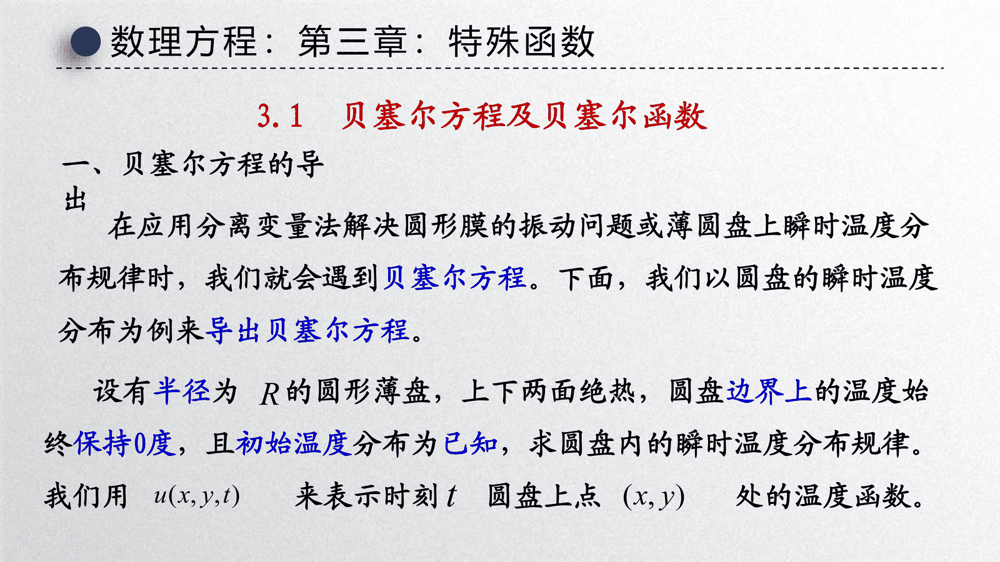
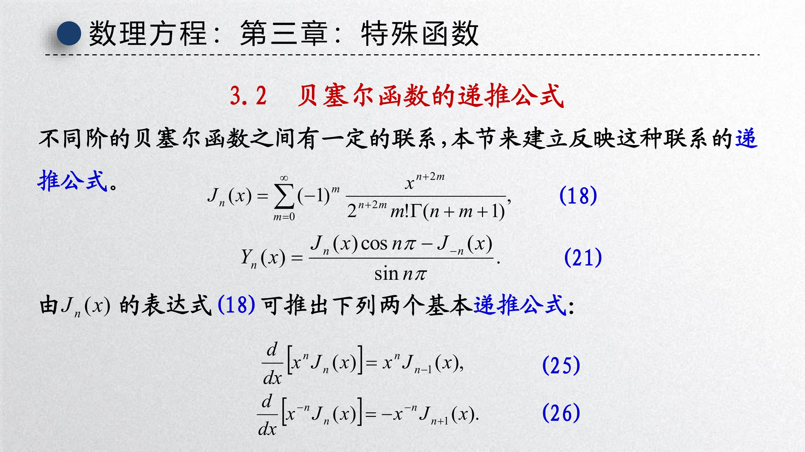
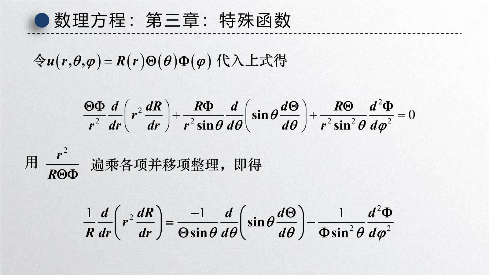
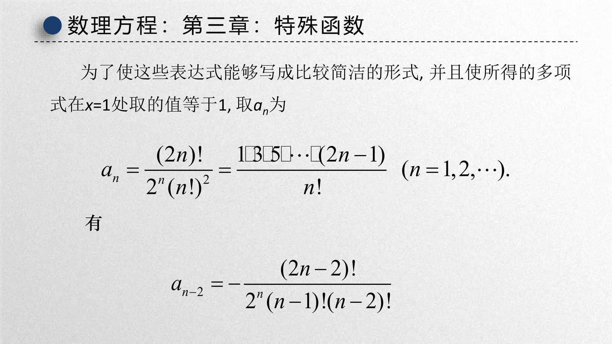
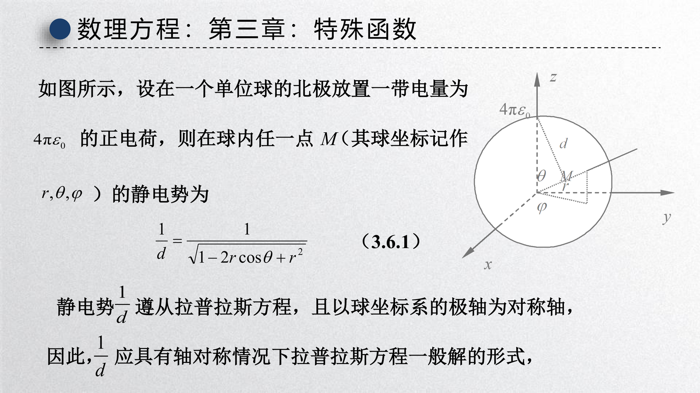

[第三章课件：特殊函数](slides/!%20工程数学_数理方程_第三章_特殊函数_20260519.pdf)

{ width="750" }

这一章承接第二章的分离变量法，但主题发生了一个关键变化：**当区域不再是区间或矩形，而是圆域、球域时，分离后出现的常微分方程往往已经不能用初等函数表示**。于是，贝塞尔函数、勒让德函数、勒让德多项式这些“特殊函数”就自然出现了。

可以把这一章理解成一句话：

- 直角坐标下，常见特征函数是正弦、余弦、双曲函数
- 极坐标 / 球坐标下，常见特征函数变成了 Bessel / Legendre 系列

因此，特殊函数不是“额外背诵内容”，而是 **分离变量法在非直角坐标中的必然产物**。

---

## 1 预备知识：Gamma 函数

### 1.1 定义与基本性质

课件一开始先回顾了 Gamma 函数：

$$
\Gamma(x) = \int_0^{+\infty} t^{x-1} e^{-t}\,\mathrm{d}t, \qquad x>0.
$$

它最重要的性质是递推关系

$$
\Gamma(x+1) = x\Gamma(x).
$$

由此立刻得到

$$
\Gamma(n+1) = n!, \qquad n=0,1,2,\ldots
$$

以及著名结果

$$
\Gamma\left(\frac{1}{2}\right)=\sqrt{\pi}.
$$

!!! info "为什么这里要先讲 Gamma 函数"
    因为在 Bessel 函数的幂级数表达式中，系数会自然写成 Gamma 函数形式。它相当于把“阶乘”推广到了非整数参数。

### 1.2 在特殊函数中的角色

后面出现的很多系数表达式，例如

$$
\frac{1}{m!\Gamma(m+n+1)},
$$

都不是为了形式好看，而是在统一处理整数阶、非整数阶甚至半整数阶的情形。

---

## 2 特殊函数为什么会出现

### 2.1 从分离变量法回看

第二章的基本框架是：

$$
u(\text{空间变量}, t) = \text{空间部分} \times \text{时间部分}.
$$

当空间区域是矩形时，空间方程常常退化为常系数 ODE，因此解还是初等函数；但在圆域或球域中，坐标变换会引入像

$$
\frac{1}{r}R'(r), \qquad \frac{1}{r^2}\Theta''(\theta)
$$

这样的变系数项，于是就导出了新的函数类。

### 2.2 两个典型来源

这一章的两条主线是：

1. **圆域 / 圆膜 / 圆盘问题** 导出贝塞尔方程
2. **球坐标问题** 导出勒让德方程

这也是课程里最典型的两类几何对称性：

- 圆对称
- 球对称

---

## 3 贝塞尔方程与贝塞尔函数

### 3.1 贝塞尔方程的引出

课件以圆盘上的瞬时温度分布为例。若 $u(x,y,t)$ 满足二维热方程，并把空间部分改写到极坐标 $(r,\theta)$ 下，再做分离变量

$$
u(r,\theta,t) = R(r)\Theta(\theta)T(t),
$$

则径向部分会导出形如

$$
r^2 R'' + rR' + (\lambda r^2 - n^2)R = 0
$$

的方程。经过变量缩放后，它写成标准形式

$$
x^2 y'' + xy' + (x^2 - n^2)y = 0.
$$

这就是 **$n$ 阶贝塞尔方程**。

!!! abstract "定义 1（贝塞尔方程）"
    方程
    
    $$
    x^2 y'' + xy' + (x^2 - n^2)y = 0
    $$
    
    称为 $n$ 阶贝塞尔方程。

### 3.2 第一类贝塞尔函数

用 Frobenius 级数法求解，可得到在 $x=0$ 附近有界的一类解，称为 **第一类贝塞尔函数** $J_n(x)$。其标准幂级数形式是

$$
J_n(x)
=
\sum_{m=0}^{\infty}
\frac{(-1)^m}{m!\Gamma(m+n+1)}
\left(\frac{x}{2}\right)^{2m+n}.
$$

对整数阶 $n$，这一定义尤其常用。

课件给出它的重要特点是：

- 在原点附近通常有界
- 是圆对称问题中最常出现的径向特征函数
- 当边界要求有界性时，往往只保留 $J_n$ 而舍弃另一组奇异解

### 3.3 第二类贝塞尔函数

除了 $J_n(x)$ 外，贝塞尔方程还有另一组线性无关解，课件称为 **第二类贝塞尔函数** 或 **诺伊曼函数**，记作 $Y_n(x)$。

因此一般解通常写成

$$
y(x) = C_1 J_n(x) + C_2 Y_n(x).
$$

如果问题要求在 $x=0$ 附近有界，例如圆心处温度或位移不能发散，那么通常要令

$$
C_2 = 0.
$$

!!! warning "圆心有界性是筛选解的重要条件"
    很多圆域边值问题并不是“所有通解都可以”，而是必须满足圆心可有限延拓。这个条件往往会自动排除 $Y_n(x)$。

### 3.4 递推公式

{ width="750" }

课件第 3.2 节重点建立不同阶贝塞尔函数之间的联系。最常用的两条递推公式是

$$
J_{n-1}(x) + J_{n+1}(x) = \frac{2n}{x}J_n(x),
$$

$$
J_{n-1}(x) - J_{n+1}(x) = 2J_n'(x).
$$

它们非常重要，因为：

- 可以由低阶函数推出高阶函数
- 可以把导数表达式改写成邻阶函数
- 在边值条件计算和级数化简中经常使用

由这两式还可以推出

$$
\frac{\mathrm{d}}{\mathrm{d}x}\bigl[x^n J_n(x)\bigr] = x^n J_{n-1}(x),
$$

$$
\frac{\mathrm{d}}{\mathrm{d}x}\bigl[x^{-n} J_n(x)\bigr] = -x^{-n} J_{n+1}(x).
$$

### 3.5 半整数阶与初等函数

课件还提到一个很有用的事实：当阶数为半奇数时，贝塞尔函数可以化成初等函数。例如

$$
J_{1/2}(x) = \sqrt{\frac{2}{\pi x}}\sin x,
\qquad
J_{-1/2}(x) = \sqrt{\frac{2}{\pi x}}\cos x.
$$

这说明球坐标问题中的某些径向解，仍然可能回到比较熟悉的三角函数形式。

---

## 4 勒让德方程的引出

### 4.1 从球坐标分离变量开始

{ width="750" }

课件第 3.3 节从球坐标中的拉普拉斯方程出发。设

$$
u(r,\theta,\varphi) = R(r)\Theta(\theta)\Phi(\varphi),
$$

代入球坐标下的方程并分离后，径向部分是欧拉型方程，角向部分会导出勒让德型方程。

在轴对称情形下，角变量通常记作

$$
x = \cos\theta,
$$

最终得到标准形式

$$
(1-x^2)y'' - 2xy' + n(n+1)y = 0.
$$

这就是 **勒让德方程**。

!!! abstract "定义 2（勒让德方程）"
    方程
    
    $$
    (1-x^2)y'' - 2xy' + n(n+1)y = 0
    $$
    
    称为勒让德方程。

### 4.2 连带勒让德方程

若不要求轴对称，进一步分离 $\varphi$ 变量，还会出现 **连带勒让德方程**。这部分在球谐函数理论中非常重要，不过本章更关注的是基础的勒让德方程及其多项式解。

---

## 5 勒让德多项式

### 5.1 为什么要挑出“多项式解”

勒让德方程的一般解并不都长得很规整。但当参数取合适整数时，会出现一组在 $[-1,1]$ 上良好的多项式解，这就是 **勒让德多项式** $P_n(x)$。

课件将归一化条件取为

$$
P_n(1) = 1,
$$

这样表达式更整齐，也方便物理应用。

{ width="750" }

### 5.2 Rodrigues 公式

勒让德多项式最重要的显式公式是 Rodrigues 公式：

$$
P_n(x)
=
\frac{1}{2^n n!}
\frac{\mathrm{d}^n}{\mathrm{d}x^n}(x^2-1)^n.
$$

由它可以直接算出前几项：

$$
P_0(x)=1,
\qquad
P_1(x)=x,
\qquad
P_2(x)=\frac{1}{2}(3x^2-1),
$$

$$
P_3(x)=\frac{1}{2}(5x^3-3x).
$$

### 5.3 递推关系

勒让德多项式之间也满足递推关系：

$$
(n+1)P_{n+1}(x) = (2n+1)xP_n(x) - nP_{n-1}(x).
$$

这和贝塞尔函数的递推公式非常类似，本质上都在反映“相邻阶之间并不独立”。

### 5.4 正交性

课件在第 3.6 之后专门讨论了正交性。对 $m \neq n$，有

$$
\int_{-1}^1 P_m(x)P_n(x)\,\mathrm{d}x = 0.
$$

而当 $m=n$ 时，

$$
\int_{-1}^1 P_n^2(x)\,\mathrm{d}x = \frac{2}{2n+1}.
$$

这说明 $\{P_n(x)\}_{n=0}^{\infty}$ 在区间 $[-1,1]$ 上构成一个正交函数系。

!!! info "正交性为什么重要"
    一旦拥有正交性，就能像 Fourier 级数那样把一般函数展开成特殊函数级数。这正是特殊函数能进入 PDE 解法核心位置的根本原因。

---

## 6 勒让德多项式的生成函数与展开

### 6.1 生成函数

{ width="750" }

课件第 3.6 节从单位球内外静电势问题出发，导出了勒让德多项式的生成函数：

$$
\frac{1}{\sqrt{1 - 2xt + t^2}}
=
\sum_{n=0}^{\infty} P_n(x)t^n,
\qquad |t|<1.
$$

生成函数的意义非常大：

- 一次性打包了所有 $P_n(x)$
- 便于推出递推关系与系数公式
- 直接对应球坐标中的势函数展开

### 6.2 Fourier-Legendre 级数

利用正交性，一般函数可以在 $[-1,1]$ 上展开成

$$
f(x) = \sum_{n=0}^{\infty} C_n P_n(x),
$$

其中系数为

$$
C_n
=
\frac{2n+1}{2}\int_{-1}^1 f(x)P_n(x)\,\mathrm{d}x.
$$

这称为 **Fourier-Legendre 级数**。

课件中还给出了把 $|x|$ 展成勒让德级数的例子，目的是说明：

- 正交展开不局限于三角函数
- 特殊函数同样能够承担“基函数”角色

### 6.3 在物理中的意义

当问题具有球对称或轴对称结构时，勒让德多项式就像直角坐标里的正弦余弦一样自然。比如：

- 静电势展开
- 引力势展开
- 球坐标下的 Laplace 方程与 Helmholtz 方程

这些场景中，$P_n(\cos\theta)$ 几乎是必然出现的。

---

## 7 本章的统一视角

### 7.1 特殊函数并不“特殊”

从课程逻辑上看，所谓特殊函数，其实只是“某类边值问题的天然特征函数”：

- 区间问题对应三角函数
- 圆域问题对应贝塞尔函数
- 球域问题对应勒让德函数 / 勒让德多项式

因此不应把它们看成割裂的新知识，而应把它们看成 **分离变量法的坐标适配版本**。

### 7.2 学习时最该抓住的三件事

1. 它们是从哪个 PDE / 坐标系里导出来的。
2. 哪一支解在物理上可接受，例如是否在原点有界。
3. 它们是否构成正交函数系，能否做级数展开。

!!! summary "复习与考试重点"
    - **Gamma 函数**：记住定义、递推关系 $\Gamma(x+1)=x\Gamma(x)$、以及 $\Gamma(1/2)=\sqrt{\pi}$。
    - **贝塞尔方程**：标准形式是 $x^2 y'' + xy' + (x^2-n^2)y=0$，来自圆域或极坐标分离变量。
    - **贝塞尔函数**：第一类 $J_n$ 往往对应原点有界解；第二类 $Y_n$ 常在原点奇异。
    - **贝塞尔递推**：重点记住 $J_{n-1}+J_{n+1}=\dfrac{2n}{x}J_n$ 与 $J_{n-1}-J_{n+1}=2J_n'$。
    - **勒让德方程**：标准形式是 $(1-x^2)y''-2xy'+n(n+1)y=0$，来自球坐标分离变量。
    - **勒让德多项式**：记住 Rodrigues 公式、正交性和生成函数。
    - **Fourier-Legendre 展开**：说明特殊函数也能像三角函数一样充当正交基。

!!! summary "整门课中的位置"
    第一章建立模型、第二章给出求解套路、第三章说明在更复杂几何中会出现新的特征函数族。到这里，数理方程课程的核心主线就完整了：**物理建模 -> 定解问题 -> 分离变量 -> 特征函数展开**。
