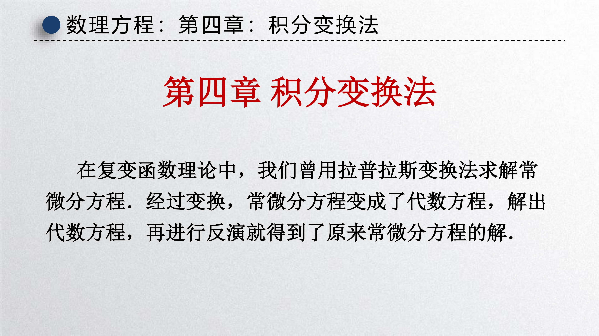
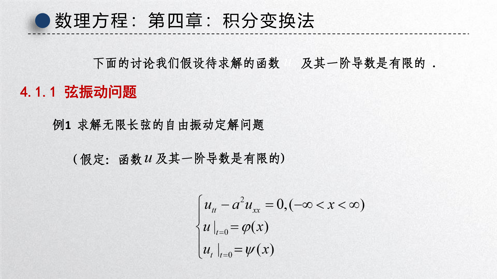
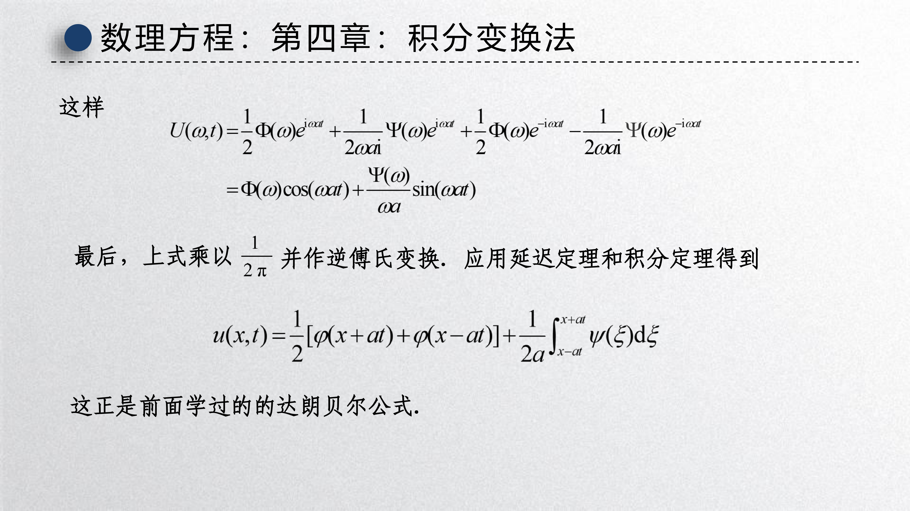
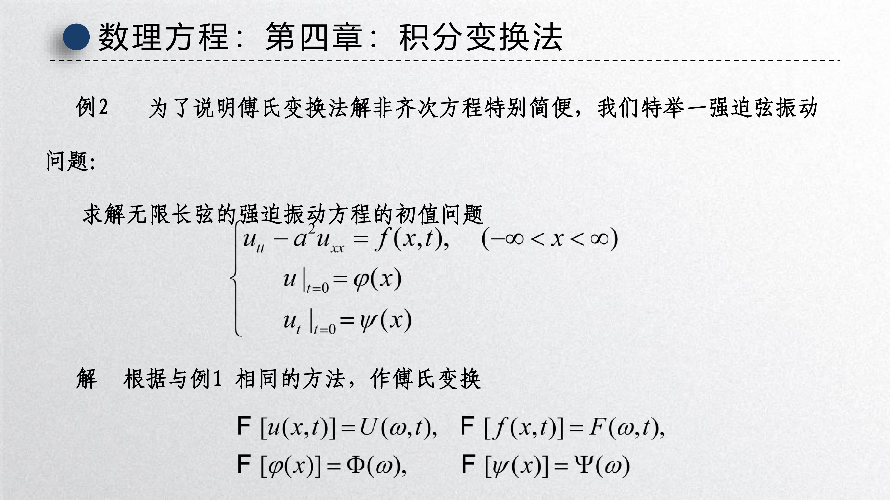
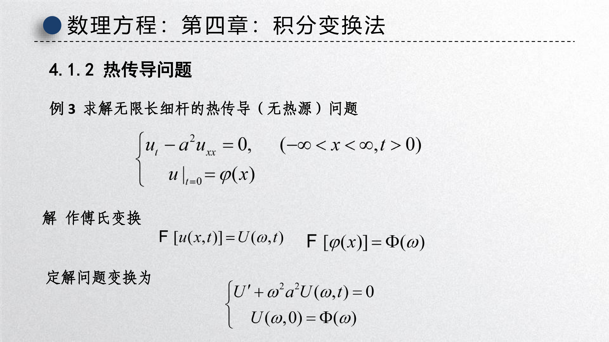
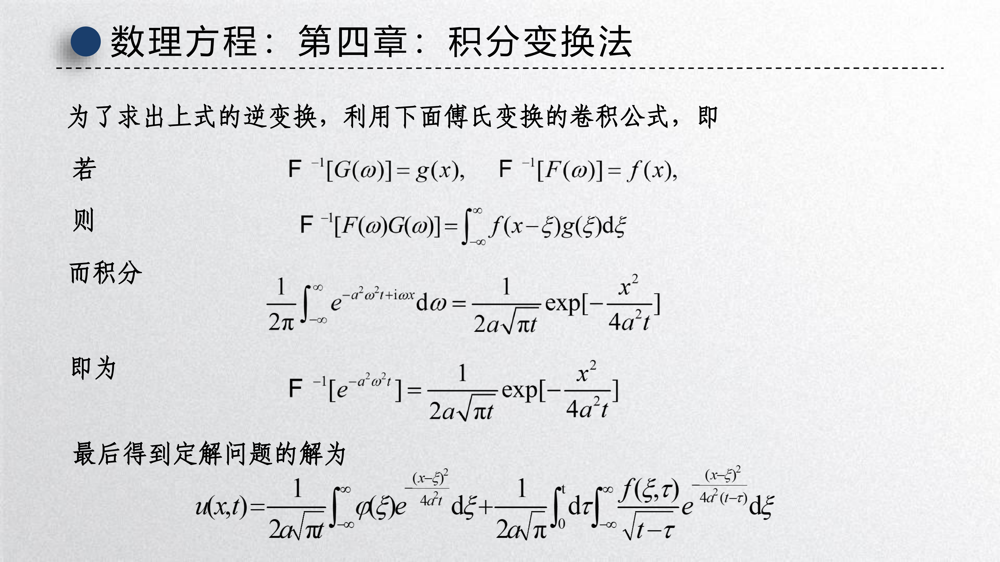
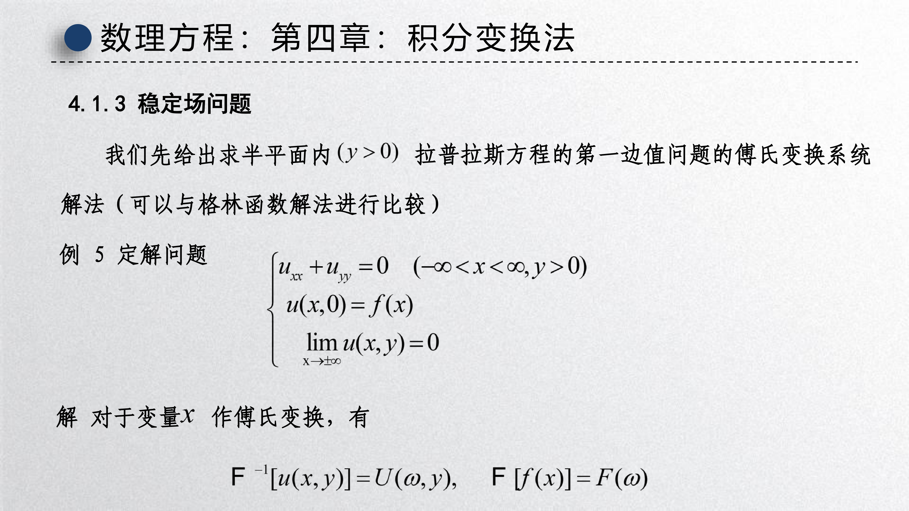
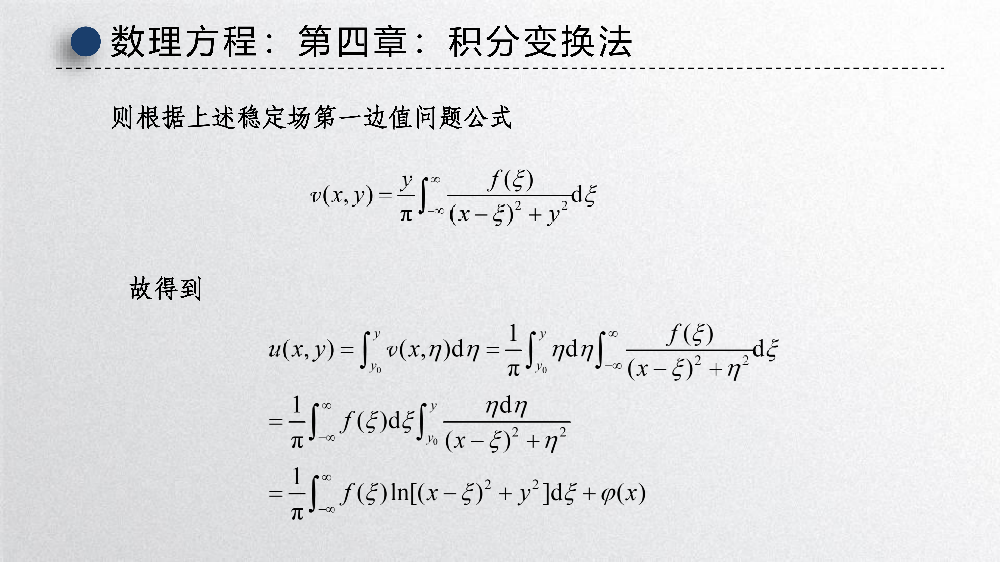
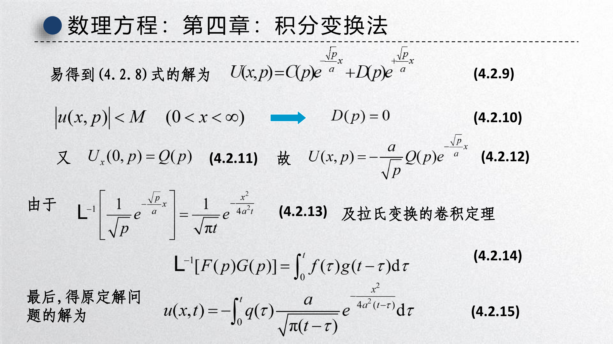

[第四章课件：积分变换法](slides/!%20工程数学_数理方程_第四章_积分变换法_20260526.pdf)

{ width="750" }

前三章分别用行波法、分离变量法、特殊函数处理了各类定解问题。这一章引入 **积分变换法** ，核心思路只有一句话： **把偏微分方程中的一个自变量通过积分变换消掉，将 PDE 化为 ODE，解完后再反演回去** 。

积分变换法特别适合以下两类场景：

- **无界或半无界区域** ：分离变量法需要有限区间才能产生离散本征值，而无界区域的本征值是连续的，此时 Fourier 积分（变换）是自然替代。
- **非齐次方程 + 非齐次边界** ：当泛定方程和边界条件都非齐次时，分离变量法需要先齐次化，步骤繁琐；积分变换法按固定程序走即可，常常更直接。

当然，积分变换法也有局限：它要求变换核的积分收敛，因此对待求函数有一定衰减要求；此外，逆变换的计算有时也并不简单。

---

## 1 用积分变换求解定解问题的基本步骤

用积分变换法求解定解问题，可以总结为五步：

1. **选变换** ：根据自变量的变化范围和定解条件，选择适当的积分变换。
   - 自变量在 $(-\infty, +\infty)$ 上变化（如无界域的空间坐标）→ **Fourier 变换** 
   - 自变量在 $(0, +\infty)$ 上变化（如时间变量 $t$）→ **Laplace 变换** 

2. **作变换** ：对方程取积分变换，将含两个自变量的 PDE 化为含参量的 ODE。

3. **转条件** ：对定解条件取相应变换，导出 ODE 的定解条件。

4. **解 ODE** ：求解这个常微分方程，得到变换域上的解。

5. **逆变换** ：对所得解取逆变换，得到原定解问题的解。

下面依次展开 Fourier 变换法和 Laplace 变换法。

---

## 2 常用积分变换对汇总

在动手算题之前，先把本章高频用到的变换对和性质统一放在这里，后面每一步推导都可以直接查用。

### 2.1 Fourier 变换对

!!! abstract "定义"

    设函数 $u(x)$ 在 $(-\infty, +\infty)$ 上满足一定衰减条件，则其 Fourier 变换和逆变换定义为：

    $$
    \hat{u}(\omega) = \mathcal{F}[u(x)] = \int_{-\infty}^{+\infty} u(x) \, e^{-\mathrm{i}\omega x} \, \mathrm{d}x,
    $$

    $$
    u(x) = \mathcal{F}^{-1}[\hat{u}(\omega)] = \frac{1}{2\pi} \int_{-\infty}^{+\infty} \hat{u}(\omega) \, e^{\mathrm{i}\omega x} \, \mathrm{d}\omega.
    $$

!!! abstract "基本性质"

    - **线性性** ：$\mathcal{F}[\alpha u + \beta v] = \alpha \hat{u} + \beta \hat{v}$
    - **微分性质** ：$\mathcal{F}[u'(x)] = \mathrm{i}\omega \, \hat{u}(\omega)$，$\mathcal{F}[u''(x)] = -\omega^2 \, \hat{u}(\omega)$
    - **平移性质** ：$\mathcal{F}[u(x-a)] = e^{-\mathrm{i}\omega a} \hat{u}(\omega)$
    - **延迟性质** ：$\mathcal{F}^{-1}[\hat{u}(\omega) \, e^{\pm \mathrm{i}\omega a}] = u(x \pm a)$
    - **积分定理** ：$\displaystyle\mathcal{F}^{-1}\!\left[\frac{\hat{u}(\omega)}{\mathrm{i}\omega}\right] = \int_{x_0}^{x} u(\xi) \, \mathrm{d}\xi$
    - **卷积定理** ：$\mathcal{F}^{-1}[\hat{u}(\omega) \hat{v}(\omega)] = \displaystyle\int_{-\infty}^{+\infty} u(x-\xi) v(\xi) \, \mathrm{d}\xi$

!!! info "常用逆变换"

    $$
    \mathcal{F}^{-1}\!\left[e^{-a^2 \omega^2 t}\right] = \frac{1}{2a\sqrt{\pi t}} \exp\!\left(-\frac{x^2}{4a^2 t}\right)
    $$

    $$
    \mathcal{F}^{-1}\!\left[e^{-|\omega| y}\right] = \frac{y}{\pi(x^2 + y^2)}
    $$

### 2.2 Laplace 变换对

!!! abstract "定义"

    设函数 $u(t)$ 在 $t \geq 0$ 上定义，其 Laplace 变换和逆变换定义为：

    $$
    U(p) = \mathcal{L}[u(t)] = \int_0^{+\infty} u(t) \, e^{-pt} \, \mathrm{d}t,
    $$

    $$
    u(t) = \mathcal{L}^{-1}[U(p)] = \frac{1}{2\pi\mathrm{i}} \int_{\sigma - \mathrm{i}\infty}^{\sigma + \mathrm{i}\infty} U(p) \, e^{pt} \, \mathrm{d}p.
    $$

!!! abstract "基本性质"

    - **线性性** ：$\mathcal{L}[\alpha u + \beta v] = \alpha U + \beta V$
    - **微分性质** ：$\mathcal{L}[u'(t)] = pU(p) - u(0)$
    - **二阶微分** ：$\mathcal{L}[u''(t)] = p^2 U(p) - p\,u(0) - u'(0)$
    - **延迟性质** ：$\mathcal{L}^{-1}[U(p) \, e^{-ps}] = u(t-s) \, H(t-s)$，其中 $H(\cdot)$ 为 Heaviside 阶跃函数
    - **卷积定理** ：$\mathcal{L}^{-1}[U(p) V(p)] = \displaystyle\int_0^t u(\tau) v(t-\tau) \, \mathrm{d}\tau$

!!! info "常用逆变换"

    $$
    \mathcal{L}^{-1}\!\left[\frac{1}{\sqrt{p}} \, e^{-\frac{\sqrt{p}}{a}x}\right] = \frac{1}{\sqrt{\pi t}} \exp\!\left(-\frac{x^2}{4a^2 t}\right)
    $$

    $$
    \mathcal{L}^{-1}\!\left[\frac{1}{p} \, e^{-\frac{\sqrt{p}}{a}x}\right] = \frac{a}{x\sqrt{\pi t}} \exp\!\left(-\frac{x^2}{4a^2 t}\right) \quad (x > 0)
    $$

---

## 3 Fourier 变换法解数学物理定解问题

### 3.1 Fourier 变换对

在展开例子之前，先明确本章采用的 Fourier 变换对。设 $u(x,t)$ 关于空间变量 $x$ 的 Fourier 变换为

$$
U(\omega, t) = \mathcal{F}[u(x,t)] = \int_{-\infty}^{+\infty} u(x,t) \, e^{-\mathrm{i}\omega x} \, \mathrm{d}x,
$$

逆变换为

$$
u(x,t) = \mathcal{F}^{-1}[U(\omega,t)] = \frac{1}{2\pi} \int_{-\infty}^{+\infty} U(\omega,t) \, e^{\mathrm{i}\omega x} \, \mathrm{d}\omega.
$$

本章默认所涉及的函数及其一阶导数在无穷远处足够快地趋于零，以保证变换存在。

---

### 3.2 弦振动问题

#### 例 1：无限长弦的自由振动

{ width="750" }

考虑如下定解问题：

$$
\begin{cases}
u_{tt} - a^2 u_{xx} = 0, & (-\infty < x < +\infty, \ t > 0), \\[6pt]
u\big|_{t=0} = \varphi(x), & \\[4pt]
u_t\big|_{t=0} = \psi(x).
\end{cases}
$$

 **解** ：对空间变量 $x$ 作 Fourier 变换，记

$$
\mathcal{F}[u(x,t)] = U(\omega,t), \quad \mathcal{F}[\varphi(x)] = \Phi(\omega), \quad \mathcal{F}[\psi(x)] = \Psi(\omega).
$$

利用 Fourier 变换的微分性质 $\mathcal{F}[u_{xx}] = (\mathrm{i}\omega)^2 U = -\omega^2 U$，原定解问题化为关于 $t$ 的常微分方程：

$$
\begin{cases}
\displaystyle\frac{\partial^2 U}{\partial t^2} + a^2 \omega^2 U = 0, \\[8pt]
U(\omega, 0) = \Phi(\omega), \\[4pt]
U_t(\omega, 0) = \Psi(\omega).
\end{cases}
$$

这是二阶常系数线性 ODE，其通解为

$$
U(\omega, t) = A(\omega) \, e^{\mathrm{i} a \omega t} + B(\omega) \, e^{-\mathrm{i} a \omega t}.
$$

代入初始条件，解得

$$
A(\omega) = \frac{1}{2}\Phi(\omega) + \frac{1}{2a} \frac{\Psi(\omega)}{\mathrm{i}\omega}, \qquad
B(\omega) = \frac{1}{2}\Phi(\omega) - \frac{1}{2a} \frac{\Psi(\omega)}{\mathrm{i}\omega}.
$$

于是

$$
U(\omega, t) = \Phi(\omega) \cos(a\omega t) + \frac{\Psi(\omega)}{a\omega} \sin(a\omega t).
$$

最后进行逆 Fourier 变换。利用

- **延迟定理** ：$\mathcal{F}^{-1}[\Phi(\omega) e^{\pm \mathrm{i} a \omega t}] = \varphi(x \pm a t)$
- **积分定理** ：$\mathcal{F}^{-1}\!\left[\dfrac{\Psi(\omega)}{\mathrm{i}\omega}\right] = \displaystyle\int_{x_0}^{x} \psi(\xi) \, \mathrm{d}\xi$

得到

$$
\boxed{
u(x,t) = \frac{1}{2}\big[\varphi(x+at) + \varphi(x-at)\big] + \frac{1}{2a} \int_{x-at}^{x+at} \psi(\xi) \, \mathrm{d}\xi
}
$$

这正是 **达朗贝尔公式** 。用 Fourier 变换法重新得到了行波法的结果，验证了两个方法的等价性。

{ width="750" }

---

#### 例 2：无限长弦的强迫振动

{ width="750" }

考虑非齐次波动方程：

$$
\begin{cases}
u_{tt} - a^2 u_{xx} = f(x,t), & (-\infty < x < +\infty, \ t > 0), \\[6pt]
u\big|_{t=0} = \varphi(x), \\[4pt]
u_t\big|_{t=0} = \psi(x).
\end{cases}
$$

 **解** ：同样对 $x$ 作 Fourier 变换，记 $\mathcal{F}[f(x,t)] = F(\omega, t)$。变换后的 ODE 为

$$
\begin{cases}
\displaystyle\frac{\partial^2 U}{\partial t^2} + a^2 \omega^2 U = F(\omega, t), \\[8pt]
U(\omega, 0) = \Phi(\omega), \\[4pt]
U_t(\omega, 0) = \Psi(\omega).
\end{cases}
$$

用常数变易法或 Laplace 变换法解此一维非齐次 ODE，得

$$
U(\omega, t) = \Phi(\omega) \cos(a\omega t) + \frac{\Psi(\omega)}{a\omega} \sin(a\omega t) + \int_0^t \frac{F(\omega, \tau)}{a\omega} \sin\big[a\omega(t-\tau)\big] \, \mathrm{d}\tau.
$$

前两项的逆变换已在例 1 中求得。对第三项，利用卷积公式和积分公式：

$$
\mathcal{F}^{-1}\!\left[\frac{\sin[a\omega(t-\tau)]}{a\omega} \, F(\omega,\tau)\right] = \frac{1}{2a} \int_{x-a(t-\tau)}^{x+a(t-\tau)} f(\xi, \tau) \, \mathrm{d}\xi.
$$

因此，原定解问题的解为

$$
\boxed{
\begin{aligned}
u(x,t) =& \ \frac{1}{2}\big[\varphi(x+at) + \varphi(x-at)\big] + \frac{1}{2a} \int_{x-at}^{x+at} \psi(\xi) \, \mathrm{d}\xi \\[6pt]
& + \frac{1}{2a} \int_0^t \!\! \int_{x-a(t-\tau)}^{x+a(t-\tau)} f(\xi, \tau) \, \mathrm{d}\xi \, \mathrm{d}\tau
\end{aligned}
}
$$

与例 1 相比，多出的第三项就是 **外力引起的强迫振动响应** 。物理上可以理解为：在每一时刻 $\tau$，外力 $f(\cdot, \tau)$ 在区间 $[x-a(t-\tau), \, x+a(t-\tau)]$ 上产生一个扰动，这些扰动按时间叠加即得总响应。

---

### 3.3 热传导问题

#### 例 3：无限长细杆的无热源热传导

{ width="750" }

定解问题为

$$
\begin{cases}
u_t - a^2 u_{xx} = 0, & (-\infty < x < +\infty, \ t > 0), \\[6pt]
u\big|_{t=0} = \varphi(x).
\end{cases}
$$

 **解** ：对 $x$ 作 Fourier 变换，得

$$
\begin{cases}
U_t + a^2 \omega^2 U = 0, \\[6pt]
U(\omega, 0) = \Phi(\omega).
\end{cases}
$$

解得 $U(\omega, t) = \Phi(\omega) \, e^{-a^2 \omega^2 t}$。进行逆变换：

$$
\nu(x,t) = \frac{1}{2\pi} \int_{-\infty}^{+\infty} \Phi(\omega) \, e^{-a^2 \omega^2 t} \, e^{\mathrm{i}\omega x} \, \mathrm{d}\omega.
$$

将 $\Phi(\omega) = \displaystyle\int_{-\infty}^{+\infty} \varphi(\xi) \, e^{-\mathrm{i}\omega\xi} \, \mathrm{d}\xi$ 代入并交换积分次序：

$$
u(x,t) = \frac{1}{2\pi} \int_{-\infty}^{+\infty} \varphi(\xi) \left[ \int_{-\infty}^{+\infty} e^{-a^2 \omega^2 t} \, e^{\mathrm{i}\omega(x-\xi)} \, \mathrm{d}\omega \right] \mathrm{d}\xi.
$$

引用高斯积分公式

$$
\int_{-\infty}^{+\infty} e^{-\alpha^2 \omega^2} e^{\beta \omega} \, \mathrm{d}\omega = \frac{\sqrt{\pi}}{\alpha} \exp\!\left(\frac{\beta^2}{4\alpha^2}\right),
$$

令 $\alpha = a\sqrt{t}$，$\beta = \mathrm{i}(x-\xi)$，得内层积分

$$
\int_{-\infty}^{+\infty} e^{-a^2 \omega^2 t} \, e^{\mathrm{i}\omega(x-\xi)} \, \mathrm{d}\omega = \frac{\sqrt{\pi}}{a\sqrt{t}} \exp\!\left(-\frac{(x-\xi)^2}{4a^2 t}\right).
$$

因此

$$
\boxed{
u(x,t) = \int_{-\infty}^{+\infty} \varphi(\xi) \, \frac{1}{2a\sqrt{\pi t}} \exp\!\left(-\frac{(x-\xi)^2}{4a^2 t}\right) \mathrm{d}\xi
}
$$

这就是 **热传导方程的基本解** （热核）与初始条件的卷积。函数

$$
G(x,t; \xi) = \frac{1}{2a\sqrt{\pi t}} \exp\!\left(-\frac{(x-\xi)^2}{4a^2 t}\right)
$$

称为 **热核** 或 **高斯核** ，它描述了一个位于 $\xi$ 处的点热源在时刻 $t$ 产生的温度分布。

---

#### 例 4：无限长细杆的有源热传导

定解问题为

$$
\begin{cases}
u_t - a^2 u_{xx} = f(x,t), & (-\infty < x < +\infty, \ t > 0), \\[6pt]
u\big|_{t=0} = \varphi(x).
\end{cases}
$$

 **解** ：对 $x$ 作 Fourier 变换，得

$$
\begin{cases}
U_t + a^2 \omega^2 U = F(\omega, t), \\[6pt]
U(\omega, 0) = \Phi(\omega).
\end{cases}
$$

这是一阶线性非齐次 ODE，解为

$$
U(\omega, t) = \Phi(\omega) \, e^{-a^2 \omega^2 t} + \int_0^t F(\omega, \tau) \, e^{-a^2 \omega^2 (t-\tau)} \, \mathrm{d}\tau.
$$

第一项的逆变换已在例 3 中求得。对第二项，利用卷积定理：

{ width="750" }

已知

$$
\mathcal{F}^{-1}\big[e^{-a^2 \omega^2 t}\big] = \frac{1}{2a\sqrt{\pi t}} \exp\!\left(-\frac{x^2}{4a^2 t}\right),
$$

因此

$$
\mathcal{F}^{-1}\!\left[\int_0^t F(\omega,\tau) \, e^{-a^2\omega^2(t-\tau)} \, \mathrm{d}\tau\right] = \int_0^t \!\! \int_{-\infty}^{+\infty} f(\xi, \tau) \, \frac{\exp\!\left(-\dfrac{(x-\xi)^2}{4a^2(t-\tau)}\right)}{2a\sqrt{\pi(t-\tau)}} \, \mathrm{d}\xi \, \mathrm{d}\tau.
$$

综上，定解问题的解为

$$
\boxed{
\begin{aligned}
u(x,t) =& \int_{-\infty}^{+\infty} \varphi(\xi) \, \frac{1}{2a\sqrt{\pi t}} \exp\!\left(-\frac{(x-\xi)^2}{4a^2 t}\right) \mathrm{d}\xi \\[6pt]
& + \int_0^t \!\! \int_{-\infty}^{+\infty} f(\xi, \tau) \, \frac{1}{2a\sqrt{\pi(t-\tau)}} \exp\!\left(-\frac{(x-\xi)^2}{4a^2(t-\tau)}\right) \mathrm{d}\xi \, \mathrm{d}\tau
\end{aligned}
}
$$

第一项是初始温度分布的扩散，第二项是热源 $f$ 随时间累积的贡献。

---

### 3.4 稳定场问题

#### 例 5：半平面的第一边值问题

{ width="750" }

考虑上半平面 $y > 0$ 内的 Laplace 方程第一边值问题：

$$
\begin{cases}
u_{xx} + u_{yy} = 0, & (-\infty < x < +\infty, \ y > 0), \\[6pt]
u(x, 0) = f(x), \\[4pt]
\displaystyle\lim_{x \to \pm\infty} u(x,y) = 0.
\end{cases}
$$

 **解** ：对 $x$ 作 Fourier 变换，记 $U(\omega, y) = \mathcal{F}[u(x,y)]$，$F(\omega) = \mathcal{F}[f(x)]$。定解问题化为

$$
\begin{cases}
\displaystyle\frac{\partial^2 U}{\partial y^2} - \omega^2 U = 0, \\[8pt]
U(\omega, 0) = F(\omega), \\[4pt]
\displaystyle\lim_{\omega \to \pm\infty} U(\omega, y) = 0.
\end{cases}
$$

通解为 $U(\omega, y) = C(\omega) \, e^{|\omega| y} + D(\omega) \, e^{-|\omega| y}$。由有界性条件 $U \to 0$（当 $\omega \to \pm\infty$），得 $C(\omega) = 0$。再由 $U(\omega, 0) = F(\omega)$，得 $D(\omega) = F(\omega)$。因此

$$
U(\omega, y) = F(\omega) \, e^{-|\omega| y}.
$$

计算 $e^{-|\omega| y}$ 的逆 Fourier 变换：

$$
\mathcal{F}^{-1}\big[e^{-|\omega| y}\big] = \frac{1}{2\pi} \int_{-\infty}^{+\infty} e^{-|\omega| y} \, e^{\mathrm{i}\omega x} \, \mathrm{d}\omega = \frac{y}{\pi(x^2 + y^2)}.
$$

利用卷积定理，得到

$$
\boxed{
u(x,y) = \frac{y}{\pi} \int_{-\infty}^{+\infty} \frac{f(\xi)}{(x-\xi)^2 + y^2} \, \mathrm{d}\xi
}
$$

这就是 **上半平面的 Poisson 积分公式** 。它表明：上半平面内任意一点的调和函数值，可由边界上的值通过一个以该点为极值的权函数加权平均得到。

---

#### 例 6：半平面的第二边值问题

若边界条件改为 Neumann 条件：

$$
\begin{cases}
u_{xx} + u_{yy} = 0, & (-\infty < x < +\infty, \ y > 0), \\[6pt]
u_y(x, 0) = f(x), \\[4pt]
\displaystyle\lim_{x \to \pm\infty} u(x,y) = 0.
\end{cases}
$$

 **解** ：令 $v(x,y) = u_y(x,y)$，则 $v$ 满足第一边值问题

$$
\begin{cases}
v_{xx} + v_{yy} = 0, \\[4pt]
v(x, 0) = f(x), \\[4pt]
v \to 0 \ (x \to \pm\infty).
\end{cases}
$$

由例 5 的结果，

$$
v(x,y) = \frac{y}{\pi} \int_{-\infty}^{+\infty} \frac{f(\xi)}{(x-\xi)^2 + y^2} \, \mathrm{d}\xi.
$$

于是

$$
u(x,y) = \int_{y_0}^{y} v(x, \eta) \, \mathrm{d}\eta = \frac{1}{\pi} \int_{-\infty}^{+\infty} f(\xi) \ln\big[(x-\xi)^2 + y^2\big] \, \mathrm{d}\xi + \varphi(x),
$$

其中 $\varphi(x)$ 是积分常数（仅依赖于 $x$），可由附加条件确定。

---

## 4 Laplace 变换解数学物理定解问题

{ width="750" }

Fourier 变换要求函数定义在 $(-\infty, +\infty)$ 上，因此当处理半无界问题（如 $x \in (0, +\infty)$）时，就不能直接对 $x$ 使用 Fourier 变换了。此时， **Laplace 变换** 成为自然选择——它适用于定义在 $(0, +\infty)$ 上的函数。

在数理方程中，Laplace 变换通常对 **时间变量 $t$** 实施，因为物理过程总是从 $t = 0$ 开始发展的。

回顾 Laplace 变换的基本性质：

$$
\mathcal{L}[u(x,t)] = U(x,p) = \int_0^{+\infty} u(x,t) \, e^{-pt} \, \mathrm{d}t,
$$

$$
\mathcal{L}[u_t(x,t)] = p \, U(x,p) - u(x,0), \qquad \mathcal{L}[u_{tt}(x,t)] = p^2 U(x,p) - p\,u(x,0) - u_t(x,0).
$$

---

### 4.1 无界区域的问题

#### 例 4.2.1：有源热传导方程

定解问题为

$$
\begin{cases}
u_t - a^2 u_{xx} = f(x,t), & (-\infty < x < +\infty, \ t > 0), \\[6pt]
u\big|_{t=0} = \varphi(x).
\end{cases}
$$

 **解** ：先对时间 $t$ 作 Laplace 变换，记

$$
\mathcal{L}[u(x,t)] = U(x,p), \quad \mathcal{L}[f(x,t)] = F(x,p).
$$

利用 Laplace 变换的微分性质，方程变为

$$
p \, U(x,p) - \varphi(x) - a^2 \frac{\partial^2 U}{\partial x^2} = F(x,p),
$$

即

$$
\frac{\mathrm{d}^2 U}{\mathrm{d}x^2} - \frac{p}{a^2} U = -\frac{1}{a^2}\big[\varphi(x) + F(x,p)\big].
$$

这是一个二阶线性非齐次 ODE。利用 Green 函数法或 Fourier 变换法求解（对 $x$ 作 Fourier 变换），可得

$$
U(x,p) = \int_{-\infty}^{+\infty} \varphi(\xi) \, \frac{1}{2a\sqrt{p}} \, e^{-\frac{\sqrt{p}}{a}|x-\xi|} \, \mathrm{d}\xi + \int_{-\infty}^{+\infty} F(\xi,p) \, \frac{1}{2a\sqrt{p}} \, e^{-\frac{\sqrt{p}}{a}|x-\xi|} \, \mathrm{d}\xi.
$$

查阅 Laplace 逆变换表，有

$$
\mathcal{L}^{-1}\!\left[\frac{1}{\sqrt{p}} \, e^{-\frac{\sqrt{p}}{a}|x-\xi|}\right] = \frac{1}{\sqrt{\pi t}} \exp\!\left(-\frac{(x-\xi)^2}{4a^2 t}\right).
$$

再利用 Laplace 变换的卷积定理

$$
\mathcal{L}^{-1}\big[F(p)G(p)\big] = \int_0^t f(\tau) \, g(t-\tau) \, \mathrm{d}\tau,
$$

最终得到

$$
\boxed{
\begin{aligned}
u(x,t) =& \int_{-\infty}^{+\infty} \varphi(\xi) \, \frac{1}{2a\sqrt{\pi t}} \exp\!\left(-\frac{(x-\xi)^2}{4a^2 t}\right) \mathrm{d}\xi \\[6pt]
& + \int_0^t \!\! \int_{-\infty}^{+\infty} f(\xi, \tau) \, \frac{1}{2a\sqrt{\pi(t-\tau)}} \exp\!\left(-\frac{(x-\xi)^2}{4a^2(t-\tau)}\right) \mathrm{d}\xi \, \mathrm{d}\tau
\end{aligned}
}
$$

与 Fourier 变换法得到的结果完全一致，验证了两种方法的等价性。

---

### 4.2 半无界区域的问题

#### 例 2：半无限杆的热传导

定解问题为

$$
\begin{cases}
u_t = a^2 u_{xx}, & (0 < x < +\infty, \ t > 0), \\[6pt]
u(x, 0) = 0, \\[4pt]
u_x(0, t) = q(t), \\[4pt]
|u(x,t)| < M.
\end{cases}
$$

 **解** ：对时间 $t$ 作 Laplace 变换，得

$$
\begin{cases}
\displaystyle\frac{\mathrm{d}^2 U}{\mathrm{d}x^2} - \frac{p}{a^2} U = 0, \\[8pt]
U_x(0, p) = Q(p), \\[4pt]
|U(x,p)| < M,
\end{cases}
$$

其中 $Q(p) = \mathcal{L}[q(t)]$。通解为

$$
U(x,p) = C(p) \, e^{-\frac{\sqrt{p}}{a}x} + D(p) \, e^{\frac{\sqrt{p}}{a}x}.
$$

由有界性条件 $|U| < M$（当 $x \to +\infty$），得 $D(p) = 0$。再由 $U_x(0,p) = Q(p)$，得

$$
C(p) = -\frac{a}{\sqrt{p}} Q(p).
$$

因此

$$
U(x,p) = -\frac{a}{\sqrt{p}} Q(p) \, e^{-\frac{\sqrt{p}}{a}x}.
$$

利用 Laplace 逆变换公式

$$
\mathcal{L}^{-1}\!\left[\frac{1}{\sqrt{p}} \, e^{-\frac{\sqrt{p}}{a}x}\right] = \frac{1}{\sqrt{\pi t}} \exp\!\left(-\frac{x^2}{4a^2 t}\right),
$$

以及卷积定理，得到

$$
\boxed{
u(x,t) = -a \int_0^t q(\tau) \, \frac{1}{\sqrt{\pi(t-\tau)}} \exp\!\left(-\frac{x^2}{4a^2(t-\tau)}\right) \mathrm{d}\tau
}
$$

---

#### 例 3：无失真条件下的电报方程

{ width="750" }

电报方程描述的是传输线上的电压或电流变化。在无失真条件下，电报方程可化简为

$$
\begin{cases}
v_{xx} = \dfrac{1}{\alpha^2} v_{tt} + \dfrac{2\beta}{\alpha} v_t + \beta^2 v, & (x > 0, \ t > 0), \\[10pt]
v(x,0) = 0, \quad v_t(x,0) = 0, \\[6pt]
v(0,t) = \varphi(t), \\[4pt]
\displaystyle\lim_{x \to +\infty} v(x,t) = 0,
\end{cases}
$$

其中 $\alpha = \dfrac{1}{\sqrt{LC}}$，$\beta = \sqrt{RG}$。

 **解** ：对时间 $t$ 作 Laplace 变换，记 $V(x,p) = \mathcal{L}[v(x,t)]$，$\Phi(p) = \mathcal{L}[\varphi(t)]$。方程变为

$$
\frac{\mathrm{d}^2 V}{\mathrm{d}x^2} = \left(\frac{p^2}{\alpha^2} + \frac{2\beta p}{\alpha} + \beta^2\right) V = \left(\frac{p}{\alpha} + \beta\right)^2 V.
$$

通解为

$$
V(x,p) = C(p) \, e^{-(\frac{p}{\alpha}+\beta)x} + D(p) \, e^{(\frac{p}{\alpha}+\beta)x}.
$$

由有界性条件，$D(p) = 0$。由 $V(0,p) = \Phi(p)$，得 $C(p) = \Phi(p)$。因此

$$
V(x,p) = \Phi(p) \, e^{-(\frac{p}{\alpha}+\beta)x} = \Phi(p) \, e^{-\beta x} \, e^{-\frac{p x}{\alpha}}.
$$

利用 Laplace 变换的 **延迟定理** 

$$
\mathcal{L}^{-1}\big[e^{-ps} \Phi(p)\big] = \varphi(t-s) \, H(t-s),
$$

其中 $H(\cdot)$ 是 Heaviside 阶跃函数，得到

$$
\boxed{
u(x,t) = \begin{cases}
e^{-\beta x} \, \varphi\!\left(t - \dfrac{x}{\alpha}\right), & t \geq \dfrac{x}{\alpha}, \\[8pt]
0, & t < \dfrac{x}{\alpha}.
\end{cases}}
$$

物理意义非常清晰：信号以速度 $\alpha = 1/\sqrt{LC}$ 沿传输线传播，每传播距离 $x$，幅度衰减因子为 $e^{-\beta x} = e^{-\sqrt{RG}\, x}$。当 $t < x/\alpha$ 时，信号尚未到达该点，故电压为零。这就是 **无失真传输线** 的特征：波形不变，只衰减和延迟。

---

## 5 总结

!!! abstract "核心公式汇总"

    **Fourier 变换对** 

    $$
    U(\omega) = \int_{-\infty}^{+\infty} u(x) \, e^{-\mathrm{i}\omega x} \, \mathrm{d}x, \qquad
    u(x) = \frac{1}{2\pi} \int_{-\infty}^{+\infty} U(\omega) \, e^{\mathrm{i}\omega x} \, \mathrm{d}\omega
    $$

    **Laplace 变换对** 

    $$
    U(p) = \int_0^{+\infty} u(t) \, e^{-pt} \, \mathrm{d}t, \qquad
    u(t) = \frac{1}{2\pi\mathrm{i}} \int_{\sigma-\mathrm{i}\infty}^{\sigma+\mathrm{i}\infty} U(p) \, e^{pt} \, \mathrm{d}p
    $$

    **常用逆变换** 

    $$
    \mathcal{F}^{-1}\big[e^{-a^2\omega^2 t}\big] = \frac{1}{2a\sqrt{\pi t}} \exp\!\left(-\frac{x^2}{4a^2 t}\right)
    $$

    $$
    \mathcal{F}^{-1}\big[e^{-|\omega| y}\big] = \frac{y}{\pi(x^2+y^2)}
    $$

    $$
    \mathcal{L}^{-1}\!\left[\frac{1}{\sqrt{p}} e^{-\frac{\sqrt{p}}{a}x}\right] = \frac{1}{\sqrt{\pi t}} \exp\!\left(-\frac{x^2}{4a^2 t}\right)
    $$

!!! tip "方法选择指南"

    - **空间无界** $(-\infty, +\infty)$ + 时间演化 → 对 $x$ 用 **Fourier 变换** 
    - **时间半无界** $(0, +\infty)$ + 空间演化 → 对 $t$ 用 **Laplace 变换** 
    - **全空间热传导/波动** → Fourier 变换通常更直接
    - **半空间/边界条件复杂** → Laplace 变换可能更方便
    - **有源问题** → 两种变换都能处理，结果形式常常是卷积

!!! warning "注意事项"

    - Fourier 变换要求函数在无穷远处足够快地衰减，否则变换可能不存在。
    - Laplace 变换的收敛域需要特别注意，逆变换通常用查表或留数定理。
    - 两种变换法得到的解应当一致，可以作为互相检验的手段。
