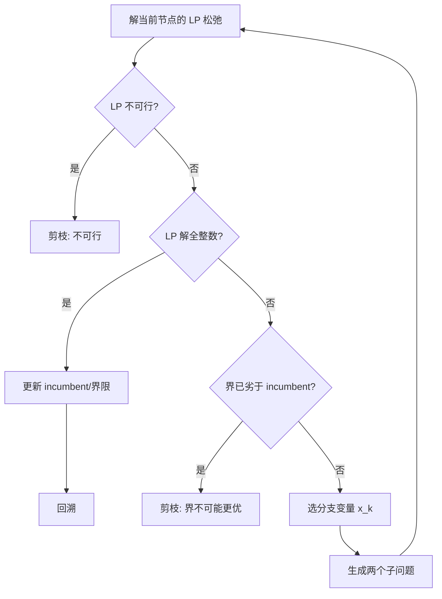

## 1 线性规划模型

### 1.1 基本形式与术语

线性规划（Linear Programming, LP）是在一组线性约束下，优化一个线性目标函数的问题。课件采用的“常见一般形式”可写为：

$$
\begin{aligned}
\min/\max \quad & z = \sum_{j=1}^{n} c_j x_j \\
\text{s.t.} \quad & \sum_{j=1}^{n} a_{ij} x_j \;\; (\le,=,\ge)\;\; b_i,\quad i = 1,2,\ldots,m \\
& x_j \ge 0,\quad j \in J \subseteq \{1,2,\ldots,n\} \\
& x_j \ \text{自由变量},\quad j \in \{1,2,\ldots,n\}\setminus J
\end{aligned}
$$

常用概念（与课件一致）：

1. 可行解：满足全部约束与变量取值要求的解。
2. 可行域：全体可行解的集合（凸多面体或其低维退化）。
3. 最优解：目标函数值最小（或最大）的可行解。
4. 最优值：最优解处的目标函数值。

### 1.2 典型建模例子（课件）

#### 例 1：生产计划（配比约束）

两种清洁剂 A、B 用三种原料混配，问如何配制使总价值最大。设清洁剂 A、B 的产量分别为 $x,y$（吨），则：

$$
\begin{aligned}
\max \quad & 12x + 15y \\
\text{s.t.}\quad
& 0.25x + 0.50y \le 120 \\
& 0.50x + 0.50y \le 150 \\
& 0.25x \le 50 \\
& x \ge 0,\ y \ge 0
\end{aligned}
$$

#### 例 2：投资组合（上界、比例约束）

总投资 10 亿，设 $x_i$ 为第 $i$ 个项目投资额（亿元）。课件给出了“每个项目不超过 3 亿、高新不超过 5 亿、项目 2 不超过高新一半、债券不少于基础工业 40%”等约束，可以统一写成线性不等式组与等式约束（总额为 10）。

#### 例 3：运输问题（供需平衡）

设 $x_{ij}$ 为工厂 $i$ 到分销中心 $j$ 的运输量，则目标为总运费最小化，并满足每个工厂产量约束与分销中心需求约束（产销平衡时含等式）。

## 2 标准形与等价变换

### 2.1 标准形（课件）

课件使用的标准形（standard form）为：

$$
\begin{aligned}
\min \quad & z = c^T x \\
\text{s.t.}\quad & Ax = b \\
& x \ge 0
\end{aligned}
$$

特点：

1. 目标函数：最小化。
2. 约束：等式约束。
3. 变量：全部非负。

### 2.2 化成标准形的规则（课件）

1. 最大化转最小化：$\max z$ 等价于 $\min z' = -z$，即 $c' = -c$。
2. 若 $b_i < 0$：第 $i$ 条约束两边同乘 $-1$，并将 $\le/\ge$ 方向翻转。
3. $\le$ 约束：引入松弛变量 $s_i \ge 0$，使 $\sum_j a_{ij}x_j + s_i = b_i$。
4. $\ge$ 约束：引入剩余变量 $s_i \ge 0$，使 $\sum_j a_{ij}x_j - s_i = b_i$。
5. 自由变量：用 $x_j = x'_j - x''_j$ 替换，其中 $x'_j \ge 0,\ x''_j \ge 0$。

### 2.3 标准形的矩阵记号（课件）

将 $A \in \mathbb{R}^{m\times n}$、$b\in\mathbb{R}^m$、$c\in\mathbb{R}^n$ 写成矩阵形式：

$$
\min \ c^T x\quad \text{s.t.}\ Ax=b,\ x\ge 0
$$

## 3 几何视角与图解法（二维）

### 3.1 可行域的结构与“顶点最优性”

对二维 LP，可行域是若干半平面的交，形成凸多边形（可能无界或为空）。课件总结的解的情形：

1. 有唯一最优解。
2. 有无穷多个最优解（目标函数与某条可行边平行并在其上达到最优）。
3. 有可行解但无最优解（目标函数无界）。
4. 无可行解（可行域为空）。

关键事实：若 LP 有最优解，则一定可以在可行域的某个顶点（极点）取到最优值。

### 3.2 图解法（课件示例）

课件在例 1 的二维情形给出了可行域顶点 $O,A,B,C,D$，并比较不同等值线，得到最优解在顶点 $B$。若将目标函数改变为某些系数，可能出现“整段最优”（如线段 $BC$ 上任一点皆最优）。

## 4 单纯形法（Simplex）

### 4.1 基、基变量、基本解、基本可行解（课件）

在标准形 $Ax=b,\ x\ge 0$ 下，设 $\operatorname{rank}(A)=m$：

1. $A$ 的任意 $m$ 个线性无关列称为一个基（basis），记为 $B$。
2. 与基列对应的变量称为基变量 $x_B$，其余为非基变量 $x_N$。
3. 令 $x_N = 0$，则由 $Bx_B=b$ 得 $x_B = B^{-1}b$，此解称为基本解（basic solution）。
4. 若该基本解满足 $x_B \ge 0$，则称为基本可行解（basic feasible solution, BFS），对应的基称为可行基。

课件还给出了判别引理：$Ax=b$ 的解 $\alpha$ 是基本解，当且仅当 $\alpha$ 中非零分量对应的列向量线性无关。

### 4.2 为什么只需搜“顶点”（课件）

课件结论（对应几何直觉）：

1. 若标准形有可行解，则必存在基本可行解。
2. 若标准形有最优解，则必存在一个基本可行解是最优解。

因此，算法只需在 BFS（即可行域顶点）之间进行迭代。

### 4.3 初始基本可行解（课件 + 扩展）

最简单的情形：约束为 $\le$ 且 $b \ge 0$。引入松弛变量后可直接取松弛变量为基变量，得到初始 BFS。

其他情形（包含 $=$、$\ge$、或不易直接读出 BFS）通常需要“人工变量”来构造初始可行基，课件给出“两阶段法”的思路：

1. 引入人工变量并以其为基，构造一个显然可行的辅助问题。
2. 先解辅助问题以获得原问题的可行基（或判断不可行），再以此为起点解原问题。

### 4.4 单纯形法的推导（详细）

下面给出一条从标准形出发、逐步得到“检验数（reduced cost）”“换入/换出规则”“比值检验”的推导链条。为避免符号冲突，本节约定目标为最小化。

我们从标准形开始：

$$
\begin{aligned}
\min \quad & z = c^T x \\
\text{s.t.}\quad & Ax=b \\
& x\ge 0
\end{aligned}
$$

#### 4.4.1 选定基并将可行解参数化

设 $\operatorname{rank}(A)=m$。取 $A$ 的一组基列组成 $B\in\mathbb{R}^{m\times m}$，其余列组成 $N\in\mathbb{R}^{m\times (n-m)}$，并相应地把变量分成

$$
x = \begin{bmatrix} x_B \\ x_N \end{bmatrix},\quad A = [B\ \ N],\quad c = \begin{bmatrix} c_B \\ c_N \end{bmatrix}.
$$

把等式约束写成

$$
Bx_B + Nx_N = b.
$$

若 $B$ 可逆，则

$$
x_B = B^{-1}b - B^{-1}N x_N.
$$

记

$$
\beta := B^{-1}b,\quad \alpha := B^{-1}A = [I\ \ B^{-1}N].
$$

当我们令 $x_N=0$ 时得到基本解 $x_B=\beta$；若进一步满足 $\beta\ge 0$，则它是基本可行解（BFS）。

更一般地：在固定基 $B$ 的前提下，所有满足 $Ax=b$ 的解都可由非基变量 $x_N$ 参数化为上式。此时可行性等价于

$$
x_N \ge 0,\quad x_B = \beta - (B^{-1}N)x_N \ge 0.
$$

#### 4.4.2 把目标函数写成“常数项 + 线性项”

将 $x_B=\beta - B^{-1}N x_N$ 代入目标函数：

$$
\begin{aligned}
z
&= c_B^T x_B + c_N^T x_N \\
&= c_B^T\beta + \bigl(c_N^T - c_B^T B^{-1}N\bigr)x_N.
\end{aligned}
$$

记

$$
z_0 := c_B^T\beta,\quad \lambda^T := c_N^T - c_B^T B^{-1}N,
$$

则

$$
z = z_0 + \lambda^T x_N.
$$

其中 $\lambda$ 正是“非基变量的检验数/约化成本（reduced cost）”。

#### 4.4.3 最优性条件为什么是 “$\lambda \ge 0$”

在当前基 $B$ 固定且当前 BFS 为 $x_N=0,\ x_B=\beta$ 时，考虑任意可行解。因为 $x_N\ge 0$，且 $z=z_0+\lambda^T x_N$，所以：

1. 若 $\lambda \ge 0$（逐分量），则对任意可行解都有 $z \ge z_0$，因此当前 BFS 已是最优解。
2. 若存在某个 $k$ 使 $\lambda_k < 0$，则让 $x_k$ 从 0 增大将倾向于降低目标值（更优），所以当前 BFS 不可能最优。

这就是单纯形法“最优性检验”的来源。

#### 4.4.4 无界判别为什么是 “$\lambda_k < 0$ 且列向量方向不受约束”

设存在 $k$ 使 $\lambda_k<0$，我们尝试沿着只增加 $x_k$ 的方向移动：

$$
x_N(t) = t e_k,\quad t\ge 0.
$$

则

$$
x_B(t) = \beta - (B^{-1}N) e_k \cdot t = \beta - \alpha_k t,
$$

其中 $\alpha_k$ 表示 $B^{-1}A$ 中对应 $x_k$ 的那一列（也就是课件里 $\alpha_{ik}$ 的列向量）。

若 $\alpha_k \le 0$（逐分量），则对任意 $t\ge 0$ 都有 $x_B(t)=\beta-\alpha_k t\ge \beta\ge 0$，因此 $x(t)$ 始终可行；同时

$$
z(t) = z_0 + \lambda_k t \xrightarrow[t\to +\infty]{} -\infty,
$$

于是问题无界（无最优解）。这就得到单纯形法的无界判别条件。

#### 4.4.5 比值检验（选换出变量）的由来

现在考虑一般情形：$\lambda_k<0$，且存在一些分量 $\alpha_{ik}>0$，这意味着增大 $x_k$ 会使某些基变量减少，最终可能触到 0 而违反非负性。

要求可行性 $x_B(t)=\beta-\alpha_k t\ge 0$ 等价于对每个 $i$：

$$
\beta_i - \alpha_{ik} t \ge 0.
$$

当 $\alpha_{ik} > 0$ 时，上式给出上界 $t \le \beta_i/\alpha_{ik}$；当 $\alpha_{ik}\le 0$ 时没有上界约束。为了能走得尽可能远且仍可行，应取

$$
t^\star = \min\left\{ \frac{\beta_i}{\alpha_{ik}} \mid \alpha_{ik} > 0 \right\}.
$$

在 $t^\star$ 处至少有一个基变量恰好变为 0（对应达到最小比值的行 $l$），这意味着我们“用 $x_k$ 替换该基变量”就会到达一个相邻的顶点（新的 BFS）。因此：

1. 换入变量选择：取某个 $\lambda_k<0$ 的非基变量（能改进目标）。
2. 换出变量选择：取 $l\in\arg\min\{\beta_i/\alpha_{ik}\mid \alpha_{ik}>0\}$（保证换基后仍可行）。

同时，目标函数的改变量为

$$
z(t^\star)-z_0 = \lambda_k t^\star < 0,
$$

这保证单纯形迭代会严格改进（在非退化情况下）。

#### 4.4.6 “表格法”和 “修正单纯形” 在推导里的位置（扩展）

上面的推导完全基于分块消元与代入，并不依赖完整单纯形表。所谓“表格法（tableau）”就是把 $\alpha=B^{-1}A$、$\beta=B^{-1}b$、$\lambda=c^T-c_B^T B^{-1}A$ 与当前 $z_0=c_B^T\beta$ 以一种便于手工 pivot 的方式排在一起。

在实现中通常使用“修正单纯形（revised simplex）”，即不显式维护整张表，而是维护基矩阵的分解（如 LU）以便高效计算 $B^{-1}$ 乘向量，并按上述推导更新 $\beta$、$\lambda$ 与换基。

### 4.5 最优性检验：检验数（reduced cost）（课件）

设当前可行基为 $B$，并将 $A$ 经过基变换写成 $B^{-1}A$。课件给出简化目标函数形式：

$$
z = z_0 + \lambda^T x_N
$$

其中 $\lambda$（课件称“检验数”）刻画非基变量变化对目标的影响。对最小化问题：

1. 若所有检验数 $\lambda_j \ge 0$，则当前 BFS 为最优解。
2. 若存在 $\lambda_k < 0$，且对应列的系数满足 $\alpha_{ik} \le 0$（对所有 $i$），则目标可沿该方向无限下降，问题无最优解（无界）。

### 4.6 基变换（pivot）与比值检验（课件）

若存在换入变量 $x_k$（其检验数满足 $\lambda_k < 0$），且存在某些 $\alpha_{ik} > 0$，则通过比值检验选择换出变量：

$$
l \in \arg\min \left\{ \frac{\beta_i}{\alpha_{ik}} \mid \alpha_{ik} > 0,\ 1\le i\le m \right\}
$$

其中 $\beta = B^{-1}b$。这样可保证换基后仍保持可行性（$x_B \ge 0$）。

### 4.7 单纯形法伪代码（与课件一致的“最小化版本”）

$$
\begin{aligned}
& \textbf{算法: } \text{Simplex} \\
& \textbf{输入: } A\in\mathbb{R}^{m\times n},\ b\in\mathbb{R}^{m},\ c\in\mathbb{R}^{n},\ \text{初始可行基 } B \\
& \textbf{输出: } \text{最优解 } x^\star\ \text{或判定无界/不可行} \\
& 1. \quad \alpha \leftarrow B^{-1}A,\ \beta \leftarrow B^{-1}b,\ \lambda^T \leftarrow c^T - c_B^T B^{-1}A,\ z_0 \leftarrow c_B^T \beta \\
& 2. \quad \textbf{if } \lambda_j \ge 0\ \textbf{for all } j \textbf{ then return } x_B=\beta,\ x_N=0 \\
& 3. \quad \text{选择换入变量 } k \text{ 使 } \lambda_k < 0 \\
& 4. \quad \textbf{if } \alpha_{ik} \le 0\ \textbf{for all } i \textbf{ then return } \text{无界（无最优解）} \\
& 5. \quad l \leftarrow \arg\min\{ \beta_i/\alpha_{ik} \mid \alpha_{ik} > 0 \} \\
& 6. \quad \text{以 } x_k \text{ 换入、} x_{\pi(l)} \text{ 换出做基变换，更新 } B \\
& 7. \quad \textbf{goto } 1
\end{aligned}
$$

### 4.8 退化、循环与 Bland 规则（扩展资料）

当比值检验出现 $\beta_l = 0$ 等情形时，单纯形可能发生退化并出现循环。实践中常用 Bland 规则（总是选取最小下标的可行换入/换出变量）来保证有限步终止。

### 4.9 复杂度：单纯形与内点法（扩展资料）

理论上，单纯形在最坏情况下可指数复杂度，但在工程实践中通常非常高效。另一方面，内点法（interior-point methods）给出了 LP 的多项式时间算法，并在大规模稠密问题上表现稳定（见参考资料）。

## 5 对偶理论

### 5.1 从“原料定价”理解对偶（课件）

课件以“公司乙购买原料”为例，从“原始规划的资源约束”推出“对偶规划的定价约束”：

1. 原问题：在原料限制下最大化产品收益。
2. 对偶问题：给原料定价，使购买成本最小，但定价必须保证对任意产品配方，原料成本不低于产品售价。

这解释了对偶变量的“影子价格（shadow price）”含义：它衡量约束资源的边际价值。

### 5.2 标准对偶（课件）

原始（P）与对偶（D）的一种典型配对为：

$$
\begin{aligned}
(\mathrm{P})\quad & \max\ c^T x \\
& \text{s.t.}\ Ax \le b,\ x\ge 0 \\
(\mathrm{D})\quad & \min\ b^T y \\
& \text{s.t.}\ A^T y \ge c,\ y\ge 0
\end{aligned}
$$

并且“对偶的对偶是原始”（课件定理 4）。

### 5.3 对偶的一般构造规则（课件）

课件给出了“原始约束类型 ↔ 对偶变量取值类型”与“原始变量取值类型 ↔ 对偶约束类型”的对应关系，核心记忆点：

1. 原始约束为 $\le$：对应对偶变量 $y_i \ge 0$。
2. 原始约束为 $=$：对应对偶变量 $y_i$ 自由。
3. 原始变量 $x_j \ge 0$：对应对偶约束为 $\ge$。
4. 原始变量 $x_j$ 自由：对应对偶约束为 $=$。

### 5.4 弱对偶、强对偶与三种“解的组合”（课件）

课件定理 5（弱对偶）：若 $x$ 为原始可行解、$y$ 为对偶可行解，则

$$
c^T x \le b^T y
$$

课件定理 6：若存在可行 $x,y$ 使 $c^T x = b^T y$，则二者分别为原始/对偶最优解。

课件定理 7（强对偶）：若原始（或对偶）有最优解，则对偶（或原始）也有最优解，且最优值相等。

课件还总结了原始与对偶的三种关系：

1. 都有最优解且最优值相等。
2. 一个可行且无界，则另一个不可行。
3. 两者都不可行。

### 5.5 互补松弛（扩展资料）

在标准对偶配对下，最优解 $(x^\star, y^\star)$ 满足互补松弛：

$$
y_i^\star \bigl(b_i - (Ax^\star)_i\bigr) = 0,\quad i=1,\ldots,m
$$

$$
x_j^\star \bigl((A^T y^\star)_j - c_j\bigr) = 0,\quad j=1,\ldots,n
$$

直观解释：

1. 若某条原始约束不紧（有剩余），其对偶变量必须为 0。
2. 若某个对偶约束不紧，则对应原始变量必须为 0。

互补松弛与“影子价格”一起，是灵敏度分析和经济解释的基础。

## 6 灵敏度分析（Sensitivity Analysis，扩展资料）

课件未展开灵敏度分析，但在算法与工业应用里非常重要：它研究 $b,c,A$ 的小扰动如何影响最优解与最优值，尤其是“影子价格”与“检验数”的解释。参考教材通常从“最优基不变”的前提下推导允许扰动区间。

### 6.1 右端项 $b$ 的扰动与影子价格

对偶最优解 $y^\star$ 可被解释为最优值对 $b$ 的（次）梯度：当 $b$ 在某个区间内扰动且最优基不变时，最优值近似满足

$$
z^\star(b+\Delta b) \approx z^\star(b) + (y^\star)^T \Delta b
$$

其中 $y_i^\star$ 即第 $i$ 条约束的“边际价值”：$b_i$ 增加 1 单位对最优值的影响量。

### 6.2 目标系数 $c$ 的扰动与检验数

在单纯形框架中，非基变量的检验数（reduced cost）刻画“让该变量从 0 增加一点”对目标的局部影响；当检验数符号不变且仍满足最优性条件时，最优基保持不变，从而可以得到 $c$ 的允许变化区间（allowable range）。

### 6.3 新增变量/新增约束的快速判别

工程上常见增量更新：

1. 新增变量（列生成）：只需计算其 reduced cost，若对最小化问题该值为负，则有改进空间。
2. 新增约束（切割平面）：只需检查当前解是否违反新约束，若违反则需要重新优化。

## 7 整数线性规划（ILP）

### 7.1 类型（课件）

1. 纯整数线性规划：要求所有变量为整数。
2. 混合整数线性规划：只要求部分变量为整数。
3. 0-1 整数线性规划：变量取值为 0 或 1。

去掉整数约束得到松弛规划（LP relaxation）。对最小化问题，松弛规划最优值是 ILP 最优值的下界；对最大化问题，是上界（课件说明）。

### 7.2 分支限界法（Branch and Bound，课件）

课件核心流程：

1. 先解松弛 LP。若最优解已满足整数性，则即为 ILP 最优解。
2. 否则选取一个非整数变量 $x_k$，分两支加入约束

   $$
   x_k \le \lfloor \alpha_k \rfloor,\quad x_k \ge \lfloor \alpha_k \rfloor + 1
   $$
3. 对每个子问题解其松弛 LP，得到界（bound）。若某个子问题的界已劣于当前最优整数可行解（incumbent），则剪枝。
4. 直到待处理子问题为空，返回 incumbent。

下面用 Mermaid 给出一个“求解器视角”的流程图：

### 7.3 割平面与其他 ILP 方法（扩展资料）

分支限界常与割平面（cutting planes）结合（分支定界切割，branch-and-cut）。典型割包括 Gomory 割、cover cut 等，它们通过添加对整数解有效但切掉当前分数解的约束来加速收敛。

## 8 LP 在算法设计中的应用（课件：最小顶点覆盖）

### 8.1 顶点覆盖的 ILP 建模（课件）

给定无向图 $G=(V,E)$，顶点覆盖是 $S\subseteq V$，使每条边至少有一个端点在 $S$ 内。定义 0-1 变量 $x_i$ 表示顶点 $i$ 是否选入：

$$
\begin{aligned}
\min \quad & \sum_{i\in V} x_i \\
\text{s.t.}\quad & x_i + x_j \ge 1,\quad (i,j)\in E \\
& x_i \in \{0,1\},\quad i\in V
\end{aligned}
$$

### 8.2 LP 松弛与 2-近似（课件）

将 $x_i \in \{0,1\}$ 放松为 $x_i \in [0,1]$ 得到 LP。课件给出近似算法：

1. 解 LP 松弛得到 $x_i \in [0,1]$。
2. 输出 $S = \{ i \mid x_i \ge 1/2 \}$。

可以证明该 $S$ 是顶点覆盖，且 $|S| \le 2|S^\star|$，其中 $S^\star$ 为最优顶点覆盖。

## 9 参考资料（扩展阅读）

- Boyd, S., Vandenberghe, L. Convex Optimization (book and course material): https://stanford.edu/~boyd/cvxbook/
- Bertsimas, D., Tsitsiklis, J. N. Introduction to Linear Optimization (book page): http://vlsicad.eecs.umich.edu/BK/Slots/cache/www.athenasc.com/linoptbook.html
- Bertsimas, D., Tsitsiklis, J. N. Preface / chapter overview: http://athenasc.com/linoptpreface.html
- QuantEcon lecture notes: Linear programming overview: https://python.quantecon.org/lp_intro.html

## 10 常见误区与面试高频问答

### 10.1 常见误区（≥10）

1. 把“标准形”与“规范形/一般形”混淆：不同教材的标准形约定不同，面试时要先澄清你采用的标准形（如 $Ax=b,\ x\ge 0$）。
2. 忘记将 $b_i<0$ 的约束先翻转：否则松弛变量引入后会直接导致初始解不可行。
3. 把“松弛变量”和“人工变量”混为一谈：松弛变量来自 $\le$ 约束，人工变量是为了构造初始可行基的算法工具。
4. 认为“只要有可行解就一定有最优解”：可行域无界且目标可无界下降（或上升）时没有最优解。
5. 认为最优解一定唯一：目标函数与某条可行边平行时会出现无穷多个最优解。
6. 忘记“基本解不一定可行”：基本解只要求 $Ax=b$ 且至多 $m$ 个非零分量，是否可行还需 $x\ge 0$。
7. 无界判别写错方向：对最小化问题，存在检验数为负且相应列在所有约束上都不可能限制其增大时，才无界。
8. 不会解释对偶变量：对偶变量是影子价格，不是“随便引入的变量”，它有明确的经济含义与灵敏度解释。
9. 忘记弱对偶的“任意可行解”条件：弱对偶是对所有原始可行 $x$ 与对偶可行 $y$ 成立的界关系。
10. 认为“LP 松弛的最优解就是 ILP 的最优解”：只有当松弛解恰好整数时才成立，否则只是界。
11. 分支限界中界限方向搞反：最小化的 LP 松弛给出下界，最大化给出上界；剪枝判断要与该方向一致。
12. 误以为单纯形一定多项式：单纯形最坏情况指数，但实践极强；多项式时间算法通常指椭球法或内点法。

### 10.2 面试高频问答（≥10）

1. **Q:** 为什么 LP 的最优解一定能在顶点取到？  
   **A:** 可行域是凸多面体（半空间交）。线性目标在凸多面体上达到极值时必在极点处取得；若在某条边上达到，则该边两端点也同样最优。
2. **Q:** 基、基变量、基本可行解分别是什么？  
   **A:** 基是 $A$ 的 $m$ 个线性无关列；基变量对应基列；令非基变量为 0 解出基变量得到基本解；若同时满足非负性则为基本可行解。
3. **Q:** 单纯形每一步在做什么？  
   **A:** 选择一个能改进目标的非基变量换入，并通过比值检验选择一个基变量换出，完成 pivot，使新解仍可行且目标不劣。
4. **Q:** 如何判断 LP 无界？  
   **A:** 对最小化问题：存在 reduced cost（检验数）为负的换入变量，且其列在所有约束中对应系数都不为正（无法限制其增大），则沿该方向可使目标趋于 $-\infty$。
5. **Q:** 你能写出标准对偶吗？  
   **A:** 若原始为 $\max c^T x\ \text{s.t.}\ Ax\le b,\ x\ge 0$，则对偶为 $\min b^T y\ \text{s.t.}\ A^T y\ge c,\ y\ge 0$。
6. **Q:** 弱对偶与强对偶分别说什么？  
   **A:** 弱对偶：任意原始可行 $x$ 与对偶可行 $y$ 满足 $c^T x \le b^T y$；强对偶：若一方存在最优解，则另一方也存在且最优值相等。
7. **Q:** 互补松弛怎么用来验证最优性？  
   **A:** 找到可行的 $(x,y)$，再检查每个约束与对应变量是否满足互补松弛等式；若满足且满足强对偶条件，则可判定最优。
8. **Q:** 为什么 LP 松弛能做近似算法？  
   **A:** LP 可多项式时间求解，松弛解提供了结构化的分数解与界，通过阈值化或随机化舍入可以构造近似比有保证的整数解（课件给出顶点覆盖的 2-近似）。
9. **Q:** 分支限界里“界”是什么？为什么能剪枝？  
   **A:** 界来自子问题的 LP 松弛最优值；对最小化是下界。若某子问题下界已不可能优于当前最优整数解，则其所有后代都不可能更优，故可剪枝。
10. **Q:** 单纯形和内点法怎么选？  
   **A:** 单纯形在稀疏结构、热启动与增量更新方面极强；内点法在大规模稠密问题上更稳定且有多项式理论保证。工程求解器通常两者都实现并自动选择策略。
11. **Q:** 对偶变量的“经济意义”是什么？  
   **A:** 它等价于资源约束的影子价格：放宽约束 1 单位对最优值的边际影响，构成灵敏度分析的核心。
12. **Q:** 什么时候 LP 的最优解一定整数？  
   **A:** 当约束矩阵满足全酉模（totally unimodular）且 $b$ 整数时，LP 的所有顶点都是整数，松弛即可精确解 ILP（典型例子：网络流、二分图匹配等）。
