## 1 最大流问题

### 1.1 容量网络与可行流

!!! abstract "定义 1（容量网络）"
    一个 **容量网络** 是一个四元组 $N = \langle V, E, c, s, t \rangle$，其中：

    - $N = \langle V, E \rangle$ 是有向连通图，记 $n = |V|$，$m = |E|$
    - $c: E \to \mathbb{R}^{+}$ 是边的 **容量** 函数
    - $s \in V$ 称作 **发点**（源），$t \in V$ 称作 **收点**（汇）
    - 其余顶点称作 **中间点**

    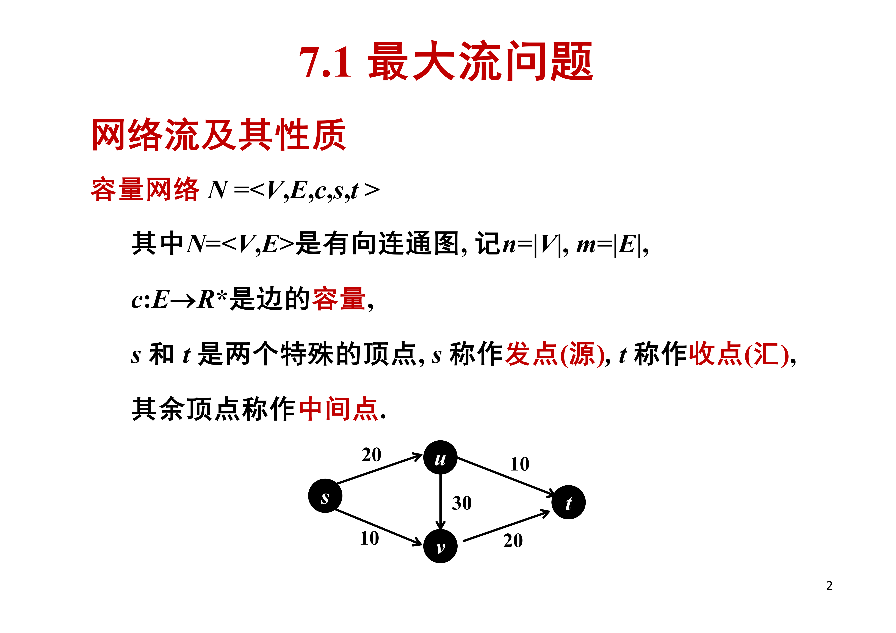{ width="800" }

!!! abstract "定义 2（可行流）"
    设 $f: E \to \mathbb{R}^{+}$，若满足下述条件，则称 $f$ 为 $N$ 上的一个 **可行流**：

    1. **容量限制**：$\forall \langle i, j \rangle \in E$，$f(i, j) \le c(i, j)$
    2. **平衡条件**：$\forall i \in V - \{ s, t \}$，

    $$
    \sum_{\langle j, i \rangle \in E} f(j, i) = \sum_{\langle i, j \rangle \in E} f(i, j)
    $$

!!! abstract "定义 3（流量）"
    可行流 $f$ 的 **流量** $v(f)$ 定义为从 $s$ 流出的净流量：

    $$
    v(f) = \sum_{\langle s, j \rangle \in E} f(s, j) - \sum_{\langle j, s \rangle \in E} f(j, s)
    $$

    等价地，$v(f)$ 也是流入 $t$ 的净流量。

!!! abstract "定义 4（最大流问题）"
    给定容量网络 $N$，求使 $v(f)$ 最大的可行流 $f$，即求解：

    $$
    \begin{aligned}
    \max \quad & v(f) \\
    \text{s.t.} \quad & f(i, j) \le c(i, j), && \langle i, j \rangle \in E \\
    & \sum_{\langle j, i \rangle \in E} f(j, i) - \sum_{\langle i, j \rangle \in E} f(i, j) = 0, && i \in V - \{s, t\} \\
    & v(f) - \sum_{\langle s, j \rangle \in E} f(s, j) + \sum_{\langle j, s \rangle \in E} f(j, s) = 0 \\
    & f(i, j) \ge 0, && \langle i, j \rangle \in E \\
    & v(f) \ge 0
    \end{aligned}
    $$

### 1.2 最小割与最大流最小割定理

!!! abstract "定义 5（割集）"
    设容量网络 $N = \langle V, E, c, s, t \rangle$，$A \subset V$ 且 $s \in A$，$t \in V - A$，称

    $$
    (A, V - A) = \{ \langle i, j \rangle \mid \langle i, j \rangle \in E \text{ 且 } i \in A, j \in V - A \}
    $$

    为 $N$ 的 **割集**，其容量定义为

    $$
    c(A, V - A) = \sum_{\langle i, j \rangle \in (A, V - A)} c(i, j)
    $$

    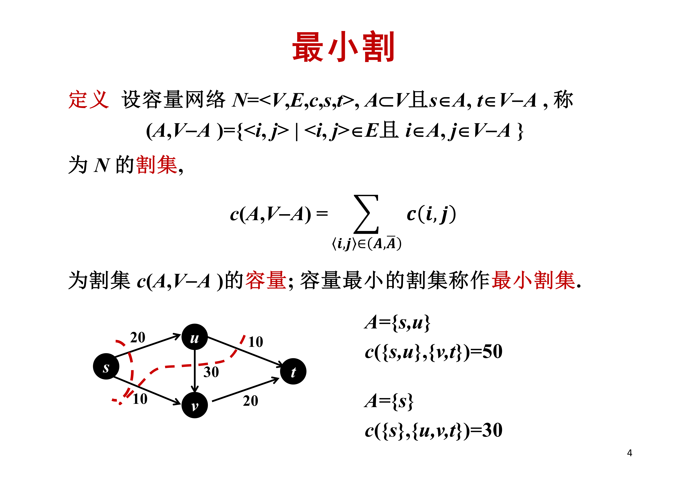{ width="800" }

!!! abstract "引理 1"
    设 $f$ 是任一可行流，$(A, V - A)$ 是任一割集，则

    $$
    v(f) = \sum_{\langle i, j \rangle \in (A, V - A)} f(i, j) - \sum_{\langle j, i \rangle \in (V - A, A)} f(j, i)
    $$

    即流量等于 **从 $A$ 到 $V - A$ 的流量减去从 $V - A$ 到 $A$ 的流量**。

??? note "证明"
    由平衡条件，对 $A - \{s\}$ 中所有顶点求和，中间点流量抵消，仅剩 $s$ 的净流出，即 $v(f)$。

    另一方面，交叉项恰好是割两侧边的流量差。

    $$\square$$

!!! abstract "引理 2"
    设 $f$ 是任一可行流，$(A, V - A)$ 是任一割集，则

    $$
    v(f) \le c(A, V - A)
    $$

!!! abstract "引理 3"
    设 $f$ 是一个可行流，$(A, V - A)$ 是一个割集。如果

    $$
    v(f) = c(A, V - A)
    $$

    则 $f$ 是 **最大流**，$(A, V - A)$ 是 **最小割集**。

为了证明最大流与最小割之间的精确关系，需要引入 **增广链** 的概念。

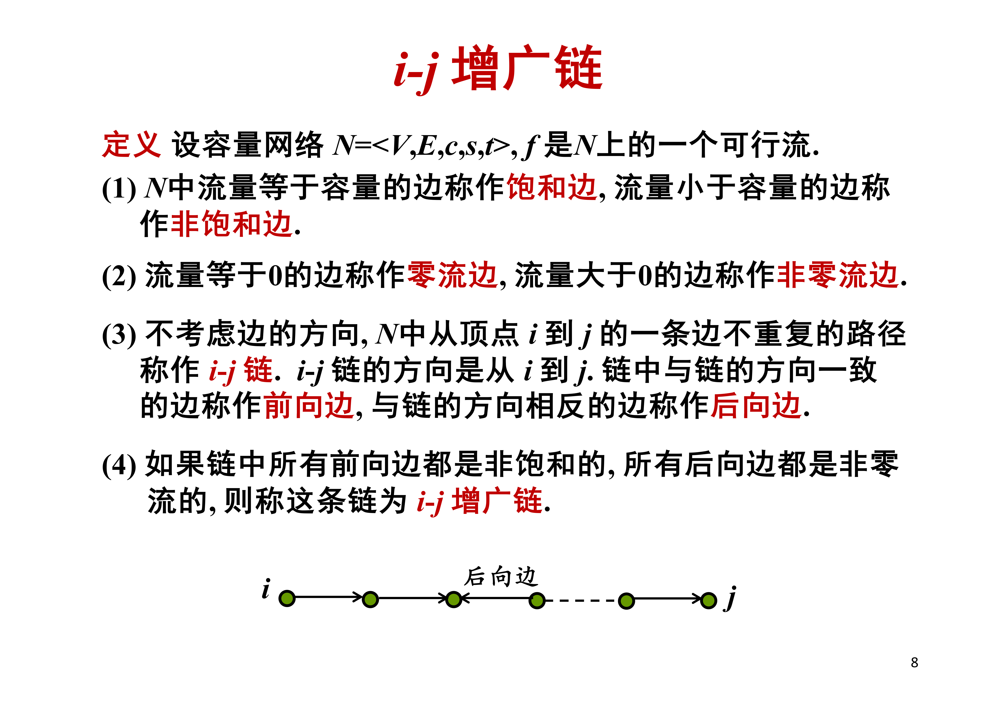{ width="800" }

!!! abstract "定义 6（增广链相关概念）"
    设容量网络 $N = \langle V, E, c, s, t \rangle$，$f$ 是 $N$ 上的一个可行流。

    1. $N$ 中流量等于容量的边称作 **饱和边**，流量小于容量的边称作 **非饱和边**
    2. 流量等于 $0$ 的边称作 **零流边**，流量大于 $0$ 的边称作 **非零流边**
    3. 不考虑边的方向，$N$ 中从顶点 $i$ 到 $j$ 的一条边不重复的路径称作 **$i$-$j$ 链**。链中与链方向一致的边称作 **前向边**，与链方向相反的边称作 **后向边**
    4. 如果链中所有前向边都是非饱和的，所有后向边都是非零流的，则称这条链为 **$i$-$j$ 增广链**

!!! abstract "定理 1（增广链定理）"
    可行流 $f$ 是最大流当且仅当不存在关于 $f$ 的 $s$-$t$ 增广链。

??? note "证明"
    **必要性**：假设 $P$ 是一条可行流 $f$ 的 $s$-$t$ 增广链，令修改量 $\delta$ 等于 $P$ 上所有前向边容量与流量之差及所有后向边流量的最小值。构造新流 $f'$：

    $$
    f'(i, j) =
    \begin{cases}
    f(i, j) + \delta, & \langle i, j \rangle \text{ 是 } P \text{ 的前向边} \\
    f(i, j) - \delta, & \langle i, j \rangle \text{ 是 } P \text{ 的后向边} \\
    f(i, j), & \text{否则}
    \end{cases}
    $$

    则 $f'$ 仍是可行流，且 $v(f') = v(f) + \delta > v(f)$，故 $f$ 不是最大流。

    **充分性**：假设不存在关于 $f$ 的 $s$-$t$ 增广链。令

    $$
    A = \{ j \in V \mid \text{存在关于 } f \text{ 的 } s\text{-}j \text{ 增广链} \}
    $$

    则 $s \in A$，$t \notin A$。$\forall \langle i, j \rangle \in (A, V - A)$，必有 $f(i, j) = c(i, j)$（否则可以把 $s$-$i$ 增广链延伸到 $j$，矛盾）。$\forall \langle j, i \rangle \in (V - A, A)$，必有 $f(j, i) = 0$（否则同理）。于是由引理 1：

    $$
    v(f) = \sum_{\langle i, j \rangle \in (A, V - A)} c(i, j) = c(A, V - A)
    $$

    由引理 3，$f$ 是最大流。

    $$\square$$

!!! abstract "定理 2（最大流最小割集定理）"
    最大流的流量等于最小割集的容量。

    即，若 $f^*$ 是最大流，$(A^*, V - A^*)$ 是最小割集，则

    $$
    v(f^*) = c(A^*, V - A^*)
    $$

### 1.3 Ford-Fulkerson 最大流算法

!!! tip "设计思想"
    从给定初始可行流（通常取 **零流**）开始，反复寻找当前可行流的 $s$-$t$ 增广链 $P$，修改 $P$ 上的流量得到新的可行流，直到不存在 $s$-$t$ 增广链为止。

!!! tip "标号法"
    从 $s$ 开始给顶点作标号，直到 $t$ 得到标号为止。顶点 $j$ 得到标号表示已找到从 $s$ 到 $j$ 的增广链。

    - 标号格式：$l_j = \Delta$ 表示 $s$ 直接可达
    - $l_j = +i$ 表示通过前向边 $\langle i, j \rangle$ 到达
    - $l_j = -i$ 表示通过后向边 $\langle j, i \rangle$ 到达
    - $d_j$ 记录从 $s$ 到 $j$ 的增广链上的最小剩余容量

### 算法 1（Ford-Fulkerson 算法）

$$
\begin{aligned}
& \textbf{算法: } \text{Ford-Fulkerson} \\
& \textbf{输入: } \text{容量网络 } N = \langle V, E, c, s, t \rangle \\
& \textbf{输出: } N \text{ 上的最大流 } f \\
& 1. \quad f \leftarrow 0 \quad \text{// 零流为初始可行流} \\
& 2. \quad T \leftarrow \{s\},\ R \leftarrow V - \{s\},\ l_s \leftarrow \Delta,\ d_s \leftarrow +\infty \\
& \quad\quad \text{// } T\text{: 已标未查, } R\text{: 未标} \\
& 3. \quad \textbf{while } T \neq \varnothing \textbf{ do} \\
& 4. \quad \quad \text{取 } i \in T,\ T \leftarrow T - \{i\} \quad \text{// 检查顶点 } i \\
& 5. \quad \quad \textbf{for } \text{所有 } R \text{ 中与 } i \text{ 邻接的 } j \textbf{ do} \\
& 6. \quad \quad \quad \textbf{if } \langle i, j \rangle \in E \text{ 且 } f(i, j) < c(i, j) \textbf{ then} \quad \text{// 前向边} \\
& 7. \quad \quad \quad \quad l_j \leftarrow +i,\ d_j \leftarrow \min\{d_i,\ c(i, j) - f(i, j)\} \\
& 8. \quad \quad \quad \quad T \leftarrow T \cup \{j\},\ R \leftarrow R - \{j\} \\
& 9. \quad \quad \quad \quad \textbf{if } j = t \textbf{ then goto } 13 \\
& 10.\quad \quad \quad \textbf{if } \langle j, i \rangle \in E \text{ 且 } f(j, i) > 0 \textbf{ then} \quad \text{// 后向边} \\
& 11.\quad \quad \quad \quad l_j \leftarrow -i,\ d_j \leftarrow \min\{d_i,\ f(j, i)\} \\
& 12.\quad \quad \quad \quad T \leftarrow T \cup \{j\},\ R \leftarrow R - \{j\} \\
& 13.\quad \textbf{if } t \text{ 得到标号 then} \\
& 14.\quad \quad \delta \leftarrow d_t \\
& 15.\quad \quad \textbf{while } l_j \neq \Delta \textbf{ do} \\
& 16.\quad \quad \quad \textbf{if } l_j = +i \textbf{ then } f(i, j) \leftarrow f(i, j) + \delta,\ j \leftarrow i \\
& 17.\quad \quad \quad \textbf{if } l_j = -i \textbf{ then } f(j, i) \leftarrow f(j, i) - \delta,\ j \leftarrow i \\
& 18.\quad \quad \textbf{end while} \\
& 19.\quad \quad \textbf{goto } 2 \quad \text{// 重新开始下一阶段标号} \\
& 20.\quad \textbf{end if} \\
& 21.\quad \textbf{return } f
\end{aligned}
$$

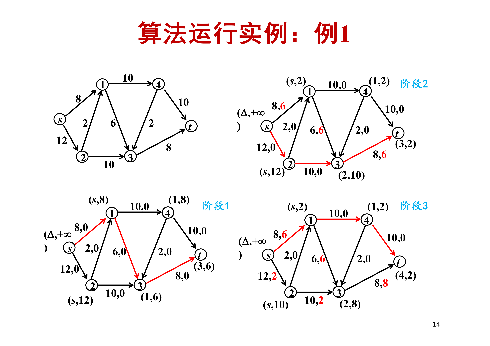{ width="800" }

!!! info "时间复杂度"
    假设所有容量都是正整数，记最大流量 $v^* \le C$，则 Ford-Fulkerson 算法的时间复杂度为 $O(mC)$。

    - $\delta$ 是正整数，每次流量至少加 $1$
    - 至多 $C$ 个阶段
    - 每阶段标号和修改增广链流量需要 $O(m)$

    **局限性**：若容量为无理数，FF 算法可能不终止；即使容量为整数，$O(mC)$ 也不是输入规模的多项式（因为 $C$ 可能指数于输入位数）。

### 1.4 辅助网络

!!! abstract "定义 7（辅助网络）"
    设容量网络 $N = \langle V, E, c, s, t \rangle$，$f$ 是 $N$ 上的一个可行流。关于 $f$ 的 **辅助网络** $N(f) = \langle V, E(f), ac, s, t \rangle$，其中：

    - 前向边集：$E^{+}(f) = \{ \langle i, j \rangle \mid \langle i, j \rangle \in E \text{ 且 } f(i, j) < c(i, j) \}$
    - 后向边集：$E^{-}(f) = \{ \langle j, i \rangle \mid \langle i, j \rangle \in E \text{ 且 } f(i, j) > 0 \}$
    - 边集：$E(f) = E^{+}(f) \cup E^{-}(f)$
    - **辅助容量**：

    $$
    ac(i, j) =
    \begin{cases}
    c(i, j) - f(i, j), & \langle i, j \rangle \in E^{+}(f) \\
    f(j, i), & \langle j, i \rangle \in E^{-}(f)
    \end{cases}
    $$

    $N(f)$ 也是一个容量网络。

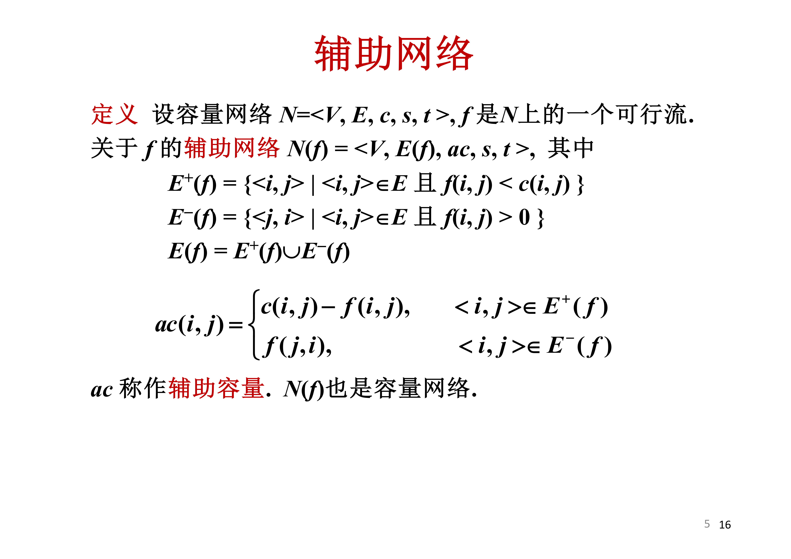{ width="800" }

!!! abstract "引理 4"
    在辅助网络 $N(f)$ 中，$s$-$t$ 增广链与 $N$ 中关于 $f$ 的 $s$-$t$ 增广链一一对应。

### 1.5 Dinic 有效算法

Ford-Fulkerson 算法的瓶颈在于每次只沿 **一条** 增广链增广。Dinic 算法的核心思想是：

1. 构造 **分层辅助网络** $AN(f)$，只保留最短的 $s$-$t$ 路径
2. 在 $AN(f)$ 中沿多条增广链同时增广，求 **极大流**
3. 每阶段 $AN(f)$ 中 $s$-$t$ 距离严格增大，至多 $n$ 个阶段

!!! abstract "定义 8（分层辅助网络）"
    按广度优先搜索 $N(f)$ 中 $s$-$t$ 最短路，按到 $s$ 的距离 $d$ 对顶点分层。

    分层辅助网络 $AN(f) = \langle V(f), AE(f), ac, s, t \rangle$，其中：

    $$
    \begin{aligned}
    & V_k(f) = \{ i \in V \mid d(i) = k \},\quad 0 \le k \le d - 1 \\
    & V_d(f) = \{ t \} \\
    & AE(f) = \bigcup_{k=0}^{d-1} \{ \langle i, j \rangle \mid \langle i, j \rangle \in E(f),\ i \in V_k(f),\ j \in V_{k+1}(f) \}
    \end{aligned}
    $$

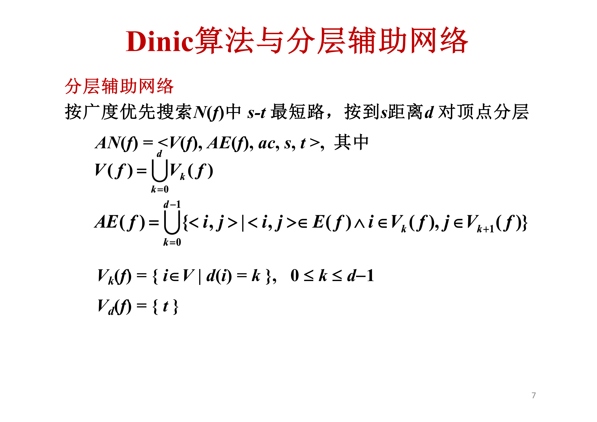{ width="800" }

!!! abstract "定义 9（极大流与流通量）"
    1. **前向增广链**：关于 $f$ 的不含后向边的增广链
    2. **极大流**：不存在前向增广链的可行流。最大流必是极大流，但极大流不一定是最大流
    3. **中间点 $i$ 的流通量** $\theta(i)$：以 $i$ 为终点的边的容量之和与以 $i$ 为始点的边的容量之和中的小者

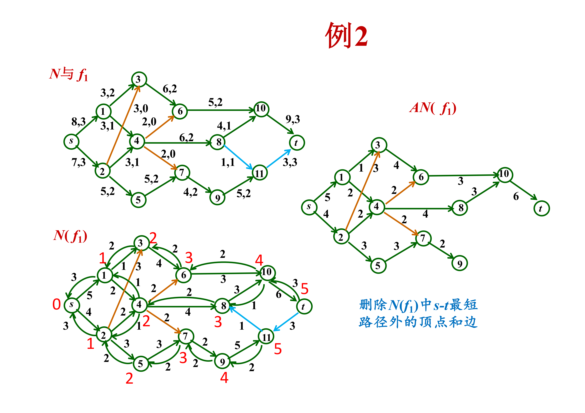{ width="800" }

### 算法 2（Dinic 算法）

$$
\begin{aligned}
& \textbf{算法: } \text{Dinic} \\
& \textbf{输入: } \text{容量网络 } N = \langle V, E, c, s, t \rangle \\
& \textbf{输出: } N \text{ 上的最大流 } f \\
& 1. \quad f \leftarrow 0 \quad \text{// 取零流作初始可行流} \\
& 2. \quad \text{构造 } AN(f) \\
& 3. \quad \textbf{if } AN(f) \text{ 不存在从 } s \text{ 到 } t \text{ 的路径} \\
& 4. \quad \quad \textbf{return } f \quad \text{// 计算结束} \\
& 5. \quad g \leftarrow 0 \quad \text{// } g \text{ 是 } AN(f) \text{ 上的可行流} \\
& 6. \quad \textbf{while } AN(f) \text{ 中存在流通量为 } 0 \text{ 的顶点} \textbf{ do} \\
& 7. \quad \quad \text{删去该顶点及关联边} \\
& 8. \quad \textbf{end while} \\
& 9. \quad \textbf{while } AN(f) \text{ 中存在从 } s \text{ 到 } t \text{ 的路径} \textbf{ do} \\
& 10.\quad \quad \text{取一条 } s\text{-}t \text{ 路径 } P \text{，令 } \delta \leftarrow \min\{ ac(i, j) \mid \langle i, j \rangle \in E(P) \} \\
& 11.\quad \quad \textbf{for } \langle i, j \rangle \in E(P) \textbf{ do} \\
& 12.\quad \quad \quad g(i, j) \leftarrow g(i, j) + \delta,\ ac(i, j) \leftarrow ac(i, j) - \delta \\
& 13.\quad \quad \quad \textbf{if } ac(i, j) = 0 \textbf{ then } \text{删去边 } \langle i, j \rangle \\
& 14.\quad \quad \textbf{end for} \\
& 15.\quad \quad \text{删去流通量为 } 0 \text{ 的顶点及关联边} \\
& 16.\quad \textbf{end while} \\
& 17.\quad f \leftarrow f + g \\
& 18.\quad \textbf{goto } 2 \\
& 19.\quad \textbf{return } f
\end{aligned}
$$

!!! abstract "引理 5"
    在 Dinic 算法第 5 步得到的 $AN(f)$ 中，$s$ 的流通量等于 $t$ 的流通量。

!!! abstract "引理 6"
    在每个阶段结束时，$g$ 是 $AN(f)$ 中的极大流。

!!! abstract "引理 7"
    在每个阶段，$AN(f + g)$ 中 $s$-$t$ 距离大于前一个阶段 $AN(f)$ 中 $s$-$t$ 距离。约定，当不存在 $s$-$t$ 最短路径时，规定其距离为 $+\infty$。

!!! abstract "定理 3（Dinic 算法的正确性与复杂度）"
    Dinic 算法得到的 $f$ 是最大流，且算法在 $O(n^3)$ 步内终止。

??? note "证明"
    **$f$ 是最大流**：当算法终止时，$AN(f)$ 中不存在从 $s$ 到 $t$ 的路径，因此 $N(f)$ 中也不存在从 $s$ 到 $t$ 的路径。由增广链定理（定理 1），$f$ 是最大流。

    **复杂度分析**：

    - **阶段数** $\le n$：由引理 7，$AN(f)$ 中 $s$-$t$ 距离每阶段至少加 $1$，而 $s$-$t$ 距离 $\le n - 1$，故至多 $n$ 个阶段
    - **每阶段工作量** $O(n^2)$：
        - 构造 $AN(f)$ 可在 $O(m)$ 步内完成
        - 计算顶点的流通量需 $O(m)$ 步
        - 在生成 $g$ 的过程中，找一个流通量最小的顶点需 $O(n)$ 步，至多找 $n$ 次，至多需 $O(n^2)$ 步

    总时间复杂度 $O(n \cdot n^2) = O(n^3)$。

    $$\square$$

!!! tip "Dinic vs Ford-Fulkerson"
    | 特性 | Ford-Fulkerson | Dinic |
    |------|----------------|-------|
    | 时间复杂度 | $O(mC)$（伪多项式） | $O(n^3)$（强多项式） |
    | 增广策略 | 每次一条增广链 | 分层网络中多条同时增广 |
    | 关键思想 | 标号法找任意增广链 | BFS 分层 + 极大流 |

---

## 2 最小费用流

### 2.1 容量-费用网络

!!! abstract "定义 10（容量-费用网络）"
    一个 **容量-费用网络** 是一个五元组 $N = \langle V, E, c, w, s, t \rangle$，其中 $\langle V, E, c, s, t \rangle$ 是容量网络，$w: E \to \mathbb{R}$ 是边的 **费用** 函数。

    可行流 $f$ 的 **费用** 定义为：

    $$
    w(f) = \sum_{\langle i, j \rangle \in E} w(i, j) \cdot f(i, j)
    $$

!!! abstract "最小费用流问题"
    给定容量-费用网络 $N$ 和目标流量 $v_0$，求流量为 $v_0$ 的 **费用最小** 的可行流。

### 2.2 辅助网络与圈流

!!! abstract "定义 11（容量-费用网络的辅助网络）"
    设容量-费用网络 $N = \langle V, E, c, w, s, t \rangle$，关于可行流 $f$ 的辅助网络 $N(f) = \langle V, E(f), ac, aw, s, t \rangle$，其中辅助容量 $ac$ 同定义 7，辅助费用为：

    $$
    aw(i, j) =
    \begin{cases}
    w(i, j), & \langle i, j \rangle \in E^{+}(f) \\
    -w(j, i), & \langle j, i \rangle \in E^{-}(f)
    \end{cases}
    $$

!!! abstract "引理 8"
    设 $f$ 是容量-费用网络 $N$ 上的可行流，$g$ 是辅助网络 $N(f)$ 上的可行流，令 $f' = f + g$，则

    $$
    w(f') = w(f) + aw(g)
    $$

!!! abstract "定义 12（圈流）"
    设 $C$ 是 $N$ 中边不重复的回路，$C$ 上的 **圈流** $h_C$ 定义如下：

    - $\forall \langle i, j \rangle \in E(C)$，$h_C(i, j) = d$
    - $\forall \langle i, j \rangle \in E - E(C)$，$h_C(i, j) = 0$

    其中 $d > 0$ 是 $h_C$ 的 **环流量**。

!!! abstract "圈流的性质"
    1. $h_C$ 为可行流，且 $v(h_C) = 0$，$w(h_C) = d \cdot w(C)$
    2. 设 $f$ 是 $N$ 上的一个可行流，$h_C$ 是 $N(f)$ 上的一个圈流，则 $f + h_C$ 仍是 $N$ 上的可行流，且 $v(f + h_C) = v(f)$，$w(f + h_C) = w(f) + aw(h_C)$

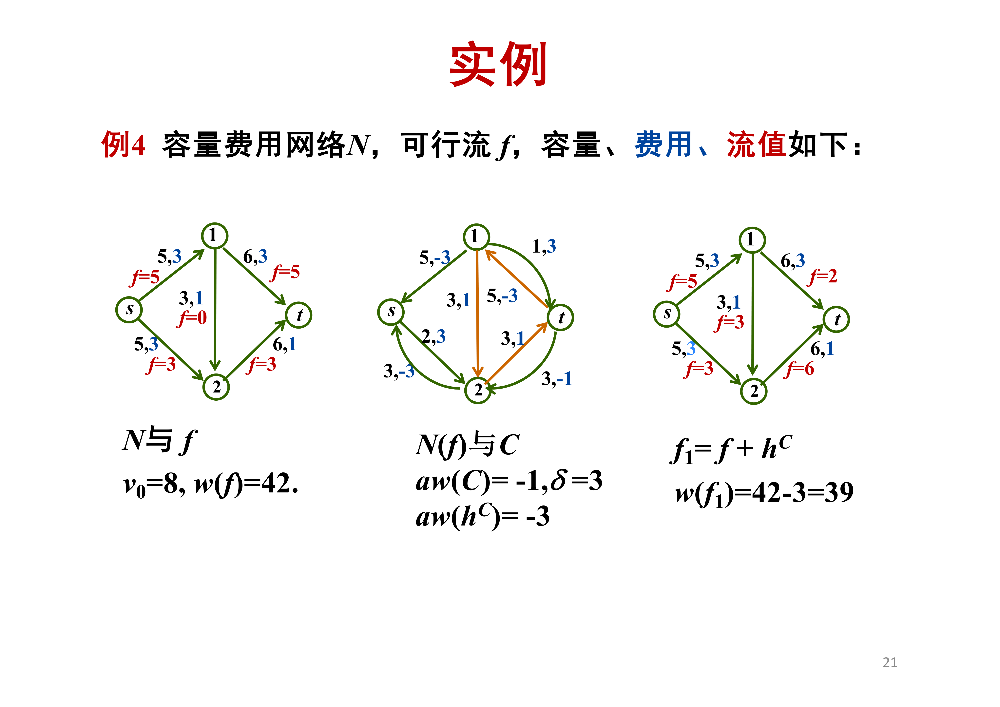{ width="800" }

### 2.3 最小费用流的负回路算法

!!! tip "设计思想"
    1. 首先求一个流量为 $v_0$ 的可行流 $f$（调用最大流算法）
    2. 如果 $N(f)$ 中存在权 $aw$ 的 **负回路** $C$，令 $f' \leftarrow f + h_C$
    3. 重复进行，直至辅助网络中不存在权 $aw$ 的负回路

    可证明：当 $N(f)$ 中不存在权 $aw$ 的负回路时，$f$ 是最小费用流。

为了检测负回路，需要能在带负权图中求最短路径的算法。

!!! abstract "命题 1（负回路与最短路径）"
    赋权有向图 $D = \langle V, E, w \rangle$ 中任意两点之间都有最短路径或不存在路径，当且仅当 $D$ 中不含负回路。

    等价地说，若 $D$ 中存在负回路 $C$，$i$ 是 $C$ 上的一个顶点，那么从 $i$ 到 $j$ 的路径可以先重复走 $C$ 若干次再到 $j$，路径的权可以任意小。

#### Floyd 算法（检测负回路）

Floyd 算法使用动态规划方法求所有点对之间的最短路径。

令 $d^{(k)}(i, j)$：从 $i$ 到 $j$ 经过顶点编号不大于 $k$ 的最短路径长度。

递推方程：

$$
\begin{aligned}
& d^{(0)}(i, j) = w(i, j),\quad 1 \le i, j \le n \\
& d^{(k)}(i, j) = \min\{ d^{(k-1)}(i, j),\ d^{(k-1)}(i, k) + d^{(k-1)}(k, j) \},\quad 1 \le i, j \le n,\ i, j \neq k,\ 1 \le k \le n
\end{aligned}
$$

规定：$\forall i \in V$，$w(i, i) = 0$；$\forall \langle i, j \rangle \notin E$，$w(i, j) = +\infty$。

同时维护 $h^{(k)}(i, j)$：从 $i$ 到 $j$ 经过编号不大于 $k$ 的最短路径中 $i$ 的下一顶点。

### 算法 3（最小费用流的负回路算法）

$$
\begin{aligned}
& \textbf{算法: } \text{Minimum-Cost Flow by Negative Cycle Cancellation} \\
& \textbf{输入: } \text{容量-费用网络 } N = \langle V, E, c, w, s, t \rangle,\ \text{目标流量 } v_0 \\
& \textbf{输出: } N \text{ 上流量为 } v_0 \text{ 的最小费用流 } f \\
& 1. \quad \text{调用最大流算法，若求得流量 } v_0 \text{ 的可行流 } f \text{，则转 2} \\
& \quad\quad \text{若最大流量} < v_0 \text{，则输出"无流量 } v_0 \text{ 的可行流"，结束} \\
& 2. \quad \text{构造 } N(f) \\
& 3. \quad \text{用 Floyd 算法检测 } N(f) \text{ 中是否存在权 } aw \text{ 的负回路} \\
& \quad\quad \text{若存在负回路 } C \text{，则转 4；若不存在，则输出 } f \text{，结束} \\
& 4. \quad \delta \leftarrow \min\{ ac(i, j) \mid \langle i, j \rangle \in E(C) \} \quad \text{// } h_C \text{ 的环流量为 } \delta \\
& 5. \quad \textbf{for } \langle i, j \rangle \in E(C) \textbf{ do} \\
& 6. \quad \quad g(i, j) \leftarrow g(i, j) + \delta \\
& 7. \quad \textbf{end for} \\
& 8. \quad f \leftarrow f + h_C \\
& 9. \quad \textbf{goto } 2
\end{aligned}
$$

!!! info "时间复杂度"
    设最大费用为 $W$，负回路算法每次至少使费用下降 $1$，故循环次数 $O(v_0 W)$。每轮用 Floyd 算法 $O(n^3)$，总复杂度 $O(v_0 W n^3)$。

### 2.4 最短路径算法（逐次最短增广链）

!!! tip "设计思想"
    从一个初始的最小费用流 $f$（如零流）开始：

    1. 如果 $v(f) < v_0$，找一条 **费用最少** 的 $s$-$t$ 增广链 $P$
    2. 修改 $P$ 上的流量，得到新的可行流 $f'$
    3. 重复进行，直至流量等于 $v_0$

    若存在负权边，可用 Floyd 或 Bellman-Ford 算法计算最短路径。

---

## 3 最大流算法的应用

### 3.1 带需求的流通

!!! abstract "定义 13（带需求的流通）"
    给定带需求的流通图 $N = \langle V, E, c, S, T \rangle$，$\forall v \in V$ 存在需求 $d_v$。所有发点集合为 $S$，所有收点集合为 $T$：

    - **收点**：$d_v > 0$，表示 $v$ 对流有 $d_v$ 的需求
    - **发点**：$d_v < 0$，表示 $v$ 有 $-d_v$ 的供给
    - **中间点**：$d_v = 0$，$v$ 不是发点和收点

    所有容量和需求都是整数。

!!! abstract "命题 2（必要条件）"
    如果存在一个带需求 $\{ d_v \}$ 的可行流通，那么

    $$
    \sum_{v \in V} d_v = 0
    $$

??? note "证明"
    假设存在可行流通 $f$，则

    $$
    \sum_{v \in V} d_v = \sum_{v \in V} \big( f_{\text{in}}(v) - f_{\text{out}}(v) \big) = 0
    $$

    因为每条边的流量在其两个端点处一正一负，求和后全部抵消。

    $$\square$$

!!! tip "用最大流建模"
    将带需求的流通问题转化为单发点单收点的最大流问题：

    1. 添加 **超源点** $s^*$ 和 **超汇点** $t^*$
    2. 从 $s^*$ 到每个 $v \in S$（发点，$d_v < 0$）加边 $\langle s^*, v \rangle$，令 $c_e = -d_v$
    3. 从每个 $v \in T$（收点，$d_v > 0$）到 $t^*$ 加边 $\langle v, t^* \rangle$，令 $c_e = d_v$
    4. 令 $D = \sum_{v: d_v > 0} d_v = \sum_{v: d_v < 0} (-d_v)$
    5. 在改造后的网络 $G'$ 中求 $s^*$-$t^*$ 最大流

    若最大流值为 $D$，则原问题存在可行流通；否则不存在。

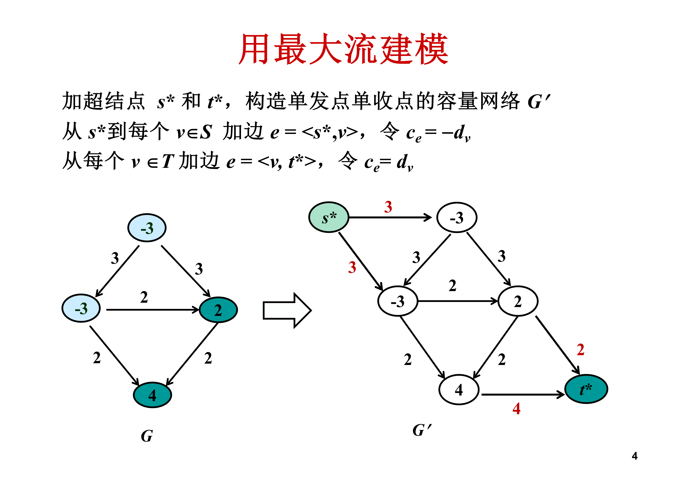{ width="800" }

!!! abstract "命题 3"
    $G'$ 没有大于 $D$ 的 $s^*$-$t^*$ 流。因为 $c(\{s^*\}, V \cup \{t^*\}) = D$。

### 3.2 运输问题

!!! abstract "定义 14（Hitchcock 运输问题）"
    有 $m$ 个产地 $A_1, A_2, \ldots, A_m$ 和 $n$ 个销地 $B_1, B_2, \ldots, B_n$：

    - $A_i$ 的产量为 $a_i$
    - $B_j$ 的销量为 $b_j$
    - 从 $A_i$ 到 $B_j$ 的单位运费为 $w_{ij}$

    假设 **产销平衡**，即 $\sum_{i=1}^{m} a_i = \sum_{j=1}^{n} b_j$。求总运费最小的调运方案。

!!! tip "转化为最小费用流"
    添加发点 $s$ 和收点 $t$，构造容量-费用网络 $N = \langle V, E, c, w, s, t \rangle$：

    - $V = \{ s, t, A_1, \ldots, A_m, B_1, \ldots, B_n \}$
    - $E = \{ \langle s, A_i \rangle \mid 1 \le i \le m \} \cup \{ \langle B_j, t \rangle \mid 1 \le j \le n \} \cup \{ \langle A_i, B_j \rangle \mid 1 \le i \le m, 1 \le j \le n \}$
    - $c(s, A_i) = a_i$，$w(s, A_i) = 0$
    - $c(B_j, t) = b_j$，$w(B_j, t) = 0$
    - $c(A_i, B_j) = +\infty$，$w(A_i, B_j) = w_{ij}$

    流量 $v_0 = \sum_{i=1}^{m} a_i$ 的可行流恰好对应运输问题的调运方案，总运费最小的调运方案就是流量 $v_0$ 的 **最小费用流**。

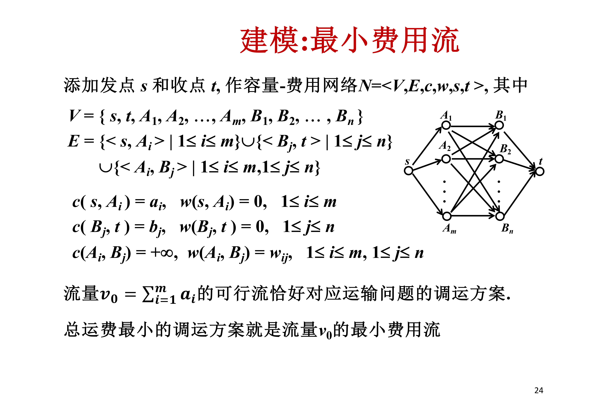{ width="800" }

### 3.3 图像分割

!!! abstract "问题描述"
    图像分割的目标是将一幅图片的 **前景** 与 **背景** 分离，对每个像素进行"前景 / 背景"的标记。

!!! tip "建模"
    设 $V$ 是图像中的像素集合，$E$ 表示所有相邻像素对的集合，构成无向图 $G = \langle V, E \rangle$：

    - 像素 $i$ 属于前景的可能性：$a_i$
    - 像素 $i$ 属于背景的可能性：$b_i$
    - 如果 $a_i > b_i$，像素 $i$ 标为前景，否则标为背景
    - 如果像素 $i$ 的邻居都标为"背景"，那么倾向于将 $i$ 标为背景，使标记更"光滑"
    - 对每对邻居像素 $(i, j)$，定义 **分离罚分** $p_{ij} > 0$ 来惩罚 $i$ 和 $j$ 标记不同

    图像分割问题：将像素点集划分为 $A$（前景）和 $B$（背景），使得划分的权值 $q(A, B)$ 最大化（即得到最优标记）：

    $$
    q(A, B) = \sum_{i \in A} a_i + \sum_{j \in B} b_j - \sum_{\substack{(i, j) \in E \\ |A \cap \{i, j\}| = 1}} p_{ij}
    $$

!!! tip "转化为最小割"
    两个问题的相似性：都涉及图的分割。但图像分割的图是无向图，而最小割是有发点 $s$、收点 $t$ 的有向图。

    转化方法：

    1. 将无向图 $G = \langle V, E \rangle$ 的每条边 $(u, v) \in E$ 转化成一对有向边 $\langle u, v \rangle$ 和 $\langle v, u \rangle$，构成有向图
    2. 添加 **超源点** $s$（前景）和 **超汇点** $t$（背景）
    3. 加边 $\langle s, v \rangle$ 和 $\langle v, t \rangle$，$\forall v \in V$

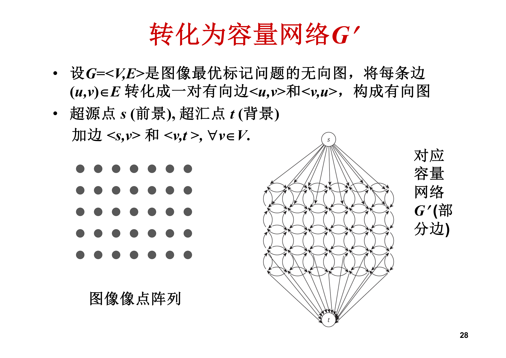{ width="800" }

!!! abstract "容量分配"
    - 对边 $e = \langle s, i \rangle$，令 $c_e = a_i$
    - 对边 $e = \langle i, t \rangle$，令 $c_e = b_i$
    - 对邻居边 $e = \langle j, i \rangle$ 和 $e' = \langle i, j \rangle$，令 $c_e = c_{e'} = p_{ij}$

    穿过割 $(A', B')$ 的边分成三类：

    - 边 $\langle s, j \rangle$，$j \in B'$：贡献 $a_j$
    - 边 $\langle i, t \rangle$，$i \in A'$：贡献 $b_i$
    - 边 $\langle i, j \rangle$，$i \in A'$，$j \in B'$：贡献 $p_{ij}$

    割的容量为：

    $$
    c(A', B') = \sum_{j \in B'} a_j + \sum_{i \in A'} b_i + \sum_{\substack{i \in A', j \in B' \\ (i, j) \in E}} p_{ij}
    $$

    注意到：

    $$
    \sum_{i} a_i + \sum_{i} b_i = \text{常数}
    $$

    而

    $$
    c(A', B') = \sum_{i} a_i + \sum_{i} b_i - q(A, B)
    $$

    因此 **最大化 $q(A, B)$ 等价于最小化割容量 $c(A', B')$**！

!!! abstract "图像分割算法"
    1. 建立像素邻居图 $G$
    2. 将 $G$ 转化成容量网络 $G'$
    3. 求解 $G'$ 的最小割 $(A', B')$
    4. 前景为 $A' - \{s\}$，背景为 $B' - \{t\}$

---

## 4 总结

!!! abstract "核心知识点"
    | 概念 | 内容 |
    |------|------|
    | 容量网络 | $N = \langle V, E, c, s, t \rangle$，有向连通图 + 容量 + 源汇 |
    | 可行流 | 满足容量限制与平衡条件 |
    | 最大流 | 流量 $v(f)$ 最大的可行流 |
    | 割集 | $(A, V - A)$，$s \in A$，$t \notin A$ |
    | 最大流最小割定理 | 最大流 = 最小割容量 |
    | 增广链 | 前向边非饱和、后向边非零流的 $s$-$t$ 链 |
    | Ford-Fulkerson | 标号法，$O(mC)$ |
    | 辅助网络 $N(f)$ | 前向边（剩余容量）+ 后向边（可退流量）|
    | Dinic 算法 | 分层辅助网络 + 极大流，$O(n^3)$ |
    | 最小费用流 | 费用 $w(f)$ 最小的指定流量可行流 |
    | 负回路算法 | 消去辅助网络中的负回路 |
    | 带需求流通 | 添加超源超汇转化为最大流 |
    | 运输问题 | 转化为最小费用流 |
    | 图像分割 | 最大化划分权值 = 最小割 |
