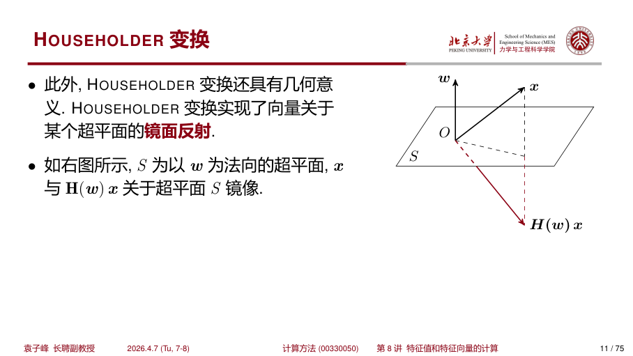
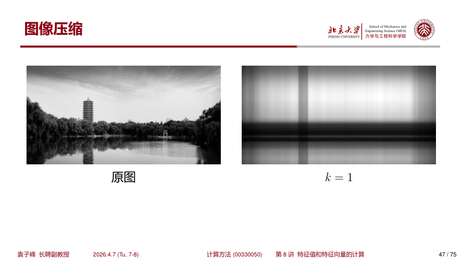
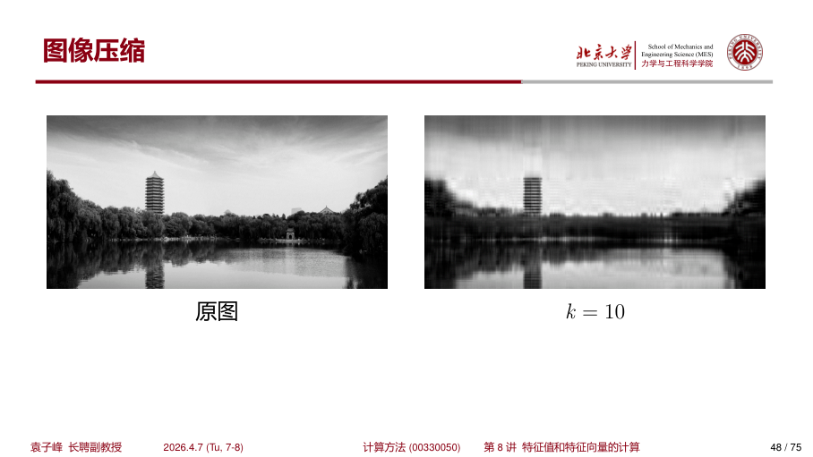

## 1 QR 算法

### 1.1 问题引入

!!! warning "问题 1"
    **什么样的矩阵易于求得所有的特征值？**

当矩阵是如下矩阵形式时，易于求解特征值：

- 对角矩阵、上（下）三角矩阵
- 分块对角矩阵、分块上（下）三角矩阵，并且每个分块矩阵都维数不高

!!! warning "问题 2"
    **什么样的矩阵变换能保证特征值不变？**

相似变换不会改变矩阵特征值。实践中，如果相似变换中的矩阵 $X$ 是正交矩阵则更有利于计算。

### 1.2 QR 算法基本思想

QR 算法的想法是，将矩阵 $A$ 进行正交三角化，即分解成一个正交矩阵 $Q$ 与上三角矩阵 $R$ 的乘积：

$$
A = QR \tag{8.1}
$$

于是就可以构造如下序列：

$$
A^{(k)} = Q^{(k)}R^{(k)} \tag{8.2a}
$$

$$
A^{(k+1)} = R^{(k)}Q^{(k)} \Rightarrow A^{(k+1)} = (Q^{(k)})^TA^{(k)}Q^{(k)} \tag{8.2b}
$$

所以 $A^{(k)}$ 与 $A^{(k+1)}$ 是相似的。

!!! abstract "定义 8.1（拟上三角矩阵）"
    设矩阵 $A \in \mathbb{R}^{n \times n}$，若 $A$ 为分块上三角矩阵，且对角块为 1 阶或者 2 阶矩阵，则称 $A$ 为 **拟上三角矩阵**（quasi-upper triangle matrix），也称为 **实 SCHUR 型**（real SCHUR form）。

!!! abstract "定理 8.1（实 SCHUR 分解）"
    设 $A \in \mathbb{R}^{n \times n}$，则存在正交矩阵 $Q \in \mathbb{R}^{n \times n}$，使得

    $$
    Q^TAQ = S \tag{8.3}
    $$

    其中 $S \in \mathbb{R}^{n \times n}$ 为拟上三角矩阵，并且 $S$ 的一阶对角块就是 $A$ 的实特征值，二阶对角块的特征值为 $A$ 的两个共轭复特征值。等式 $A = QSQ^T$ 称为 $A$ 的 **实 SCHUR 分解**。

这个定理表明了正交相似变换可能达到的最佳效果。QR 分解中，常见的方法有 **HOUSEHOLDER 变换**、**GIVENS 旋转变换**以及 **GRAM-SCHMIDT 正交化过程**三种方法。

---

## 2 HOUSEHOLDER 变换

### 2.1 定义与性质

!!! abstract "定义 8.2（HOUSEHOLDER 矩阵）"
    设向量 $w \in \mathbb{R}^n$ 且 $w^Tw = 1$，称矩阵

    $$
    H(w) = I - 2ww^T \tag{8.4}
    $$

    为 **HOUSEHOLDER 矩阵**，或 **初等反射矩阵**。

容易得到 HOUSEHOLDER 变换的一些性质，例如：

$$
H^T = H, \quad H^TH = I \Rightarrow H^2 = I \tag{8.5}
$$

即对称性、正交性。

### 2.2 几何意义

HOUSEHOLDER 变换具有明确的几何意义。HOUSEHOLDER 变换实现了向量关于某个超平面的 **镜面反射**。

{ width="750" }

如图所示，$S$ 为以 $w$ 为法向的超平面，$x$ 与 $H(w)x$ 关于超平面 $S$ 镜像。

证明如下：

$$
Hx = (I - 2ww^T)x = x - 2(w^Tx)w
$$

$$
(Hx - x) \parallel w, \quad (Hx + x)^Tw = 0 \Rightarrow (Hx + x) \perp w \tag{8.6}
$$

实际上，$ww^T$ 是投影矩阵，而 $ww^Tx$ 为 $x$ 在 $w$ 上的投影。因此，容易证明 $x - 2ww^Tx$ 就是 $x$ 关于 $S$ 对称的向量。

### 2.3 Householder 变换的存在性

!!! abstract "定理 8.2"
    设 $x, y \in \mathbb{R}^n$，$x \neq y$，$\|x\|_2 = \|y\|_2$，则存在 HOUSEHOLDER 矩阵 $H$，使 $Hx = y$。

    证明：构造

    $$
    w = \frac{x - y}{\|x - y\|_2} \tag{8.7}
    $$

!!! abstract "定理 8.3"
    设 $x = [x_1, x_2, \cdots, x_n]^T \neq 0$，则存在 HOUSEHOLDER 矩阵 $H$，使 $Hx = -\sigma e_1$，其中

    $$
    \sigma = \operatorname{sign}(x_1)\|x\|_2, \quad e_1 = [1, 0, \cdots, 0]^T, \quad \operatorname{sign}(x_1) \equiv \begin{cases} 1, & x_1 \geq 0 \\ -1, & x_1 < 0 \end{cases} \tag{8.8}
    $$

    证明：容易得到 $\|-\sigma e_1\|_2 = \|x\|_2$，根据定理 8.2 得证。即构造

    $$
    w = \frac{x + \sigma e_1}{\|x + \sigma e_1\|_2} \tag{8.9}
    $$

???+ example "例 8.1"
    给出 HOUSEHOLDER 变换形式，用以消去下面向量除去第一个分量以外的分量：

    $$
    a = \begin{bmatrix} 2 & 1 & 2 \end{bmatrix}^T
    $$

    **解：** 根据定理 8.3，令 $\sigma = \operatorname{sign}(a_1)\|a\|_2 = 3$，则构造向量

    $$
    u = a + \sigma e_1 = \begin{bmatrix} 2 & 1 & 2 \end{bmatrix}^T + 3 \cdot \begin{bmatrix} 1 & 0 & 0 \end{bmatrix}^T = \begin{bmatrix} 5 & 1 & 2 \end{bmatrix}^T
    $$

    则 HOUSEHOLDER 中的 $w \equiv u/\|u\|$。此时，

    $$
    Ha = a - 2\frac{u^Ta}{u^Tu}u = a - 2\frac{\begin{bmatrix} 5 & 1 & 2 \end{bmatrix}\begin{bmatrix} 2 \\ 1 \\ 2 \end{bmatrix}}{30}\begin{bmatrix} 5 \\ 1 \\ 2 \end{bmatrix} = a - \frac{2}{15}\begin{bmatrix} 5 \\ 1 \\ 2 \end{bmatrix} = \begin{bmatrix} -3 \\ 0 \\ 0 \end{bmatrix}
    $$

---

## 3 GIVENS 旋转变换

### 3.1 定义

!!! abstract "定义 8.3（GIVENS 旋转矩阵）"
    矩阵 $G \in \mathbb{R}^{2 \times 2}$，若

    $$
    G = \begin{bmatrix} \cos\theta & \sin\theta \\ -\sin\theta & \cos\theta \end{bmatrix} \tag{8.10}
    $$

    其中 $\theta \in \mathbb{R}$，则称矩阵 $G$ 为 **2 阶 GIVENS 旋转矩阵**。

GIVENS 旋转变换也称为 **平面旋转变换**，它能够消去给定向量的某一个分量。GIVENS 旋转变换对处理具有稀疏性的向量或者矩阵非常有效。

### 3.2 消去分量

对于向量 $x = [x_1, x_2]^T$，可以选择合适的 $\theta$，使得

$$
\begin{bmatrix} \cos\theta & \sin\theta \\ -\sin\theta & \cos\theta \end{bmatrix} \begin{bmatrix} x_1 \\ x_2 \end{bmatrix} = \begin{bmatrix} a \\ 0 \end{bmatrix} \tag{8.11}
$$

GIVENS 旋转变换可以处理一般的 $n$ 维向量，将第 $k$ 个分量变为 $0$，而将这个分量"贡献"到第 $j$ 个分量：

$$
\begin{bmatrix} I_{j-1} & & & \\ & \cos\theta & \sin\theta & \\ & -\sin\theta & \cos\theta & \\ & & & I_{n-k} \end{bmatrix} \begin{bmatrix} x_1 \\ \vdots \\ x_j \\ \vdots \\ x_k \\ \vdots \\ x_n \end{bmatrix} = \begin{bmatrix} x_1 \\ \vdots \\ a \\ \vdots \\ 0 \\ \vdots \\ x_n \end{bmatrix} \tag{8.12}
$$

---

## 4 QR 分解

### 4.1 QR 分解过程

考虑采用 HOUSEHOLDER 对 $A \in \mathbb{R}^{n \times n}$ 进行 QR 分解。令 $A^{(1)} = A$，并定义 $a_i$ 为 $A$ 的第 $i$ 列列向量，则

$$
A^{(2)} = H_1 A^{(1)} = \begin{bmatrix} -\sigma_1 & r_1^T \\ 0 & \bar{A}^{(2)} \end{bmatrix} \tag{8.13}
$$

依次类推，可以得到

$$
H_n \cdots H_2 H_1 A = \begin{bmatrix} -\sigma_1 & r_1^T \\ & -\sigma_2 & r_2^T \\ & & \ddots & \ddots \\ & & & -\sigma_{n-1} & r_{n-1}^T \\ & & & & -\sigma_n \end{bmatrix} \tag{8.16}
$$

!!! abstract "定理 8.4（QR 分解定理）"
    设矩阵 $A \in \mathbb{R}^{n \times n}$：

    1. 存在 $n$ 阶正交矩阵 $H_1, H_2, \cdots, H_n$（为初等反射矩阵或单位矩阵），使得

       $$
       H_n \cdots H_2 H_1 A = R
       $$

       其中 $R$ 为上三角矩阵。

    2. 矩阵 $A$ 有 QR 分解 $A = QR$，其中 $Q$ 为正交矩阵，$R$ 为上三角矩阵。若 $A$ 非奇异，$R$ 对角线元素为正，则此分解唯一。

???+ example "例 8.2"
    利用 QR 算法计算下面矩阵的所有特征值：

    $$
    A = \begin{bmatrix} 0.8701 & 0.1174 & 0.4024 & 0.5207 \\ 0.5823 & 0.6850 & 0.1130 & 0.3261 \\ 0.2788 & 0.4376 & 0.4470 & 0.6992 \\ 0.1859 & 0.5562 & 0.5854 & 0.3664 \end{bmatrix}
    $$

    **解：** 经过多次 QR 迭代后，矩阵收敛到拟上三角形式：

    $$
    A^{(10)} = \begin{bmatrix} 1.7929 & 0.0507 & -0.0118 & -0.1856 \\ 0.0000 & 0.4037 & -0.2760 & 0.0438 \\ 0.0000 & 0.3946 & 0.4180 & 0.1619 \\ 0.0000 & 0.0004 & 0.0004 & -0.2462 \end{bmatrix}
    $$

    可以看到矩阵已经接近上三角形式，对角线元素即为特征值的近似。

---

## 5 $3 \times 3$ 实对称矩阵特征值问题

### 5.1 问题背景

在力学领域，一个常见的问题是求解 $3 \times 3$ 实对称矩阵 $A \in \mathbb{R}^{3 \times 3}$ 的特征值。例如描述材料变形状态的应变矩阵和描述材料受力状态的应力矩阵。

### 5.2 特征值的解析解

!!! warning "注意"
    这种固定维度的低维度对称矩阵的特征值可以采取特别的求解方法。

$A \in \mathbb{R}^{3 \times 3}$ 的特征方程可以直接给出：

$$
P(\lambda) = \lambda^3 - I_1 \lambda^2 + I_2 \lambda - I_3 = 0 \tag{8.19}
$$

其中

$$
I_1 = a_{11} + a_{22} + a_{33} \tag{8.20a}
$$

$$
I_2 = a_{11}a_{22} + a_{22}a_{33} + a_{33}a_{11} - a_{12}^2 - a_{23}^2 - a_{13}^2 \tag{8.20b}
$$

$$
I_3 = a_{11}a_{22}a_{33} + 2a_{12}a_{13}a_{23} - a_{11}a_{23}^2 - a_{22}a_{13}^2 - a_{33}a_{12}^2 = \det A \tag{8.20c}
$$

定义

$$
p = I_2 - \frac{I_1^2}{3}, \quad q = \frac{2I_1^3}{27} - \frac{I_1 I_2}{3} + I_3 \tag{8.21}
$$

以及

$$
\phi = \frac{1}{3}\arctan\left(\frac{\sqrt{p^3 - q^2}}{q}\right) \tag{8.22}
$$

于是特征值可以解析地写成：

$$
\lambda_1 = 2\sqrt{-\frac{p}{3}}\cos\phi + \frac{I_1}{3} \tag{8.23a}
$$

$$
\lambda_2 = 2\sqrt{-\frac{p}{3}}\cos\left(\phi + \frac{2\pi}{3}\right) + \frac{I_1}{3} \tag{8.23b}
$$

$$
\lambda_3 = 2\sqrt{-\frac{p}{3}}\cos\left(\phi + \frac{4\pi}{3}\right) + \frac{I_1}{3} \tag{8.23c}
$$

得到特征值后，可以继续计算对应的特征向量。

### 5.3 特征向量的解析解

对于对应于特征值 $\lambda_i$ 的特征向量 $v_i$，有：

$$
(A - \lambda_i I)v_i = 0 \tag{8.24}
$$

对上式转置，并考虑到 $A$ 与 $I$ 都是对称矩阵，得到

$$
v_i^T(A - \lambda_i I) = 0 \tag{8.25}
$$

于是，对任意的 $x \in \mathbb{R}^3$，都有

$$
v_i^T(A - \lambda_i I)x = 0 \tag{8.26}
$$

分别选取 $x = e_1 = [1, 0, 0]^T$，$x = e_2 = [0, 1, 0]^T$，得到：

$$
v_i^T(a_1 - \lambda_i e_1) = 0 \tag{8.27a}
$$

$$
v_i^T(a_2 - \lambda_i e_2) = 0 \tag{8.27b}
$$

这里 $a_j$ 表示 $A$ 的第 $j$ 列所组成的列向量。

如果有 $a_1 - \lambda_i e_1$ 与 $a_2 - \lambda_i e_2$ 线性无关，那么未归一化的特征向量可以通过向量叉乘计算而得：

$$
v_i = (a_1 - \lambda_i e_1) \times (a_2 - \lambda_i e_2) \tag{8.28}
$$

---

## 6 奇异值分解（SVD）

### 6.1 基本定义

!!! abstract "定义 8.5（奇异值与奇异向量）"
    矩阵 $A \in \mathbb{R}^{m \times n}$，若非负实数 $\sigma$ 和相应的一对非零向量 $u \in \mathbb{R}^m$，$v \in \mathbb{R}^n$ 满足

    $$
    \begin{cases} Av = \sigma u \\ A^Tu = \sigma v \end{cases} \tag{8.29}
    $$

    则称 $\sigma$ 为 $A$ 的 **奇异值**（singular value），向量 $u$ 和 $v$ 分别为 $A$ 对应于 $\sigma$ 的 **左奇异向量**（left singular vector）和 **右奇异向量**（right singular vector）。

!!! abstract "定理 8.5（奇异值分解定理）"
    任意矩阵 $A \in \mathbb{R}^{m \times n}$ 一定可以分解为

    $$
    A = U\Sigma V^T \tag{8.30}
    $$

    其中 $U \in \mathbb{R}^{m \times m}$，$V \in \mathbb{R}^{n \times n}$，$\Sigma \in \mathbb{R}^{m \times n}$ 为对角矩阵，且对角元按照递减顺序排列，并有 $\sigma_k \geq 0$，$k = 1, 2, \cdots, \min\{m, n\}$。

### 6.2 最优低秩近似

!!! abstract "定理 8.6（Eckart-Young-Mirsky 定理：最优低秩近似）"
    设 $A \in \mathbb{R}^{m \times n}$，其奇异值分解为

    $$
    A = U\Sigma V^T = \sum_{i=1}^{r} \sigma_i u_i v_i^T \tag{8.31}
    $$

    其中 $\sigma_1 \geq \sigma_2 \geq \cdots \geq \sigma_r > 0$，$r = \operatorname{Rank}(A)$。对 $0 \leq k \leq r$，定义截断 SVD：

    $$
    A_k = \sum_{i=1}^{k} \sigma_i u_i v_i^T \tag{8.32}
    $$

    则 $A_k$ 是在谱范数（2-范数）意义下，秩不超过 $k$ 的矩阵中对 $A$ 的最佳逼近，即：

    $$
    \|A - A_k\|_2 = \min_{\operatorname{Rank}(B) \leq k} \|A - B\|_2 \tag{8.33}
    $$

    且最小误差为

    $$
    \|A - A_k\|_2 = \sigma_{k+1} \tag{8.34}
    $$

---

## 7 SVD 的应用

### 7.1 图像压缩

计算机图像基本单位是像素。像素的颜色由红、绿、蓝色控制。每种颜色通过量化的整数控制，范围为 0 至 255。因此，每种颜色可以通过两位 16 进制整数表示。

从数学上，灰度图等价于像素矩阵 $A = [a_{ij}] \in \mathbb{N}^{n \times m}$，矩阵元素值范围为 0 至 255。

!!! tip "图像压缩原理"
    1. 将矩阵 $A$ 进行 SVD 分解：$A = U\Sigma V^T$
    2. 提取 $\Sigma$ 的前 $k$ 个对角元素，得到 $\Sigma_k$
    3. 计算 $A_k = U\Sigma_k V^T$
    4. 再将 $A_k$ "翻译" 回图像，即完成了对图像的压缩

{ width="700" }

{ width="700" }

{ width="700" }

{ width="700" }

从图中可以看出，当 $k=100$ 时，重构图像已经非常接近原图，而存储所需的信息量大大减少。

### 7.2 Netflix 推荐系统

2006 年，Netflix 设立了一次挑战赛，公开征集更好的电影推荐方案，奖金为 1 百万美元。

Netflix 网站中，用户可以给一部电影打分，分值可以从 1 颗星（最低）到 5 颗星（最高）。Netflix 希望根据某个用户的打分历史，推断这个用户对某部没有打过分的电影的评价，从而向用户推荐更多的电影。

!!! info "RMSE 评估"
    用均方根误差（Root-Mean-Square-Error, RMSE）来衡量某个推荐系统的误差：

    - Netflix 原有系统 RMSE = 0.9514
    - 百万大奖目标：RMSE 降低 10%，即误差控制在 0.8572 颗星以内

2007 年 Netflix 大约有 480,189 个用户，17,770 部电影。Netflix 公开提供 100,480,507 个评分记录。

!!! tip "基于 SVD 的推荐算法"
    1. 将已知的用户评价数据组成矩阵 $A = [a_{ij}]$

       $$
       a_{ij} = \begin{cases} 1,2,\ldots,5 & \text{用户 } u_i \text{ 对影片 } m_j \text{ 有评价} \\ 0 & \text{用户 } u_i \text{ 对影片 } m_j \text{ 未打分} \end{cases}
       $$

    2. 对 $A$ 进行 SVD 分解：$A = U\Sigma V^T$

    3. 提取 $\Sigma$ 的前 $k$ 个最大对角元素，组成 $\Sigma_k$，计算 $A_k = U\Sigma_k V^T$

    4. 这样就获得了原 $A$ 中零元素（未打分）的估计推荐值

其中 $U$ 的第 $i$ 行表示的是用户 $u_i$ 的特征；而 $V$ 的第 $j$ 行表示的是影片 $m_j$ 的特征。

### 7.3 大语言模型微调中的 LoRA

2018 年以来，大语言模型（LLM）的规模呈指数级增长：

- GPT-2 (2019)：15 亿参数
- GPT-3 (2020)：1750 亿参数
- GPT-4 (2023)：估计超过 1 万亿参数

!!! warning "痛点"
    全参数微调（Full Fine-tuning）需要：

    - 为每个下游任务独立存储一份完整的模型副本
    - 更新全部参数需要巨大的 GPU 显存和训练时间
    - 对于普通研究者和中小企业来说几乎不可行

研究者观察到一个关键现象：预训练模型在适应下游任务时，权重矩阵的变化量 $\Delta W$ 具有极低的内在秩。

!!! abstract "LoRA (Low-Rank Adaptation) 的核心公式"
    $$
    W_{\text{fine}} = W_0 + BA \tag{8.43}
    $$

    其中：

    - $W_0$ 冻结，不参与训练
    - $B \in \mathbb{R}^{d \times r}$，$A \in \mathbb{R}^{r \times k}$，并且 $r \ll \min\{d, k\}$
    - 训练时，只更新 $B$ 和 $A$

理论上，最优的低秩近似 $\Delta W$ 就是其截断 SVD：

$$
\Delta W \approx U_r \Sigma_r V_r^T \tag{8.44}
$$

可以令

$$
B = U_r \Sigma_r^{1/2}, \quad A = \Sigma_r^{1/2}V_r^T \tag{8.45}
$$

真正重要的变化只发生在少数几个"方向"上（由 $V_r$ 的行张成）。

### 7.4 自然语言处理中的潜在语义分析

!!! info "语义压缩的目标"

    - **语义压缩**：将高维稀疏的词空间投影到低维稠密的"概念"空间
    - **捕获隐含关系**：同义词应映射到相近位置
    - **消歧能力**：不同含义的词在同一空间中形成不同的簇
    - **计算可行**：能够处理百万级文档、十万级词项的规模

#### 词频-逆文档频率（TF-IDF）

TF-IDF（Term Frequency–Inverse Document Frequency）是一种用于衡量一个词对文档集中某篇文档的重要程度的数值统计方法。

!!! abstract "词频（TF）"
    $$
    \text{TF}(t, d) = \frac{\text{词 } t \text{ 在文档 } d \text{ 中出现的次数}}{\text{在文档 } d \text{ 的总词数}} \tag{8.46}
    $$

!!! abstract "逆文档频率（IDF）"
    $$
    \text{IDF}(t, D) = \log\left(\frac{N}{|\{d \in D; t \in d\}|}\right) \tag{8.47}
    $$

    其中 $N$ 为文档总数，$|\{d \in D; t \in d\}|$ 表示包含词 $t$ 的文档数量。

TF-IDF 值定义为：

$$
\text{TFxIDF}(t, d, D) = \text{TF}(t, d) \times \text{IDF}(t, D) \tag{8.48}
$$

???+ example "TF-IDF 计算示例"
    假设有一个包含 100 篇文档的集合：

    - 文档 A（100 词）中出现"苹果"5 次，出现"的"20 次
    - 包含"苹果"的文档有 10 篇
    - 包含"的"的文档有 99 篇

    得到：

    - $\text{TF}(\text{苹果}, A) = 5/100 = 0.05$
    - $\text{IDF}(\text{苹果}) = \log(100/10) = \log(10) \approx 2.30$
    - $\text{TFxIDF}(\text{苹果}) = 0.05 \times 2.30 \approx 0.115$
    - $\text{TF}(\text{的}, A) = 20/100 = 0.20$
    - $\text{IDF}(\text{的}) = \log(100/99) \approx 0.01$
    - $\text{TFxIDF}(\text{的}) = 0.20 \times 0.01 = 0.002$

    可见，"苹果"的 TF-IDF 远高于"的"，说明"苹果"更能代表文档 A 的主题。

#### 基于 SVD 的潜在语义分析（LSA）

在潜在语义分析（Latent Semantic Analysis，LSA）中，首先构造文档-词项矩阵，矩阵中的每个元素就是 TF-IDF 值。

!!! tip "LSA 步骤"
    1. 构建矩阵 $A = [A_{ij}]$（词频-逆文档频率）
    2. 对 $A$ 进行 SVD 分解：$A = U\Sigma V^T$
    3. 得到截断 SVD：$A_k$（$k$ 一般取 100 到 300）
    4. 映射文档：文档 $i$ 在语义空间中的坐标 $= U_k \Sigma_k$ 的第 $i$ 行
    5. 映射查询：将查询词 $q$ 先转为词向量，再投影到语义空间：$q_{\text{proj}} = q^T V_k \Sigma_k^{-1}$

例如，语料中有三篇文档：

- D1: "宝马汽车性能好"
- D2: "奔驰轿车速度快"
- D3: "苹果水果营养丰富"

LSA 会将 D1 和 D2 映射到相近位置，因为它们共享"汽车/轿车"等概念；D3 远离它们。

查询"汽车"时，即使 D2 中没有"汽车"一词，也会被检索出来。

---

## 8 总结

| 方法 | 核心思想 | 适用场景 |
|------|----------|----------|
| QR 算法 | 正交相似变换逐步逼近拟上三角形式 | 求解一般矩阵全部特征值 |
| Householder 变换 | 镜面反射，实现向量的批量消元 | QR 分解的主要工具 |
| Givens 旋转 | 平面旋转变换，实现稀疏结构保持 | 稀疏矩阵 QR 分解 |
| SVD | 矩阵的最优低秩近似 | 数据压缩、推荐系统、语义分析 |

**关键定理**：

- 实 SCHUR 分解：任意实矩阵可正交相似化为拟上三角矩阵
- Eckart-Young-Mirsky：截断 SVD 是谱范数意义下的最优低秩近似
