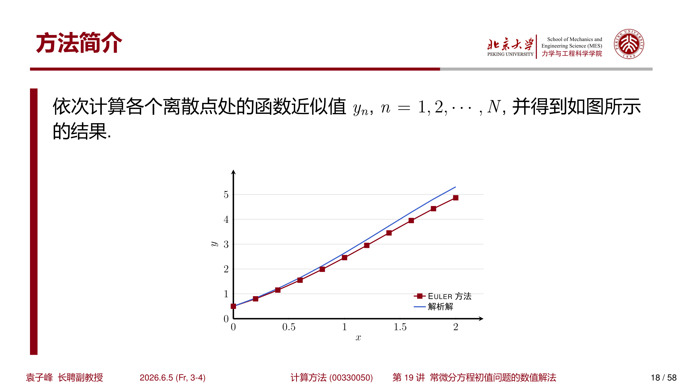
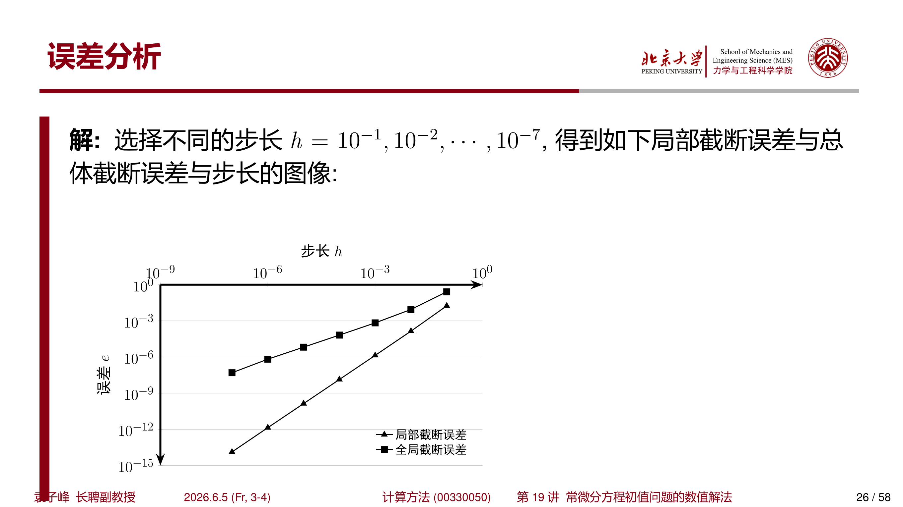
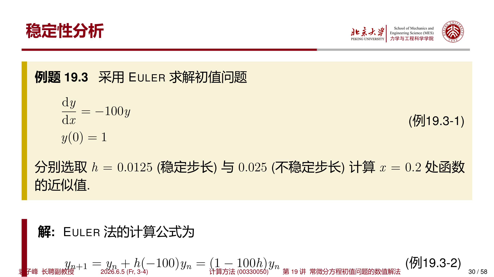
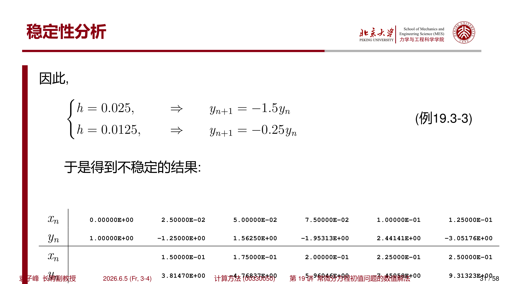
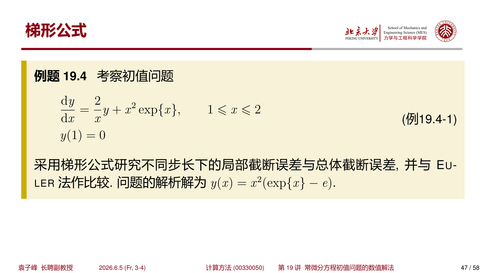
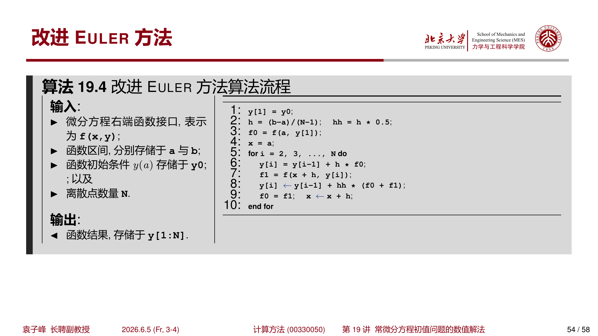

## 1 问题简介

### 1.1 常微分方程初值问题

考虑一阶常微分方程初值问题

$$
\begin{cases}
y'(x)=f(x,y(x)),&x\in[a,b]\\[4pt]
y(a)=y_0
\end{cases}
$$

对于无法用初等函数表示的问题，可以寻求数值解。数值解的基本思路是：将自变量 $x$ 离散化成一个单调递增的序列

$$
x_0<x_1<\cdots<x_N
$$

其中 $x_0=a$，$x_N=b$。如果不特别说明，一般认为这些点的间隔是均匀的，并记作

$$
h=x_{k+1}-x_k,\quad\forall k=0,1,\cdots,N-1
$$

这里的 $h$ 称为 **步长**。

!!! tip "为什么需要数值解法"
    绝大多数常微分方程没有解析解。例如 $y'=x^2+y^2$ 就是一个看似简单却无法用初等函数表示解的方程。数值方法的核心思想是"以差商代替微商、以离散代替连续"。

### 1.2 基本概念与定义

常微分方程初值问题的数值算法寻求一种计算格式：

$$
y_{n+1}=G(y_{n+1},y_n,\cdots,y_{n-k})
$$

其中 $y_n$ 是计算方法下 $y(x_n)$ 的近似值，而 $y(x_n)$ 表示 $y=y(x)$ 在点 $x=x_n$ 的准确值。

此外，定义

$$
\tilde{y}_{n+1}=G(\tilde{y}_{n+1},y(x_n),\cdots,y(x_{n-k}))
$$

即 $\tilde{y}_{n+1}$ 所依赖的函数值，除了自身以外，其余都是准确值。

!!! abstract "定义 1.1（局部截断误差）"
    称

    $$
    l_{n+1}=y(x_{n+1})-\tilde{y}_{n+1}
    $$

    为该方法的 **局部截断误差** （local truncation error）。

!!! abstract "定义 1.2（总体截断误差）"
    称

    $$
    e_{n+1}=y(x_{n+1})-y_{n+1}
    $$

    为该方法的 **总体截断误差** （global truncation error）。

!!! info "两种误差的区别"
    **局部截断误差** 描述的是单次计算所引入的误差的大小，假设前面所有步骤都是精确的。而 **总体截断误差** 描述的是由于误差累积导致的当前误差的大小，反映的是实际计算中的真实误差。

!!! abstract "定义 1.3（精度阶）"
    若一个求解常微分方程初值问题的数值方法，其局部截断误差 $l_{n+1}=O(h^{p+1})$，则称该方法具有 $p$ **阶精度**。

!!! abstract "定义 1.4（相容性）"
    若一个求解常微分方程初值问题的数值方法，当 $h\to0$ 时，局部截断误差趋于 0，则称这个方法是 **相容的** （compatible）。

!!! abstract "定义 1.5（绝对稳定性）"
    用一个求解常微分方程初值问题的数值方法求解模型方程

    $$
    y'=\lambda y,\quad\lambda\in\mathbb{C}
    $$

    对于给定步长 $h>0$，假设计算 $y_n$ 时引入误差 $\rho_n$。若这个误差在计算 $y_{n+k}\ (k=1,2,\cdots)$ 中引起的误差绝对值均不增加，就说这个数值方法对于步长 $h$ 和 $\lambda$ 是 **绝对稳定的**。

!!! abstract "定义 1.6（显式方法与隐式方法）"
    若常微分方程初值问题的数值算法中，$G$ 与 $y_{n+1}$ 无关，即

    $$
    y_{n+1}=G(y_n,\cdots,y_{n-k})
    $$

    则称这个方法为 **显式方法** （explicit method）；反之，若 $G$ 依赖于 $y_{n+1}$，则称为 **隐式方法** （implicit method）。

!!! abstract "定义 1.7（单步法与多步法）"
    若常微分方程初值问题的数值算法中，$k=0$，即

    $$
    y_{n+1}=G(y_{n+1},y_n)\quad\text{或}\quad y_{n+1}=G(y_n)
    $$

    则称这个方法为 **单步法** （single-step method）；反之，若需要多个历史值，则称为 **多步法** （multiple-step method）。

---

## 2 Euler 方法

### 2.1 方法推导

Euler 方法是常微分方程初值问题数值解法中最简单的一种。将 $y(x)$ 在点 $x=x_n$ 处做 Taylor 展开：

$$
y(x_n+h)=y(x_n)+hy'(x_n)+\frac{h^2}{2}y''(x_n)+\cdots
$$

代入 $y'(x_n)=f(x_n,y(x_n))$，得到

$$
y(x_n+h)=y(x_n)+hf(x_n,y(x_n))+\frac{h^2}{2}y''(x_n)+\cdots
$$

取 $h$ 的线性部分，则得到 **Euler 公式**：

$$
y_{n+1}=y_n+hf(x_n,y_n),\quad n=0,1,2,\cdots,N-1
$$

!!! warning "注意符号区分"
    注意不要将上式写成 $y(x_{n+1})=y(x_n)+hf(x_n,y(x_n))$。$y(x_n)$ 表示的是点 $x=x_n$ 处的 **准确值**，而 $y_n$ 表示的是 **数值近似值**。

Euler 方法也可以通过 **数值积分** 的方式推导。由微积分基本定理：

$$
y(x_{n+1})=y(x_n)+\int_{x_n}^{x_{n+1}}y'(\xi)\,d\xi=y(x_n)+\int_{x_n}^{x_{n+1}}f(\xi,y(\xi))\,d\xi
$$

利用 **左矩形积分公式**，得到

$$
\int_{x_n}^{x_{n+1}}f(\xi,y(\xi))\,d\xi\approx(x_{n+1}-x_n)f(x_n,y(x_n))=hf(x_n,y(x_n))
$$

因此同样得到 Euler 方法。这也说明了 Euler 方法的局部截断误差与矩形积分公式的截断误差同阶。

### 2.2 算法

$$
\begin{aligned}
& \textbf{算法: } \text{Euler 法} \\
& \textbf{输入: } f(x,y),\ [a,b],\ y_0,\ N \\
& \textbf{输出: } y[1:N] \\
& 1. \quad y[1] \leftarrow y_0 \\
& 2. \quad h \leftarrow (b-a)/(N-1) \\
& 3. \quad x \leftarrow a \\
& 4. \quad \textbf{for } i = 2, 3, \ldots, N \textbf{ do} \\
& 5. \quad \quad y[i] \leftarrow y[i-1] + h \cdot f(x, y[i-1]) \\
& 6. \quad \quad x \leftarrow x + h \\
& 7. \quad \textbf{end for} \\
& 8. \quad \textbf{return } y[1:N]
\end{aligned}
$$

???+ example "例 2.1：Euler 方法数值实验"
    采用 Euler 方法近似计算

    $$
    \begin{cases}
    y'(x)=y-x^2+1,\quad x\in[0,2]\\[4pt]
    y(0)=0.5
    \end{cases}
    $$

    选取 $N=11$（即 $h=0.2$），并与解析解 $y(x)=(x+1)^2-\dfrac{e^x}{2}$ 做比较。

    解：Euler 方法的计算公式为

    $$
    y_{n+1}=y_n+0.2(y_n-x_n^2+1)
    $$

    依次计算：

    $$
    \begin{aligned}
    y_1&=y_0+hf(x_0,y_0)=0.5+0.2\times(0.5-0+1)=0.8\\
    y_2&=y_1+hf(x_1,y_1)=0.8+0.2\times(0.8-0.04+1)=1.152
    \end{aligned}
    $$

    依次计算各个离散点处的函数近似值，得到如下图所示的结果。

    { width="500" }

    从图中可以明显看出，Euler 方法的数值解（蓝色线）系统性地偏离了真实解（橙色线），这是由于 Euler 方法的一阶精度造成的累积误差。

---

## 3 误差分析

### 3.1 局部截断误差

考虑 $y(x)$ 在 $x=x_n$ 处的 Taylor 展开：

$$
y(x)=y(x_n)+y'(x_n)(x-x_n)+\frac{1}{2}y''(x_n)(x-x_n)^2+O((x-x_n)^3)
$$

令 $x=x_{n+1}=x_n+h$，并代入 $y'=f(x,y)$，得到

$$
y(x_{n+1})=y(x_n)+hf(x_n,y(x_n))+\frac{h^2}{2}y''(x_n)+O(h^3)
$$

而 Euler 方法在假设前面精确的情况下给出的值为

$$
\tilde{y}_{n+1}=y(x_n)+hf(x_n,y(x_n))
$$

根据局部截断误差的定义 $l_{n+1}=y(x_{n+1})-\tilde{y}_{n+1}$，得到 Euler 方法的局部截断误差为

$$
l_{n+1}=\frac{h^2}{2}y''(x_n)+O(h^3)=O(h^2)
$$

!!! abstract "Euler 方法具有 1 阶精度"
    由于局部截断误差 $l_{n+1}=O(h^2)$，根据定义，Euler 方法具有 **1 阶精度**。

### 3.2 总体截断误差

再研究 Euler 方法的总体截断误差。假设 $f(x,y)$ 对 $y$ 满足 **Lipschitz 条件**，并且 Lipschitz 常数为 $L$。则总体截断误差可以分解为：

$$
|e_{n+1}|=|y(x_{n+1})-y_{n+1}|\leq|y(x_{n+1})-\tilde{y}_{n+1}|+|\tilde{y}_{n+1}-y_{n+1}|
$$

右端第一项为局部截断误差：

$$
y(x_{n+1})-\tilde{y}_{n+1}=O(h^2)
$$

右端第二项可以展开为：

$$
\begin{aligned}
|\tilde{y}_{n+1}-y_{n+1}|
&=|y(x_n)+hf(x_n,y(x_n))-y_n-hf(x_n,y_n)|\\
&\leq|y(x_n)-y_n|+h|f(x_n,y(x_n))-f(x_n,y_n)|\\
&\leq|y(x_n)-y_n|+hL|y(x_n)-y_n|\\
&=(1+hL)|y(x_n)-y_n|=(1+hL)|e_n|
\end{aligned}
$$

因此，总体截断误差估计为

$$
\begin{aligned}
|e_{n+1}|
&\leq O(h^2)+(1+hL)|e_n|\\
&\leq O(h^2)+(1+hL)\bigl[O(h^2)+(1+hL)|e_{n-1}|\bigr]\\
&\leq\cdots\\
&\leq O(h^2)\bigl[1+(1+hL)+\cdots+(1+hL)^n\bigr]\\
&=O(h^2)\cdot\frac{(1+hL)^{n+1}-1}{hL}
\end{aligned}
$$

注意到当 $h\to0$ 且 $nh$ 有界时，$(1+hL)^n\approx e^{nhL}$，因此

$$
|e_{n+1}|=O(h^2)\cdot\frac{e^{(n+1)hL}-1}{hL}=O(h^2)\cdot O(h^{-1})=O(h)
$$

!!! abstract "Euler 方法的总体截断误差"
    Euler 方法的总体截断误差为 $O(h)$。局部截断误差 $O(h^2)$ 与总体截断误差 $O(h)$ 相差一个 $h$ 的阶数，这是单步法的一个典型特征。

???+ example "例 3.1：不同步长下的误差对比"
    考察初值问题

    $$
    \begin{cases}
    \dfrac{dy}{dx}=\dfrac{2}{x}y+x^2e^x,\quad 1\leq x\leq 2\\[8pt]
    y(1)=0
    \end{cases}
    $$

    问题的解析解为 $y(x)=x^2(e^x-e)$。选择不同的步长 $h=10^{-1},10^{-2},\cdots,10^{-7}$，研究局部截断误差与总体截断误差。

    数值结果如下图所示：

    { width="500" }

    通过数据拟合，得到近似的误差与步长的关系为：

    $$
    \begin{aligned}
    l_{x=1+h}&\approx1.6077\,h^{2.0142}\\[4pt]
    e_{x=2}&\approx1.7847\,h^{1.0866}
    \end{aligned}
    $$

    这验证了理论分析：局部截断误差为 $O(h^2)$，总体截断误差为 $O(h)$。

---

## 4 稳定性分析

### 4.1 模型方程与稳定区域

为了分析 Euler 方法的稳定性，利用 Euler 方法求解模型方程

$$
y'=\lambda y,\quad\lambda\in\mathbb{C}
$$

Euler 方法的计算公式为

$$
y_{n+1}=y_n+h\lambda y_n=(1+\lambda h)y_n
$$

为了使计算 $y_n$ 时引入的误差在之后计算中不再增长，需要满足

$$
|1+\lambda h|\leq1
$$

此时 Euler 方法是 **绝对稳定** 的。

!!! abstract "Euler 方法的绝对稳定区域"
    Euler 方法的绝对稳定区域为复平面上以 $(-1,0)$ 为圆心、半径为 1 的圆盘内部，即

    $$
    |z+1|\leq1,\quad z=\lambda h
    $$

    特别地，若 $\lambda<0$（实数），则稳定条件为 $h\leq-2/\lambda$。

!!! warning "步长不能太大"
    当 $\lambda<0$ 时，真实解是指数衰减的。如果步长 $h$ 太大导致 $|1+\lambda h|>1$，数值解反而会指数增长，与真实行为完全背离。这种现象称为 **数值不稳定**。

### 4.2 数值实验

???+ example "例 4.1：稳定与不稳定步长的对比"
    采用 Euler 方法求解初值问题

    $$
    \begin{cases}
    y'=-100y\\[4pt]
    y(0)=1
    \end{cases}
    $$

    分别选取 $h=0.0125$（稳定步长）与 $h=0.025$（不稳定步长）计算 $x=0.2$ 处函数的近似值。

    解：Euler 法的计算公式为

    $$
    y_{n+1}=y_n+h(-100)y_n=(1-100h)y_n
    $$

    因此：

    - 当 $h=0.025$ 时，$y_{n+1}=-1.5\,y_n$，误差每步放大 1.5 倍；
    - 当 $h=0.0125$ 时，$y_{n+1}=-0.25\,y_n$，误差每步衰减为 0.25 倍。

    **不稳定的结果** （$h=0.025$）：

    | $x_n$ | 0.00000 | 0.02500 | 0.05000 | 0.07500 | 0.10000 | 0.12500 |
    | --- | --- | --- | --- | --- | --- | --- |
    | $y_n$ | 1.00000 | -1.25000 | 1.56250 | -1.95313 | 2.44141 | -3.05176 |

    数值解震荡且幅度越来越大，完全偏离了真实解 $y=e^{-100x}$ 的快速衰减行为。

    { width="500" }

    **稳定的结果** （$h=0.0125$）：

    | $x_n$ | 0.00000 | 0.01250 | 0.02500 | 0.03750 | 0.05000 | 0.06250 |
    | --- | --- | --- | --- | --- | --- | --- |
    | $y_n$ | 1.00000 | -0.25000 | 0.06250 | -0.01562 | 0.00391 | -0.00098 |

    数值解快速衰减并趋于 0，与真实行为一致。

    { width="500" }

---

## 5 常见单步法

### 5.1 向后 Euler 方法

#### 方法推导

将 $y(x)$ 在点 $x=x_{n+1}=x_n+h$ 处做 Taylor 展开：

$$
y(x_n)=y(x_{n+1})+(-h)y'(x_{n+1})+\frac{h^2}{2}y''(x_{n+1})+\cdots
$$

整理得到 **向后 Euler 方法** （backward Euler method）：

$$
y_{n+1}=y_n+hf(x_{n+1},y_{n+1})
$$

由于计算 $y_{n+1}$ 时，右端项依赖 $y_{n+1}$，因此向后 Euler 方法是一个 **单步隐式方法**。

向后 Euler 方法也可以通过数值积分推导：

$$
\int_{x_n}^{x_{n+1}}f(\xi,y(\xi))\,d\xi\approx hf(x_{n+1},y(x_{n+1}))
$$

这是 **右矩形积分公式**。

#### 局部截断误差

通过 Taylor 展开，可以很快证明向后 Euler 方法的局部截断误差也是 $O(h^2)$，因此具有 1 阶精度。

#### 迭代求解

对于一般的 $f(x,y)$，无法通过向后 Euler 公式直接得到 $y_{n+1}$，可以通过 **不动点迭代** 进行求解。迭代的初值可以采取 Euler 方法：

$$
\begin{cases}
y_{n+1}^{(0)}=y_n+hf(x_n,y_n)\\[6pt]
y_{n+1}^{(k+1)}=y_n+hf(x_{n+1},y_{n+1}^{(k)}),\quad k=0,1,\cdots
\end{cases}
$$

下面考察迭代收敛的条件。根据

$$
|y_{n+1}^{(k+1)}-y_{n+1}^{(k)}|=h|f(x_{n+1},y_{n+1}^{(k)})-f(x_{n+1},y_{n+1}^{(k-1)})|\leq hL|y_{n+1}^{(k)}-y_{n+1}^{(k-1)}|
$$

其中 $L>0$ 为 Lipschitz 常数。因此，如果有 $0<hL<1$，则迭代收敛。

#### 稳定性分析

向后 Euler 方法的绝对稳定区域与 Euler 方法不同。求解模型方程：

$$
y_{n+1}=y_n+h\lambda y_{n+1}\quad\Rightarrow\quad y_{n+1}=\frac{1}{1-h\lambda}y_n
$$

因此，绝对稳定条件为

$$
\left|\frac{1}{1-h\lambda}\right|\leq1
$$

对于复数 $\lambda$，上式等价于 $\text{Re}(\lambda)\leq0$。也就是说：

!!! abstract "向后 Euler 方法的绝对稳定区域"
    向后 Euler 方法的绝对稳定区域为整个左半复平面

    $$
    \text{Re}(\lambda h)\leq0
    $$

    这样的方法称为 **A-稳定** （A-stable）方法。

!!! tip "A-稳定的意义"
    向后 Euler 方法对任意步长 $h$ 都是绝对稳定的（只要 $\text{Re}(\lambda)\leq0$），这是隐式方法相比显式方法的重要优势。但需要注意，迭代求解时仍要求 $hL<1$ 以保证内迭代收敛。

#### 算法

$$
\begin{aligned}
& \textbf{算法: } \text{向后 Euler 法（迭代求解）} \\
& \textbf{输入: } f(x,y),\ [a,b],\ y_0,\ N,\ M,\ \varepsilon \\
& \textbf{输出: } y[1:N] \\
& 1. \quad y[1] \leftarrow y_0 \\
& 2. \quad h \leftarrow (b-a)/(N-1) \\
& 3. \quad x \leftarrow a \\
& 4. \quad \textbf{for } i = 2, 3, \ldots, N \textbf{ do} \\
& 5. \quad \quad k \leftarrow 0 \\
& 6. \quad \quad y[i] \leftarrow y[i-1] + h \cdot f(x, y[i-1]) \quad \text{// Euler 预估} \\
& 7. \quad \quad y_t \leftarrow y[i] \\
& 8. \quad \quad \textbf{while } k < M \textbf{ do} \\
& 9. \quad \quad \quad y[i] \leftarrow y[i-1] + h \cdot f(x+h, y[i]) \\
& 10. \quad \quad \quad \textbf{if } |y[i] - y_t| < \varepsilon \textbf{ then break} \\
& 11. \quad \quad \quad y_t \leftarrow y[i] \\
& 12. \quad \quad \quad k \leftarrow k + 1 \\
& 13. \quad \quad \textbf{end while} \\
& 14. \quad \quad x \leftarrow x + h \\
& 15. \quad \textbf{end for} \\
& 16. \quad \textbf{return } y[1:N]
\end{aligned}
$$

### 5.2 梯形公式

#### 方法推导

将 Euler 方法与向后 Euler 方法结合，可以构造 **梯形公式** （trapezoidal method）：

$$
y_{n+1}=y_n+\frac{h}{2}\bigl[f(x_n,y_n)+f(x_{n+1},y_{n+1})\bigr]
$$

梯形公式也可以从积分公式推导。由

$$
y(x_{n+1})=y(x_n)+\int_{x_n}^{x_{n+1}}f(\xi,y(\xi))\,d\xi
$$

利用 **梯形积分公式**：

$$
\int_{x_n}^{x_{n+1}}f(\xi,y(\xi))\,d\xi\approx\frac{h}{2}\bigl[f(x_n,y(x_n))+f(x_{n+1},y(x_{n+1}))\bigr]
$$

显然，梯形公式也是一种 **单步隐式方法**。

#### 迭代求解

类似向后 Euler 法，梯形公式的迭代格式为：

$$
\begin{cases}
y_{n+1}^{(0)}=y_n+hf(x_n,y_n)\\[8pt]
y_{n+1}^{(k+1)}=y_n+\dfrac{h}{2}\bigl[f(x_n,y_n)+f(x_{n+1},y_{n+1}^{(k)})\bigr],\quad k=0,1,\cdots
\end{cases}
$$

此时，迭代收敛的条件为 $0<\dfrac{hL}{2}<1$。与向后 Euler 相比，步长 $h$ 可以放宽一倍。

#### 局部截断误差

梯形公式的一个优点是局部截断误差为 $O(h^3)$。通过 $y(x)$ 与 $y'(x)$ 的 Taylor 展开，并代入 $x=x_{n+1}$，得到：

$$
y(x_{n+1})=y(x_n)+hy'(x_n)+\frac{h^2}{2}y''(x_n)+\frac{h^3}{6}y'''(x_n)+O(h^4)
$$

$$
y'(x_{n+1})=y'(x_n)+hy''(x_n)+\frac{h^2}{2}y'''(x_n)+O(h^3)
$$

从第二个展开式，可以得到

$$
y''(x_n)=\frac{1}{h}\bigl[y'(x_{n+1})-y'(x_n)\bigr]-\frac{h}{2}y'''(x_n)+O(h^2)
$$

代入第一个 Taylor 展开：

$$
\begin{aligned}
y(x_{n+1})
&=y(x_n)+hy'(x_n)+\frac{h}{2}\bigl[y'(x_{n+1})-y'(x_n)\bigr]-\frac{h^3}{4}y'''(x_n)+O(h^4)\\
&\quad+\frac{h^3}{6}y'''(x_n)+O(h^4)\\
&=y(x_n)+\frac{h}{2}\bigl[y'(x_n)+y'(x_{n+1})\bigr]-\frac{h^3}{12}y'''(x_n)+O(h^4)
\end{aligned}
$$

而梯形公式给出的值为

$$
\tilde{y}_{n+1}=y(x_n)+\frac{h}{2}\bigl[f(x_n,y(x_n))+f(x_{n+1},\tilde{y}_{n+1})\bigr]
$$

因此局部截断误差为

$$
l_{n+1}=y(x_{n+1})-\tilde{y}_{n+1}=O(h^3)
$$

!!! abstract "梯形公式具有 2 阶精度"
    梯形公式的局部截断误差为 $O(h^3)$，具有 **2 阶精度**。进一步可以证明总体截断误差为 $O(h^2)$。

#### 稳定性分析

梯形公式求解模型方程 $y'=\lambda y$：

$$
y_{n+1}=y_n+\frac{h\lambda}{2}(y_n+y_{n+1})\quad\Rightarrow\quad y_{n+1}=\frac{1+\dfrac{\lambda h}{2}}{1-\dfrac{\lambda h}{2}}\,y_n
$$

稳定条件为

$$
\left|\frac{1+\dfrac{\lambda h}{2}}{1-\dfrac{\lambda h}{2}}\right|\leq1
$$

对于 $\text{Re}(\lambda)\leq0$，上式恒成立。因此：

!!! abstract "梯形公式也是 A-稳定的"
    梯形公式的绝对稳定区域也是整个左半复平面，因此梯形公式同样是 **A-稳定** 方法。

#### 算法

$$
\begin{aligned}
& \textbf{算法: } \text{梯形法（迭代求解）} \\
& \textbf{输入: } f(x,y),\ [a,b],\ y_0,\ N,\ M,\ \varepsilon \\
& \textbf{输出: } y[1:N] \\
& 1. \quad y[1] \leftarrow y_0 \\
& 2. \quad h \leftarrow (b-a)/(N-1);\quad hh \leftarrow h/2 \\
& 3. \quad f_0 \leftarrow f(a, y[1]) \\
& 4. \quad x \leftarrow a \\
& 5. \quad \textbf{for } i = 2, 3, \ldots, N \textbf{ do} \\
& 6. \quad \quad k \leftarrow 0 \\
& 7. \quad \quad y[i] \leftarrow y[i-1] + h \cdot f_0 \quad \text{// Euler 预估} \\
& 8. \quad \quad y_t \leftarrow y[i] \\
& 9. \quad \quad \textbf{while } k < M \textbf{ do} \\
& 10. \quad \quad \quad f_1 \leftarrow f(x+h, y[i]) \\
& 11. \quad \quad \quad y[i] \leftarrow y[i-1] + hh \cdot (f_0 + f_1) \\
& 12. \quad \quad \quad \textbf{if } |y[i] - y_t| < \varepsilon \textbf{ then break} \\
& 13. \quad \quad \quad y_t \leftarrow y[i] \\
& 14. \quad \quad \quad k \leftarrow k + 1 \\
& 15. \quad \quad \textbf{end while} \\
& 16. \quad \quad f_0 \leftarrow f_1;\quad x \leftarrow x + h \\
& 17. \quad \textbf{end for} \\
& 18. \quad \textbf{return } y[1:N]
\end{aligned}
$$

???+ example "例 5.1：梯形公式与 Euler 法的精度对比"
    考察相同的初值问题

    $$
    \begin{cases}
    \dfrac{dy}{dx}=\dfrac{2}{x}y+x^2e^x,\quad 1\leq x\leq 2\\[8pt]
    y(1)=0
    \end{cases}
    $$

    采用梯形公式研究不同步长下的局部截断误差与总体截断误差，并与 Euler 法作比较。

    { width="500" }

    通过数据拟合，得到近似的误差与步长的关系：

    **梯形公式**：

    $$
    \begin{aligned}
    l_{x=1+h}&\approx3.6474\,h^{3.0299}\\[4pt]
    e_{x=2}&\approx12.682\,h^{2.0148}
    \end{aligned}
    $$

    **Euler 法** （回顾）：

    $$
    \begin{aligned}
    l_{x=1+h}&\approx1.6077\,h^{2.0142}\\[4pt]
    e_{x=2}&\approx1.7847\,h^{1.0866}
    \end{aligned}
    $$

    对比可见：梯形公式的局部误差为 $O(h^3)$（2 阶精度），全局误差为 $O(h^2)$，比 Euler 法高一个数量级。

### 5.3 改进 Euler 方法

#### 方法推导

在梯形公式中，如果固定迭代次数为 1（只进行一次校正），就得到了一种不同于 Euler 方法的 **单步显式法**：

$$
y_{n+1}=y_n+\frac{h}{2}\bigl[f(x_n,y_n)+f(x_{n+1},y_n+hf(x_n,y_n))\bigr]
$$

这个方法称为 **改进 Euler 方法**，也称为 **Heun 方法**。

将上式在 $(x_n,y_n)$ 处进行 Taylor 展开。记 $f_x\equiv\dfrac{\partial f}{\partial x}$，$f_y\equiv\dfrac{\partial f}{\partial y}$，则

$$
\begin{aligned}
f(x_{n+1},y_n+hf_n)
&=f(x_n,y_n)+hf_x+hf_y\,f(x_n,y_n)+O(h^2)\\
&=f_n+h(f_x+f_yf_n)+O(h^2)
\end{aligned}
$$

其中 $f_n=f(x_n,y_n)$。代入改进 Euler 公式：

$$
\begin{aligned}
y_{n+1}
&=y_n+\frac{h}{2}\bigl[f_n+f_n+h(f_x+f_yf_n)+O(h^2)\bigr]\\
&=y_n+hf_n+\frac{h^2}{2}(f_x+f_yf_n)+O(h^3)
\end{aligned}
$$

因此

$$
\tilde{y}_{n+1}=y(x_n)+hf(x_n,y(x_n))+\frac{h^2}{2}\bigl[f_x+f_yf(x_n,y(x_n))\bigr]
$$

另一方面，从 $y=y(x)$ 的 Taylor 展开：

$$
\begin{aligned}
y(x_{n+1})
&=y(x_n)+hy'(x_n)+\frac{h^2}{2}y''(x_n)+O(h^3)\\
&=y(x_n)+hf(x_n,y(x_n))+\frac{h^2}{2}\bigl[f_x+f_y\,y'(x_n)\bigr]+O(h^3)\\
&=y(x_n)+hf(x_n,y(x_n))+\frac{h^2}{2}\bigl[f_x+f_yf(x_n,y(x_n))\bigr]+O(h^3)
\end{aligned}
$$

因此，改进 Euler 方法的局部截断误差为 $O(h^3)$。

!!! abstract "改进 Euler 方法具有 2 阶精度"
    改进 Euler 方法的局部截断误差为 $O(h^3)$，具有 **2 阶精度**。由于它是显式方法，不需要迭代求解，每步的计算量比梯形公式小。

#### 算法

$$
\begin{aligned}
& \textbf{算法: } \text{改进 Euler 法（Heun 法）} \\
& \textbf{输入: } f(x,y),\ [a,b],\ y_0,\ N \\
& \textbf{输出: } y[1:N] \\
& 1. \quad y[1] \leftarrow y_0 \\
& 2. \quad h \leftarrow (b-a)/(N-1);\quad hh \leftarrow h/2 \\
& 3. \quad f_0 \leftarrow f(a, y[1]) \\
& 4. \quad x \leftarrow a \\
& 5. \quad \textbf{for } i = 2, 3, \ldots, N \textbf{ do} \\
& 6. \quad \quad y[i] \leftarrow y[i-1] + h \cdot f_0 \quad \text{// Euler 预估} \\
& 7. \quad \quad f_1 \leftarrow f(x+h, y[i]) \\
& 8. \quad \quad y[i] \leftarrow y[i-1] + hh \cdot (f_0 + f_1) \quad \text{// 梯形校正} \\
& 9. \quad \quad f_0 \leftarrow f_1;\quad x \leftarrow x + h \\
& 10. \quad \textbf{end for} \\
& 11. \quad \textbf{return } y[1:N]
\end{aligned}
$$

!!! tip "改进 Euler 法的结构"
    改进 Euler 法可以看作一个"预估-校正"结构：

    - **预估步** （Predictor）：用 Euler 法预估 $y_{n+1}^*=y_n+hf(x_n,y_n)$
    - **校正步** （Corrector）：用梯形公式校正 $y_{n+1}=y_n+\dfrac{h}{2}\bigl[f(x_n,y_n)+f(x_{n+1},y_{n+1}^*)\bigr]$

???+ example "例 5.2：改进 Euler 法与梯形公式的精度对比"
    采用相同的初值问题，比较改进 Euler 法与梯形公式的精度。

    { width="500" }

    通过数据拟合：

    **改进 Euler 法**：

    $$
    \begin{aligned}
    l_{x=1+h}&\approx3.4365\,h^{2.9831}\\[4pt]
    e_{x=2}&\approx30.146\,h^{1.9748}
    \end{aligned}
    $$

    **梯形公式** （回顾）：

    $$
    \begin{aligned}
    l_{x=1+h}&\approx3.6474\,h^{3.0299}\\[4pt]
    e_{x=2}&\approx12.682\,h^{2.0148}
    \end{aligned}
    $$

    两种方法都具有 2 阶精度。改进 Euler 法是显式方法，实现更简单；梯形公式是隐式方法，精度略好且 A-稳定，但需要迭代求解。

---

## 6 总结

| 方法 | 类型 | 显式/隐式 | 局部截断误差 | 全局截断误差 | 稳定区域 | 特点 |
| --- | --- | --- | --- | --- | --- | --- |
| Euler 法 | 单步 | 显式 | $O(h^2)$ | $O(h)$ | $|1+\lambda h|\leq1$ | 最简单，精度低 |
| 向后 Euler 法 | 单步 | 隐式 | $O(h^2)$ | $O(h)$ | $\text{Re}(\lambda h)\leq0$ | A-稳定，需迭代 |
| 梯形公式 | 单步 | 隐式 | $O(h^3)$ | $O(h^2)$ | $\text{Re}(\lambda h)\leq0$ | A-稳定，2 阶精度 |
| 改进 Euler 法 | 单步 | 显式 | $O(h^3)$ | $O(h^2)$ | 有界（条件稳定） | 2 阶精度，无需迭代 |

!!! tip "方法选择建议"
    - 对简单问题或教学演示：Euler 法
    - 对刚性问题（$|\lambda|$ 很大）：向后 Euler 法或梯形公式（A-稳定）
    - 对一般问题追求效率：改进 Euler 法（显式、2 阶、无需迭代）
    - 对精度要求高的非刚性问题：梯形公式（2 阶、A-稳定）
