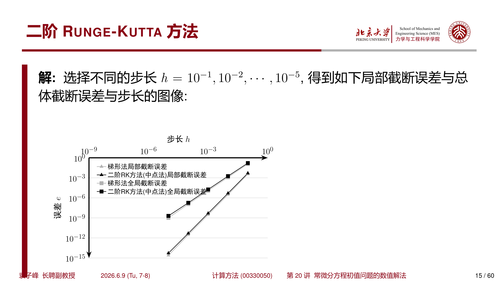
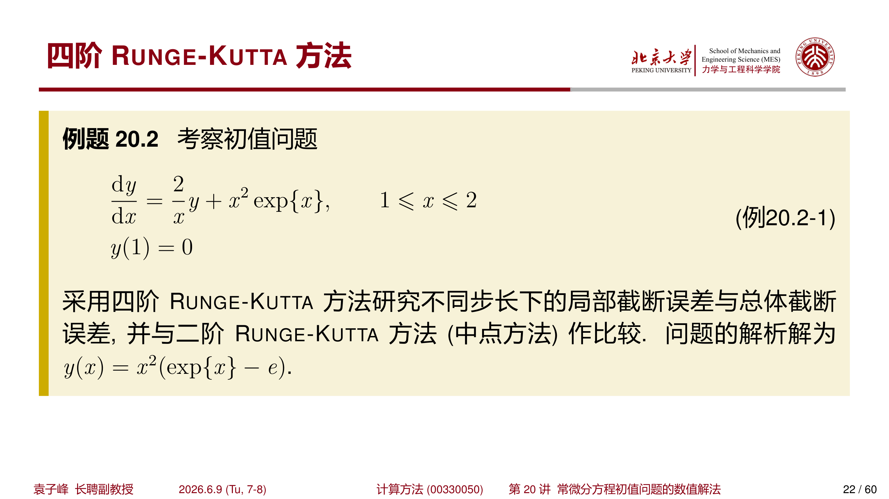

## 1 Runge-Kutta 方法

### 1.1 方法思想

Euler 方法的局部截断误差为 $O(h^2)$，而改进 Euler 方法的局部截断误差为 $O(h^3)$。回顾这两种方法：

**Euler 方法**：

$$
\begin{cases}
k_1=hf(x_n,y_n)\\[6pt]
y_{n+1}=y_n+k_1
\end{cases}
$$

**改进 Euler 方法**：

$$
\begin{cases}
k_1=hf(x_n,y_n)\\[6pt]
k_2=hf(x_n+h,y_n+k_1)\\[6pt]
y_{n+1}=y_n+\dfrac{1}{2}(k_1+k_2)
\end{cases}
$$

可以看到，改进 Euler 方法计算了 $[x_n,x_{n+1}]$ 区间内 **更多点** 的函数值，然后通过合适的 **加权系数**，最终得到了更好的 $y_{n+1}$ 的估计。Runge-Kutta（RK）方法正是将这一思想系统化、推广化的结果。

!!! tip "Runge-Kutta 方法的核心思想"
    通过在区间 $[x_n,x_{n+1}]$ 内计算若干个点处的斜率（导数值），然后对这些斜率进行加权平均，作为整个区间上的平均斜率，从而获得更高精度的近似。

### 1.2 二阶 Runge-Kutta 方法

#### 一般形式与参数推导

从改进 Euler 方法入手，假设更一般的计算格式：

$$
\begin{cases}
k_1=hf(x_n,y_n)\\[6pt]
k_2=hf(x_n+\alpha h,y_n+\beta k_1)\\[6pt]
y_{n+1}=y_n+\omega_1k_1+\omega_2k_2
\end{cases}
$$

其中 $\omega_1,\omega_2,\alpha,\beta$ 为待定参数。

将 $f(x_n+\alpha h,y_n+\beta k_1)$ 在 $f(x_n,y_n)$ 处展开：

$$
\begin{aligned}
f(x_n+\alpha h,y_n+\beta k_1)
&=f(x_n,y_n)+\alpha hf_x+\beta k_1f_y+O(h^2)\\
&=f(x_n,y_n)+\alpha hf_x+\beta hf_yf(x_n,y_n)+O(h^2)
\end{aligned}
$$

如果假设第 $n$ 步是准确解（即 $y_n=y(x_n)$），则

$$
\begin{aligned}
f(x_n+\alpha h,y(x_n)+\beta k_1)
&=f(x_n,y_n)+\alpha hf_x+\beta hf_yf(x_n,y(x_n))+O(h^2)
\end{aligned}
$$

代入 RK 计算格式，得到

$$
\begin{aligned}
\tilde{y}_{n+1}
&=y(x_n)+(\omega_1+\omega_2)hf(x_n,y(x_n))\\
&\quad+\omega_2h^2\bigl[\alpha f_x+\beta f_yf(x_n,y(x_n))\bigr]+O(h^3)
\end{aligned}
$$

回顾 $y=y(x)$ 的 Taylor 展开：

$$
y(x_{n+1})=y(x_n)+hf(x_n,y(x_n))+\frac{h^2}{2}\bigl[f_x+f_yf(x_n,y(x_n))\bigr]+O(h^3)
$$

比较两式的系数，得到如下方程组：

$$
\begin{cases}
\omega_1+\omega_2=1\\[6pt]
\alpha\omega_2=\dfrac{1}{2}\\[10pt]
\beta\omega_2=\dfrac{1}{2}
\end{cases}
$$

这里有 4 个未知数但只有 3 个方程，因此解不唯一。每取一组满足条件的参数，就得到一种二阶 RK 方法。

#### 改进 Euler 方法

取 $\omega_1=\omega_2=\dfrac{1}{2}$，$\alpha=\beta=1$，得到改进 Euler 方法：

$$
\begin{cases}
k_1=hf(x_n,y_n)\\[6pt]
k_2=hf(x_n+h,y_n+k_1)\\[6pt]
y_{n+1}=y_n+\dfrac{1}{2}(k_1+k_2)
\end{cases}
$$

#### 中点方法

取 $\omega_1=0$，$\omega_2=1$，$\alpha=\beta=\dfrac{1}{2}$，得到 **中点方法**：

$$
\begin{cases}
k_1=hf(x_n,y_n)\\[6pt]
k_2=hf\left(x_n+\dfrac{h}{2},y_n+\dfrac{k_1}{2}\right)\\[8pt]
y_{n+1}=y_n+k_2
\end{cases}
$$

!!! tip "中点方法的几何意义"
    中点方法用区间中点处的斜率作为整个区间的平均斜率。与改进 Euler 方法（用端点斜率的平均）不同，中点方法只需要存储一个 $k$ 值来更新 $y$。

#### Butcher 表

Butcher 将 RK 方法的系数整理排列成如下的表格形式，称为 **Butcher 表**：

$$
\begin{array}{c|cc}
0 & &\\
\alpha & \beta &\\
\hline
& \omega_1 & \omega_2
\end{array}
$$

改进 Euler 方法与中点方法的 Butcher 表分别为：

$$
\text{改进 Euler：}\quad
\begin{array}{c|cc}
0 & &\\
1 & 1 &\\
\hline
& \dfrac{1}{2} & \dfrac{1}{2}
\end{array}
\qquad
\text{中点方法：}\quad
\begin{array}{c|cc}
0 & &\\
\dfrac{1}{2} & \dfrac{1}{2} &\\
\hline
& 0 & 1
\end{array}
$$

#### 算法（中点方法）

$$
\begin{aligned}
& \textbf{算法: } \text{2 阶 RK 方法（中点方法）} \\
& \textbf{输入: } f(x,y),\ [a,b],\ y_0,\ N \\
& \textbf{输出: } y[1:N] \\
& 1. \quad y[1] \leftarrow y_0 \\
& 2. \quad h \leftarrow (b-a)/(N-1);\quad hh \leftarrow h/2 \\
& 3. \quad x \leftarrow a \\
& 4. \quad \textbf{for } i = 2, 3, \ldots, N \textbf{ do} \\
& 5. \quad \quad k_1 \leftarrow h \cdot f(x, y[i-1]) \\
& 6. \quad \quad k_2 \leftarrow h \cdot f(x + hh, y[i-1] + k_1/2) \\
& 7. \quad \quad y[i] \leftarrow y[i-1] + k_2 \\
& 8. \quad \quad x \leftarrow x + h \\
& 9. \quad \textbf{end for} \\
& 10. \quad \textbf{return } y[1:N]
\end{aligned}
$$

???+ example "例 1.1：二阶 RK 方法的精度验证"
    考察相同的初值问题

    $$
    \begin{cases}
    \dfrac{dy}{dx}=\dfrac{2}{x}y+x^2e^x,\quad 1\leq x\leq 2\\[8pt]
    y(1)=0
    \end{cases}
    $$

    采用二阶 Runge-Kutta 方法（中点方法）研究不同步长下的局部截断误差与总体截断误差，并与梯形公式作比较。

    { width="500" }

    通过数据拟合：

    **二阶 RK（中点方法）**：

    $$
    \begin{aligned}
    l_{x=1+h}&\approx4.7935\,h^{2.9946}\\[4pt]
    e_{x=2}&\approx15.927\,h^{1.9813}
    \end{aligned}
    $$

    **梯形公式** （回顾）：

    $$
    \begin{aligned}
    l_{x=1+h}&\approx3.6474\,h^{3.0299}\\[4pt]
    e_{x=2}&\approx12.682\,h^{2.0148}
    \end{aligned}
    $$

    两种方法都具有 2 阶精度，误差表现相近。

#### 稳定性分析

利用二阶 RK 方法求解模型方程 $y'=\lambda y$，可以得到

$$
y_{n+1}=\left(1+\lambda h+\frac{(\lambda h)^2}{2}\right)y_n
$$

稳定的计算格式要求

$$
\left|1+\lambda h+\frac{(\lambda h)^2}{2}\right|\leq1
$$

考虑 $\lambda\in\mathbb{R}$ 的情况，可以得到稳定的计算格式要求 $h<-2/\lambda$（当 $\lambda<0$ 时）。

!!! info "二阶 RK 的稳定区域"
    二阶 RK 方法的绝对稳定区域比 Euler 方法稍大，但仍然是 **条件稳定** 的，不是 A-稳定方法。

### 1.3 四阶 Runge-Kutta 方法

#### 经典公式

对于四阶 Runge-Kutta 方法，其更一般的计算格式表示为：

$$
\begin{cases}
k_1=hf(x_n,y_n)\\[6pt]
k_2=hf(x_n+\alpha_1h,y_n+\beta_1k_1)\\[6pt]
k_3=hf(x_n+\alpha_2h,y_n+\beta_2k_1+\gamma_1k_2)\\[6pt]
k_4=hf(x_n+\alpha_3h,y_n+\beta_3k_1+\gamma_2k_2+\zeta_1k_3)\\[8pt]
y_{n+1}=y_n+\omega_1k_1+\omega_2k_2+\omega_3k_3+\omega_4k_4
\end{cases}
$$

希望这种计算格式下，局部截断误差满足

$$
y(x_{n+1})-\tilde{y}_{n+1}=O(h^5)
$$

结合 Taylor 展开，得到关于 13 个参数、11 个方程的方程组。

最经典、最广泛使用的四阶 Runge-Kutta 方法为：

$$
\begin{cases}
k_1=hf(x_n,y_n)\\[6pt]
k_2=hf\left(x_n+\dfrac{h}{2},y_n+\dfrac{k_1}{2}\right)\\[8pt]
k_3=hf\left(x_n+\dfrac{h}{2},y_n+\dfrac{k_2}{2}\right)\\[8pt]
k_4=hf(x_n+h,y_n+k_3)\\[8pt]
y_{n+1}=y_n+\dfrac{1}{6}(k_1+2k_2+2k_3+k_4)
\end{cases}
$$

其 Butcher 表为：

$$
\begin{array}{c|cccc}
0 & & & &\\
\dfrac{1}{2} & \dfrac{1}{2} & & &\\
\dfrac{1}{2} & 0 & \dfrac{1}{2} & &\\
1 & 0 & 0 & 1 &\\
\hline
& \dfrac{1}{6} & \dfrac{1}{3} & \dfrac{1}{3} & \dfrac{1}{6}
\end{array}
$$

!!! abstract "四阶 RK 方法的精度"
    经典的四阶 Runge-Kutta 方法具有 $O(h^5)$ 的局部截断误差和 $O(h^4)$ 的全局截断误差，是工程计算中最常用的常微分方程数值解法之一。

!!! tip "四阶 RK 的系数规律"
    注意到 $k_1,k_2,k_3,k_4$ 的权重分别为 $\dfrac{1}{6},\dfrac{2}{6},\dfrac{2}{6},\dfrac{1}{6}$，这与 Simpson 积分公式的权重一致，反映了 RK 方法与数值积分的深刻联系。

#### 算法

$$
\begin{aligned}
& \textbf{算法: } \text{4 阶 RK 方法} \\
& \textbf{输入: } f(x,y),\ [a,b],\ y_0,\ N \\
& \textbf{输出: } y[1:N] \\
& 1. \quad y[1] \leftarrow y_0 \\
& 2. \quad h \leftarrow (b-a)/(N-1);\quad hh \leftarrow h/2 \\
& 3. \quad x \leftarrow a \\
& 4. \quad \textbf{for } i = 2, 3, \ldots, N \textbf{ do} \\
& 5. \quad \quad k_1 \leftarrow h \cdot f(x, y[i-1]) \\
& 6. \quad \quad k_2 \leftarrow h \cdot f(x + hh, y[i-1] + k_1/2) \\
& 7. \quad \quad k_3 \leftarrow h \cdot f(x + hh, y[i-1] + k_2/2) \\
& 8. \quad \quad k_4 \leftarrow h \cdot f(x + h, y[i-1] + k_3) \\
& 9. \quad \quad y[i] \leftarrow y[i-1] + (k_1 + 2k_2 + 2k_3 + k_4)/6 \\
& 10. \quad \quad x \leftarrow x + h \\
& 11. \quad \textbf{end for} \\
& 12. \quad \textbf{return } y[1:N]
\end{aligned}
$$

???+ example "例 1.2：四阶 RK 方法的精度验证"
    采用四阶 Runge-Kutta 方法研究不同步长下的误差，并与二阶 RK 方法（中点方法）作比较。

    { width="500" }

    通过数据拟合：

    **四阶 RK 方法**：

    $$
    \begin{aligned}
    l_{x=1+h}&\approx1.1151\,h^{5.0330}\\[4pt]
    e_{x=2}&\approx2.519\,h^{4.1079}
    \end{aligned}
    $$

    **二阶 RK（中点方法）** （回顾）：

    $$
    \begin{aligned}
    l_{x=1+h}&\approx4.7935\,h^{2.9946}\\[4pt]
    e_{x=2}&\approx15.927\,h^{1.9813}
    \end{aligned}
    $$

    四阶 RK 方法的局部误差为 $O(h^5)$，全局误差为 $O(h^4)$，比二阶方法高出两个数量级。在实际应用中，四阶 RK 方法通常用较大的步长就能获得很高的精度。

#### 稳定性分析

四阶 RK 方法求解模型方程 $y'=\lambda y$ 时：

$$
\begin{aligned}
k_1&=(h\lambda)y_n\\
k_2&=\left(h\lambda+\frac{(h\lambda)^2}{2}\right)y_n\\
k_3&=\left(h\lambda+\frac{(h\lambda)^2}{2}+\frac{(h\lambda)^3}{4}\right)y_n\\
k_4&=\left(h\lambda+(h\lambda)^2+\frac{(h\lambda)^3}{2}+\frac{(h\lambda)^4}{4}\right)y_n
\end{aligned}
$$

于是

$$
y_{n+1}=\left(1+h\lambda+\frac{(h\lambda)^2}{2}+\frac{(h\lambda)^3}{6}+\frac{(h\lambda)^4}{24}\right)y_n
$$

稳定性要求

$$
\left|1+h\lambda+\frac{(h\lambda)^2}{2}+\frac{(h\lambda)^3}{6}+\frac{(h\lambda)^4}{24}\right|\leq1
$$

如果考虑 $\lambda\in\mathbb{R}$（且 $\lambda<0$），则稳定条件近似为 $h\leq-2.78/\lambda$。

!!! info "四阶 RK 的稳定区域"
    四阶 RK 方法的绝对稳定区域比低阶方法更大，但仍然是条件稳定的。对于刚性问题，需要配合隐式方法或特殊设计的 RK 方法。

---

## 2 线性多步法

### 2.1 方法简介

在之前介绍的方法中，包括 Euler 法、梯形公式、Runge-Kutta 方法，$y_{n+1}$ 仅依赖于 $y_n$，因此这些方法都属于 **单步法**。

如果可以采用多个之前计算结果 $y_n,y_{n-1},\cdots,y_{n-k}$，则可期望获得更好的精度。这种方法称为 **多步法**。

多步法中，常见的构造方法为 **线性多步法**：

$$
y_{n+1}=\sum_{i=0}^{k}\alpha_iy_{n-i}+\sum_{i=-1}^{k}\beta_if(x_{n-i},y_{n-i})
$$

特别地：

- 如果 $\beta_{-1}=0$，则这个线性多步法为 **显式方法**；
- 如果 $\beta_{-1}\neq0$，则为 **隐式算法**。

!!! tip "多步法的优势"
    多步法每步的计算量通常比同阶 RK 方法小（不需要多次计算中间点的函数值），但需要额外的"出发值"来启动计算。

根据恒等式

$$
y(x_{n+1})-y(x_{n-k})=\int_{x_{n-k}}^{x_{n+1}}f(x,y(x))\,dx
$$

令 $F(x)\equiv f(x,y(x))$，利用 **插值方式** 近似 $F(x)$，可以获得不同的数值求解格式。

!!! info "单步法是多步法的特例"
    当 $k=0$ 时，线性多步法退化为单步法。Euler 法、向后 Euler 法和梯形公式在区间 $[x_n,x_{n+1}]$ 中，分别采用了如下的近似函数：

    $$
    \begin{aligned}
    f(x,y(x))&\approx f(x_n,y_n)\quad\text{（Euler 法）}\\
    f(x,y(x))&\approx f(x_{n+1},y_{n+1})\quad\text{（向后 Euler 法）}\\
    f(x,y(x))&\approx\frac{1}{2}\bigl[f(x_n,y_n)+f(x_{n+1},y_{n+1})\bigr]\quad\text{（梯形公式）}
    \end{aligned}
    $$

???+ example "例 2.1：一个简单多步法的精度分析"
    假设有线性多步法迭代格式

    $$
    y_{n+1}=y_{n-1}+2hf(x_n,y_n)
    $$

    计算其局部截断误差，并给出计算精度。

    解：局部截断误差为

    $$
    l_{n+1}=y(x_{n+1})-y(x_{n-1})-2hf(x_n,y(x_n))=y(x_{n+1})-y(x_{n-1})-2hy'(x_n)
    $$

    将 $y(x)$ 在 $x_n$ 处做 Taylor 展开：

    $$
    \begin{aligned}
    y(x_{n+1})&=y(x_n)+hy'(x_n)+\frac{h^2}{2}y''(x_n)+\frac{h^3}{6}y'''(x_n)+O(h^4)\\
    y(x_{n-1})&=y(x_n)-hy'(x_n)+\frac{h^2}{2}y''(x_n)-\frac{h^3}{6}y'''(x_n)+O(h^4)
    \end{aligned}
    $$

    两式相减，代入局部截断误差表达式：

    $$
    l_{n+1}=\frac{h^3}{3}y'''(x_n)+O(h^4)=O(h^3)
    $$

    因此这个多步法的局部截断误差为 $O(h^3)$，具有 **2 阶精度**。

???+ example "例 2.2：Simpson 线性多步法"
    考察 Simpson 线性多步法

    $$
    y_{n+1}=y_{n-1}+\frac{h}{3}\bigl[f(x_{n-1},y_{n-1})+4f(x_n,y_n)+f(x_{n+1},y_{n+1})\bigr]
    $$

    这实际上是用 Simpson 积分公式近似积分：

    $$
    \int_{x_{n-1}}^{x_{n+1}}f(\xi,y(\xi))\,d\xi\approx\frac{2h}{6}\bigl[f(x_{n-1},y_{n-1})+4f(x_n,y_n)+f(x_{n+1},y_{n+1})\bigr]
    $$

    Simpson 积分公式的余项为 $-\dfrac{(2h)^5}{2880}F^{(4)}(\eta)$，因此 Simpson 线性多步法是一个 **4 阶方法**。

### 2.2 Adams 外推公式

#### 一次多项式插值（二阶 Adams-Bashforth）

以两个点为例，通过点 $(x_n,F(x_n))$ 与 $(x_{n-1},F(x_{n-1}))$，构造一次多项式插值：

$$
\psi_1(x)=\frac{x-x_{n-1}}{x_n-x_{n-1}}F(x_n)+\frac{x-x_n}{x_{n-1}-x_n}F(x_{n-1})
$$

插值余项为

$$
R_1(x)=F(x)-\psi_1(x)=\frac{1}{2}(x-x_n)(x-x_{n-1})F''(\eta),\quad\eta\in(x_{n-1},x_n)
$$

将 $\psi_1(x)$ 代入积分公式（假设均匀步长 $h$）：

$$
\begin{aligned}
y(x_{n+1})
&=y(x_n)+\int_{x_n}^{x_{n+1}}F(\xi)\,d\xi\\
&\approx y(x_n)+\int_{x_n}^{x_{n+1}}\psi_1(\xi)\,d\xi\\
&=y(x_n)+\frac{h}{2}\bigl[3F(x_n)-F(x_{n-1})\bigr]
\end{aligned}
$$

得到计算格式：

$$
y_{n+1}=y_n+\frac{h}{2}\bigl[3f(x_n,y_n)-f(x_{n-1},y_{n-1})\bigr]
$$

余项的积分代表了这个算法的局部截断误差：

$$
l_{n+1}=\int_{x_n}^{x_{n+1}}R_1(\xi)\,d\xi=\frac{5h^3}{12}F''(\eta)=O(h^3)
$$

因此这个方法是 **2 阶** 的 Adams 外推公式，也称为 **2 步 Adams-Bashforth 方法**。

#### 三次多项式插值（四阶 Adams-Bashforth）

若采用点 $(x_n,F(x_n)),(x_{n-1},F(x_{n-1})),(x_{n-2},F(x_{n-2})),(x_{n-3},F(x_{n-3}))$，构造三次 Lagrange 多项式插值 $\psi_3(x)$，积分后得到：

$$
y_{n+1}=y_n+\frac{h}{24}\bigl[55f_n-59f_{n-1}+37f_{n-2}-9f_{n-3}\bigr]
$$

其中 $f_k=f(x_k,y_k)$。余项为

$$
l_{n+1}=\frac{251h^5}{720}F^{(4)}(\eta)+O(h^6),\quad\eta\in(x_{n-3},x_n)
$$

因此局部截断误差为 $O(h^5)$，具有 **4 阶精度**。

!!! abstract "Adams-Bashforth 4 步公式"
    $$
    y_{n+1}=y_n+\frac{h}{24}\bigl(55f_n-59f_{n-1}+37f_{n-2}-9f_{n-3}\bigr)
    $$

    局部截断误差：$O(h^5)$，4 阶精度。

!!! info "为什么叫"外推""
    这一类算法在构造插值多项式时，是在区间 $[x_{n-k},x_n]$ 内，但积分在 $[x_n,x_{n+1}]$ 内计算。插值点在积分区间之外，因此称为 **外推** （extrapolation）公式。

### 2.3 Adams 内插公式

若多项式插值时考虑点 $(x_{n+1},F(x_{n+1}))$，我们称这类线性多步法为 **Adams 内插公式**。Adams 内插公式是一种 **隐式算法**。

#### 一次多项式插值（梯形公式）

通过点 $(x_{n+1},F(x_{n+1}))$ 与 $(x_n,F(x_n))$，构造一次多项式插值：

$$
\psi_1(x)=\frac{x-x_n}{x_{n+1}-x_n}F(x_{n+1})+\frac{x_{n+1}-x}{x_{n+1}-x_n}F(x_n)
$$

代入积分公式，得到

$$
y_{n+1}=y_n+\frac{h}{2}\bigl[f(x_n,y_n)+f(x_{n+1},y_{n+1})\bigr]
$$

这个方法其实就是 **梯形公式**。

#### 三次多项式插值（四阶 Adams-Moulton）

类似地，可以得到通过三次多项式插值后的 Adams 内插公式：

$$
y_{n+1}=y_n+\frac{h}{24}\bigl[9f(x_{n+1},y_{n+1})+19f_n-5f_{n-1}+f_{n-2}\bigr]
$$

余项为

$$
l_{n+1}=-\frac{19h^5}{720}F^{(4)}(\eta)+O(h^6),\quad\eta\in(x_{n-2},x_{n+1})
$$

!!! abstract "Adams-Moulton 3 步公式"
    $$
    y_{n+1}=y_n+\frac{h}{24}\bigl(9f_{n+1}+19f_n-5f_{n-1}+f_{n-2}\bigr)
    $$

    局部截断误差：$O(h^5)$，4 阶精度。

!!! tip "Adams 外推 vs 内插"
    | | Adams-Bashforth（外推） | Adams-Moulton（内插） |
    | --- | --- | --- |
    | 类型 | 显式 | 隐式 |
    | 4 阶公式需要的历史步数 | 4 步（$f_n,f_{n-1},f_{n-2},f_{n-3}$） | 3 步（$f_{n+1},f_n,f_{n-1},f_{n-2}$） |
    | 主误差系数 | $+251/720$ | $-19/720$ |
    | 稳定性 | 条件稳定 | 更好的稳定性 |

### 2.4 出发值的计算

在使用线性多步法的时候，仅仅有初值 $y(0)=y_0$ 是不够的。例如在 4 阶 Adams-Bashforth 公式中，需要 $y_0,y_1,y_2,y_3$ 的值才能计算 $y_4$。

!!! warning "多步法需要出发值"
    线性多步法需要 $y_0,y_1,\cdots,y_{k-1}$ 的值才能启动计算。这些初始的近似值称为 **出发值** （starting values）。

通常采用 **单步法** 计算出发值。为保证多步法的精确度：

- 用于计算出发值的单步法的阶应 **至少不低于** 多步法的阶；
- 常常以 **小步长** 来计算出发值。

!!! tip "常用做法"
    四阶 Adams 方法常采用 **四阶 Runge-Kutta 方法** 计算初始的 3 个出发值（$y_1,y_2,y_3$），然后用 Adams 多步法继续计算。

---

## 3 预估-校正法

### 3.1 基本思想

在隐式方法每步的迭代求解中，通常由显式方法来计算迭代初值，称为 **预估** （predictor）。每进行一次迭代，称作一次 **校正** （corrector）。

例如，可以采用 Euler 方法进行预估：

$$
y_{n+1}^{(0)}=y_n+hf(x_n,y_n)
$$

然后采用梯形公式进行校正：

$$
y_{n+1}^{(k+1)}=y_n+\frac{h}{2}\bigl[f(x_n,y_n)+f(x_{n+1},y_{n+1}^{(k)})\bigr]
$$

### 3.2 改进 Euler 法的 PEC 结构

如果校正过程中的迭代次数限制为一次，就得到了改进 Euler 法：

$$
\begin{aligned}
&\text{P（预估）：}\quad p_{n+1}=y_n+hf_n\\
&\text{E（求值）：}\quad\tilde{f}_{n+1}=f(x_{n+1},p_{n+1})\\
&\text{C（校正）：}\quad y_{n+1}=y_n+\frac{h}{2}(f_n+\tilde{f}_{n+1})
\end{aligned}
$$

这里用 P、E 和 C 分别表示预估（predictor）、求值（evaluation）和校正（corrector）步。

!!! tip "PEC 的含义"
    - **P**：用显式公式预估 $y_{n+1}$
    - **E**：在新的预估值处计算导数值 $f_{n+1}$
    - **C**：用隐式公式校正 $y_{n+1}$

### 3.3 Adams 预估-校正法

类似地，可以采用 Adams-Bashforth 外推公式进行预估：

$$
p_{n+1}=y_n+\frac{h}{24}(55f_n-59f_{n-1}+37f_{n-2}-9f_{n-3})
$$

然后利用 Adams-Moulton 内插公式进行校正：

$$
y_{n+1}^{(k+1)}=y_n+\frac{h}{24}\bigl[9f(x_{n+1},y_{n+1}^{(k)})+19f_n-5f_{n-1}+f_{n-2}\bigr],\quad k=0,1,\cdots
$$

!!! info "校正优于预估"
    校正公式（Adams-Moulton）的截断误差优于预估公式（Adams-Bashforth）。预估提供一个好的初值，校正提高精度。

如果校正过程中的迭代次数限制为一次，则得到了 **Adams 预估-校正法**：

$$
\begin{aligned}
&\text{P：}\quad p_{n+1}=y_n+\frac{h}{24}(55f_n-59f_{n-1}+37f_{n-2}-9f_{n-3})\\
&\text{E：}\quad\tilde{f}_{n+1}=f(x_{n+1},p_{n+1})\\
&\text{C：}\quad y_{n+1}=y_n+\frac{h}{24}(9\tilde{f}_{n+1}+19f_n-5f_{n-1}+f_{n-2})
\end{aligned}
$$

以上计算方法可以用符号 **PEC** 表示。

如果再求一次函数值并校正迭代一次，则记为 **P(EC)**$^2$：

$$
\begin{aligned}
&\text{P：}\quad p_{n+1}=y_n+\frac{h}{24}(55f_n-59f_{n-1}+37f_{n-2}-9f_{n-3})\\
&\text{E：}\quad\tilde{f}_{n+1}^{(1)}=f(x_{n+1},p_{n+1})\\
&\text{C：}\quad y_{n+1}^{(1)}=y_n+\frac{h}{24}(9\tilde{f}_{n+1}^{(1)}+19f_n-5f_{n-1}+f_{n-2})\\
&\text{E：}\quad\tilde{f}_{n+1}^{(2)}=f(x_{n+1},y_{n+1}^{(1)})\\
&\text{C：}\quad y_{n+1}^{(2)}=y_n+\frac{h}{24}(9\tilde{f}_{n+1}^{(2)}+19f_n-5f_{n-1}+f_{n-2})
\end{aligned}
$$

### 3.4 PMECME 修正方案

对 Adams 外插和内插公式，可以将各自的截断误差（同阶的）用于修正，以进一步提高精度，从而实现只校正一次就达到精度要求的目的。

假设 $p_n$ 以及 $c_n$ 分别是 $y_n$ 的预估值以及校正值。根据余项估计：

$$
\begin{aligned}
y(x_{n+1})-p_{n+1}&=\frac{251h^5}{720}y^{(5)}(\xi_n),\quad x_{n-3}<\xi_n<x_{n+1}\\[6pt]
y(x_{n+1})-c_{n+1}&=-\frac{19h^5}{720}y^{(5)}(\eta_n),\quad x_{n-2}<\eta_n<x_{n+1}
\end{aligned}
$$

两式相减：

$$
c_{n+1}-p_{n+1}=\frac{251h^5}{720}y^{(5)}(\xi_n)+\frac{19h^5}{720}y^{(5)}(\eta_n)
$$

如果 $y(x)$ 的五阶导数仍然连续，则在区间 $[x_{n-3},x_{n+1}]$ 中存在一点 $\zeta_n$，使得

$$
c_{n+1}-p_{n+1}=\frac{270h^5}{720}y^{(5)}(\zeta_n)=\frac{3h^5}{8}y^{(5)}(\zeta_n)
$$

于是就得到如下近似：

$$
\begin{aligned}
y(x_{n+1})-p_{n+1}&\approx\frac{251}{270}(c_{n+1}-p_{n+1})\\[6pt]
y(x_{n+1})-c_{n+1}&\approx-\frac{19}{270}(c_{n+1}-p_{n+1})
\end{aligned}
$$

!!! abstract "PMECME 修正方案"
    基于上述误差估计，得到了如下的 **PMECME** 预估-校正修正方案：

    $$
    \begin{aligned}
    &\text{P：}\quad p_{n+1}=y_n+\frac{h}{24}(55f_n-59f_{n-1}+37f_{n-2}-9f_{n-3})\\[4pt]
    &\text{M：}\quad m_{n+1}=p_{n+1}+\frac{251}{270}(c_n-p_n)\quad\text{（修正预估）}\\[4pt]
    &\text{E：}\quad\tilde{f}_{n+1}=f(x_{n+1},m_{n+1})\\[4pt]
    &\text{C：}\quad c_{n+1}=y_n+\frac{h}{24}(9\tilde{f}_{n+1}+19f_n-5f_{n-1}+f_{n-2})\\[4pt]
    &\text{M：}\quad y_{n+1}=c_{n+1}-\frac{19}{270}(c_{n+1}-p_{n+1})\quad\text{（修正校正）}\\[4pt]
    &\text{E：}\quad f_{n+1}=f(x_{n+1},y_{n+1})
    \end{aligned}
    $$

    其中 M 表示修正（modification）步。这种方法只用一次校正就能达到很高的精度。

!!! tip "PMECME 的优势"
    PMECME 方案通过利用预估和校正公式的截断误差信息，对预估值和校正值都进行了修正，使得即使只进行一次校正，也能获得接近多次校正迭代的精度。这是实际计算中非常高效的实现方式。

---

## 4 常微分方程组与高阶微分方程

### 4.1 常微分方程组

考虑一阶常微分方程组

$$
\begin{cases}
\dfrac{dy}{dx}=f(x,y,z)\\[10pt]
\dfrac{dz}{dx}=g(x,y,z)
\end{cases}
$$

以及初值 $y(x_0)=y_0$，$z(x_0)=z_0$。

常微分方程组的数值计算方法与求解单个常微分方程数值方法 **完全一致**。只需要将标量公式向量化即可。

!!! abstract "方程组的 Euler 法"
    对于方程组，Euler 方法为

    $$
    \begin{cases}
    y_{n+1}=y_n+hf(x_n,y_n,z_n)\\[6pt]
    z_{n+1}=z_n+hg(x_n,y_n,z_n)
    \end{cases}
    $$

!!! abstract "方程组的 4 阶 RK 方法"
    对于方程组，4 阶 Runge-Kutta 方法为

    $$
    \begin{cases}
    k_1^{(y)}=hf(x_n,y_n,z_n),\quad k_1^{(z)}=hg(x_n,y_n,z_n)\\[6pt]
    k_2^{(y)}=hf\left(x_n+\dfrac{h}{2},y_n+\dfrac{k_1^{(y)}}{2},z_n+\dfrac{k_1^{(z)}}{2}\right),\quad\cdots\\[8pt]
    \vdots\\[4pt]
    y_{n+1}=y_n+\dfrac{1}{6}(k_1^{(y)}+2k_2^{(y)}+2k_3^{(y)}+k_4^{(y)})\\[6pt]
    z_{n+1}=z_n+\dfrac{1}{6}(k_1^{(z)}+2k_2^{(z)}+2k_3^{(z)}+k_4^{(z)})
    \end{cases}
    $$

    每个变量都需要计算一组 $k$ 值，但计算流程与标量情况完全相同。

### 4.2 高阶微分方程

高阶微分方程可以化成 **方程组** 的形式。例如对于二阶方程

$$
\frac{d^2y}{dx^2}=g\left(x,y,\frac{dy}{dx}\right)
$$

以及初值 $y(x_0)=y_0$，$y'(x_0)=y_0'$。

通过定义 $z=\dfrac{dy}{dx}$，得到一阶常微分方程组：

$$
\begin{cases}
\dfrac{dy}{dx}=z\\[10pt]
\dfrac{dz}{dx}=g(x,y,z)
\end{cases}
$$

以及初值 $y(x_0)=y_0$，$z(x_0)=y'(x_0)=y_0'\equiv z_0$。

!!! tip "一般规律"
    $m$ 阶常微分方程可以转化为 $m$ 个一阶方程组成的方程组。转化的关键是引入中间变量表示各阶导数：

    $$
    y_1=y,\quad y_2=y',\quad y_3=y'',\quad\cdots,\quad y_m=y^{(m-1)}
    $$

    然后方程组为

    $$
    \begin{cases}
    y_1'=y_2\\
    y_2'=y_3\\
    \vdots\\
    y_m'=g(x,y_1,y_2,\cdots,y_m)
    \end{cases}
    $$

---

## 5 总结

### 5.1 方法对比

| 方法 | 类型 | 显式/隐式 | 局部误差 | 全局误差 | 特点 |
| --- | --- | --- | --- | --- | --- |
| Euler 法 | 单步 | 显式 | $O(h^2)$ | $O(h)$ | 最简单 |
| 向后 Euler 法 | 单步 | 隐式 | $O(h^2)$ | $O(h)$ | A-稳定 |
| 梯形公式 | 单步 | 隐式 | $O(h^3)$ | $O(h^2)$ | A-稳定，2 阶 |
| 改进 Euler 法 | 单步 | 显式 | $O(h^3)$ | $O(h^2)$ | PEC 结构 |
| 2 阶 RK（中点） | 单步 | 显式 | $O(h^3)$ | $O(h^2)$ | 2 阶显式 |
| 4 阶 RK（经典） | 单步 | 显式 | $O(h^5)$ | $O(h^4)$ | 最常用，高精度 |
| Adams-Bashforth 4 步 | 多步 | 显式 | $O(h^5)$ | $O(h^4)$ | 需出发值，计算量小 |
| Adams-Moulton 3 步 | 多步 | 隐式 | $O(h^5)$ | $O(h^4)$ | 需迭代，稳定性好 |
| Adams PEC/PMECME | 多步 | 显-隐结合 | $O(h^5)$ | $O(h^4)$ | 实用高效 |

### 5.2 方法选择建议

!!! tip "选择策略"
    - **教学/简单问题**：Euler 法或改进 Euler 法
    - **一般非刚性问题，追求精度**：四阶 Runge-Kutta 方法
    - **长区间积分，节省计算量**：Adams 预估-校正法（PMECME）
    - **刚性问题**（$|\lambda|$ 很大，解有快慢变化）：隐式方法（向后 Euler、梯形公式、Adams-Moulton）
    - **需要自适应步长**：Runge-Kutta-Fehlberg 等嵌入式 RK 方法（课程未涉及，但工程常用）

!!! info "单步法 vs 多步法"
    - **单步法**（RK 方法）：自启动，易于变步长，适合自适应算法
    - **多步法**（Adams 方法）：每步计算量小，但需要出发值，变步长较复杂
    - 实际求解器中常常结合使用：用 RK 方法计算前几步，然后切换到 Adams 方法继续
