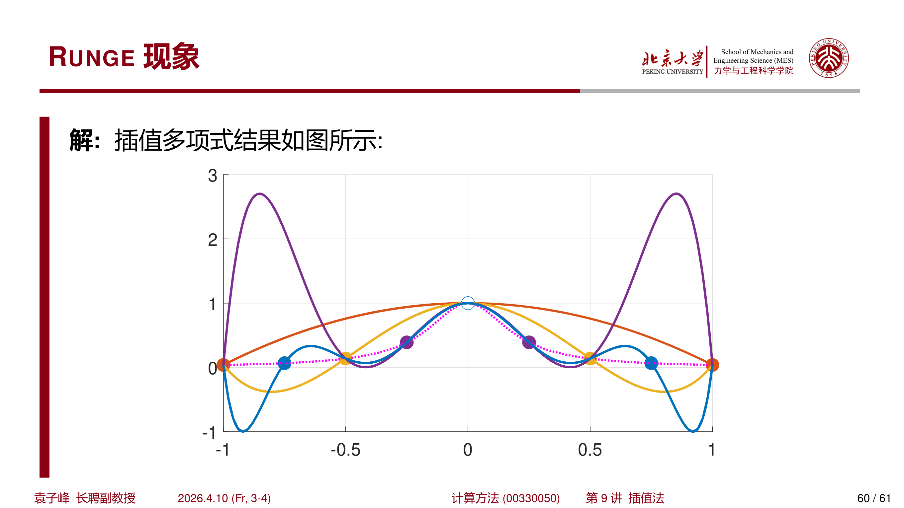
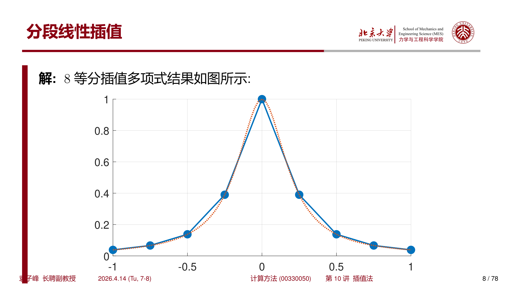
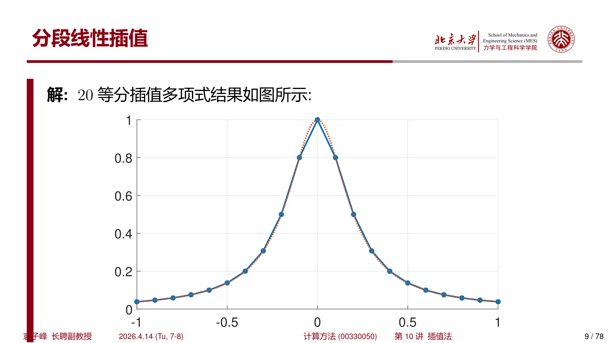
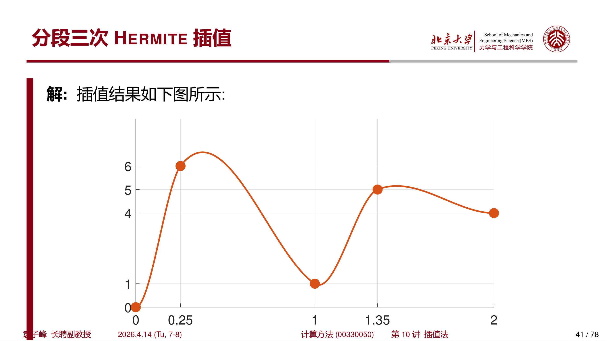
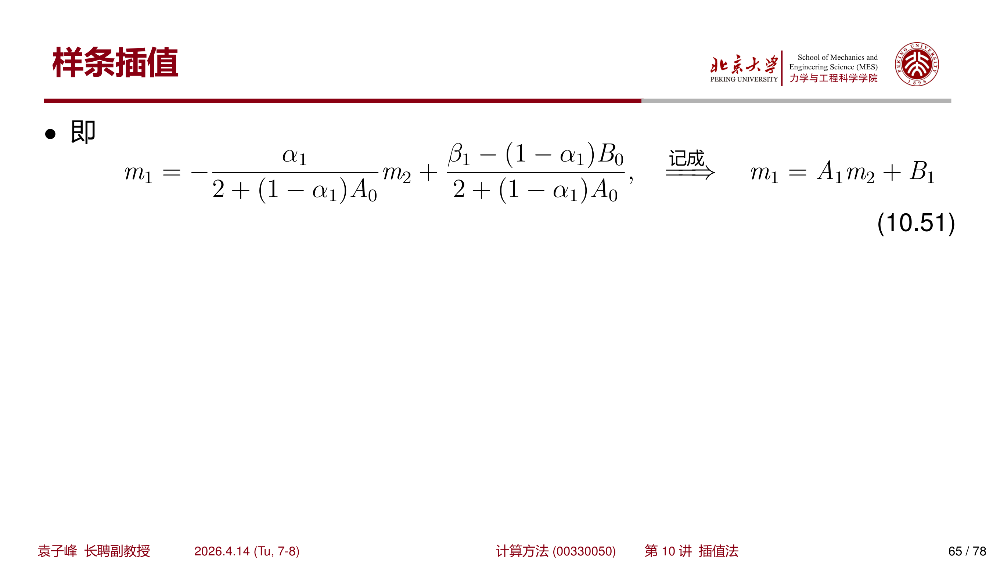
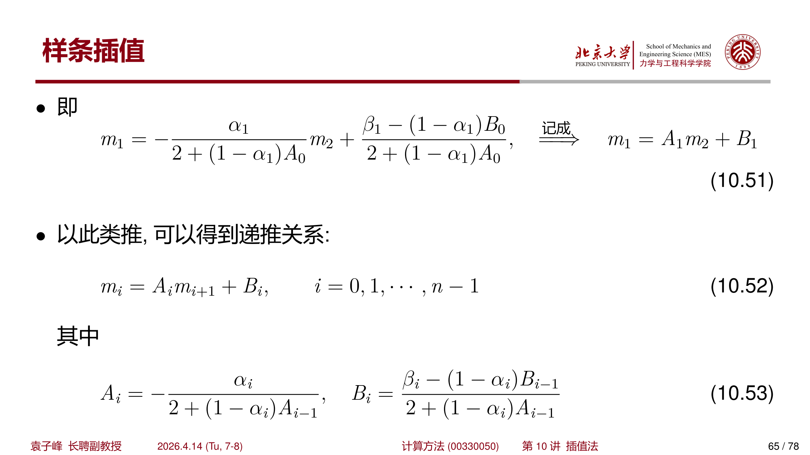
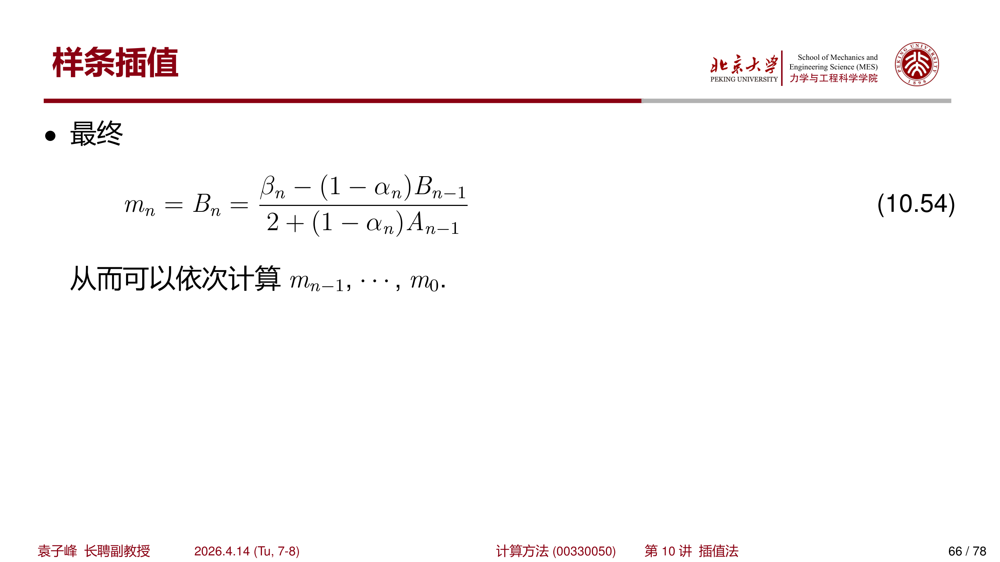

## 1 介绍

### 1.1 插值法的目的

插值的目的就是用简单函数（特别是多项式或分段多项式）为各种离散数组建立连续模型。

具体来说，在给定有限个点的函数值的情况下，寻求一个解析形式的函数 $\varphi(x)$（插值函数），近似地代替原函数 $f(x)$。

插值法拥有悠久的历史。早在公元 6 世纪，我国刘焯就将等距二次插值应用于天文计算。隋代刘焯（542—608 年）发明了二次等间距内插法用于测算每日中心差，其成就记载于《皇极历》中。

17 世纪，Newton 和 Gregory 建立了等距节点上的一般插值公式；18 世纪，Lagrange 给出了更一般的非等距节点上的插值公式。

### 1.2 代数插值的基本概念

给出 $n + 1$ 个点上的函数表：

$$
\begin{array}{c|cccc}
x & x_0 & x_1 & \cdots & x_n \\ \hline
y & y_0 & y_1 & \cdots & y_n
\end{array}
$$

要构造一个插值多项式 $\varphi_n(x)$ 满足：

- $\varphi_n(x)$ 是次数不超过 $n$ 的多项式；
- $\varphi_n(x_j) = f(x_j) = y_j,\quad j = 0, 1, \cdots, n$

将 $\varphi_n(x)$ 写成：

$$
\varphi_n(x) = a_0 + a_1 x + \cdots + a_n x^n
$$

根据 $\varphi_n(x_j) = f(x_j) = y_j$，获得线性方程组：

$$
\begin{cases}
a_0 + a_1 x_0 + a_2 x_0^2 + \cdots + a_n x_0^n = y_0 \\
a_0 + a_1 x_1 + a_2 x_1^2 + \cdots + a_n x_1^n = y_1 \\
\cdots \\
a_0 + a_1 x_n + a_2 x_n^2 + \cdots + a_n x_n^n = y_n
\end{cases}
$$

该线性方程组的系数行列式为 **Vandermonde 行列式**：

$$
\begin{vmatrix}
1 & x_0 & x_0^2 & \cdots & x_0^n \\
1 & x_1 & x_1^2 & \cdots & x_1^n \\
\vdots & \vdots & \vdots & & \vdots \\
1 & x_n & x_n^2 & \cdots & x_n^n
\end{vmatrix}
= \prod_{0 \leqslant j < i \leqslant n} (x_i - x_j)
$$

因此，当 $x_0, x_1, \cdots, x_n$ 两两不相等时，方程组有唯一解。

### 1.3 插值余项

插值多项式 $\varphi_n(x)$ 与被插函数 $f(x)$ 之间的差：

$$
R_n(x) = f(x) - \varphi_n(x)
$$

称为 **截断误差**，又称为 **插值余项**。这里假定 $f(x)$ 在区间 $[a, b]$ 上 $n + 1$ 次连续可导，即 $f(x) \in C^{n+1}[a,b]$。

!!! info "记号约定"
    所有在区间 $[a, b]$ 上 $k$ 次连续可微的函数记为 $C^k[a,b]$。特别地，$C^0[a,b]$ 又记为 $C[a,b]$，表示区间 $[a, b]$ 上所有连续函数的集合。

定义：

$$
\omega_{n+1}(x) \equiv \prod_{i=0}^{n} (x - x_i)
$$

!!! abstract "定理 1.1（插值余项定理）"
    设 $x_0, x_1, \cdots, x_n$ 是区间 $[a, b]$ 上的互异节点，$\varphi_n(x)$ 是过这组节点的 $n$ 次插值多项式。如果 $f(x) \in C^{n+1}[a,b]$，则对 $[a, b]$ 内任意点 $x$，插值余项为：

    $$
    R_n(x) = \frac{f^{(n+1)}(\xi)}{(n+1)!} \omega_{n+1}(x) = \frac{f^{(n+1)}(\xi)}{(n+1)!} (x - x_0)(x - x_1) \cdots (x - x_n),\quad \xi \in (a, b)
    $$

??? note "证明"
    构造辅助函数：

    $$
    \psi(t) = f(t) - \varphi_n(t) - \frac{R_n(x)}{\omega_{n+1}(x)} \omega_{n+1}(t)
    $$

    则 $\psi(t)$ 在 $x, x_0, x_1, \cdots, x_n$ 处均为零，即至少有 $n + 2$ 个零点。反复运用 Rolle 定理，最终可知 $\psi^{(n+1)}(t)$ 在 $(a, b)$ 内至少有一个零点 $\xi$，使得 $\psi^{(n+1)}(\xi) = 0$。

    由于 $\varphi_n^{(n+1)}(t) = 0$（$\varphi_n$ 为 $n$ 次多项式），且 $\omega_{n+1}^{(n+1)}(t) = (n+1)!$，可得：

    $$
    f^{(n+1)}(\xi) - \frac{R_n(x)}{\omega_{n+1}(x)} (n+1)! = 0
    $$

    从而 $R_n(x) = \dfrac{f^{(n+1)}(\xi)}{(n+1)!} \omega_{n+1}(x)$。 $\square$

---

## 2 Lagrange 插值

### 2.1 线性插值形式

考虑函数表：

$$
\begin{array}{c|cc}
x & x_0 & x_1 \\ \hline
y & y_0 & y_1
\end{array}
$$

此时 $n = 1$，插值函数 $\varphi_1(x) = a_0 + a_1 x$，由 $\varphi_1(x_0) = y_0$ 和 $\varphi_1(x_1) = y_1$ 解得：

$$
a_0 = \frac{x_1 y_0 - x_0 y_1}{x_1 - x_0},\quad a_1 = \frac{y_1 - y_0}{x_1 - x_0}
$$

整理后得到 Lagrange 线性插值公式：

$$
\varphi_1(x) = y_0 \frac{x - x_1}{x_0 - x_1} + y_1 \frac{x - x_0}{x_1 - x_0} \equiv y_0 l_0(x) + y_1 l_1(x)
$$

其中 $l_0(x)$ 和 $l_1(x)$ 称为 **一次插值基函数**：

$$
l_0(x) = \frac{x - x_1}{x_0 - x_1},\quad l_1(x) = \frac{x - x_0}{x_1 - x_0}
$$

一次插值基函数具有如下性质：

$$
l_i(x_j) = \delta_{ij} = \begin{cases} 1 & i = j \\ 0 & i \neq j \end{cases}
$$

### 2.2 一般形式

将 Lagrange 插值推广至 $n + 1$ 个点的情况。构造满足 $l_i(x_j) = \delta_{ij}$ 的 $n$ 次插值基函数 $l_i(x)$：

$$
l_i(x) = A_i \prod_{\substack{j=0 \\ j \neq i}}^{n} (x - x_j)
$$

由归一化条件 $l_i(x_i) = 1$ 确定 $A_i$，得到：

$$
l_i(x) = \prod_{\substack{j=0 \\ j \neq i}}^{n} \frac{x - x_j}{x_i - x_j}
$$

这里要求 $\{x_i\}_{i=0}^{n}$ 两两互异，这也是插值多项式存在且唯一的条件。

!!! info "Lagrange 基函数的性质"
    - $l_i(x_j) = \delta_{ij}$（克罗内克 $\delta$ 函数）
    - $\sum_{i=0}^{n} l_i(x) \equiv 1$（权函数性质）

于是 **Lagrange 形式插值公式** 为：

$$
\varphi_n(x) = \sum_{i=0}^{n} y_i l_i(x)
$$

???+ example "例 2.1：Lagrange 插值计算"
    根据节点 $x_0 = 2,\ x_1 = 2.5,\ x_2 = 4$，采用 Lagrange 插值计算 $f(x) = 1/x$ 的插值多项式，并计算 $f(3)$ 的近似值。

    **解：** 插值节点依次为 $(2, 0.5)$、$(2.5, 0.4)$、$(4, 0.25)$，插值多项式为：

    $$
    \varphi_2(x) = 0.5 \cdot \frac{(x-2.5)(x-4)}{(2-2.5)(2-4)} + 0.4 \cdot \frac{(x-2)(x-4)}{(2.5-2)(2.5-4)} + 0.25 \cdot \frac{(x-2)(x-2.5)}{(4-2)(4-2.5)} = 0.05x^2 - 0.425x + 1.15
    $$

    计算 $\varphi_2(3) = 0.325$。

    由于 $f'''(x) = -6/x^4$，有 $\max_{2 \leqslant \xi \leqslant 4} |f'''(\xi)| = |f'''(2)| = \dfrac{3}{8}$。

    根据余项公式，误差估计为：

    $$
    |R_2(3)| \leqslant \frac{3}{8} \cdot \frac{|(3-2)(3-2.5)(3-4)|}{6} = 0.03125
    $$

    实际误差为 $f(3) - \varphi_2(3) \approx 0.00833$。

### 2.3 算法与复杂度分析

#### 算法 2.1（Lagrange 插值，单点计算）

$$
\begin{aligned}
& \textbf{输入: } x_i, y_i,\ i = 0,1,\cdots,n;\quad \text{插值点 } x \\ 
& \textbf{输出: } \varphi_n(x) \\
& 1. \quad \phi \leftarrow 0 \\
& 2. \quad \textbf{for } i = 0, 1, \cdots, n \textbf{ do} \\
& 3. \quad \quad l \leftarrow 1 \\
& 4. \quad \quad \textbf{for } j = 0, 1, \cdots, n,\ j \neq i \textbf{ do} \\
& 5. \quad \quad \quad l \leftarrow l \cdot (x - x_j) / (x_i - x_j) \\
& 6. \quad \quad \textbf{end for} \\
& 7. \quad \quad \phi \leftarrow \phi + y_i \cdot l \\
& 8. \textbf{end for}
\end{aligned}
$$

该方法的时间复杂度为 $O(n^2)$。若需要在 $m$ 个点计算插值函数值，则达到 $O(mn^2)$。

#### 算法 2.2（面向多个插值点的 Lagrange 插值）

利用 $\omega_{n+1}(x) = \prod_{i=0}^{n} (x - x_i)$，插值基函数可写为：

$$
l_i(x) = \frac{\omega_{n+1}(x)}{(x - x_i) \omega_{n+1}'(x_i)}
$$

其中 $\omega_{n+1}'(x_i) = \prod_{j \neq i} (x_i - x_j)$ 可预先计算。

算法流程如下：

$$
\begin{aligned}
& \textbf{算法: } \text{MultiPointLagrange} \\
& \textbf{输入: } x_i, y_i,\ i = 0,1,\cdots,n;\quad \text{插值点 } x_k,\ k = 1,2,\cdots,m \\ 
& \textbf{输出: } \varphi_n(x_k),\ k = 1,2,\cdots,m \\
& 1. \quad \textbf{for } i = 0, 1, \cdots, n \textbf{ do} \\
& 2. \quad \quad w[i] \leftarrow 1 \\
& 3. \quad \quad \textbf{for } j = 0, 1, \cdots, n,\ j \neq i \textbf{ do} \\
& 4. \quad \quad \quad w[i] \leftarrow w[i] / (x_i - x_j) \\
& 5. \quad \quad \textbf{end for} \\
& 6. \quad \textbf{end for} \\
& 7. \quad \textbf{for } k = 1, 2, \cdots, m \textbf{ do} \\
& 8. \quad \quad \omega \leftarrow 1 \\
& 9. \quad \quad \textbf{for } i = 0, 1, \cdots, n \textbf{ do} \\
& 10. \quad \quad \quad \omega \leftarrow \omega \cdot (x_k - x_i) \\
& 11. \quad \quad \textbf{end for} \\
& 12. \quad \quad \phi[k] \leftarrow 0 \\
& 13. \quad \quad \textbf{for } i = 0, 1, \cdots, n \textbf{ do} \\
& 14. \quad \quad \quad \phi[k] \leftarrow \phi[k] + y_i \cdot \omega / (x_k - x_i) \cdot w[i] \\
& 15. \quad \quad \textbf{end for} \\
& 16. \quad \textbf{end for}
\end{aligned}
$$

该方法时间复杂度为 $O(mn)$（当 $m > n$ 时），其中第 1 至 6 行预处理复杂度为 $O(n^2)$，第 7 至 16 行计算复杂度为 $O(mn)$。

!!! warning "数值稳定性"
    该算法未考虑 $\omega / (x_k - x_i)$ 出现 $0 / 0$ 的情况。当 $x_k$ 与某个 $x_i$ 重合时，需特殊处理。

---

## 3 Newton 插值

### 3.1 线性插值形式

考虑两个节点的函数表，插值函数可整理为：

$$
\varphi_1(x) = f(x_0) + \frac{f(x_1) - f(x_0)}{x_1 - x_0} (x - x_0) = f(x_0) + f[x_1, x_0] (x - x_0)
$$

这里 $f[x_1, x_0]$ 称为 $f(x)$ 在节点 $x_1$ 与 $x_0$ 的 **一阶差商**。

### 3.2 差商（均差）

**$k$ 阶差商** 的定义为：

$$
f[x_0, x_1, \cdots, x_k] = \frac{f[x_0, x_1, \cdots, x_{k-1}] - f[x_1, x_2, \cdots, x_k]}{x_0 - x_k}
$$

差商具有以下性质：

- **线性性质**：若 $f(x) = \alpha \varphi(x) + \beta \psi(x)$，则 $f[x_0, \cdots, x_k] = \alpha \varphi[x_0, \cdots, x_k] + \beta \psi[x_0, \cdots, x_k]$
- **对称性**：差商中点的顺序对值无影响
- $k$ 阶差商可表示为函数值的线性组合：

$$
f[x_0, x_1, \cdots, x_k] = \sum_{i=0}^{k} \frac{f(x_i)}{\omega_k'(x_i)}
$$

其中 $\omega_k(x) = \prod_{i=0}^{k} (x - x_i)$

### 3.3 Newton 插值公式

根据差商表，可构造 $n$ 次 **Newton 形式插值公式**：

$$
\begin{aligned}
\varphi_n(x) = & \ f(x_0) + (x - x_0) f[x_0, x_1] + (x - x_0)(x - x_1) f[x_0, x_1, x_2] + \cdots \\
& + (x - x_0)(x - x_1) \cdots (x - x_{n-1}) f[x_0, x_1, \cdots, x_n]
\end{aligned}
$$

或等价地：

$$
\varphi_n(x) = \varphi_{n-1}(x) + (x - x_0)(x - x_1) \cdots (x - x_{n-1}) f[x_0, x_1, \cdots, x_n]
$$

Newton 形式的一个重要优点是：**每增加一个点，之前的插值函数表达式仍然保留**，只需计算新增项。相比之下，Lagrange 形式增加点时所有基函数都需要重新计算。

???+ example "例 3.1：Newton 插值"
    采用 Newton 插值形式，计算函数表：

    $$
    \begin{array}{c|ccccc}
    x & 0 & 1 & 2 & 1.5 & 0.5 \\ \hline
    y & 0 & 1 & 4 & 5 & 6
    \end{array}
    $$

    **解：** 建立均差表：

    $$
    \begin{array}{c|c|c|c|c|c}
    x & y & \text{一阶均差} & \text{二阶均差} & \text{三阶均差} & \text{四阶均差} \\ \hline
    0 & 0 & & & & \\
    1 & 1 & 1 & & & \\
    2 & 4 & 3 & 1 & & \\
    1.5 & 5 & -2 & -10 & -22/3 & \\
    0.5 & 6 & -1 & -2/3 & -56/3 & -68/3
    \end{array}
    $$

    最终得到 Newton 插值多项式：

    $$
    \varphi_4(x) = 0 + 1 \cdot x + 1 \cdot x(x-1) - \frac{22}{3} x(x-1)(x-2) - \frac{68}{3} x(x-1)(x-2)(x-1.5)
    $$

### 3.4 算法与复杂度分析

#### 算法 3.1（Newton 插值）

$$
\begin{aligned}
& \textbf{输入: } x_i, y_i,\ i = 0,1,\cdots,n;\quad \text{插值点 } x \\ 
& \textbf{输出: } \varphi_n(x) \\
& 1. \quad \textbf{for } k = 0, 1, \cdots, n \textbf{ do} \\
& 2. \quad \quad f[k] \leftarrow y[k] \quad \text{（初始化 0 阶差商）} \\
& 3. \quad \textbf{end for} \\
& 4. \quad \phi \leftarrow y[0] \\
& 5. \quad \omega \leftarrow 1 \\
& 6. \quad \textbf{for } i = 1, \cdots, n \textbf{ do} \\
& 7. \quad \quad \omega \leftarrow \omega \cdot (x - x[i]) \\
& 8. \quad \quad \textbf{for } k = n, n-1, \cdots, i \textbf{ do} \\
& 9. \quad \quad \quad f[k] \leftarrow (f[k-1] - f[k]) / (x[k-i] - x[k]) \\
& 10. \quad \quad \textbf{end for} \\
& 11. \quad \quad \phi \leftarrow \phi + f[i] \cdot \omega \\
& 12. \textbf{end for}
\end{aligned}
$$

该方法的时间复杂度为 $O(n^2)$。

---

## 4 Runge 现象

对于 $n$ 次多项式插值，节点数量变多未必能保证更好地逼近原函数。20 世纪初，Runge 指出了这种多项式插值的缺点。

???+ example "例 4.1：Runge 现象"
    给定函数：

    $$
    f(x) = \frac{1}{1 + 25x^2},\quad -1 \leqslant x \leqslant 1
    $$

    将区间 8 等分，计算插值多项式。

{ width="750" }

如图所示，在区间端点附近，插值多项式出现了明显的振荡，而加密节点并不能消除这一现象。

!!! tip "Runge 现象的启示"
    - 加密插值节点并不一定能保证插值多项式 $\varphi_n(x)$ 很好地逼近 $f(x)$
    - 多项式插值无法确保两个测量节点之间函数的凹凸性
    - 在实际应用中大多采用 **分段低次插值** ，而非高次插值

### 4.2 收敛区域的势理论分析

龙格现象的收敛区域分析，本质上是研究多项式插值误差项在 $n \to \infty$ 时的渐近行为，需要借助复变函数中的 **势理论（Potential Theory）**。

#### 误差的复积分表示

假设在区间 $[-1, 1]$ 上取 $n+1$ 个等距节点 $x_k$ 对解析函数 $f(z)$ 进行插值。根据 **埃尔米特插值误差公式**，插值多项式 $P_n(z)$ 与原函数的误差可表示为：

$$
f(z) - P_n(z) = \frac{1}{2\pi i} \int_{\Gamma} \frac{\omega_{n+1}(z)}{\omega_{n+1}(t)} \cdot \frac{f(t)}{t - z} \, dt
$$

其中 $\omega_{n+1}(z) = \prod_{k=0}^{n} (z - x_k)$ 是节点多项式，$\Gamma$ 是包围插值区间且不包含 $f(t)$ 奇点的闭曲线。

**收敛的关键：** 若当 $n \to \infty$ 时 $\left| \dfrac{\omega_{n+1}(z)}{\omega_{n+1}(t)} \right| \to 0$，则误差趋于零，插值收敛。

??? note "埃尔米特误差公式的推导"
    利用柯西积分公式和多项式性质可优雅地导出该公式。

    对解析函数 $f(z)$，柯西积分公式给出：

    $$
    f(z) = \frac{1}{2\pi i} \oint_{\Gamma} \frac{f(t)}{t - z} \, dt
    $$

    引入代数恒等变形：

    $$
    \frac{1}{t - z} = \frac{\omega_{n+1}(t) - \omega_{n+1}(z)}{\omega_{n+1}(t)(t - z)} + \frac{\omega_{n+1}(z)}{\omega_{n+1}(t)(t - z)}
    $$

    代入积分并分解为两部分 $I_1 + I_2$：

    - **$I_1$ 部分**：$Q(t, z) = \dfrac{\omega_{n+1}(t) - \omega_{n+1}(z)}{t - z}$ 是关于 $z$ 的 $n$ 次多项式，且满足 $I_1(z_k) = f(z_k)$，因此 $I_1 = P_n(z)$
    - **$I_2$ 部分**：即误差项 $R_n(z) = \dfrac{\omega_{n+1}(z)}{2\pi i} \oint_{\Gamma} \dfrac{f(t)}{\omega_{n+1}(t)(t-z)} \, dt$

    从留数定理角度看，积分在节点 $t = z_k$ 和目标点 $t = z$ 处有极点，两者留数的抵消关系正好给出 $f(z) - P_n(z)$。 $\square$

#### 节点多项式的对数势分析

为处理积 $\omega_{n+1}(z) = \prod_{k=0}^{n} (z - x_k)$，取对数转化为累加和：

$$
\frac{1}{n+1} \ln |\omega_{n+1}(z)| \approx \int_{-1}^{1} \ln |z - x| \cdot \rho(x) \, dx
$$

其中 $\rho(x) = \dfrac{1}{2}$ 是等距节点在 $[-1,1]$ 上的均匀分布密度。

定义 **势函数 (Potential Function)**：

$$
V(z) = \int_{-1}^{1} \ln |z - x| \cdot \rho(x) \, dx = \frac{1}{2} \int_{-1}^{1} \ln |z - x| \, dx
$$

对于龙格函数 $f(z) = \dfrac{1}{1 + 25z^2}$，其极点位于 $z = \pm \dfrac{i}{5}$，距离实轴仅 $0.2$ 单位。

收敛区域由不等式 $V(z) < V\left(\dfrac{i}{5}\right)$ 决定。数值计算表明，等势线与实轴的交点约为 $x \approx \pm 0.726$。

!!! info "收敛区域结论"
    - **收敛区**：$x \in (-0.726, 0.726)$，当 $n \to \infty$ 时插值误差趋于零
    - **龙格区域**：$0.726 < |x| \leqslant 1$，当 $n \to \infty$ 时误差发散

直观理解：等距采样的势能分布在区间边缘（$|x| \to 1$）极高，意味着节点对该区域的控制力极弱。奇点 $i/5$ 距离实轴仅 $0.2$，其产生的扰动在势能高的边缘区域被剧烈放大，导致震荡。

#### 切比雪夫节点的优势

若采用 **切比雪夫节点** $x_k = \cos\left(\dfrac{(2k+1)\pi}{2(n+1)}\right)$，其分布密度为：

$$
\rho(x) = \frac{1}{\pi \sqrt{1 - x^2}}
$$

此时势函数 $V(z)$ 在整个 $[-1,1]$ 区间上恒为**最小值**，等势线与椭圆族重合。从而切比雪夫插值在整个区间内都能保证收敛，**彻底消除龙格现象**。

这正是在实际应用中偏好使用切比雪夫节点或自适应节点选择的原因。

---

## 5 分段线性插值

### 5.1 基本概念

在区间 $[a, b]$ 上，假设节点为 $a = x_0 < x_1 < \cdots < x_n = b$，分段线性插值函数 $\varphi(x)$ 满足：

- $\varphi(x_i) = y_i,\quad i = 0, 1, \cdots, n$
- $\varphi(x)$ 在每个小区间 $[x_i, x_{i+1}]$ 上是一次多项式函数

直观上，分段线性插值函数是一系列经过 $(x_i, y_i)$ 的 **连续折线**。

### 5.2 基函数构造

分段线性插值可通过基函数 $l_j(x)$ 构造： ==注意每一个 $l_j(x)$ 的定义域！==

$$
l_0(x) = \begin{cases} \dfrac{x - x_1}{x_0 - x_1}, & x \in [x_0, x_1] \\ 0, & x \in (x_1, x_n] \end{cases}
$$

$$
l_j(x) = \begin{cases} \dfrac{x - x_{j-1}}{x_j - x_{j-1}}, & x \in [x_{j-1}, x_j] \\ \dfrac{x - x_{j+1}}{x_j - x_{j+1}}, & x \in (x_j, x_{j+1}] \\ 0, & \text{otherwise} \end{cases},\quad 1 \leqslant j \leqslant n-1
$$

$$
l_n(x) = \begin{cases} \dfrac{x - x_{n-1}}{x_n - x_{n-1}}, & x \in [x_{n-1}, x_n] \\ 0, & x \in [x_0, x_{n-1}) \end{cases}
$$

分段线性插值函数为：

$$
\varphi_n(x) = \sum_{j=0}^{n} y_j l_j(x)
$$

???+ example "例 5.1：分段线性插值"
    给定 $f(x) = \dfrac{1}{1+25x^2},\ -1 \leqslant x \leqslant 1$，分别采用 8 等分和 20 等分的分段线性插值。

{ width="550" }

{ width="550" }

### 5.3 误差估计

!!! abstract "定理 5.1（分段线性插值误差估计）"
    假设区间 $[a, b]$ 内给定节点 $a = x_0 < x_1 < \cdots < x_n = b$ 及相应的函数值 $y_i = f(x_i)$，$f(x)$ 在 $[a, b]$ 上二阶连续可微。$\varphi_n(x)$ 是分段线性插值函数，则：

    $$
    |R_n(x)| \equiv |f(x) - \varphi_n(x)| \leqslant \frac{h^2}{8} M
    $$

    其中 $h = \max_{0 \leqslant i \leqslant n-1} |x_{i+1} - x_i|$，$M = \max_{a \leqslant x \leqslant b} |f''(x)|$。

当 $h \to 0$ 时，误差趋于零。但分段线性插值 **无法保证导数在节点处的连续性**。

---

## 6 Hermite 插值

### 6.1 两个节点的 Hermite 插值

分段线性插值虽然克服了高阶多项式的一些问题，但其导函数整体不连续。为提高曲线整体光滑性，引入 **Hermite 插值法** （带指定微商值的插值）。

给定两个点 $x_0$ 与 $x_1$ 及其函数值 $y_0,\ y_1$ 和导数值 $y_0',\ y_1'$，构造 Hermite 插值函数 $H(x)$，满足：

- $H(x)$ 是不超过三次的多项式函数
- $H(x_0) = y_0,\ H(x_1) = y_1,\ H'(x_0) = y_0',\ H'(x_1) = y_1'$

构造四个基函数 $h_0(x),\ h_1(x),\ H_0(x),\ H_1(x)$：

$$
\begin{aligned}
& h_0(x_0) = 1,\ h_0(x_1) = 0,\ h_0'(x_0) = 0,\ h_0'(x_1) = 0 \\
& h_1(x_0) = 0,\ h_1(x_1) = 1,\ h_1'(x_0) = 0,\ h_1'(x_1) = 0 \\
& H_0(x_0) = 0,\ H_0(x_1) = 0,\ H_0'(x_0) = 1,\ H_0'(x_1) = 0 \\
& H_1(x_0) = 0,\ H_1(x_1) = 0,\ H_1'(x_0) = 0,\ H_1'(x_1) = 1
\end{aligned}
$$

Hermite 插值函数为：

$$
H(x) = y_0 h_0(x) + y_1 h_1(x) + y_0' H_0(x) + y_1' H_1(x)
$$

这些基函数的显式形式为：

$$
\begin{aligned}
h_0(x) & = \left(1 + 2\frac{x - x_0}{x_1 - x_0}\right) \left(\frac{x - x_1}{x_0 - x_1}\right)^2 \\
h_1(x) & = \left(1 + 2\frac{x - x_1}{x_0 - x_1}\right) \left(\frac{x - x_0}{x_1 - x_0}\right)^2 \\
H_0(x) & = (x - x_0) \left(\frac{x - x_1}{x_0 - x_1}\right)^2 \\
H_1(x) & = (x - x_1) \left(\frac{x - x_0}{x_1 - x_0}\right)^2
\end{aligned}
$$

!!! abstract "定理 6.1（Hermite 插值余项）"
    设 $H(x)$ 是过 $x_0, x_1$ 的 Hermite 插值多项式，$f(x) \in C^4[a,b]$，则对任意 $x \in [a,b]$：

    $$
    R(x) = f(x) - H(x) = \frac{f^{(4)}(\xi)}{4!} (x - x_0)^2 (x - x_1)^2
    $$

    且 $|R(x)| \leqslant \dfrac{h^4}{384} M_4$，其中 $h = x_1 - x_0$，$M_4 = \max_{a \leqslant x \leqslant b} |f^{(4)}(x)|$。

???+ example "例 6.1：Hermite 插值"
    给定 $f(x)$ 的函数表：

    $$
    \begin{array}{c|ccc}
    x & 1 & 2 & 3 \\ \hline
    y & 2 & 4 & 12 \\
    y' & 3 & \text{（待定} m_1 \text{）} & -
    \end{array}
    $$

    求满足插值条件 $P(x_i) = y_i\ (i=0,1,2)$ 及 $P'(x_1) = m_1$ 的不高于三次多项式。

    **解：** 构造基函数并求解，得到：

    $$
    P(x) = \frac{1}{2}(x-2)^2(3-x) \cdot 2 - (x-1)(x-3) \cdot 4 + \frac{1}{2}(x-1)(x-2)^2 \cdot 12 - (x-1)(x-2)(x-3) \cdot 3 = 2x^3 - 9x^2 + 15x - 6
    $$

### 6.2 分段三次 Hermite 插值

$n + 1$ 个节点的 Hermite 插值多项式依赖于基函数 $l_i(x)$，实际上也引入了高阶多项式插值的弊端。因此，实际使用中往往采用 **分段三次 Hermite 插值**，保证全局函数具有一阶导数连续性。

给定函数表：

$$
\begin{array}{c|cccc}
x & x_0 & x_1 & \cdots & x_n \\ \hline
y & y_0 & y_1 & \cdots & y_n \\ \hline
y' & m_0 & m_1 & \cdots & m_n
\end{array}
$$

分段三次 Hermite 插值函数 $H(x)$ 满足：

- $H(x_i) = y_i,\ H'(x_i) = m_i\ (i = 0, 1, \cdots, n)$
- 在每个小区间 $[x_i, x_{i+1}]$ 上是不超过三次的多项式

基函数 $h_i(x)$ 和 $H_i(x)$ 定义如下（以区间 $[x_{i-1}, x_i]$ 和 $[x_i, x_{i+1}]$ 为支撑）：

$$
\begin{aligned}
h_0(x) & = \begin{cases} \left(1 + 2\frac{x - x_0}{x_1 - x_0}\right) \left(\frac{x - x_1}{x_0 - x_1}\right)^2, & x \in [x_0, x_1] \\ 0, & \text{otherwise} \end{cases} \\
h_n(x) & = \begin{cases} \left(1 + 2\frac{x - x_n}{x_{n-1} - x_n}\right) \left(\frac{x - x_{n-1}}{x_n - x_{n-1}}\right)^2, & x \in [x_{n-1}, x_n] \\ 0, & \text{otherwise} \end{cases} \\
h_i(x) & = \begin{cases} \left(1 + 2\frac{x - x_i}{x_{i-1} - x_i}\right) \left(\frac{x - x_{i-1}}{x_i - x_{i-1}}\right)^2, & x \in [x_{i-1}, x_i] \\ \left(1 + 2\frac{x - x_i}{x_{i+1} - x_i}\right) \left(\frac{x - x_{i+1}}{x_i - x_{i+1}}\right)^2, & x \in [x_i, x_{i+1}] \\ 0, & \text{otherwise} \end{cases},\quad 1 \leqslant i \leqslant n-1
\end{aligned}
$$

$$
\begin{aligned}
H_0(x) & = \begin{cases} (x - x_0) \left(\frac{x - x_1}{x_0 - x_1}\right)^2, & x \in [x_0, x_1] \\ 0, & \text{otherwise} \end{cases} \\
H_n(x) & = \begin{cases} (x - x_n) \left(\frac{x - x_{n-1}}{x_n - x_{n-1}}\right)^2, & x \in [x_{n-1}, x_n] \\ 0, & \text{otherwise} \end{cases} \\
H_i(x) & = \begin{cases} (x - x_i) \left(\frac{x - x_{i-1}}{x_i - x_{i-1}}\right)^2, & x \in [x_{i-1}, x_i] \\ (x - x_i) \left(\frac{x - x_{i+1}}{x_i - x_{i+1}}\right)^2, & x \in [x_i, x_{i+1}] \\ 0, & \text{otherwise} \end{cases},\quad 1 \leqslant i \leqslant n-1
\end{aligned}
$$

分段三次 Hermite 插值公式为：

$$
H(x) = \sum_{i=0}^{n} \left(y_i h_i(x) + m_i H_i(x)\right)
$$

!!! abstract "定理 6.2（分段三次 Hermite 插值误差）"
    设 $H(x)$ 是分段三次 Hermite 插值函数，$f(x) \in C^4[a,b]$，则对任意 $x \in [a,b]$：

    $$
    |R(x)| = |f(x) - H(x)| \leqslant \frac{h^4 M_4}{384}
    $$

    其中 $h = \max_i (x_{i+1} - x_i)$，$M_4 = \max_{a \leqslant x \leqslant b} |f^{(4)}(x)|$。

???+ example "例 6.2：分段三次 Hermite 插值"
    基于函数表：

    $$
    \begin{array}{c|ccccc}
    x & 0 & 0.25 & 1.0 & 1.35 & 2.0 \\ \hline
    y & 0 & 6.0 & 1.0 & 5.0 & 4.0 \\ \hline
    y' & 0 & 10.0 & -5.0 & 3.0 & 0.0
    \end{array}
    $$

    分段三次 Hermite 插值结果如下：

{ width="550" }

### 6.3 Hermite 插值的一般形式

Hermite 插值可推广至多个节点情形。给定 $n+1$ 个节点及其函数值和导数值，构造次数不超过 $2n+1$ 的 Hermite 插值多项式 $H(x)$：

$$
H(x_i) = y_i,\quad H'(x_i) = m_i,\quad i = 0, 1, \cdots, n
$$

设 $\omega_n(x) = \prod_{i=0}^{n} (x - x_i)$，$l_i(x)$ 为相应的 Lagrange 基函数，则 Hermite 基函数为：

$$
h_i(x) = \left(1 - \frac{\omega_n''(x_i)}{\omega_n'(x_i)} (x - x_i)\right) l_i^2(x),\quad H_i(x) = (x - x_i) l_i^2(x)
$$

Hermite 插值多项式为：

$$
H(x) = \sum_{i=0}^{n} \left(y_i h_i(x) + m_i H_i(x)\right)
$$

---

## 7 样条插值

### 7.1 背景与定义

实际应用中，很多情况需要有二阶光滑度（具有二阶连续导数），如飞机机翼形线、船体放样形值线、精密机械加工等。

**样条（Spline）**  是早期飞机、造船工作中绘图员用来画光滑曲线的细木条或细金属丝。数学上仿此得出的函数称为 **样条函数**。

!!! info "样条函数"
    样条函数是一种分段多项式函数，具有一定程度的光滑性。"Spline" 一词源于造船业中用压铁固定弹性木条画光滑曲线的工艺。

### 7.2 三次样条插值问题

在区间 $[a, b]$ 上取 $n + 1$ 个节点 $a = x_0 < x_1 < \cdots < x_n = b$，给定函数值 $f(x_i) = y_i$。构造三次样条插值函数 $s(x)$，满足：

1. $s(x_i) = y_i,\quad i = 0, 1, \cdots, n$
2. 在每个小区间 $[x_i, x_{i+1}]$ 上是不超过三次的多项式
3. $s(x) \in C^2[a,b]$（二阶导数连续）

### 7.3 样条插值函数构造

利用三次 Hermite 插值，在区间 $[x_i, x_{i+1}]$ 上的样条插值函数为：

$$
\begin{aligned}
s(x) = & \left(1 + 2\frac{x - x_i}{x_{i+1} - x_i}\right) \left(\frac{x - x_{i+1}}{x_i - x_{i+1}}\right)^2 y_i \\
& + \left(1 + 2\frac{x - x_{i+1}}{x_i - x_{i+1}}\right) \left(\frac{x - x_i}{x_{i+1} - x_i}\right)^2 y_{i+1} \\
& + (x - x_i) \left(\frac{x - x_{i+1}}{x_i - x_{i+1}}\right)^2 m_i + (x - x_{i+1}) \left(\frac{x - x_i}{x_{i+1} - x_i}\right)^2 m_{i+1}
\end{aligned}
$$

其中 $m_i$ 为 $x_i$ 处的导数值（未知）。

设 $h_i = x_{i+1} - x_i$，对 $s(x)$ 求二阶导数，在 $x_i$ 处左右极限分别为：

$$
s''(x_i^-) = \frac{6}{h_{i-1}^2} y_{i-1} - \frac{6}{h_{i-1}^2} y_i + \frac{2}{h_{i-1}} m_{i-1} + \frac{4}{h_{i-1}} m_i
$$

$$
s''(x_i^+) = -\frac{6}{h_i^2} y_i + \frac{6}{h_i^2} y_{i+1} - \frac{4}{h_i} m_i - \frac{2}{h_i} m_{i+1}
$$

由 $s''(x_i^-) = s''(x_i^+)$ 得到关于 $m_{i-1}, m_i, m_{i+1}$ 的方程：

$$
(1 - \alpha_i) m_{i-1} + 2 m_i + \alpha_i m_{i+1} = \beta_i,\quad i = 1, 2, \cdots, n-1
$$

其中：

$$
\alpha_i = \frac{h_{i-1}}{h_{i-1} + h_i},\quad \beta_i = 3\left((1 - \alpha_i) \frac{y_i - y_{i-1}}{h_{i-1}} + \alpha_i \frac{y_{i+1} - y_i}{h_i}\right)
$$

### 7.4 边界条件

上述方程组有 $n+1$ 个未知数 $m_0, m_1, \cdots, m_n$，但仅有 $n-1$ 个方程，需要补充边界条件。

**固支边界条件**：已知端点导数值 $f'(x_0) = m_0$ 和 $f'(x_n) = m_n$

**自然边界条件**：端点二阶导数值为 $0$，即 $s''(x_0) = s''(x_n) = 0$

**周期边界条件**：$f(x_0) = f(x_n)$，$f'(x_0) = f'(x_n)$，$f''(x_0) = f''(x_n)$

!!! tip "追赶法求解"
    对于自然边界条件，可采用 **追赶法** 高效求解三对角线性方程组：

    由 $m_0 = -\dfrac{\alpha_0}{2} m_1 + \dfrac{\beta_0}{2}$ 出发，递推计算：

    $$
    m_i = -\frac{\alpha_i}{2 + (1 - \alpha_i) A_{i-1}} m_{i+1} + \frac{\beta_i - (1 - \alpha_i) B_{i-1}}{2 + (1 - \alpha_i) A_{i-1}}
    $$

    最终反向回代得到所有 $m_i$。

!!! abstract "定理 7.1（样条插值收敛性）"
    如果被插函数 $f(x) \in C^4[a,b]$，$s(x)$ 是三次样条插值函数，且在端点处满足 $s'(x_i) = f'(x_i)$，$s''(x_i) = f''(x_i)$，则在整个插值区域 $[a,b]$ 上有：

    $$
    |f^{(k)}(x) - s^{(k)}(x)| \leqslant C_k M_4 h^{4-k},\quad k = 0, 1, 2, 3
    $$

    其中 $M_4 = \max_{a \leqslant x \leqslant b} |f^{(4)}(x)|$，$h = \max_i h_i$。

    当 $h \to 0$ 时，$s(x) \to f(x)$，$s'(x) \to f'(x)$，$s''(x) \to f''(x)$。

???+ example "例 7.1：三次样条插值"
    给定函数表：

    $$
    \begin{array}{c|cccc}
    x & 0 & 1 & 3 & 4 \\ \hline
    y & 0 & 1 & 5 & 0
    \end{array}
    $$

    分别采用固支边界条件、自然边界条件、周期边界条件计算样条插值曲线。

{ width="550" }

{ width="550" }

{ width="550" }

---

## 8 拓展话题：Bézier 曲线与字体设计

**Bézier 曲线** 是由法国雷诺汽车公司的 P. Bézier 于 20 世纪 70 年代初为解决汽车外型设计问题而提出的一种曲线表示法。

!!! abstract "定义 8.1（Bézier 曲线）"
    给定点列 $\{P_i\},\ i = 0, 1, 2, \cdots, n$。$n$ 次 Bézier 曲线定义为：

    $$
    P(t) = \sum_{i=0}^{n} P_i B_{i,n}(t),\quad 0 \leqslant t \leqslant 1
    $$

    其中基函数 $\{B_{i,n}(t)\}$ 为 $n$ 次 **Bernstein 多项式**：

    $$
    B_{i,n}(t) = \binom{n}{i} t^i (1-t)^{n-i}
    $$

    $\{P_i\}$ 称为 Bézier 曲线的**控制点**。

Bernstein 基函数具有如下性质：

- $B_{i,n}(t) \geqslant 0$（非负性）
- $\sum_{i=0}^{n} B_{i,n}(t) \equiv 1$（权函数性质）
- $B_{i,n}(0) = \delta_{i0}$，$B_{i,n}(1) = \delta_{in}$（端点插值）

!!! info "Bézier 曲线与字体设计"
    在 SVG（可缩放矢量图形）格式中，Bézier 曲线被广泛用于字体设计。例如：

    - 命令 `C x1 y1, x2 y2, x y` 用于绘制三次贝塞尔曲线
    - 命令 `Q x1 y1, x y` 用于绘制二次贝塞尔曲线
    - 命令 `T x y` 用于绘制光滑连续的二次贝塞尔曲线（控制点自动定义为前一点关于当前起点的中心对称）

现代计算机字体（如 TrueType、PostScript）均基于 Bézier 曲线构建，这使得字体可以无损缩放到任意大小。

---

## 9 总结

### 9.1 各类插值方法对比

| 方法 | 连续性 | 导数连续性 | 计算复杂度 | 适用范围 |
|------|--------|-----------|-----------|---------|
| Lagrange 插值 | $C^\infty$ | — | $O(n^2)$ | 理论分析，节点较少时 |
| Newton 插值 | $C^\infty$ | — | $O(n^2)$ | 节点逐步增加时 |
| 分段线性插值 | $C^0$ | 不连续 | $O(n)$ | 大规模数据可视化 |
| 分段三次 Hermite | $C^1$ | 连续 | $O(n)$ | 需要指定导数值时 |
| 三次样条插值 | $C^2$ | 二阶连续 | $O(n)$ + 求解线性方程组 | 精密曲线设计 |

### 9.2 核心公式汇总

**Lagrange 插值基函数**：

$$
l_i(x) = \prod_{\substack{j=0 \\ j \neq i}}^{n} \frac{x - x_j}{x_i - x_j}
$$

**Newton 插值公式**：

$$
\varphi_n(x) = f(x_0) + \sum_{k=1}^{n} f[x_0, x_1, \cdots, x_k] \prod_{j=0}^{k-1} (x - x_j)
$$

**插值余项**：

$$
R_n(x) = \frac{f^{(n+1)}(\xi)}{(n+1)!} \omega_{n+1}(x)
$$

**分段线性插值误差界**：

$$
|f(x) - \varphi(x)| \leqslant \frac{h^2}{8} M_2
$$

**分段三次 Hermite 误差界**：

$$
|f(x) - H(x)| \leqslant \frac{h^4}{384} M_4
$$
