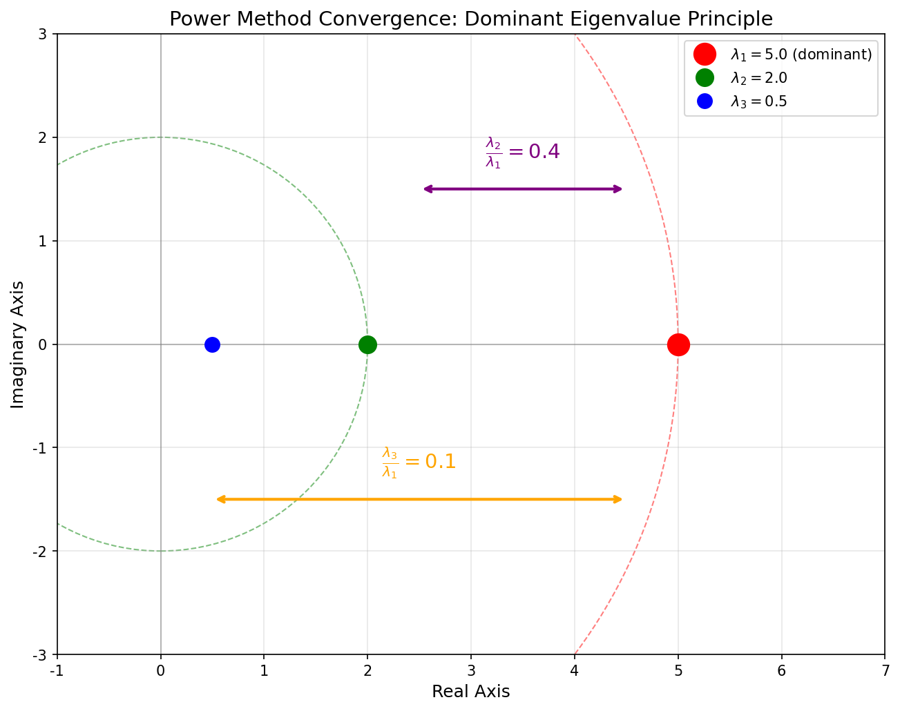
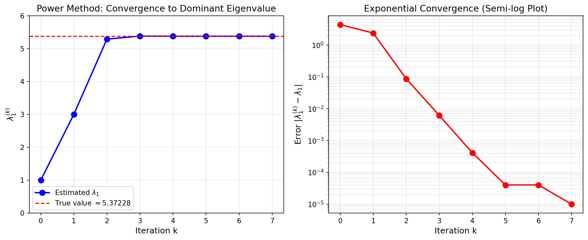
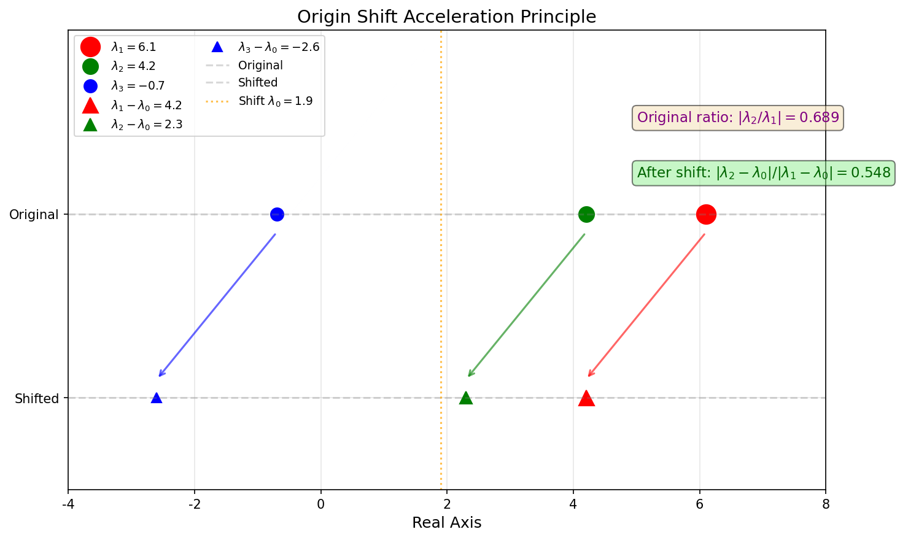
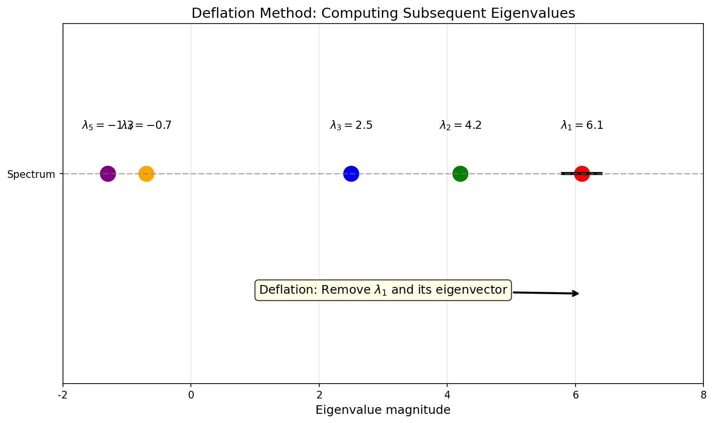
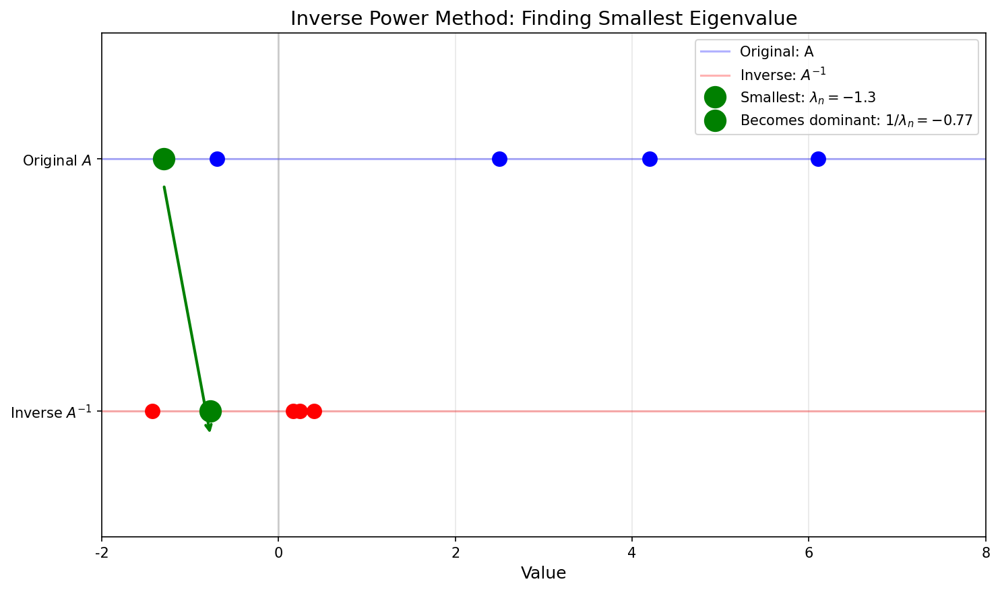
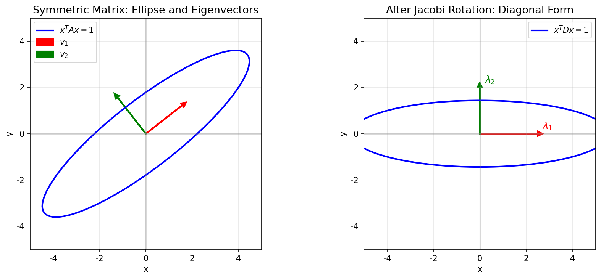

## 1 问题简介

### 1.1 特征值问题的背景

特征值问题在工程和物理中有广泛应用。以弹簧-质点系统的共振问题为例：

$$
M \ddot{y} + Ky = 0
$$

假设系统以自然频率 $\omega$ 做谐波振动，即 $y_j(t) = x_j \exp(i \omega t)$，代入后得到特征值问题：

$$
Kx = \omega^2 M x \quad \Rightarrow \quad Ax = \lambda x
$$

其中 $\lambda = \omega^2$。求解系统的自然频率等价于求解矩阵的 **特征值**。

### 1.2 基本概念

!!! abstract "定义 1.1（特征多项式与特征值）"
    设矩阵 $A \in \mathbb{R}^{n \times n}$，称

    $$
    \varphi(\lambda) = \det(\lambda I - A) = \lambda^n + c_1 \lambda^{n-1} + \cdots + c_{n-1}\lambda + c_n
    $$

    为 $A$ 的 **特征多项式**；$n$ 次代数方程 $\varphi(\lambda) = 0$ 为 $A$ 的 **特征方程**，其 $n$ 个根 $\lambda_1, \lambda_2, \ldots, \lambda_n$ 被称为 $A$ 的 **特征值**。

!!! abstract "定义 1.2（特征向量与特征子空间）"
    对于矩阵 $A$ 的一个特征值 $\lambda$，对应的齐次线性方程组

    $$
    (\lambda I - A)x = 0
    $$

    有非零解，其解向量 $x$ 称为矩阵 $A$ 对应于 $\lambda$ 的 **特征向量**。同一个特征值对应的特征向量构成线性子空间，称为 **特征子空间**（eigenspace）。

### 1.3 特征值的基本性质

!!! abstract "定理 1.1（特征值的基本关系）"
    设 $\lambda_i$，$i = 1, 2, \ldots, n$ 为 $A \in \mathbb{R}^{n \times n}$ 的特征值，则：

    $$
    \sum_{j=1}^{n} \lambda_j = \sum_{j=1}^{n} a_{jj} = \operatorname{tr}(A)
    $$

    $$
    \prod_{j=1}^{n} \lambda_j = \det(A)
    $$

    这里 $\operatorname{tr}(A)$ 表示矩阵对角线元素之和，称为矩阵的 **迹**（trace）。

!!! abstract "定理 1.2（相似变换不改变特征值）"
    矩阵的相似变换不改变特征值。设矩阵 $A$ 与 $B$ 为相似矩阵，即存在非奇异矩阵 $X$ 使得 $B = X^{-1}AX$，则：

    1. 矩阵 $A$ 和 $B$ 的特征值相同，即 $\lambda(A) = \lambda(B)$
    2. 若 $y$ 是 $B$ 的特征向量，则 $Xy$ 为 $A$ 的特征向量

!!! abstract "定理 1.3（矩阵运算的特征值）"
    设 $\lambda_i$，$i = 1, 2, \ldots, n$ 为矩阵 $A$ 的特征值，则：

    - 矩阵 $cA$（$c$ 为常数）的特征值为 $c\lambda_i$
    - 矩阵 $A + cI$（$c$ 为常数）的特征值为 $\lambda_i + c$
    - 矩阵 $A^k$（$k$ 为正整数）的特征值为 $\lambda_i^k$
    - 若 $p(x)$ 为多项式函数，则矩阵 $p(A)$ 的特征值为 $p(\lambda_i)$
    - 若 $A$ 非奇异，则 $A^{-1}$ 的特征值为 $\lambda_i^{-1}$

!!! abstract "定理 1.4（分块三角矩阵的特征值）"
    如果矩阵 $A$ 是 **分块对角矩阵**，或者 **分块上（下）三角矩阵**，例如分块上三角矩阵可以写成：

    $$
    A = \begin{bmatrix}
    A_{11} & A_{12} & \cdots & A_{1m} \\
    & A_{22} & \cdots & A_{2m} \\
    & & \ddots & \vdots \\
    & & & A_{mm}
    \end{bmatrix}
    $$

    其中 $A_{ii} \in \mathbb{R}^{n_i \times n_i}$（$i = 1, 2, \ldots, m$）为方阵，且 $\sum_{i=1}^m n_i = n$，则矩阵 $A$ 的特征值为各对角块特征值的并集：

    $$
    \lambda(A) = \bigcup_{j=1}^{m} \lambda(A_{jj})
    $$

!!! tip "重要推论"
    对于 **上三角矩阵** 或 **下三角矩阵**，其特征值就是 **对角线元素**。

### 1.4 代数重数与几何重数

!!! abstract "定义 1.3（代数重数与几何重数）"
    设矩阵 $A \in \mathbb{R}^{n \times n}$ 有 $m$ 个（$m \leq n$）不同的特征值 $\tilde{\lambda}_1, \tilde{\lambda}_2, \ldots, \tilde{\lambda}_m$。若 $\tilde{\lambda}_j$ 是特征方程的 $n_j$ 重根，则称 $n_j$ 为 $\tilde{\lambda}_j$ 的 **代数重数**（algebraic multiplicity），并称 $\tilde{\lambda}_j$ 对应的特征子空间的维数 $k_j$ 为 $\tilde{\lambda}_j$ 的 **几何重数**（geometric multiplicity）。

!!! tip "重要性质"
    几何重数满足 $1 \leq k_j \leq n_j$，即几何重数不超过代数重数。

??? note "证明"
    设 $\lambda_j$ 是矩阵 $A$ 的特征值，代数重数为 $n_j$，几何重数为 $k_j$。

    由几何重数的定义，$k_j$ 是对应于 $\lambda_j$ 的特征子空间的维数，即齐次线性方程组 $(\lambda_j I - A)x = 0$ 的解空间维数：

    $$
    k_j = \dim(\ker(\lambda_j I - A)) = n - \operatorname{rank}(\lambda_j I - A)
    $$

    下面证明 $k_j \leq n_j$。

    取特征子空间的一组基 $v_1, v_2, \ldots, v_{k_j}$，将其扩充为 $\mathbb{R}^n$ 的一组基：

    $$
    v_1, v_2, \ldots, v_{k_j}, w_{k_j+1}, \ldots, w_n
    $$

    令 $P = [v_1, \ldots, v_{k_j}, w_{k_j+1}, \ldots, w_n]$，则 $P$ 可逆。考察相似变换 $P^{-1}AP$：

    对于 $i = 1, \ldots, k_j$，有 $Av_i = \lambda_j v_i$，因此 $P^{-1}AP$ 的前 $k_j$ 列为：

    $$
    P^{-1}Av_i = P^{-1}(\lambda_j v_i) = \lambda_j e_i
    $$

    其中 $e_i$ 是标准基向量。这说明 $P^{-1}AP$ 具有如下分块形式：

    $$
    P^{-1}AP = \begin{bmatrix} \lambda_j I_{k_j} & B \\ 0 & C \end{bmatrix}
    $$

    计算特征多项式：

    $$
    \det(\lambda I - A) = \det(\lambda I - P^{-1}AP) = \det\begin{bmatrix} (\lambda - \lambda_j)I_{k_j} & -B \\ 0 & \lambda I - C \end{bmatrix}
    $$

    $$
    = (\lambda - \lambda_j)^{k_j} \det(\lambda I - C)
    $$

    这表明 $(\lambda - \lambda_j)^{k_j}$ 整除 $\det(\lambda I - A)$。由于 $\lambda_j$ 的代数重数为 $n_j$，即 $(\lambda - \lambda_j)^{n_j}$ 是特征多项式中 $(\lambda - \lambda_j)$ 的最高幂次，因此：

    $$
    k_j \leq n_j
    $$

    另外，由于 $\lambda_j$ 至少对应一个非零特征向量，故 $k_j \geq 1$。

    综上，$1 \leq k_j \leq n_j$。$\square$

---

## 2 幂法

### 2.1 主特征值与主特征向量

!!! abstract "定义 2.1（主特征值）"
    在矩阵 $A$ 的特征值中，模最大的特征值称为 **主特征值**（dominant eigenvalue），对应的特征向量称为 **主特征向量**。

幂法是一种计算矩阵 **主特征值** 以及对应特征向量的迭代方法。

!!! tip "注意"
    在复数域内，主特征值可能不唯一。如果矩阵 $A$ 有唯一的主特征值，则幂法可以方便地计算出这个主特征值以及相应的特征向量。并且，如果 $A \in \mathbb{R}^{n \times n}$ 并且有唯一的主特征值，则这个主特征值为实数。

### 2.2 幂法的基本原理

对于 $A \in \mathbb{R}^{n \times n}$ 并且有唯一的主特征值，考虑 $A$ 的一组线性无关的单位特征向量 $u_1, u_2, \ldots, u_n$，则某个非零向量 $x^{(0)} \in \mathbb{R}^n$ 可以表示成这组特征向量的线性组合：

$$
x^{(0)} = \alpha_1 u_1 + \alpha_2 u_2 + \cdots + \alpha_n u_n
$$

于是：

$$
A^k x^{(0)} = \alpha_1 \lambda_1^k u_1 + \alpha_2 \lambda_2^k u_2 + \cdots + \alpha_n \lambda_n^k u_n
$$

整理得：

$$
A^k x^{(0)} = \lambda_1^k \left( \alpha_1 u_1 + \alpha_2 \left(\frac{\lambda_2}{\lambda_1}\right)^k u_2 + \cdots + \alpha_n \left(\frac{\lambda_n}{\lambda_1}\right)^k u_n \right)
$$

当 $k \to \infty$ 时，由于 $|\lambda_i/\lambda_1| < 1$（$i \geq 2$），归一化的 $x^{(k)}$ 趋近于 $u_1$。

!!! abstract "定理 2.1（幂法收敛性）"
    设 $A \in \mathbb{R}^{n \times n}$ 并且有唯一的主特征值，记为 $\lambda_1$，随机选择一非零向量 $x^{(0)} \in \mathbb{R}^n$，并按照迭代公式进行计算：

    $$
    x^{(k)} = A x^{(k-1)}, \quad k = 1, 2, \ldots
    $$

    则有：

    1. 当 $k \to \infty$ 时，归一化的 $x^{(k)}$ 趋近于 $\lambda_1$ 对应的特征向量
    2. 主特征值 $\lambda_1$ 通过下式计算：

    $$
    \lambda_1 = \lim_{k \to \infty} \frac{(x^{(k+1)})_j}{(x^{(k)})_j}
    $$

    这里 $(x^{(k)})_j$ 表示 $x^{(k)}$ 的第 $j$ 个分量，而 $j$ 是 $x^{(k+1)}$ 绝对值最大的元素下标。

{ width="550" }

上图中展示了幂法的收敛原理：当 $|\lambda_2/\lambda_1|$ 越小，收敛速度越快。

### 2.3 归一化处理

直接迭代 $x^{(k)} = Ax^{(k-1)}$ 存在问题：

- 当 $|\lambda_1| > 1$ 时，$x^{(k)}$ 会因为 $\lambda_1^k$ 项而上溢出
- 当 $|\lambda_1| < 1$ 时，会出现数值太小而下溢出

因此，实践中需要对 $x^{(k)}$ 进行归一化，迭代格式变成：

$$
\begin{cases}
y^{(k)} = \dfrac{x^{(k)}}{\|x^{(k)}\|_\infty} \\[8pt]
x^{(k+1)} = A y^{(k)}
\end{cases}, \quad k = 0, 1, 2, \ldots
$$

最终，$\lambda_1 \approx \|x^{(k)}\|_\infty$，$u_1 \approx y^{(k)}$。

### 2.4 算法流程

### 算法 2.1（幂法）

$$
\begin{aligned}
& \textbf{算法: } \text{Power Method} \\
& \textbf{输入: } A \in \mathbb{R}^{n \times n}, \quad x^{(0)} \in \mathbb{R}^n, \quad N, \quad \varepsilon \\
& \textbf{输出: } \lambda_1 \text{ (主特征值)}, \quad u_1 \text{ (主特征向量)} \\
& 1. \quad k \leftarrow 0 \\
& 2. \quad \mu \leftarrow 0 \\
& 3. \quad \textbf{while } k < N \textbf{ do} \\
& 4. \quad \quad i \leftarrow \arg\max_j |x_j| \quad \text{// 最大分量位置} \\
& 5. \quad \quad \lambda_1 \leftarrow x_i \quad \text{// 当前特征值估计} \\
& 6. \quad \quad y \leftarrow x / \lambda_1 \quad \text{// 归一化} \\
& 7. \quad \quad x \leftarrow A y \quad \text{// 矩阵向量乘法} \\
& 8. \quad \quad \textbf{if } |\mu - \lambda_1| < \varepsilon \textbf{ then} \\
& 9. \quad \quad \quad \textbf{return } \lambda_1, y \\
& 10. \quad \quad \textbf{end if} \\
& 11. \quad \quad k \leftarrow k + 1 \\
& 12. \quad \quad \mu \leftarrow \lambda_1 \\
& 13. \quad \textbf{end while} \\
& 14. \quad \textbf{return } \lambda_1, y
\end{aligned}
$$

{ width="550" }

上图展示了幂法求解矩阵 $A = \begin{bmatrix} 1 & 2 \\ 3 & 4 \end{bmatrix}$ 主特征值的收敛过程。可以看到，仅需约 7 次迭代，特征值估计就收敛到真值 $5.37228$。

---

## 3 幂法的加速

### 3.1 收敛速度分析

幂法的收敛速率依赖于 **次大特征值的模与最大特征值的模之比**。当这个比值较小的时候，只需要几次迭代就可以获得很好的最大特征值的近似。

!!! tip "收敛速度"
    设 $r = |\lambda_2/\lambda_1|$，则误差大致按 $r^k$ 衰减。$r$ 越接近 1，收敛越慢。

### 3.2 原点位移法

幂法的加速来源于特征值的性质：设 $\lambda_i$，$i = 1, 2, \ldots, n$ 为矩阵 $A$ 的特征值，则矩阵 $A + cI$（$c$ 为常数）的特征值为 $\lambda_i + c$，并且特征向量不变：

$$
Au_i = \lambda_i u_i \quad \Rightarrow \quad (A + cI)u_i = (\lambda_i + c)u_i
$$

因此，可以尝试用 $A - \lambda_0 I$ 来代替 $A$ 进行迭代，其中 $\lambda_0$ 是一个已知的常数，使得次大特征值的模与最大特征值的模之比变小，从而加速迭代收敛过程。这种加速方法称为 **原点位移法**（origin shift）。

!!! abstract "定理 3.1（最优位移选择）"
    对于对称正定矩阵，最优位移参数为：

    $$
    \lambda_0 = \frac{1}{2}(\lambda_2 + \lambda_n)
    $$

    但实践中，特征值 $\lambda_2$ 或者 $\lambda_n$ 事先并不知道，需要对矩阵的特征值分布进行估计。

{ width="550" }

上图中，原点位移后，收敛比从 $|4.2/6.1| \approx 0.69$ 改善到 $|2.3/4.2| \approx 0.55$，加速了收敛。

### 3.3 带位移的幂法算法

### 算法 3.1（带原点位移的幂法）

$$
\begin{aligned}
& \textbf{算法: } \text{Shifted Power Method} \\
& \textbf{输入: } A \in \mathbb{R}^{n \times n}, \quad x^{(0)} \in \mathbb{R}^n, \quad \lambda_0, \quad N, \quad \varepsilon \\
& \textbf{输出: } \lambda_1 \text{ (主特征值)}, \quad u_1 \text{ (主特征向量)} \\
& 1. \quad k \leftarrow 0 \\
& 2. \quad \mu \leftarrow 0 \\
& 3. \quad \textbf{while } k < N \textbf{ do} \\
& 4. \quad \quad i \leftarrow \arg\max_j |x_j| \\
& 5. \quad \quad \lambda_1 \leftarrow x_i \\
& 6. \quad \quad y \leftarrow x / \lambda_1 \\
& 7. \quad \quad x \leftarrow A y - \lambda_0 y \quad \text{// 使用 } A - \lambda_0 I \\
& 8. \quad \quad \textbf{if } |\mu - \lambda_1| < \varepsilon \textbf{ then} \\
& 9. \quad \quad \quad \textbf{return } \lambda_1 + \lambda_0, y \\
& 10. \quad \quad \textbf{end if} \\
& 11. \quad \quad k \leftarrow k + 1 \\
& 12. \quad \quad \mu \leftarrow \lambda_1 \\
& 13. \quad \textbf{end while} \\
& 14. \quad \lambda_1 \leftarrow \lambda_1 + \lambda_0 \\
& 15. \quad \textbf{return } \lambda_1, y
\end{aligned}
$$

---

## 4 幂法的降阶

### 4.1 降阶方法原理

在得到特征值 $\lambda_1$ 以及对应的特征向量 $u_1$ 后，如果需要继续计算 $\lambda_2$ 及 $u_2$，可以采用 **降阶方法**（deflation）。

假设 $A \in \mathbb{R}^{n \times n}$ 是对称矩阵（即特征向量互相正交）。令 $A^{(1)} = A$，定义矩阵：

$$
A^{(2)} = A^{(1)} - \lambda_1 \frac{u_1 u_1^T}{u_1^T u_1}
$$

!!! abstract "定理 4.1（降阶矩阵的性质）"
    对于上述定义的 $A^{(2)}$，有：

    $$
    A^{(2)} u_1 = 0, \quad A^{(2)} u_i = \lambda_i u_i \quad (i = 2, 3, \ldots, n)
    $$

    即 $A^{(2)}$ 的特征值为 $0, \lambda_2, \lambda_3, \ldots, \lambda_n$，对应的特征向量不变。

{ width="550" }

!!! warning "降阶方法的局限"
    降阶方法在求解特征值的时候，精度不佳。且不能保证矩阵的稀疏性。一般仅用于求前几个特征值和特征向量。

---

## 5 反幂法

### 5.1 反幂法原理

反幂法用来求矩阵 $A$ 的 **按模最小特征值** 和特征向量。

假设 $A$ 没有零特征值，即 $A$ 非奇异。若 $\lambda_i$ 与 $u_i$ 是 $A$ 的特征值以及对应的特征向量，则：

$$
\det(\lambda I - A^{-1}) = \det(A^{-1}) \det(\lambda A - I) = \lambda^n \det(A^{-1}) \det(A - \lambda^{-1} I)
$$

比较可知，$\lambda = 1/\lambda_i$ 为 $A^{-1}$ 的特征值。即 $A^{-1}$ 的特征值是 $A$ 特征值的倒数，最小的特征值变为最大的特征值。

{ width="550" }

上图中，原矩阵 $A$ 的最小特征值 $\lambda_n = -1.3$，在 $A^{-1}$ 中变为最大的特征值 $-0.77$。

### 5.2 实用算法

直接计算 $A^{-1}$ 是不经济的，因为当 $A$ 稀疏时，$A^{-1}$ 不一定稀疏。因此，在幂法中，将：

$$
x^{(k)} = A^{-1} x^{(k-1)}
$$

改写为求解线性方程组：

$$
A x^{(k)} = x^{(k-1)}
$$

利用 LU 分解可以高效求解。

### 算法 5.1（反幂法）

$$
\begin{aligned}
& \textbf{算法: } \text{Inverse Power Method} \\
& \textbf{输入: } A \in \mathbb{R}^{n \times n}, \quad x^{(0)} \in \mathbb{R}^n, \quad N, \quad \varepsilon \\
& \textbf{输出: } \lambda_n \text{ (最小特征值)}, \quad u_n \text{ (对应特征向量)} \\
& 1. \quad \text{计算 } A \text{ 的 LU 分解: } A = LU \\
& 2. \quad k \leftarrow 0 \\
& 3. \quad \mu \leftarrow 10^{16} \quad \text{// 大数初始化} \\
& 4. \quad \textbf{while } k < N \textbf{ do} \\
& 5. \quad \quad i \leftarrow \arg\max_j |x_j| \\
& 6. \quad \quad \lambda \leftarrow x_i \\
& 7. \quad \quad y \leftarrow x / \lambda \\
& 8. \quad \quad \text{求解 } Lz = y \text{ (前向替换)} \\
& 9. \quad \quad \text{求解 } Ux = z \text{ (后向替换)} \\
& 10. \quad \quad \textbf{if } |1/\mu - 1/\lambda| < \varepsilon \textbf{ then} \\
& 11. \quad \quad \quad \textbf{return } 1/\lambda, y \\
& 12. \quad \quad \textbf{end if} \\
& 13. \quad \quad k \leftarrow k + 1 \\
& 14. \quad \quad \mu \leftarrow \lambda \\
& 15. \quad \textbf{end while} \\
& 16. \quad \lambda_n \leftarrow 1/\lambda \\
& 17. \quad \textbf{return } \lambda_n, y
\end{aligned}
$$

### 5.3 反幂法与位移结合

幂法中的加速方法也可以在反幂法中使用，即用 $A - \lambda_0 I$ 代替 $A$。特别有用的应用是：**快速求解已知近似特征值 $\lambda^*$ 的精确值**。

此时，用 $A - \lambda^* I$ 代替 $A$，再采取反幂法，求解 $A - \lambda^* I$ 按模最小的特征值 $\lambda - \lambda^*$。由于 $\lambda^*$ 是 $A$ 的一个近似特征值，可以认为：

$$
0 < |\lambda - \lambda^*| \ll |\lambda_i - \lambda^*|, \quad \forall \lambda_i \neq \lambda
$$

因此，收敛会非常快。这是 **计算已知近似特征值精确值** 的有效方法。

---

## 6 Jacobi 算法

### 6.1 算法概述

Jacobi 算法是用来计算 **实对称矩阵** 的 **所有特征值** 以及对应的特征向量的一种变换法。

!!! abstract "定理 6.1（实对称矩阵的对角化）"
    对于实对称矩阵 $A$，存在正交矩阵 $Q$，使得：

    $$
    Q^T A Q = D
    $$

    其中 $D$ 是对角矩阵，且对角线元素 $D_{ii}$ 即为特征值 $\lambda_i$，而 $Q$ 的第 $i$ 列即为 $\lambda_i$ 对应的特征向量。

### 6.2 2x2 矩阵的 Jacobi 旋转

先考察对称矩阵 $A \in \mathbb{R}^{2 \times 2}$ 的情形：

$$
A = \begin{bmatrix} a_{11} & a_{12} \\ a_{12} & a_{22} \end{bmatrix}, \quad a_{12} \neq 0
$$

假设正交矩阵 $Q$ 表示为旋转矩阵：

$$
Q = \begin{bmatrix} \cos\theta & -\sin\theta \\ \sin\theta & \cos\theta \end{bmatrix}
$$

做正交变换 $A^{(1)} = Q^T A Q$，比较矩阵分量，要使得 $A^{(1)}$ 为对角阵，需要选择合适的 $\theta$ 使得 $a_{12}^{(1)} = 0$，即：

$$
\cot 2\theta = \frac{a_{11} - a_{22}}{2a_{12}}
$$

其中 $\theta \in [-\pi/4, \pi/4]$。

{ width="550" }

上图展示了 Jacobi 旋转的几何意义：通过正交变换将椭圆旋转到与坐标轴对齐的位置，此时矩阵变为对角形式。

### 6.3 n×n 矩阵的 Jacobi 方法

对于 $n \times n$ 对称矩阵，假设存在非对角元 $a_{ij} = a_{ji} \neq 0$。构造正交变换矩阵 $Q_{ij}$：

$$
Q_{ij} = \begin{bmatrix}
I_{i-1} & & & & \\
& \cos\theta & & -\sin\theta & \\
& & I_{j-i-1} & & \\
& \sin\theta & & \cos\theta & \\
& & & & I_{n-j}
\end{bmatrix} \begin{matrix} \\ \leftarrow \text{row } i \\ \\ \leftarrow \text{row } j \end{matrix}
$$

通过计算 $A_1 = Q_{ij}^T A Q_{ij}$，并选择合适的 $\theta$ 使得 $a_{ij}^{(1)} = 0$。这样的正交相似变换仅改变 $A$ 的第 $i, j$ 行与列的值。

!!! abstract "定理 6.2（Jacobi 算法的收敛性）"
    每次正交变换选择绝对值最大的非对角线元素 $a_{ij}$，构建正交变换矩阵 $Q_{ij}$。则有：

    $$
    \sum_{i \neq j} (a_{ij}^{(k+1)})^2 \leq \left(1 - \frac{2}{n(n-1)}\right) \sum_{i \neq j} (a_{ij}^{(k)})^2
    $$

    当 $k \to \infty$ 时，非对角线元素平方和趋于 0，即 Jacobi 算法收敛。

### 6.4 算法流程

### 算法 6.1（Jacobi 算法）

$$
\begin{aligned}
& \textbf{算法: } \text{Jacobi Method} \\
& \textbf{输入: } A \in \mathbb{R}^{n \times n} \text{ (对称矩阵)}, \quad \varepsilon \\
& \textbf{输出: } \lambda_1, \ldots, \lambda_n \text{ (特征值)}, \quad Q \text{ (特征向量矩阵)} \\
& 1. \quad k \leftarrow 0 \\
& 2. \quad Q \leftarrow I \quad \text{// 初始化正交矩阵} \\
& 3. \quad \textbf{while } \sum_{i \neq j} a_{ij}^2 > \varepsilon \textbf{ do} \\
& 4. \quad \quad \text{选择 } (i, j) \text{ 使得 } |a_{ij}| = \max_{p \neq q} |a_{pq}| \\
& 5. \quad \quad \tau \leftarrow \frac{a_{jj} - a_{ii}}{2a_{ij}} \\
& 6. \quad \quad t \leftarrow \operatorname{sign}(\tau) / (|\tau| + \sqrt{1 + \tau^2}) \quad \text{// } \tan\theta \\
& 7. \quad \quad c \leftarrow 1 / \sqrt{1 + t^2} \quad \text{// } \cos\theta \\
& 8. \quad \quad s \leftarrow c \cdot t \quad \text{// } \sin\theta \\
& 9. \quad \quad \text{// 更新矩阵元素} \\
& 10. \quad \quad a_{ii}' \leftarrow a_{ii} - t \cdot a_{ij} \\
& 11. \quad \quad a_{jj}' \leftarrow a_{jj} + t \cdot a_{ij} \\
& 12. \quad \quad a_{ij}' \leftarrow 0, \quad a_{ji}' \leftarrow 0 \\
& 13. \quad \quad \text{更新 } A \text{ 的第 } i, j \text{ 行和列其他元素} \\
& 14. \quad \quad \text{更新 } Q \text{ 的第 } i, j \text{ 列} \\
& 15. \quad \quad k \leftarrow k + 1 \\
& 16. \quad \textbf{end while} \\
& 17. \quad \lambda_i \leftarrow a_{ii} \text{ for } i = 1, \ldots, n \\
& 18. \quad \textbf{return } \lambda, Q
\end{aligned}
$$

---

## 7 总结

### 7.1 方法对比

| 方法 | 适用范围 | 计算内容 | 收敛速度 | 特点 |
|------|----------|----------|----------|------|
| 幂法 | 一般矩阵 | 主特征值及特征向量 | 线性收敛 | 简单易实现，收敛速度依赖 $|\lambda_2/\lambda_1|$ |
| 带位移幂法 | 一般矩阵 | 主特征值及特征向量 | 加速收敛 | 通过原点位移改善收敛比 |
| 降阶法 | 对称矩阵 | 前几个特征值 | 逐步降低 | 精度逐渐下降，适合只求少量特征值 |
| 反幂法 | 一般矩阵 | 最小特征值及特征向量 | 线性收敛 | 每次迭代需求解线性方程组 |
| 位移反幂法 | 一般矩阵 | 已知近似值的精确特征值 | 二次收敛 | 快速精化近似特征值 |
| Jacobi 法 | 对称矩阵 | 所有特征值及特征向量 | 线性收敛 | 精度高，适合小规模稠密对称矩阵 |

### 7.2 核心公式

**幂法迭代**：

$$
y^{(k)} = \frac{x^{(k)}}{\|x^{(k)}\|_\infty}, \quad x^{(k+1)} = A y^{(k)}, \quad \lambda_1^{(k)} = \|x^{(k)}\|_\infty
$$

**原点位移**：

$$
A' = A - \lambda_0 I, \quad \lambda_i' = \lambda_i - \lambda_0
$$

**降阶矩阵**：

$$
A^{(2)} = A^{(1)} - \lambda_1 \frac{u_1 u_1^T}{u_1^T u_1}
$$

**反幂法**：

$$
A x^{(k)} = x^{(k-1)}, \quad \lambda_n = \frac{1}{\|x^{(k)}\|_\infty}
$$

**Jacobi 旋转**：

$$
\cot 2\theta = \frac{a_{ii} - a_{jj}}{2a_{ij}}, \quad A^{(1)} = Q_{ij}^T A Q_{ij}
$$
