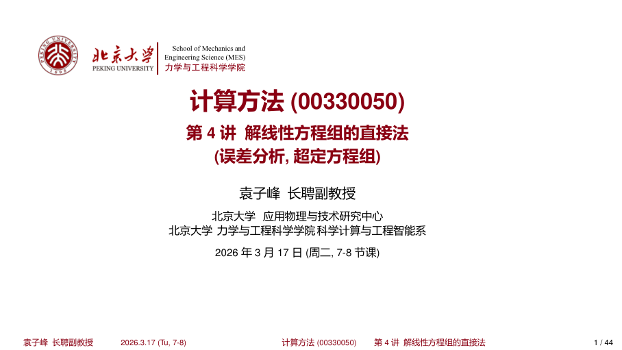
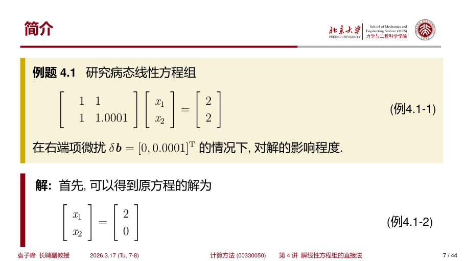
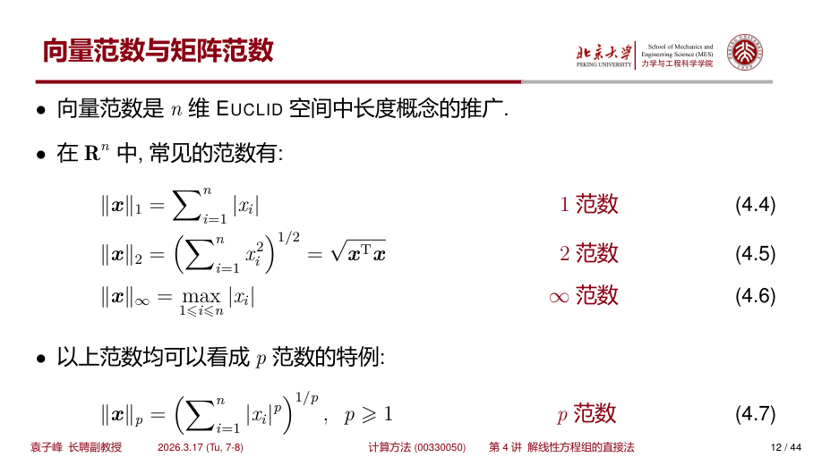
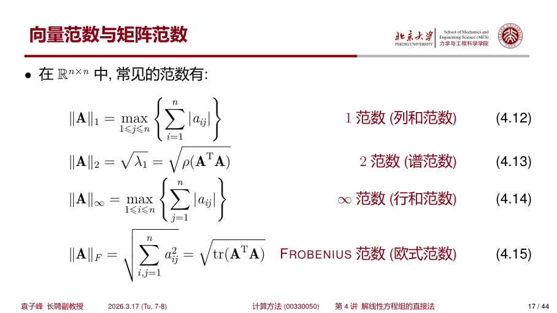
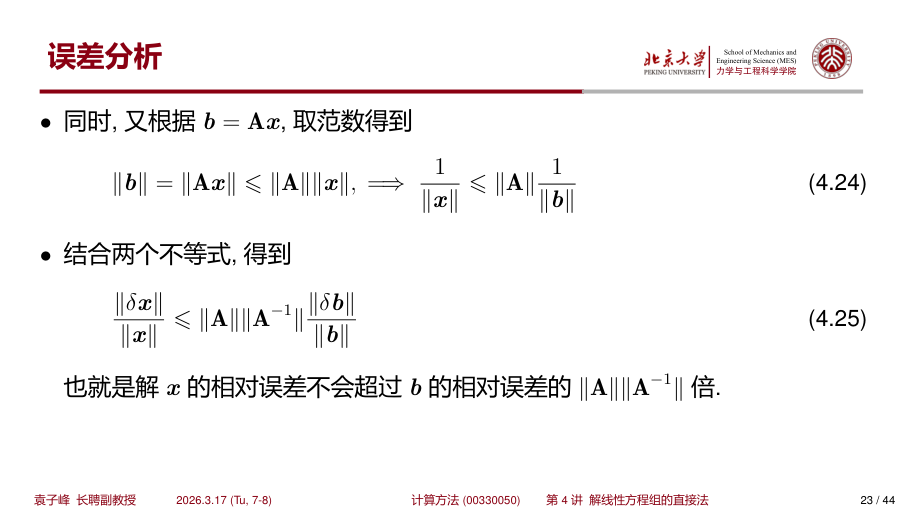
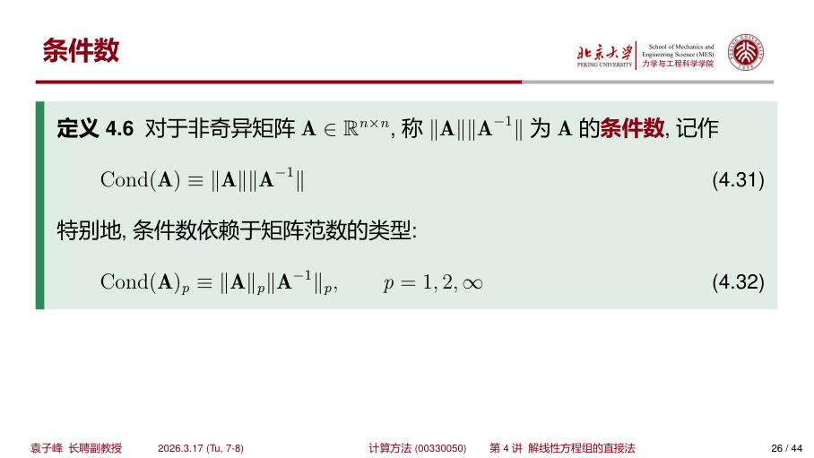
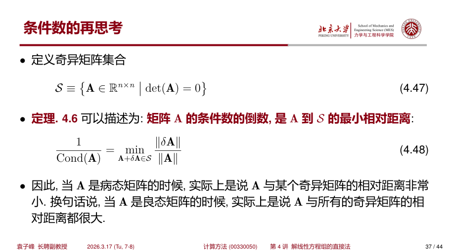
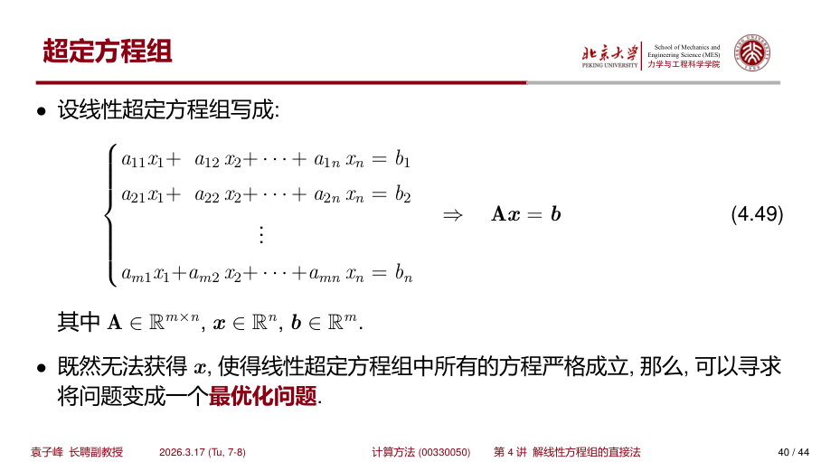
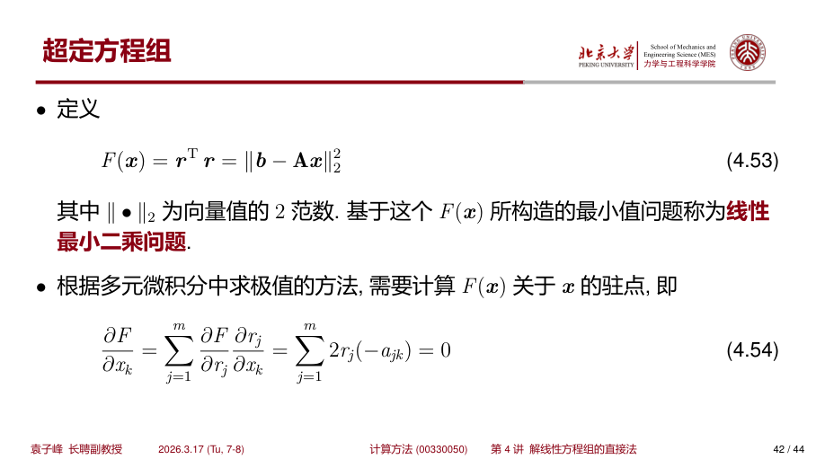
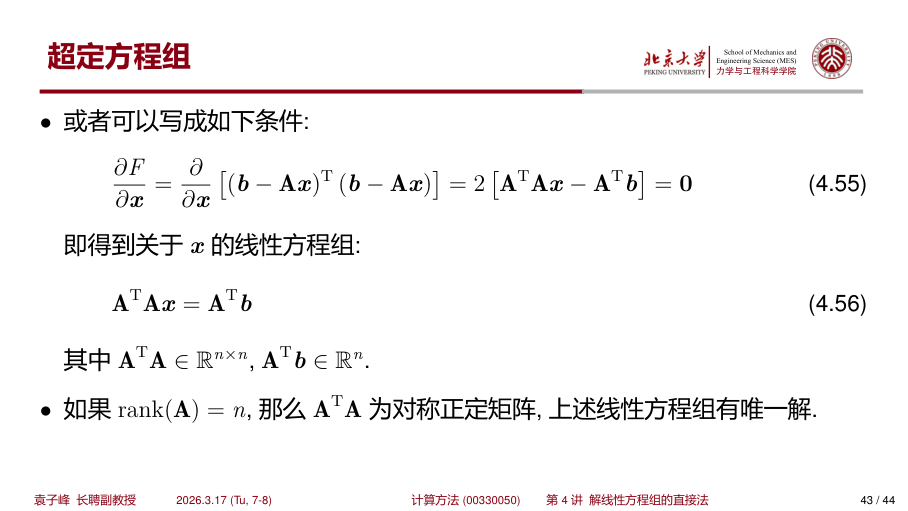

## 误差分析与超定方程组

参考：计算方法 (00330050) 第 4 讲《解线性方程组的直接法 (误差分析, 超定方程组)》

{ width="520" }

---

## 目录

- 简介
- 向量范数与矩阵范数
- 误差分析
- 条件数的估计
- 条件数的再思考
- 超定方程组与最小二乘

---

## 简介：扰动从哪里来

在计算机中，实数以浮点数形式存储，因此会产生舍入误差。  
对数学上精确给定的线性方程组

$$
A x = b
$$

输入计算机后通常变为

$$
(A + \delta A)(x + \delta x) = b + \delta b
$$

其中：

- $\delta A$ 是系数矩阵扰动
- $\delta b$ 是右端项扰动
- $\delta x$ 是解的变化（误差传播结果）

如果很小的输入扰动会导致很大的解变化，则称该问题为 **病态问题**（矩阵是 **病态矩阵**）；反之称为 **良态问题**。

{ width="520" }

### 例：病态方程组

考虑

$$
\begin{bmatrix}
1 & 1 \\
1 & 1.0001
\end{bmatrix}
\begin{bmatrix}
x_1 \\
x_2
\end{bmatrix}
=
\begin{bmatrix}
2 \\
2
\end{bmatrix}
$$

原解为

$$
x =
\begin{bmatrix}
2 \\
0
\end{bmatrix}
$$

若右端项微扰为 $\delta b = [0,\, 0.0001]^T$，则新解变成

$$
x + \delta x =
\begin{bmatrix}
1 \\
1
\end{bmatrix}
$$

所以

$$
\delta x =
\begin{bmatrix}
-1 \\
1
\end{bmatrix}
$$

说明右端极小变化引起解的大幅变化，该系统病态。

---

## 向量范数与矩阵范数

### 向量范数定义

向量范数 $\|x\|$ 需要满足：

- 正定性：$\|x\| \ge 0$，且 $\|x\|=0 \Leftrightarrow x=0$
- 齐次性：$\|\alpha x\| = |\alpha| \|x\|$
- 三角不等式：$\|x+y\| \le \|x\|+\|y\|$

!!! tip "为什么需要三角不等式"

    - **确保极限唯一性**：若向量序列 $x_n$ 同时收敛到 $a,b$，则由

    $$
    \|a-b\|
    \le
    \|x_n-a\|+\|x_n-b\|
    \to 0
    $$

    可得 $a=b$。

    - **保证线性运算连续性**：若 $x_n\to x,\ y_n\to y$，则

    $$
    \|(x_n+y_n)-(x+y)\|
    \le
    \|x_n-x\|+\|y_n-y\|
    \to 0
    $$

    从而 $x_n+y_n\to x+y$。


常见向量范数：

$$
\|x\|_1 = \sum_{i=1}^{n} |x_i|
$$

$$
\|x\|_2 = \left( \sum_{i=1}^{n} x_i^2 \right)^{1/2} = \sqrt{x^T x}
$$

$$
\|x\|_{\infty} = \max_{1 \le i \le n} |x_i|
$$

$$
\|x\|_p = \left( \sum_{i=1}^{n} |x_i|^p \right)^{1/p}, \quad p \ge 1
$$

{ width="520" }

### 范数等价

在有限维空间 $\mathbb{R}^n$ 中，任意两个范数等价。典型不等式：

$$
\|x\|_2 \le \|x\|_1 \le \sqrt{n}\|x\|_2
$$

$$
\|x\|_{\infty} \le \|x\|_2 \le \sqrt{n}\|x\|_{\infty}
$$

$$
\|x\|_{\infty} \le \|x\|_1 \le n\|x\|_{\infty}
$$

!!! tip 
    如果

    $$
    lim_{k -> \infty} \|x^{(k)} - x \| = 0
    $$

    则称 $n$ 维向量序列 $\{x^{(k)}\}$ 收敛到 $x$ 。根据范数的等价性可知：$\mathbb{R}^n$ 中序列的收敛性并不依赖于某个具体的范数。

### 矩阵范数定义

矩阵范数 $\|A\|$ 除了正定性、齐次性、三角不等式外，还需满足相容性：

$$
\|AB\| \le \|A\| \|B\|
$$

常见矩阵范数：

$$
\|A\|_1 = \max_{1 \le j \le n} \sum_{i=1}^{n} |a_{ij}|
$$

$$
\|A\|_2 = \sqrt{\rho(A^T A)}
$$

$$
\|A\|_{\infty} = \max_{1 \le i \le n} \sum_{j=1}^{n} |a_{ij}|
$$

$$
\|A\|_F = \left( \sum_{i,j=1}^{n} a_{ij}^2 \right)^{1/2} = \sqrt{\mathrm{tr}(A^T A)}
$$

{ width="520" }

### 诱导矩阵范数与谱半径

由向量范数诱导的矩阵范数定义为

$$
\|A\| = \max_{x \ne 0} \frac{\|Ax\|}{\|x\|} = \max_{\|x\|=1} \|Ax\|
$$

谱半径定义：

$$
\rho(A) = \max_i |\lambda_i|
$$

> 这里 $\lambda_i$ 为矩阵的特征值

并有一般结论

$$
\rho(A) \le \|A\|
$$

如果对 $\forall A \in \mathbb{R}^{n \times n}$ 与 $\forall x \in \mathbb{R}^n$，都有

$$
\|Ax\| \leq \|A\|\|x\|
$$

那么，称式中的矩阵范数与向量范数 **相容**。

---

## 误差分析：扰动如何放大

{ width="520" }

### 仅右端项扰动

若

$$
A(x+\delta x) = b+\delta b
$$

则

$$
\delta x = A^{-1}\delta b
$$

从而

$$
\|\delta x\| \le \|A^{-1}\|\,\|\delta b\|
$$

结合 $b=Ax$ 可得

$$
\|b\| \le \|A\|\,\|x\|
$$

最终得到相对误差估计

$$
\frac{\|\delta x\|}{\|x\|} \le \|A\|\,\|A^{-1}\| \frac{\|\delta b\|}{\|b\|}
$$

即解 $x$ 的相对误差不会超过 $b$ 的相对误差的 $\|A\|\|A^{-1}\|$ 倍

### 仅系数矩阵扰动

若

$$
(A+\delta A)(x+\delta x)=b
$$

整理得

$$
\delta x = -A^{-1}\delta A\,x - A^{-1}\delta A\,\delta x
$$

进一步可得

$$
\frac{\|\delta x\|}{\|x\|}
\le
\frac{\|A^{-1}\|\,\|\delta A\|}{1-\|A^{-1}\|\,\|\delta A\|}
$$

当 $\|A^{-1}\|\,\|\delta A\|<1$ 时成立。

### 综合扰动结论（先验估计）

若同时有 $\delta A,\delta b$，并且 $\|A^{-1}\|\,\|\delta A\|<1$，则

$$
\frac{\|\delta x\|}{\|x\|}
\le
\frac{\mathrm{Cond}(A)}{1-\mathrm{Cond}(A)\frac{\|\delta A\|}{\|A\|}}
\left(
\frac{\|\delta A\|}{\|A\|}+\frac{\|\delta b\|}{\|b\|}
\right)
$$

---

## 条件数

定义（对非奇异矩阵）：

$$
\mathrm{Cond}(A) = \|A\|\,\|A^{-1}\|
$$

按不同范数记为

$$
\mathrm{Cond}_p(A) = \|A\|_p\,\|A^{-1}\|_p,\quad p=1,2,\infty
$$

{ width="520" }

### 条件数性质

- $\mathrm{Cond}(A)\ge 1$
- 若 $A$ 为正交矩阵（2 范数下），则 $\mathrm{Cond}_2(A)=1$，也就是正交矩阵是一种典型的良态矩阵。
- 对任意 $\alpha \ne 0$，有 $\mathrm{Cond}(\alpha A)=\mathrm{Cond}(A)$
- 在 2 范数下：

$$
\mathrm{Cond}_2(A)=\sqrt{\frac{\lambda_{\max}(A^T A)}{\lambda_{\min}(A^T A)}}
$$

不同范数下的条件数在有限维空间中等价。

---

## 条件数的估计与再思考

### 如何估计条件数

直接算 $A^{-1}$ 代价高。下面给出基于 **LU分解** 求逆的算法及复杂度分析。

### 逆矩阵计算算法

对于非奇异矩阵 $A \in \mathbb{R}^{n \times n}$，利用 LU 分解 $A = LU$ 求逆：

- 先对 $A$ 进行 LU 分解（带部分主元），得到 $PA = LU$
- 然后逐列求解 $AX = I$，即求解 $n$ 个线性方程组

$$
A x_i = e_i, \quad i = 1, 2, \dots, n
$$

其中 $e_i$ 是第 $i$ 个标准基向量。

#### 算法复杂度分析

| 步骤 | 操作 | 复杂度 |
|------|------|--------|
| LU分解 | $PA = LU$ | $\frac{2}{3}n^3$ |
| 解 $n$ 个三角方程组 | 前代 + 回代 | $2n \cdot n^2 = 2n^3$ |
| **总计** | | **$O(n^3)$** |

因此直接求逆的总复杂度约为 $\frac{8}{3}n^3$，远高于求解单个方程组的 $\frac{2}{3}n^3$。

#### 算法伪代码

```
输入: A ∈ R^(n×n) (非奇异)
输出: A^(-1)

1. 对 A 进行 LU 分解（带部分主元）:  PA = LU
2. 初始化 X = 0 ∈ R^(n×n)
3. for j = 1 to n:
4.     令 e_j = [0,...,1,...,0]^T  (第j个为1)
5.     解 Ly = P*e_j      (前代)
6.     解 Ux_j = y       (回代)
7.     X(:,j) = x_j
8. return X
```

=== "Python"

    ```python
    import numpy as np
    from scipy.linalg import lu_factor, lu_solve

    def matrix_inverse_lu(A):
        """
        利用 LU 分解求逆矩阵
        
        参数:
            A: n×n 非奇异矩阵
        返回:
            A^{-1}
        """
        n = A.shape[0]
        # LU 分解（带部分主元）
        lu, piv = lu_factor(A)
        
        # 构造单位矩阵的各列
        X = np.zeros((n, n))
        for j in range(n):
            e_j = np.zeros(n)
            e_j[j] = 1.0
            # 解 Ax = e_j
            X[:, j] = lu_solve((lu, piv), e_j)
        
        return X

    # 示例
    if __name__ == "__main__":
        A = np.array([[4, 3],
                      [6, 3]], dtype=float)
        A_inv = matrix_inverse_lu(A)
        print("A^{-1} =")
        print(A_inv)
        print("验证: A @ A^{-1} =")
        print(A @ A_inv)
    ```

=== "C++"

    ```cpp
    #include <iostream>
    #include <vector>
    #include <Eigen/Dense>
    #include <Eigen/LU>

    using namespace Eigen;
    using namespace std;

    MatrixXd matrixInverseLU(const MatrixXd& A) {
        """
        利用 LU 分解求逆矩阵
        
        参数:
            A: n×n 非奇异矩阵
        返回:
            A^{-1}
        """
        int n = A.rows();
        
        // LU 分解（带部分主元）
        PartialPivLU<MatrixXd> lu(A);
        
        // 求解 n 个右端项（单位矩阵各列）
        MatrixXd I = MatrixXd::Identity(n, n);
        MatrixXd A_inv = lu.solve(I);
        
        return A_inv;
    }

    int main() {
        MatrixXd A(2, 2);
        A << 4, 3,
             6, 3;
        
        MatrixXd A_inv = matrixInverseLU(A);
        
        cout << "A^{-1} =" << endl << A_inv << endl;
        cout << "验证: A * A^{-1} =" << endl << A * A_inv << endl;
        
        return 0;
    }
    ```

### 条件数估计的替代方法

由

$$
Ay=d
$$

可得

$$
\|A^{-1}\| \ge \frac{\|y\|}{\|d\|}
$$

通过选取合适 $d$，让 $\|y\|$ 尽量大，可以构造 $\|A^{-1}\|$ 的下界估计。实际计算中常用 **Hager 估计法** 或 **条件数迭代估计**，避免显式求逆。

### 条件数的几何意义

设 $S$ 为奇异矩阵集合。对诱导范数有：

$$
\frac{1}{\mathrm{Cond}(A)}=
\min_{A+\delta A\in S}\frac{\|\delta A\|}{\|A\|}
$$

这说明：

- 条件数大 $\Rightarrow$ $A$ 离奇异矩阵集合很近（病态）
- 条件数小 $\Rightarrow$ $A$ 离奇异集合较远（良态）

!!! note "定理证明"

    **定理**：设 $A \in \mathbb{R}^{n \times n}$ 可逆，矩阵范数为诱导范数，则

    $$
    \min_{A+\delta A \in S} \frac{\|\delta A\|}{\|A\|} = \frac{1}{\|A\|\,\|A^{-1}\|} = \frac{1}{\mathrm{Cond}(A)}
    $$

    **证明** 分为两部分：

    **第一部分：证明 $\min \frac{\|\delta A\|}{\|A\|} \geq \frac{1}{\mathrm{Cond}(A)}$**

    设 $A + \delta A \in S$（奇异），则存在非零向量 $x$ 使得

    $$
    (A + \delta A)x = 0
    $$

    即

    $$
    Ax = -\delta A x
    $$

    两边取范数并利用诱导范数性质：

    $$
    \|Ax\| = \|\delta A x\| \leq \|\delta A\|\,\|x\|
    $$

    另一方面，由 $\|Ax\| \geq \frac{\|x\|}{\|A^{-1}\|}$（因为 $\|x\| = \|A^{-1}Ax\| \leq \|A^{-1}\|\,\|Ax\|$），得

    $$
    \frac{\|x\|}{\|A^{-1}\|} \leq \|\delta A\|\,\|x\|
    $$

    消去 $\|x\| \neq 0$：

    $$
    \frac{1}{\|A^{-1}\|} \leq \|\delta A\|
    $$

    因此

    $$
    \frac{\|\delta A\|}{\|A\|} \geq \frac{1}{\|A\|\,\|A^{-1}\|} = \frac{1}{\mathrm{Cond}(A)}
    $$

    这说明：**任何使 $A$ 变为奇异的扰动 $\delta A$ 都必须满足 $\|\delta A\| \geq \frac{\|A\|}{\mathrm{Cond}(A)}$**。

    ---

    **第二部分：证明等号可以达到**

    我们需要构造一个特定的 $\delta A$，使得 $A + \delta A$ 奇异且 $\frac{\|\delta A\|}{\|A\|} = \frac{1}{\mathrm{Cond}(A)}$。

    由诱导范数定义，存在单位向量 $x$（$\|x\| = 1$）使得

    $$
    \|A^{-1}x\| = \|A^{-1}\|
    $$

    令 $y = A^{-1}x$，则 $\|y\| = \|A^{-1}\|$ 且 $Ay = x$。

    构造秩一扰动矩阵：

    $$
    \delta A = -\frac{x y^T}{\|y\|^2}
    $$

    验证：

    $$
    (A + \delta A)y = Ay + \delta A \cdot y = x - \frac{x y^T y}{\|y\|^2} = x - x = 0
    $$

    所以 $A + \delta A$ 是奇异矩阵（$y \neq 0$ 在零空间中）。

    计算 $\|\delta A\|$（对诱导范数）：

    $$
    \|\delta A\| = \max_{\|z\|=1} \|\delta A \cdot z\| = \max_{\|z\|=1} \frac{|y^T z|}{\|y\|^2} \|x\|
    $$

    当范数为 2-范数时（$\|x\|_2 = 1$），由 Cauchy-Schwarz：

    $$
    |y^T z| \leq \|y\|_2 \|z\|_2 = \|y\|_2
    $$

    等号当 $z = y/\|y\|_2$ 时成立。因此

    $$
    \|\delta A\|_2 = \frac{\|y\|_2}{\|y\|_2^2} = \frac{1}{\|y\|_2} = \frac{1}{\|A^{-1}\|_2}
    $$

    于是

    $$
    \frac{\|\delta A\|_2}{\|A\|_2} = \frac{1}{\|A\|_2 \|A^{-1}\|_2} = \frac{1}{\mathrm{Cond}_2(A)}
    $$

    对一般诱导范数，类似可构造达到下界的扰动。

    ---

    **结论**：条件数的倒数正好是矩阵 $A$ 到最近奇异矩阵的相对距离。因此：

    - 当 $\mathrm{Cond}(A) \gg 1$ 时，$\frac{1}{\mathrm{Cond}(A)} \ll 1$，说明只需很小的扰动就能使 $A$ 变为奇异矩阵（病态）
    - 当 $\mathrm{Cond}(A) \approx 1$ 时，$\frac{1}{\mathrm{Cond}(A)} \approx 1$，说明需要很大的扰动才能使 $A$ 奇异（良态）

{ width="520" }

---

## 超定方程组与最小二乘

当方程数 $m$ 大于未知数数 $n$ 时，得到线性超定方程组：

$$
A x = b,\quad A\in\mathbb{R}^{m\times n},\ m>n
$$

一般情况下无精确解，因此转化为优化问题。

{ width="520" }

### 残差与目标函数

定义残差（余值）

$$
r_i = b_i - \sum_{j=1}^{n}a_{ij}x_j,\quad i=1,2,\dots,m
$$

残差向量（余向量）

$$
r=b-Ax
$$

由于一个向量本身不具备大小的可比性，因此，我们需要引入一个实函数 $F(x)$，使得

$$
x = Arg_x \space min \space F(x) 
$$

定义最小二乘目标函数

$$
F(x)=r^T r = \|b-Ax\|_2^2
$$

{ width="520" }

### 正规方程（Normal Equation）

为求 $F(x) = (b-Ax)^T(b-Ax)$ 的极小值，令梯度 $\nabla F(x)=0$。

**详细推导过程：**

**第一步：展开目标函数**

令残差向量 $r = b - Ax$，则：

$$
F(x) = r^T r = (b-Ax)^T(b-Ax)
$$

**第二步：展开矩阵乘法**

$$
\begin{aligned}
(b-Ax)^T(b-Ax) 
&= b^T b - b^T(Ax) - (Ax)^T b + (Ax)^T(Ax) \\
&= b^T b - x^T A^T b - b^T A x + x^T A^T A x
\end{aligned}
$$

> **注释 1**：注意到 $b^T A x$ 是一个标量（$1 \times 1$ 矩阵），而标量的转置等于自身，即 $(b^T A x)^T = x^T A^T b = b^T A x$。因此中间两项相等：$b^T A x = x^T A^T b$。

**第三步：合并并简化**

$$
F(x) = b^T b - 2x^T A^T b + x^T A^T A x
$$

**第四步：对 $x$ 求梯度**

利用矩阵求导的基本公式：

- $\frac{\partial}{\partial x}(c^T x) = c$（线性项）
- $\frac{\partial}{\partial x}(x^T Q x) = 2Qx$（二次项，当 $Q$ 对称时）

> **注释 2**：这里 $A^T A$ 是对称矩阵（因为 $(A^T A)^T = A^T A$），所以二次项求导直接得到 $2A^T A x$。

逐项求导：

$$
\begin{aligned}
\frac{\partial F}{\partial x} 
&= \frac{\partial}{\partial x}(b^T b) - 2\frac{\partial}{\partial x}(x^T A^T b) + \frac{\partial}{\partial x}(x^T A^T A x) \\
&= 0 - 2A^T b + 2A^T A x \\
&= 2(A^T A x - A^T b)
\end{aligned}
$$

**第五步：令梯度为零**

$$
2(A^T A x - A^T b) = 0
$$

约去因子 2，得到 **正规方程**：

$$
A^T A x = A^T b
$$

**第六步：解的存在性与唯一性**

若 $\mathrm{rank}(A)=n$（$A$ 列满秩），则：

- $A^T A$ 是 $n \times n$ 对称矩阵
- $A^T A$ 正定（因为对任意非零 $y$，$y^T A^T A y = \|Ay\|_2^2 > 0$）
- 故 $A^T A$ 可逆，解唯一：$x = (A^T A)^{-1} A^T b$

{ width="520" }

---

## 小结

- 误差分析核心：看输入扰动如何通过 $A^{-1}$ 放大到解误差
- 条件数是衡量问题敏感性的核心量
- 条件数可解释为“到奇异矩阵集合的相对距离倒数”
- 超定问题通常用最小二乘，最终化为正规方程 $A^T A x=A^T b$

