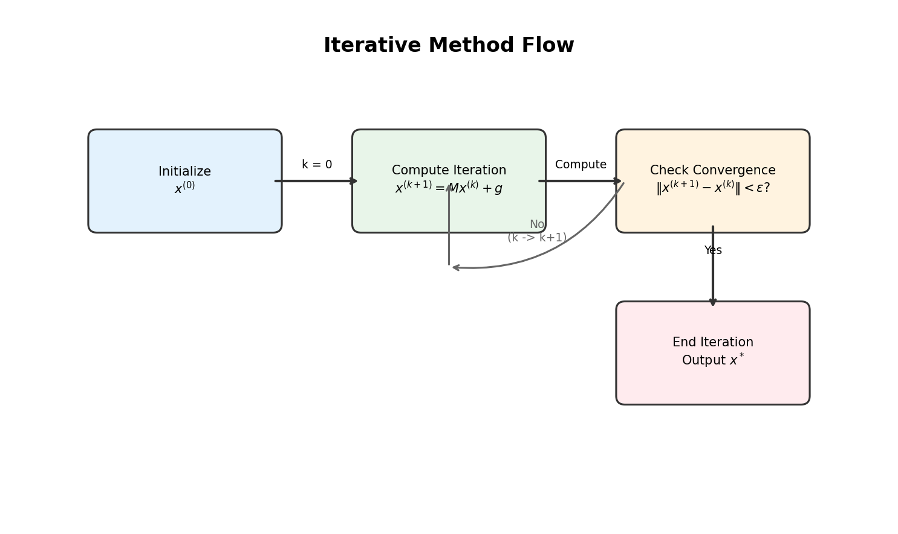
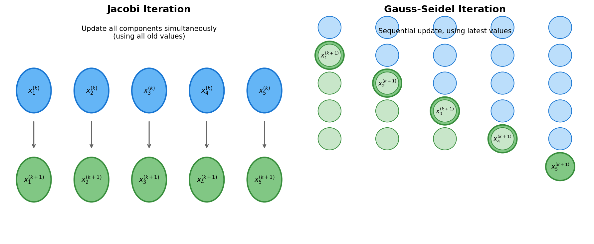
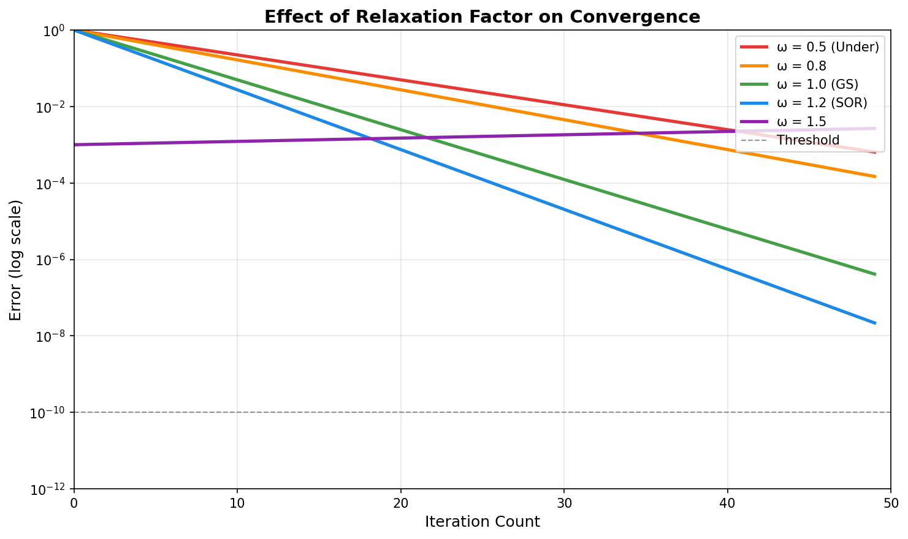
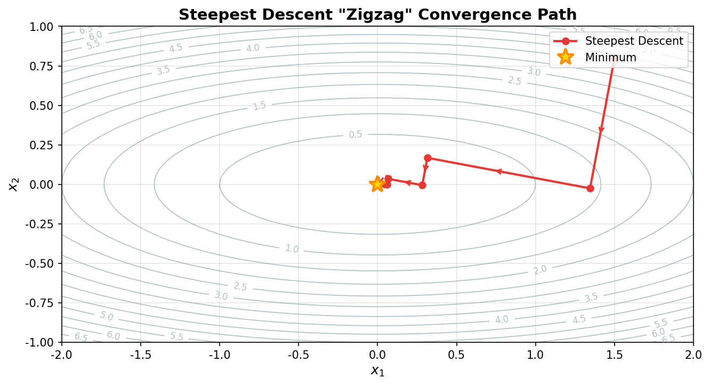
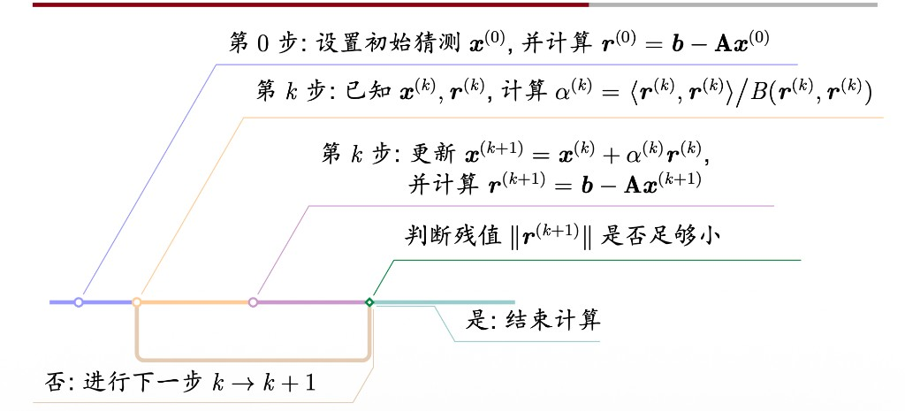
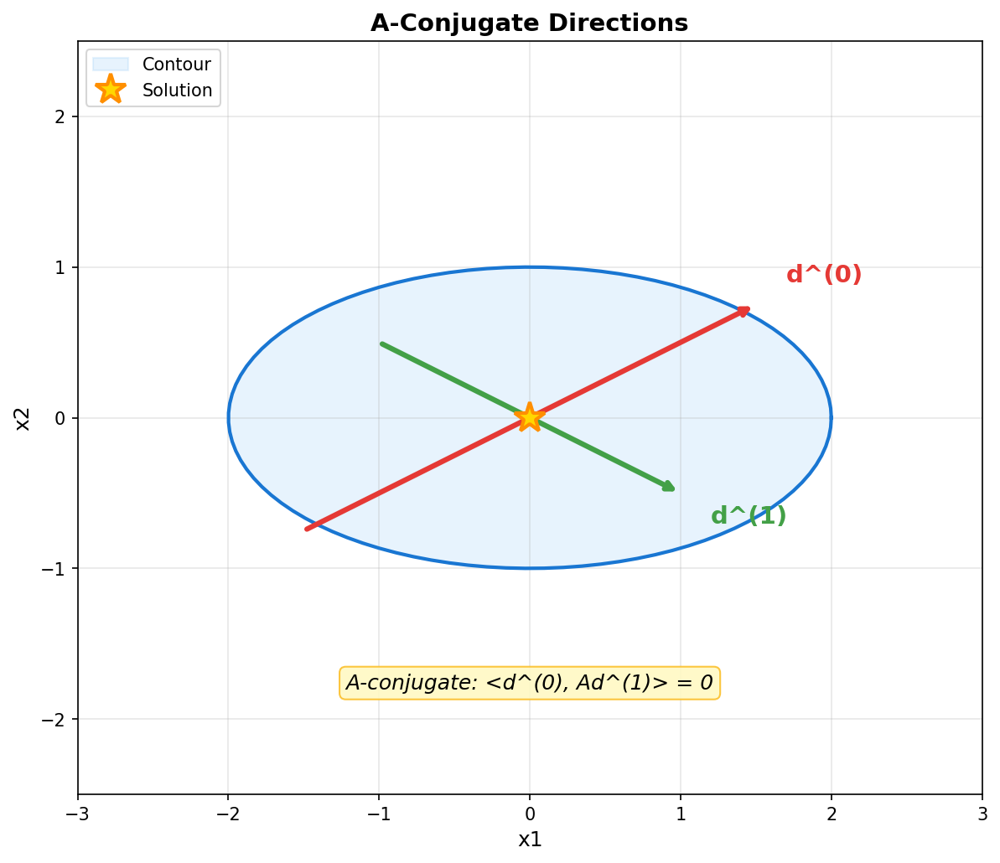
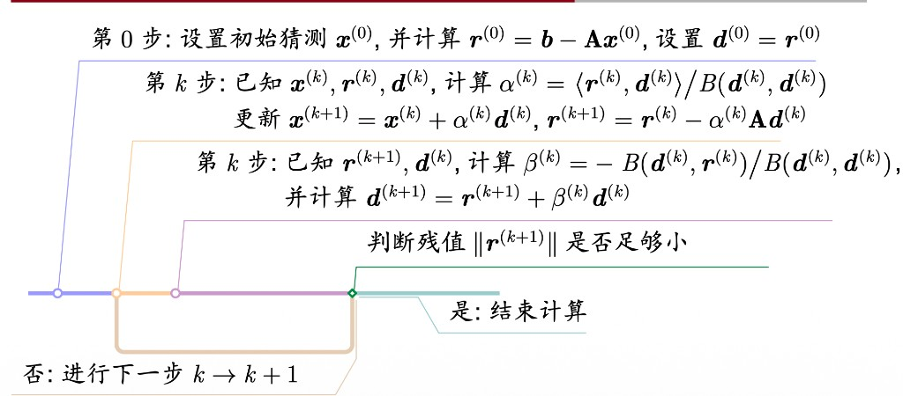
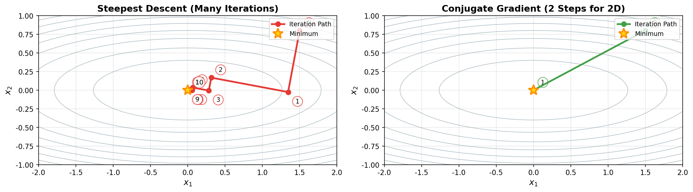

## 目录

- 迭代法简介与 Richardson 框架
- Jacobi 迭代法
- Gauss-Seidel 迭代法
- 松弛法（SOR）
- 迭代法的收敛性
- 二次函数极值问题
- 最速下降法
- 共轭梯度法

---

## 1 迭代法简介与 Richardson 框架

### 1.1 迭代法的基本思想

对于线性方程组 $Ax = b$，将系数矩阵 $A$ 进行 **加法分裂**（而非 LU 分解）：

$$
A = P - Q
$$

从而建立如下迭代格式：

$$
Px^{(k+1)} = Qx^{(k)} + b \Rightarrow x^{(k+1)} = Mx^{(k)} + g
$$

其中 $M \equiv P^{-1}Q$，$g \equiv P^{-1}b$。

迭代法适用于大规模稀疏矩阵，因为直接法（如 LU 分解）可能破坏稀疏性，而迭代法只需要矩阵与向量的乘法。

{ width="550" }

!!! abstract "定义 1（迭代格式）"
    将上述迭代格式改写为：

    $$
    x^{(k+1)} = x^{(k)} + P^{-1}r^{(k)}
    $$

    其中 $r^{(k)} \equiv b - Ax^{(k)}$ 称为 **残差向量**。

引入松弛因子 $\omega$，得到更一般的 **Richardson 方法**：

$$
x^{(k+1)} = x^{(k)} + \omega P^{-1}r^{(k)}
$$

!!! abstract "定义 2（平稳与非平稳 Richardson 方法）"
    - 如果 $\omega$ 与迭代步数 $k$ **无关**，称为 **平稳 Richardson 方法**（stationary Richardson method）
    - 如果 $\omega$ 与迭代步数 $k$ **相关**，称为 **非平稳 Richardson 方法**（nonstationary Richardson method）

!!! tip "方法归类"
    **Jacobi、Gauss-Seidel、松弛法** 都属于平稳 Richardson 方法；而 **最速下降法、共轭梯度法** 属于非平稳 Richardson 方法。

---

## 2 Jacobi 迭代法

### 2.1 迭代格式

记 $D$ 为 $A$ 的对角矩阵，即 $D_{ij} = \begin{cases} a_{ij} & i = j \\ 0 & i \neq j \end{cases}$

假设 $a_{ii} \neq 0$，则原方程组可改写为：

$$
Dx = (D - A)x + b \Rightarrow x = \underbrace{D^{-1}(D-A)}_{\equiv B}x + \underbrace{D^{-1}b}_{\equiv g}
$$

Jacobi 迭代格式为：

$$
x^{(k+1)} = Bx^{(k)} + g
$$

用分量表示：

$$
x_i^{(k+1)} = \frac{1}{a_{ii}}\left(b_i - \sum_{j=1, j \neq i}^{n} a_{ij}x_j^{(k)}\right), \quad i = 1, 2, \ldots, n
$$

### 2.2 Jacobi 与 Gauss-Seidel 对比

{ width="550" }

上图展示了两种方法的核心区别：

- **Jacobi**：同时更新所有分量，使用上一轮全部旧值
- **Gauss-Seidel**：顺序更新，使用最新计算值

### 2.3 算法流程

!!! abstract "算法 2.1（Jacobi 迭代法）"

    $$
    \begin{aligned}
    & \textbf{算法: } \text{Jacobi} \\
    & \textbf{输入: } A \in \mathbb{R}^{n \times n}, \quad x^{(0)} \in \mathbb{R}^n, \quad b \in \mathbb{R}^n, \quad N, \quad \varepsilon \\
    & \textbf{输出: } x \approx A^{-1}b \\
    & 1. \quad k \leftarrow 0 \\
    & 2. \quad \textbf{while } k < N \textbf{ do} \\
    & 3. \quad \quad y \leftarrow x \quad \text{// 保存上一轮迭代值} \\
    & 4. \quad \quad \textbf{for } i = 1, 2, \ldots, n \textbf{ do} \\
    & 5. \quad \quad \quad x_i \leftarrow b_i \\
    & 6. \quad \quad \quad \textbf{for } j = 1, 2, \ldots, n \text{ 且 } j \neq i \textbf{ do} \\
    & 7. \quad \quad \quad \quad x_i \leftarrow x_i - a_{ij} \cdot y_j \\
    & 8. \quad \quad \quad \textbf{end for} \\
    & 9. \quad \quad \quad x_i \leftarrow x_i / a_{ii} \\
    & 10. \quad \quad \textbf{end for} \\
    & 11. \quad \quad \textbf{if } \|x - y\|_2 < \varepsilon \textbf{ then} \\
    & 12. \quad \quad \quad \textbf{return } x \\
    & 13. \quad \quad \textbf{end if} \\
    & 14. \quad \quad k \leftarrow k + 1 \\
    & 15. \quad \textbf{end while} \\
    & 16. \quad \textbf{return } x
    \end{aligned}
    $$

!!! info "计算复杂度"
    Jacobi 法的主要计算代价来自矩阵向量乘法。对于稀疏矩阵，只需计算非零元素与对应向量元素的乘积。

---

## 3 Gauss-Seidel 迭代法

### 3.1 迭代格式

观察 Jacobi 迭代：在计算 $x_1^{(k+1)}$ 后，第二个方程仍然使用旧的 $x_1^{(k)}$ 进行计算。

Gauss-Seidel 法的改进：**一旦某个分量被更新，立即使用新值**。

将矩阵 $A$ 表示为 $A = D - L - U$，其中：

- $D$：对角部分
- $L$：严格下三角部分（$L_{ij} = -a_{ij}$ 当 $i > j$，否则为 0）
- $U$：严格上三角部分（$U_{ij} = -a_{ij}$ 当 $i < j$，否则为 0）

Gauss-Seidel 迭代格式：

$$
x^{(k+1)} = (D - L)^{-1}Ux^{(k)} + (D - L)^{-1}b
$$

或等价地：

$$
x_i^{(k+1)} = \frac{1}{a_{ii}}\left(b_i - \sum_{j=1}^{i-1}a_{ij}x_j^{(k+1)} - \sum_{j=i+1}^{n}a_{ij}x_j^{(k)}\right)
$$

### 3.2 算法流程

!!! abstract "算法 3.1（Gauss-Seidel 迭代法）"

    $$
    \begin{aligned}
    & \textbf{算法: } \text{Gauss-Seidel} \\
    & \textbf{输入: } A \in \mathbb{R}^{n \times n}, \quad x^{(0)} \in \mathbb{R}^n, \quad b \in \mathbb{R}^n, \quad N, \quad \varepsilon \\
    & \textbf{输出: } x \approx A^{-1}b \\
    & 1. \quad k \leftarrow 0 \\
    & 2. \quad \textbf{while } k < N \textbf{ do} \\
    & 3. \quad \quad y \leftarrow x \quad \text{// 保存上一轮迭代值} \\
    & 4. \quad \quad \textbf{for } i = 1, 2, \ldots, n \textbf{ do} \\
    & 5. \quad \quad \quad x_i \leftarrow b_i \\
    & 6. \quad \quad \quad \textbf{for } j = 1, 2, \ldots, i-1 \textbf{ do} \\
    & 7. \quad \quad \quad \quad x_i \leftarrow x_i - a_{ij} \cdot x_j \quad \text{// 使用新值} \\
    & 8. \quad \quad \quad \textbf{end for} \\
    & 9. \quad \quad \quad \textbf{for } j = i+1, i+2, \ldots, n \textbf{ do} \\
    & 10. \quad \quad \quad \quad x_i \leftarrow x_i - a_{ij} \cdot y_j \quad \text{// 使用旧值} \\
    & 11. \quad \quad \quad \textbf{end for} \\
    & 12. \quad \quad \quad x_i \leftarrow x_i / a_{ii} \\
    & 13. \quad \quad \textbf{end for} \\
    & 14. \quad \quad \textbf{if } \|x - y\|_2 < \varepsilon \textbf{ then} \\
    & 15. \quad \quad \quad \textbf{return } x \\
    & 16. \quad \quad \textbf{end if} \\
    & 17. \quad \quad k \leftarrow k + 1 \\
    & 18. \quad \textbf{end while} \\
    & 19. \quad \textbf{return } x
    \end{aligned}
    $$

!!! tip "性能对比"
    对于相同规模的问题，Gauss-Seidel 法通常比 Jacobi 法收敛更快（迭代步数更少）。例如 $n=3200$ 时，Jacobi 约需 74 步，而 Gauss-Seidel 只需约 15 步。

---

## 4 松弛法（SOR）

### 4.1 迭代格式

将 Gauss-Seidel 迭代改写为：

$$
x^{(k+1)} = x^{(k)} + D^{-1}[Lx^{(k+1)} + Ux^{(k)} + b - Dx^{(k)}]
$$

其中方括号内是 **当前迭代步的修正量** $\Delta x$。

引入松弛因子 $\omega$，修改矫正公式：

$$
x^{(k+1)} = x^{(k)} + \omega \Delta x = x^{(k)} + \omega D^{-1}[Lx^{(k+1)} + Ux^{(k)} + b - Dx^{(k)}]
$$

整理得到 **松弛法（SOR, Successive Over-Relaxation）**：

$$
x^{(k+1)} = (D - \omega L)^{-1}[(1-\omega)D + \omega U]x^{(k)} + \omega(D - \omega L)^{-1}b
$$

!!! abstract "定义 4.1（松弛因子）"
    - $\omega < 1$：低松弛法（亚松弛法）
    - $\omega = 1$：Gauss-Seidel 法
    - $\omega > 1$：超松弛法

{ width="550" }

上图展示了不同松弛因子 $\omega$ 对收敛速度的影响。合适的超松弛因子（如 $\omega \approx 1.2$）可以显著加速收敛，但过大的 $\omega$ 可能导致发散。

### 4.2 算法流程

!!! abstract "算法 4.1（松弛法 / SOR）"

    $$
    \begin{aligned}
    & \textbf{算法: } \text{SOR}(\omega) \\
    & \textbf{输入: } A \in \mathbb{R}^{n \times n}, \quad x^{(0)} \in \mathbb{R}^n, \quad b \in \mathbb{R}^n, \quad \omega \in (0, 2), \quad N, \quad \varepsilon \\
    & \textbf{输出: } x \approx A^{-1}b \\
    & 1. \quad k \leftarrow 0 \\
    & 2. \quad \textbf{while } k < N \textbf{ do} \\
    & 3. \quad \quad y \leftarrow x \quad \text{// 保存上一轮迭代值} \\
    & 4. \quad \quad \textbf{for } i = 1, 2, \ldots, n \textbf{ do} \\
    & 5. \quad \quad \quad \sigma \leftarrow 0 \\
    & 6. \quad \quad \quad \textbf{for } j = 1, 2, \ldots, i-1 \textbf{ do} \\
    & 7. \quad \quad \quad \quad \sigma \leftarrow \sigma + a_{ij} x_j \quad \text{// 已更新的新值} \\
    & 8. \quad \quad \quad \textbf{end for} \\
    & 9. \quad \quad \quad \textbf{for } j = i+1, i+2, \ldots, n \textbf{ do} \\
    & 10. \quad \quad \quad \quad \sigma \leftarrow \sigma + a_{ij} y_j \quad \text{// 旧值} \\
    & 11. \quad \quad \quad \textbf{end for} \\
    & 12. \quad \quad \quad x_i^{\text{GS}} \leftarrow (b_i - \sigma) / a_{ii} \quad \text{// Gauss-Seidel 更新} \\
    & 13. \quad \quad \quad x_i \leftarrow (1-\omega) y_i + \omega \cdot x_i^{\text{GS}} \quad \text{// 松弛组合} \\
    & 14. \quad \quad \textbf{end for} \\
    & 15. \quad \quad \textbf{if } \|x - y\| < \varepsilon \textbf{ then} \\
    & 16. \quad \quad \quad \textbf{return } x \\
    & 17. \quad \quad \textbf{end if} \\
    & 18. \quad \quad k \leftarrow k + 1 \\
    & 19. \quad \textbf{end while} \\
    & 20. \quad \textbf{return } x
    \end{aligned}
    $$

!!! warning "松弛因子的选择"
    松弛因子的选取对收敛速度影响很大。最优的 $\omega$ 通常依赖于具体问题，需要通过实验确定。一般来说：

    - 对于某些问题，$\omega \approx 1.5$ 可能显著加速收敛
    - 但 $\omega$ 过大（如 $>2$）可能导致发散

---

## 5 迭代法的收敛性

### 5.1 统一迭代格式

Jacobi、Gauss-Seidel、松弛法可以统一写成：

$$
x^{(k+1)} = Mx^{(k)} + g
$$

| 方法 | 迭代矩阵 $M$ | 向量 $g$ |
|------|-------------|----------|
| Jacobi | $I - D^{-1}A$ | $D^{-1}b$ |
| Gauss-Seidel | $(D-L)^{-1}U$ | $(D-L)^{-1}b$ |
| 松弛法 | $(D-\omega L)^{-1}[(1-\omega)D + \omega U]$ | $\omega(D-\omega L)^{-1}b$ |

### 5.2 收敛的充分必要条件

!!! abstract "定理 5.1（谱半径与范数的关系）"
    设 $A \in \mathbb{R}^{n \times n}$，对 $\forall \varepsilon > 0$，存在矩阵范数 $\|\cdot\|$，使得：

    $$
    \|A\| \leq \rho(A) + \varepsilon
    $$

??? note "证明"
    我们证明：对任意给定的 $\varepsilon > 0$，总可以人为构造一个矩阵范数，使得矩阵 $A$ 在这个范数下的大小与谱半径 $\rho(A)$ 任意接近。

    由 Jordan 标准形定理，存在可逆矩阵 $X$，使得

    $$
    A = X J X^{-1}
    $$

    其中 $J$ 是由若干个 Jordan 块组成的分块对角矩阵：

    $$
    J = \operatorname{diag}(J_1, J_2, \dots, J_s)
    $$

    每个 Jordan 块都可以写成

    $$
    J_\ell =
    \begin{bmatrix}
    \lambda_\ell & 1 &  &  \\
     & \lambda_\ell & 1 &  \\
     &  & \ddots & \ddots \\
     &  &  & \lambda_\ell
    \end{bmatrix}
    $$

    其中 $\lambda_\ell$ 是 $A$ 的一个特征值，因此

    $$
    |\lambda_\ell| \leq \rho(A).
    $$

    现在对每一个 Jordan 块 $J_\ell$，引入对角矩阵

    $$
    D_{\delta,\ell} = \operatorname{diag}(1, \delta, \delta^2, \dots, \delta^{m_\ell - 1}),
    $$

    其中 $m_\ell$ 是该 Jordan 块的阶数，$\delta > 0$ 是稍后要选取的小参数。

    直接计算可得

    $$
    D_{\delta,\ell}^{-1} J_\ell D_{\delta,\ell}
    =
    \begin{bmatrix}
    \lambda_\ell & \delta &  &  \\
     & \lambda_\ell & \delta &  \\
     &  & \ddots & \ddots \\
     &  &  & \lambda_\ell
    \end{bmatrix}.
    $$

    也就是说，Jordan 块超对角线上的 1 被缩放成了 $\delta$。令

    $$
    D_\delta = \operatorname{diag}(D_{\delta,1}, D_{\delta,2}, \dots, D_{\delta,s}),
    $$

    则

    $$
    D_\delta^{-1} J D_\delta
    $$

    仍然是分块对角矩阵，并且每个 Jordan 块的对角元不变，超对角元都变成了 $\delta$。

    现在在 $\mathbb{R}^{n \times n}$ 上定义一个新的矩阵范数：

    $$
    \|B\|_* \equiv \|D_\delta^{-1} X^{-1} B X D_\delta\|_\infty,
    $$

    这里右边的 $\|\cdot\|_\infty$ 是通常的诱导无穷范数。由于相似变换和可逆变换不会破坏范数结构，$\|\cdot\|_*$ 的确是一个矩阵范数。

    对 $A$ 本身，有

    $$
    \|A\|_*
    = \|D_\delta^{-1} X^{-1} A X D_\delta\|_\infty
    = \|D_\delta^{-1} J D_\delta\|_\infty.
    $$

    而对任一 Jordan 块，其每一行元素绝对值之和至多为

    $$
    |\lambda_\ell| + \delta \leq \rho(A) + \delta.
    $$

    因此整个矩阵满足

    $$
    \|D_\delta^{-1} J D_\delta\|_\infty \leq \rho(A) + \delta.
    $$

    于是得到

    $$
    \|A\|_* \leq \rho(A) + \delta.
    $$

    最后只需取 $0 < \delta < \varepsilon$，就有

    $$
    \|A\|_* \leq \rho(A) + \varepsilon.
    $$

    这就说明：对任意 $\varepsilon > 0$，都存在某个矩阵范数，使得 $A$ 的范数不超过 $\rho(A) + \varepsilon$。定理得证。 $\square$

!!! abstract "定理 5.2（矩阵幂收敛的条件）"
    设 $A \in \mathbb{R}^{n \times n}$，则：

    $$
    \lim_{k \to \infty} A^k = 0 \iff \rho(A) < 1
    $$

??? note "证明"
    这个定理分为必要性和充分性两部分。

    **必要性**：假设

    $$
    \lim_{k \to \infty} A^k = 0.
    $$

    任取 $A$ 的一个特征值 $\lambda$ 及其对应的非零特征向量 $v$，则

    $$
    Av = \lambda v.
    $$

    两边同时左乘 $A^{k-1}$，得到

    $$
    A^k v = \lambda^k v.
    $$

    由于 $A^k \to 0$，所以对任意向量都有 $A^k v \to 0$，于是

    $$
    \lambda^k v \to 0.
    $$

    又因为 $v \neq 0$，这只能说明

    $$
    \lambda^k \to 0,
    $$

    从而必有

    $$
    |\lambda| < 1.
    $$

    由于这对任意特征值都成立，所以

    $$
    \rho(A) = \max_{\lambda \in \sigma(A)} |\lambda| < 1.
    $$

    **充分性**：现在反过来假设

    $$
    \rho(A) < 1.
    $$

    令

    $$
    \varepsilon = \frac{1 - \rho(A)}{2} > 0.
    $$

    根据定理 5.1，存在某个矩阵范数 $\|\cdot\|$，使得

    $$
    \|A\| \leq \rho(A) + \varepsilon = \frac{1 + \rho(A)}{2} < 1.
    $$

    由矩阵范数的次可乘性，

    $$
    \|A^k\| \leq \|A\|^k.
    $$

    因为 $\|A\| < 1$，所以

    $$
    \|A\|^k \to 0 \quad (k \to \infty).
    $$

    从而

    $$
    \|A^k\| \to 0.
    $$

    矩阵范数趋于 0 等价于矩阵本身趋于零矩阵，因此

    $$
    A^k \to 0.
    $$

    必要性和充分性都已证明，故

    $$
    A^k \to 0 \iff \rho(A) < 1.
    $$

    定理得证。 $\square$

!!! abstract "定理 5.3（迭代法收敛的充要条件）"
    令 $M \in \mathbb{R}^{n \times n}$，迭代格式 $x^{(k+1)} = Mx^{(k)} + g$ 对任意的 $g \in \mathbb{R}^n$ 以及 $x^{(0)} \in \mathbb{R}^n$ 都 **收敛** 的充分必要条件为：

    $$
    \rho(M) < 1
    $$

??? note "证明"
    先把迭代格式写成更适合分析的形式。由

    $$
    x^{(k+1)} = Mx^{(k)} + g
    $$

    逐次展开可得

    $$
    x^{(k)}
    = M^k x^{(0)} + \sum_{j=0}^{k-1} M^j g.
    $$

    接下来分别证明必要性和充分性。

    **必要性**：假设该迭代对任意 $g$ 和任意初值 $x^{(0)}$ 都收敛。

    首先，由“对任意 $g$ 都收敛”，可知对任意给定的 $g$，极限

    $$
    x^* = \lim_{k \to \infty} x^{(k)}
    $$

    存在。对递推式取极限，得到

    $$
    x^* = Mx^* + g,
    $$

    即

    $$
    (I - M)x^* = g.
    $$

    由于这里 $g$ 是任意向量，上式说明线性方程组

    $$
    (I - M)x = g
    $$

    对任意右端项都有解，因此 $I - M$ 是满射。在线性有限维空间中，满射等价于可逆，所以 $I - M$ 可逆，进而 $1$ 不是 $M$ 的特征值。

    接着取特殊情形 $g = 0$。此时迭代变为

    $$
    x^{(k+1)} = Mx^{(k)}.
    $$

    由假设，它对任意初值 $x^{(0)}$ 都收敛。设其极限为 $y$，则由递推式取极限有

    $$
    y = My.
    $$

    即

    $$
    (I - M)y = 0.
    $$

    但前面已经证明 $I - M$ 可逆，所以只能有

    $$
    y = 0.
    $$

    因此对任意初值 $x^{(0)}$，

    $$
    M^k x^{(0)} \to 0.
    $$

    这说明

    $$
    M^k \to 0.
    $$

    再由定理 5.2，得到

    $$
    \rho(M) < 1.
    $$

    **充分性**：现在假设

    $$
    \rho(M) < 1.
    $$

    由定理 5.2 可知

    $$
    M^k \to 0.
    $$

    又因为 $\rho(M) < 1$，所以 $1$ 不可能是 $M$ 的特征值，从而 $I - M$ 可逆。记

    $$
    x^* = (I - M)^{-1} g.
    $$

    则 $x^*$ 满足不动点方程

    $$
    x^* = Mx^* + g.
    $$

    定义误差向量

    $$
    e^{(k)} \equiv x^{(k)} - x^*.
    $$

    由迭代式和不动点方程相减，得到

    $$
    e^{(k+1)} = M e^{(k)}.
    $$

    于是

    $$
    e^{(k)} = M^k e^{(0)}.
    $$

    因为 $M^k \to 0$，所以

    $$
    e^{(k)} \to 0,
    $$

    即

    $$
    x^{(k)} \to x^*.
    $$

    这说明迭代格式对任意 $g$ 和任意初值 $x^{(0)}$ 都收敛。

    综上，

    $$
    x^{(k+1)} = Mx^{(k)} + g \text{ 对任意 } g, x^{(0)} \text{ 都收敛} \iff \rho(M) < 1.
    $$

    定理得证。 $\square$

!!! tip "实用判据"
    谱半径 $\rho(M)$ 难以计算，可用矩阵范数作为估计：

    $$
    \rho(M) \leq \|M\|
    $$

    因此 $\|M\| < 1$ 是收敛的 **充分条件**（但非必要）。

### 5.3 误差估计与停止准则

!!! abstract "定理 5.4（误差估计）"
    如果迭代矩阵 $M$ 的范数满足 $\|M\| = q < 1$，则第 $k$ 次迭代解 $x^{(k)}$ 与准确解 $x^*$ 的误差满足：

    $$
    \|x^{(k)} - x^*\| \leq \frac{q}{1-q}\|x^{(k-1)} - x^{(k)}\| \leq \frac{q^k}{1-q}\|x^{(0)} - x^{(1)}\|
    $$

    为使误差小于给定精度 $\varepsilon$，当相邻两次迭代结果的差满足：

    $$
    \|x^{(k)} - x^{(k+1)}\| \leq \frac{1-q}{q}\varepsilon
    $$

    时，$\|x^{(k)} - x^*\| < \varepsilon$ 成立。

??? note "证明"
    设 $x^*$ 是方程组 $x = Mx + g$ 的准确解，即满足 $x^* = Mx^* + g$。

    **第一步：建立相邻迭代步之间的误差关系**

    由迭代格式 $x^{(k+1)} = Mx^{(k)} + g$ 和 $x^{(k)} = Mx^{(k-1)} + g$ 相减，得：

    $$
    x^{(k+1)} - x^{(k)} = M(x^{(k)} - x^{(k-1)})
    $$

    两边取范数，利用 $\|M\| = q < 1$，得：

    $$
    \|x^{(k+1)} - x^{(k)}\| \leq \|M\| \cdot \|x^{(k)} - x^{(k-1)}\| = q\|x^{(k)} - x^{(k-1)}\|
    $$

    递推可得：

    $$
    \|x^{(k+1)} - x^{(k)}\| \leq q^k \|x^{(1)} - x^{(0)}\|
    $$

    **第二步：建立误差与相邻迭代差的关系**

    利用三角不等式和 $x^* = Mx^* + g$，$x^{(k+1)} = Mx^{(k)} + g$，有：

    $$
    \begin{aligned}
    \|x^{(k)} - x^*\|
    &\leq \|x^{(k)} - x^{(k+1)}\| + \|x^{(k+1)} - x^*\| \\
    &= \|x^{(k)} - x^{(k+1)}\| + \|Mx^{(k)} + g - (Mx^* + g)\| \\
    &= \|x^{(k)} - x^{(k+1)}\| + \|M(x^{(k)} - x^*)\| \\
    &\leq \|x^{(k)} - x^{(k+1)}\| + q\|x^{(k)} - x^*\|
    \end{aligned}
    $$

    移项整理得：

    $$
    (1-q)\|x^{(k)} - x^*\| \leq \|x^{(k)} - x^{(k+1)}\|
    $$

    即：

    $$
    \|x^{(k)} - x^*\| \leq \frac{1}{1-q}\|x^{(k)} - x^{(k+1)}\| = \frac{q}{1-q}\|x^{(k)} - x^{(k-1)}\|
    $$

    **第三步：推导误差的指数衰减界**

    利用第一步的结果递推：

    $$
    \begin{aligned}
    \|x^{(k)} - x^*\|
    &\leq \frac{q}{1-q}\|x^{(k)} - x^{(k-1)}\| \\
    &\leq \frac{q}{1-q} \cdot q^{k-1} \|x^{(1)} - x^{(0)}\| \\
    &= \frac{q^k}{1-q}\|x^{(1)} - x^{(0)}\|
    \end{aligned}
    $$

    综合第二步和第三步的结果，即得：

    $$
    \|x^{(k)} - x^*\| \leq \frac{q}{1-q}\|x^{(k)} - x^{(k-1)}\| \leq \frac{q^k}{1-q}\|x^{(1)} - x^{(0)}\|
    $$

    **第四步：停机准则的推导**

    由 $\|x^{(k)} - x^*\| \leq \frac{q}{1-q}\|x^{(k)} - x^{(k+1)}\|$，要使 $\|x^{(k)} - x^*\| < \varepsilon$，只需：

    $$
    \frac{q}{1-q}\|x^{(k)} - x^{(k+1)}\| < \varepsilon
    $$

    即：

    $$
    \|x^{(k)} - x^{(k+1)}\| < \frac{1-q}{q}\varepsilon
    $$

    这就给出了实用的迭代停止准则。 $\square$

### 5.4 特殊矩阵的收敛性

!!! abstract "定义 5.1（可约矩阵）"
    若存在排列矩阵 $P$ 使得：

    $$
    P^TAP = \begin{bmatrix} A_{11} & A_{12} \\ 0 & A_{22} \end{bmatrix}
    $$

    其中 $A_{11}$ 和 $A_{22}$ 均为方阵，则 $A$ 称为 **可约矩阵**；否则称为 **不可约矩阵**。
    若对所有 $i$ 不等号都严格成立，则称 $A$ 具有 **严格对角占优**。

!!! abstract "定理 5.2.1（严格对角占优矩阵非奇异）"
    若矩阵 $A \in \mathbb{R}^{n \times n}$ 具有 **严格对角占优**，则 $A$ **非奇异**。

??? note "证明"
    采用反证法。假设 $A$ 是奇异矩阵，则存在非零向量 $x \in \mathbb{R}^n$ 使得：

    $$
    Ax = 0
    $$

    设 $|x_k| = \max_{1 \leq i \leq n} |x_i| > 0$，即 $x_k$ 是 $x$ 的绝对值最大分量。

    考察 $Ax = 0$ 的第 $k$ 个方程：

    $$
    \sum_{j=1}^{n} a_{kj} x_j = 0
    $$

    即：

    $$
    a_{kk} x_k = -\sum_{j=1, j \neq k}^{n} a_{kj} x_j
    $$

    两边取绝对值：

    $$
    |a_{kk}| \cdot |x_k| = \left|\sum_{j=1, j \neq k}^{n} a_{kj} x_j\right| \leq \sum_{j=1, j \neq k}^{n} |a_{kj}| \cdot |x_j|
    $$

    由于 $|x_j| \leq |x_k|$ 对所有 $j$ 成立，所以：

    $$
    |a_{kk}| \cdot |x_k| \leq \sum_{j=1, j \neq k}^{n} |a_{kj}| \cdot |x_k| = |x_k| \sum_{j=1, j \neq k}^{n} |a_{kj}|
    $$

    因为 $|x_k| > 0$，两边除以 $|x_k|$ 得：

    $$
    |a_{kk}| \leq \sum_{j=1, j \neq k}^{n} |a_{kj}|
    $$

    这与 $A$ 具有 **严格对角占优**（即 $|a_{kk}| > \sum_{j \neq k} |a_{kj}|$）矛盾！

    因此假设不成立，$A$ 必须是非奇异矩阵。$\square$

!!! tip "直观理解"
    严格对角占优意味着每个对角元在对应行中"占主导地位"，这种矩阵的线性无关性得到保证，因此不会奇异。

!!! abstract "定理 5.2.2（不可约对角占优矩阵非奇异）"
    若矩阵 $A \in \mathbb{R}^{n \times n}$ 是 **不可约** 的且具有 **对角占优**（且至少有一个行严格成立），则 $A$ **非奇异**。

??? note "证明"
    同样采用反证法。假设 $A$ 奇异，则存在非零向量 $x$ 使得 $Ax = 0$。

    定义指标集：

    $$
    S = \left\{ i : |x_i| = \max_{1 \leq j \leq n} |x_j| \right\}, \quad T = \{1, 2, \ldots, n\} \setminus S
    $$

    即 $S$ 是绝对值最大分量的指标集，$T$ 是其余指标。

    **情况1**：若 $S$ 包含所有指标（即所有 $|x_i|$ 相等）。

    取 $k \in S$，由 $Ax = 0$ 的第 $k$ 个方程：

    $$
    |a_{kk}| \cdot |x_k| \leq \sum_{j \neq k} |a_{kj}| \cdot |x_j| = |x_k| \sum_{j \neq k} |a_{kj}|
    $$

    若 $A$ 对角占优且至少有一行严格成立，设第 $k_0$ 行严格对角占优，则对 $k = k_0$：

    $$
    |a_{k_0 k_0}| > \sum_{j \neq k_0} |a_{k_0 j}|
    $$

    这导致 $|a_{k_0 k_0}| \leq \sum_{j \neq k_0} |a_{k_0 j}|$ 的矛盾。

    **情况2**：若 $S$ 是 $\{1, \ldots, n\}$ 的真子集（即存在严格更小的 $|x_i|$）。

    由于 $x \neq 0$，不妨设 $\|x\|_\infty = \max_i |x_i| = 1$（通过缩放不改变 $Ax = 0$ 的性质）。此时：

    - 对 $i \in S$：$|x_i| = 1$
    - 对 $j \in T$：$|x_j| < 1$

    由于 $A$ 是 **不可约** 的且 $S, T$ 都非空，根据不可约矩阵的定义，必存在 $i_0 \in S$ 和 $j_0 \in T$ 使得 $a_{i_0 j_0} \neq 0$。

    选取这样的 $i_0 \in S$，考察第 $i_0$ 个方程：

    $$
    a_{i_0 i_0} x_{i_0} = -\sum_{j \in S, j \neq i_0} a_{i_0 j} x_j - \sum_{j \in T} a_{i_0 j} x_j
    $$

    两边取绝对值：

    $$
    |a_{i_0 i_0}| \cdot |x_{i_0}| = \left|\sum_{j \in S, j \neq i_0} a_{i_0 j} x_j + \sum_{j \in T} a_{i_0 j} x_j\right|
    $$

    利用三角不等式分离两项：

    $$
    |a_{i_0 i_0}| \leq \sum_{j \in S, j \neq i_0} |a_{i_0 j}| \cdot |x_j| + \sum_{j \in T} |a_{i_0 j}| \cdot |x_j|
    $$

    对于第一项（$j \in S, j \neq i_0$）：由于 $|x_j| \leq |x_{i_0}| = 1$，有

    $$
    \sum_{j \in S, j \neq i_0} |a_{i_0 j}| \cdot |x_j| \leq \sum_{j \in S, j \neq i_0} |a_{i_0 j}|
    $$

    对于第二项（$j \in T$）：由于 $|x_j| < 1 = |x_{i_0}|$，且存在 $j_0 \in T$ 使得 $a_{i_0 j_0} \neq 0$，我们有严格不等式：

    $$
    \sum_{j \in T} |a_{i_0 j}| \cdot |x_j| < \sum_{j \in T} |a_{i_0 j}| \cdot 1 = \sum_{j \in T} |a_{i_0 j}|
    $$

    这是因为：对于使 $a_{i_0 j} \neq 0$ 的 $j$（至少包含 $j_0$），有 $|x_j| < 1$，所以对应项满足 $|a_{i_0 j}| \cdot |x_j| < |a_{i_0 j}|$；对于使 $a_{i_0 j} = 0$ 的 $j$，两边都为 0，不影响不等式。

    综合两项估计：

    $$
    \begin{aligned}
    |a_{i_0 i_0}|
    &\leq \sum_{j \in S, j \neq i_0} |a_{i_0 j}| + \sum_{j \in T} |a_{i_0 j}| \cdot |x_j| \\
    &< \sum_{j \in S, j \neq i_0} |a_{i_0 j}| + \sum_{j \in T} |a_{i_0 j}| \\
    &= \sum_{j \neq i_0} |a_{i_0 j}|
    \end{aligned}
    $$

    这里严格不等式成立是因为第二项中至少有一项满足 $|a_{i_0 j_0}| \cdot |x_{j_0}| < |a_{i_0 j_0}|$（由于 $a_{i_0 j_0} \neq 0$ 且 $|x_{j_0}| < 1$）。

    于是得到：

    $$
    |a_{i_0 i_0}| < \sum_{j \neq i_0} |a_{i_0 j}|
    $$

    这与第 $i_0$ 行的对角占优条件 $|a_{i_0 i_0}| \geq \sum_{j \neq i_0} |a_{i_0 j}|$ 矛盾！

    **说明**：即使第 $i_0$ 行是严格对角占优的行，上述推导仍然成立，因为严格不等式 $|a_{i_0 i_0}| > \sum_{j \neq i_0} |a_{i_0 j}|$ 与推导结果 $|a_{i_0 i_0}| < \sum_{j \neq i_0} |a_{i_0 j}|$ 更加矛盾。

    综上，两种情况下都得到矛盾，因此 $A$ 非奇异。$\square$

!!! info "重要推论"
    结合定理 5.2.1 和 5.2.2，我们有：

    - **严格对角占优** $\Rightarrow$ 非奇异
    - **不可约 + 对角占优（至少一行严格）** $\Rightarrow$ 非奇异

    这是判断矩阵可逆性的重要充分条件，在迭代法收敛性分析中起着关键作用。

!!! abstract "定理 5.5（特殊矩阵的收敛性）"
    若系数矩阵 $A$ 具有 **严格对角占优**，或者 **不可约且具有对角占优**，则 Jacobi 迭代法和 Gauss-Seidel 迭代法对任一初始向量 $x^{(0)}$ **必定收敛**。

??? note "证明"
    根据定理 5.3，只需证明在这些条件下，Jacobi 和 Gauss-Seidel 的迭代矩阵 $M$ 满足 $\rho(M) < 1$。

    先回忆两种迭代法的迭代矩阵：

    - Jacobi：$M_J = D^{-1}(D - A) = I - D^{-1}A$，或等价地写为 $B = D^{-1}(D-A)$
    - Gauss-Seidel：$M_{GS} = (D - L)^{-1}U$

    其中 $A = D - L - U$，$D$ 为对角部分，$L$ 为严格下三角部分，$U$ 为严格上三角部分。

    **第一部分：Jacobi 迭代法的收敛性**

    **情形1：$A$ 严格对角占优**

    对于 Jacobi 迭代矩阵 $M_J = D^{-1}(D-A)$，其元素为：

    $$
    (M_J)_{ij} = \begin{cases} 0 & i = j \\ -\frac{a_{ij}}{a_{ii}} & i \neq j \end{cases}
    $$

    计算 $M_J$ 的行和（无穷范数的定义）：

    $$
    \sum_{j=1}^{n} |(M_J)_{ij}| = \sum_{j \neq i} \left|\frac{a_{ij}}{a_{ii}}\right| = \frac{1}{|a_{ii}|} \sum_{j \neq i} |a_{ij}|
    $$

    由于 $A$ 严格对角占优，即 $|a_{ii}| > \sum_{j \neq i} |a_{ij}|$，所以：

    $$\sum_{j=1}^{n} |(M_J)_{ij}| < 1$$

    这对所有 $i = 1, 2, \ldots, n$ 成立，因此：

    $$
    \|M_J\|_\infty = \max_{1 \leq i \leq n} \sum_{j=1}^{n} |(M_J)_{ij}| < 1
    $$

    由谱半径与范数的关系 $\rho(M_J) \leq \|M_J\|_\infty < 1$，Jacobi 迭代收敛。

    **情形2：$A$ 不可约对角占优**

    对于不可约对角占优矩阵，虽然某些行可能只满足弱对角占优（等号），但定理 5.2.2 已证明 $A$ 非奇异。进一步可以证明（通过反证法和不可约性），此时仍有 $\rho(M_J) < 1$。

    具体思路：假设 $\rho(M_J) \geq 1$，则存在特征值 $\lambda$ 满足 $|\lambda| \geq 1$ 和特征向量 $x \neq 0$ 使得 $M_J x = \lambda x$。通过类似定理 5.2.2 的分析，利用不可约性和至少一行严格对角占优，可以导出矛盾。

    **第二部分：Gauss-Seidel 迭代法的收敛性**

    **情形1：$A$ 严格对角占优**

    对于 Gauss-Seidel 迭代矩阵 $M_{GS} = (D - L)^{-1}U$，我们需要证明 $\|M_{GS}\|_\infty < 1$（或直接用谱半径估计）。

    设 $y = M_{GS}x = (D - L)^{-1}Ux$，即 $(D - L)y = Ux$，写成方程组形式：

    $$a_{ii}y_i + \sum_{j < i} a_{ij}y_j = -\sum_{j > i} a_{ij}x_j, \quad i = 1, 2, \ldots, n$$

    取 $|y_k| = \|y\|_\infty = \max_i |y_i|$。考察第 $k$ 个方程：

    $$a_{kk}y_k = -\sum_{j < k} a_{kj}y_j - \sum_{j > k} a_{kj}x_j$$

    取绝对值并利用 $|y_j| \leq |y_k|$（对 $j < k$）和 $|x_j| \leq \|x\|_\infty$：

    $$|a_{kk}| \cdot |y_k| \leq \sum_{j < k} |a_{kj}| \cdot |y_k| + \sum_{j > k} |a_{kj}| \cdot \|x\|_\infty$$

    即：

    $$|a_{kk}| \cdot \|y\|_\infty \leq \sum_{j < k} |a_{kj}| \cdot \|y\|_\infty + \sum_{j > k} |a_{kj}| \cdot \|x\|_\infty$$

    整理得：

    $$\left(|a_{kk}| - \sum_{j < k} |a_{kj}|\right) \|y\|_\infty \leq \sum_{j > k} |a_{kj}| \cdot \|x\|_\infty$$

    由严格对角占优：$|a_{kk}| - \sum_{j < k} |a_{kj}| > \sum_{j > k} |a_{kj}| \geq 0$，所以：

    $$\|y\|_\infty \leq \frac{\sum_{j > k} |a_{kj}|}{|a_{kk}| - \sum_{j < k} |a_{kj}|} \|x\|_\infty$$

    由严格对角占优：

    $$|a_{kk}| - \sum_{j < k} |a_{kj}| > \sum_{j > k} |a_{kj}|$$

    因此：

    $$\frac{\sum_{j > k} |a_{kj}|}{|a_{kk}| - \sum_{j < k} |a_{kj}|} < 1$$

    这说明 $\|M_{GS}x\|_\infty < \|x\|_\infty$ 对所有 $x \neq 0$ 成立，即 $\|M_{GS}\|_\infty < 1$，从而 $\rho(M_{GS}) < 1$。

    **情形2：$A$ 不可约对角占优**

    类似地，利用不可约性和定理 5.2.2 的证明技巧，可以证明即使在对角占优（非严格）但不可约的情况下，仍有 $\rho(M_{GS}) < 1$。

    综合上述分析，在对角占优或不可约对角占优条件下，Jacobi 和 Gauss-Seidel 迭代矩阵的谱半径都小于 1，因此两种迭代法必定收敛。$\square$

!!! tip "核心思想"
    证明的关键在于：

    1. 对角占优条件保证了迭代矩阵的行和（或某种范数）严格小于 1
    2. 由范数小于 1 推出谱半径小于 1
    3. 不可约性在弱对角占优情况下提供了额外的"连通性"保证

### 5.5 收敛速率（不考察）

!!! abstract "定义 5.3（平均收敛速率）"
    设 $M$ 是迭代矩阵，则称：

    $$
    R_k(M) = -\frac{1}{k}\ln\|M^k\|
    $$

    为 $k$ 次迭代的 **平均收敛速率**。

!!! abstract "定义 5.4（渐进收敛速率）"
    设 $M$ 是迭代矩阵，则称：

    $$
    R_\infty(M) \equiv \lim_{k \to \infty} R_k(M) = -\ln\rho(M)
    $$

    为 **渐进收敛速率**。

!!! tip "收敛速率的意义"
    渐进收敛速率表明：迭代矩阵的 **谱半径越小，收敛越快**。

---

## 6 二次函数极值问题

### 6.1 问题转化

对于对称正定矩阵 $A$，线性方程组 $Ax = b$ 的求解可以等价转化为求二次函数的极小值。

!!! abstract "定义 6.1（二次目标函数）"
    设 $A \in \mathbb{R}^{n \times n}$ 对称正定，定义目标函数：

    $$
    \phi(x) = \frac{1}{2}x^TAx - b^Tx = \frac{1}{2}\langle x, Ax \rangle - \langle b, x \rangle
    $$

    为便于后续推导，引入以下记号：

    - **内积**：$\langle x, y \rangle \equiv x^Ty$
    - **$A$-双线性形式**：$B(x, y) \equiv x^TAy = \langle x, Ay \rangle = \langle Ax, y \rangle$
    - **$A$-范数**：$\|x\|_A \equiv \langle x, Ax \rangle^{1/2}$

    于是目标函数可简写为：

    $$
    \phi(x) = \frac{1}{2}B(x, x) - \langle b, x \rangle
    $$

!!! abstract "定理 6.1（等价性定理）"
    设 $A \in \mathbb{R}^{n \times n}$ 对称正定，方程组 $Ax = b$ 的解等价于求二次函数 $\phi(x)$ 的 **极小值点**。

??? note "证明"
    需要证明两个方向：

    **(1) $Ax^* = b \Rightarrow x^*$ 是 $\phi(x)$ 的唯一极小值点**

    设 $x^*$ 满足 $Ax^* = b$，对任意 $x \in \mathbb{R}^n$，令 $e = x - x^*$，则：

    $$
    \begin{aligned}
    \phi(x) &= \frac{1}{2}x^TAx - b^Tx \\
    &= \frac{1}{2}(x^* + e)^TA(x^* + e) - b^T(x^* + e) \\
    &= \frac{1}{2}(x^*)^TAx^* + \frac{1}{2}e^TAx^* + \frac{1}{2}(x^*)^TAe + \frac{1}{2}e^TAe - b^Tx^* - b^Te
    \end{aligned}
    $$

    由于 $A$ 对称，有 $(x^*)^TAe = e^TAx^*$，又因 $Ax^* = b$，故 $e^TAx^* = e^Tb = b^Te$。代入得：

    $$
    \begin{aligned}
    \phi(x) &= \frac{1}{2}(x^*)^TAx^* + e^Tb + \frac{1}{2}e^TAe - b^Tx^* - b^Te \\
    &= \underbrace{\frac{1}{2}(x^*)^TAx^* - b^Tx^*}_{= \phi(x^*)} + \frac{1}{2}e^TAe
    \end{aligned}
    $$

    即：

    $$
    \phi(x) - \phi(x^*) = \frac{1}{2}e^TAe = \frac{1}{2}\|x - x^*\|_A^2
    $$

    由于 $A$ 正定，对任意 $e \neq 0$ 有 $e^TAe > 0$，因此：

    $$
    \phi(x) > \phi(x^*), \quad \forall x \neq x^*
    $$

    这说明 $x^*$ 是 $\phi(x)$ 的 **严格** 极小值点，且是唯一的。

    **(2) $x^*$ 是 $\phi(x)$ 的极小值点 $\Rightarrow Ax^* = b$**

    计算 $\phi(x)$ 的梯度。对 $\phi(x) = \frac{1}{2}x^TAx - b^Tx$，由于 $A$ 对称：

    $$
    \nabla\phi(x) = Ax - b
    $$

    若 $x^*$ 是极小值点，则必须满足驻点条件（极值的必要条件）：

    $$
    \nabla\phi(x)\big|_{x=x^*} = Ax^* - b = 0
    $$

    即 $Ax^* = b$。

    此外，$\phi(x)$ 的 Hessian 矩阵为：

    $$
    H(\phi) = A
    $$

    由于 $A$ 正定，Hessian 在所有点处都正定，因此驻点 $x^*$ 确实是极小值点（极值的充分条件）。

    综上，$Ax^* = b$ 与 $x^*$ 是 $\phi(x)$ 的唯一极小值点 **等价**。$\square$

??? note "证明二（利用 $B$ 记号的简洁证法）"
    利用定义 6.1 中的记号 $B(x, y) = \langle x, Ay \rangle$ 和 $\|x\|_A = B(x,x)^{1/2}$，可以给出更紧凑的推导。

    设 $x^*$ 满足 $Ax^* = b$。对任意 $y \in \mathbb{R}^n$，计算 $\phi(x^* + y)$：

    $$
    \begin{aligned}
    \phi(x^* + y)
    &= \frac{1}{2}B(x^* + y,\; x^* + y) - \langle b,\; x^* + y \rangle \\
    &= \frac{1}{2}B(x^*, x^*) + B(x^*, y) + \frac{1}{2}B(y, y) - \langle b, x^* \rangle - \langle b, y \rangle
    \end{aligned}
    $$

    其中利用了 $B$ 的双线性性和对称性（$B(x^*, y) = B(y, x^*)$）。

    注意到 $B(x^*, y) = \langle x^*, Ay \rangle = \langle Ax^*, y \rangle = \langle b, y \rangle$，两项相消：

    $$
    \phi(x^* + y) = \underbrace{\frac{1}{2}B(x^*, x^*) - \langle b, x^* \rangle}_{= \phi(x^*)} + \frac{1}{2}B(y, y)
    $$

    即：

    $$
    \phi(x^* + y) = \phi(x^*) + \frac{1}{2}\|y\|_A^2 \geq \phi(x^*)
    $$

    等号成立当且仅当 $\|y\|_A = 0$，由 $A$ 正定知 $y = 0$。因此 $x^*$ 是 $\phi$ 的严格唯一极小值点。

    反方向：若 $x^*$ 是极小值点，对任意 $y \neq 0$ 和 $t \in \mathbb{R}$，函数

    $$
    g(t) = \phi(x^* + ty) = \phi(x^*) + t\big(B(x^*, y) - \langle b, y \rangle\big) + \frac{1}{2}t^2 B(y, y)
    $$

    在 $t = 0$ 处取极小，故 $g'(0) = B(x^*, y) - \langle b, y \rangle = \langle Ax^* - b, y \rangle = 0$。由 $y$ 的任意性得 $Ax^* = b$。$\square$

---

## 7 最速下降法

### 7.1 方法简介

最速下降法（Steepest Descent）用于计算目标函数 $\phi(x)$ 的极小值。

基本迭代格式：

$$
x^{(k+1)} = x^{(k)} + \alpha^{(k)}p^{(k)}
$$

其中需要确定两个量：

1. **步长** $\alpha^{(k)}$：使目标函数在方向 $p^{(k)}$ 上取最小值
2. **搜索方向** $p^{(k)}$：函数下降最快的方向

### 7.2 步长 $\alpha^{(k)}$ 的确定

!!! abstract "定理 7.1（最优步长公式）"
    定义单变量函数：

    $$
    f^{(k)}(\alpha) \equiv \phi(x^{(k)} + \alpha p^{(k)})
    $$

    展开后可得：

    $$
    f^{(k)}(\alpha) = \phi(x^{(k)}) - \alpha\langle r^{(k)}, p^{(k)} \rangle + \frac{1}{2}\alpha^2 B(p^{(k)}, p^{(k)})
    $$

    当取：

    $$
    \alpha^{(k)} = \frac{\langle r^{(k)}, p^{(k)} \rangle}{B(p^{(k)}, p^{(k)})} = \frac{[r^{(k)}]^Tp^{(k)}}{[p^{(k)}]^TAp^{(k)}}
    $$

    时，函数取最小值。

### 7.3 搜索方向 $p^{(k)}$ 的确定

!!! abstract "定理 7.2（最速下降方向）"
    多元函数 $\phi(x)$ 在某点增加最快的方向是其 **梯度方向**：

    $$
    \nabla\phi = \begin{bmatrix} \frac{\partial\phi}{\partial x_1} & \frac{\partial\phi}{\partial x_2} & \cdots & \frac{\partial\phi}{\partial x_n} \end{bmatrix}^T = Ax - b
    $$

    因此，**负梯度方向** 就是 $\phi(x)$ 减小最快的方向：

    $$
    p^{(k)} \equiv -\nabla\phi(x)|_{x=x^{(k)}} = r^{(k)} = b - Ax^{(k)}
    $$

将 $p^{(k)} = r^{(k)}$ 代入步长公式：

$$
\alpha^{(k)} = \frac{\langle r^{(k)}, r^{(k)} \rangle}{B(r^{(k)}, r^{(k)})} = \frac{\langle r^{(k)}, r^{(k)} \rangle}{\langle r^{(k)}, Ar^{(k)} \rangle}
$$

迭代公式：

$$
x^{(k+1)} = x^{(k)} + \frac{\langle r^{(k)}, r^{(k)} \rangle}{\langle r^{(k)}, Ar^{(k)} \rangle}r^{(k)}
$$

### 7.4 最速下降法的几何表现

{ width="500" }

上图展示了最速下降法在二次函数等高线上的 "之字形" 收敛路径。当目标函数的等高线呈 elongated（拉长）形状时，相邻迭代步的搜索方向互相正交，导致路径呈现锯齿状，收敛较慢。

### 7.5 正交性性质

!!! abstract "定理 7.3（相邻迭代步的正交性）"
    在最速下降法中，相邻迭代步的 $p$ 向量满足正交性：

    $$
    \langle p^{(k-1)}, p^{(k)} \rangle = \langle r^{(k-1)}, r^{(k)} \rangle = 0
    $$

    但此性质 **无法推广** 到不相邻的迭代步，即一般情况下：

    $$
    \langle p^{(k-1)}, p^{(k+1)} \rangle \neq 0
    $$

??? note "证明"
    由迭代公式 $x^{(k)} = x^{(k-1)} + \alpha^{(k-1)} r^{(k-1)}$，残差的递推关系为：

    $$
    r^{(k)} = b - Ax^{(k)} = b - A(x^{(k-1)} + \alpha^{(k-1)} r^{(k-1)}) = r^{(k-1)} - \alpha^{(k-1)} Ar^{(k-1)}
    $$

    对两边左乘 $[r^{(k-1)}]^T$：

    $$
    \langle r^{(k-1)}, r^{(k)} \rangle = \langle r^{(k-1)}, r^{(k-1)} \rangle - \alpha^{(k-1)} \langle r^{(k-1)}, Ar^{(k-1)} \rangle
    $$

    将最优步长公式 $\alpha^{(k-1)} = \dfrac{\langle r^{(k-1)}, r^{(k-1)} \rangle}{\langle r^{(k-1)}, Ar^{(k-1)} \rangle}$ 代入：

    $$
    \langle r^{(k-1)}, r^{(k)} \rangle = \langle r^{(k-1)}, r^{(k-1)} \rangle - \frac{\langle r^{(k-1)}, r^{(k-1)} \rangle}{\langle r^{(k-1)}, Ar^{(k-1)} \rangle} \cdot \langle r^{(k-1)}, Ar^{(k-1)} \rangle = 0
    $$

    由于最速下降法中 $p^{(k)} = r^{(k)}$，因此 $\langle p^{(k-1)}, p^{(k)} \rangle = 0$。

    **几何解释**：最优步长 $\alpha^{(k-1)}$ 使 $\phi(x^{(k-1)} + \alpha r^{(k-1)})$ 沿方向 $r^{(k-1)}$ 取极小值，极小条件即为 $\frac{d}{d\alpha}\phi\big|_{\alpha=\alpha^{(k-1)}} = 0$，等价于新的梯度（即 $-r^{(k)}$）与当前搜索方向 $r^{(k-1)}$ 正交。 $\square$

### 7.5 算法流程

下图展示了最速下降法的完整算法流程：

{ width="650" }

!!! abstract "算法 7.1（最速下降法）"

    $$
    \begin{aligned}
    & \textbf{算法: } \text{Steepest Descent} \\ 
    & \textbf{输入: } A \in \mathbb{R}^{n \times n} \text{ (对称正定)}, \quad x^{(0)} \in \mathbb{R}^n, \quad b \in \mathbb{R}^n, \quad N, \quad \varepsilon \\ 
    & \textbf{输出: } x \approx A^{-1}b \\ 
    & 1. \quad k \leftarrow 0 \\ 
    & 2. \quad r \leftarrow b - Ax \\ 
    & 3. \quad \textbf{while } k < N \textbf{ do} \\ 
    & 4. \quad \quad t \leftarrow Ar \\ 
    & 5. \quad \quad \alpha \leftarrow \langle r, r \rangle / \langle r, t \rangle \\ 
    & 6. \quad \quad x \leftarrow x + \alpha \cdot r \\ 
    & 7. \quad \quad r \leftarrow r - \alpha \cdot t \\ 
    & 8. \quad \quad \textbf{if } \|r\|_2 < \varepsilon \textbf{ then} \\ 
    & 9. \quad \quad \quad \textbf{return } x \\ 
    & 10. \quad \quad \textbf{end if} \\ 
    & 11. \quad \quad k \leftarrow k + 1 \\ 
    & 12. \quad \textbf{end while} \\ 
    & 13. \quad \textbf{return } x
    \end{aligned}
    $$

### 7.6 收敛性分析

首先引入一个关于矩阵多项式的重要不等式：

!!! abstract "定理 6.2（矩阵多项式范数不等式）"
    设正定对称矩阵 $A \in \mathbb{R}^{n \times n}$ 的特征值为 $0 < \lambda_1 \leq \cdots \leq \lambda_n$，$P(t)$ 是一个关于 $t$ 的多项式，则有

    $$
    \|P(A)x\|_A \leq \max_{1 \leq i \leq n}|P(\lambda_i)|\|x\|_A, \qquad x \in \mathbb{R}^n
    $$

??? note "证明"
    由于 $A$ 是对称正定矩阵，存在正交矩阵 $Q$ 使得 $A = Q\Lambda Q^T$，其中 $\Lambda = \operatorname{diag}(\lambda_1, \ldots, \lambda_n)$。

    对任意多项式 $P(t)$，有 $P(A) = QP(\Lambda)Q^T$，其中 $P(\Lambda) = \operatorname{diag}(P(\lambda_1), \ldots, P(\lambda_n))$。

    令 $y = Q^Tx$，计算 $A$-范数的平方：

    $$
    \begin{aligned}
    \|P(A)x\|_A^2
    &= x^T P(A)^T A\, P(A)\, x \\
    &= x^T Q P(\Lambda) Q^T \cdot Q\Lambda Q^T \cdot Q P(\Lambda) Q^T x \\
    &= y^T P(\Lambda)\, \Lambda\, P(\Lambda)\, y \\
    &= \sum_{i=1}^{n} P(\lambda_i)^2 \lambda_i y_i^2
    \end{aligned}
    $$

    其中利用了 $P(A)$ 的对称性（因为 $A$ 对称）和 $Q^TQ = I$。

    由于 $P(\lambda_i)^2 \leq \max_{1 \leq j \leq n} P(\lambda_j)^2$，有：

    $$
    \sum_{i=1}^{n} P(\lambda_i)^2 \lambda_i y_i^2 \leq \max_{1 \leq j \leq n} P(\lambda_j)^2 \sum_{i=1}^{n} \lambda_i y_i^2 = \left(\max_{1 \leq j \leq n} |P(\lambda_j)|\right)^2 \|x\|_A^2
    $$

    两边开方即得：

    $$
    \|P(A)x\|_A \leq \max_{1 \leq i \leq n}|P(\lambda_i)| \cdot \|x\|_A
    $$

    $\square$

基于上述定理，我们可以得到最速下降法的收敛估计：

!!! abstract "定理 7.4（最速下降法收敛估计）"
    设正定对称矩阵 $A \in \mathbb{R}^{n \times n}$ 的特征值为 $0 < \lambda_1 \leq \cdots \leq \lambda_n$，对于最速下降法的序列 $x^{(k)}$，有误差估计：

    $$
    \|x^{(k)} - x^*\|_A \leq \left(\frac{\lambda_n - \lambda_1}{\lambda_n + \lambda_1}\right)^k\|x^{(0)} - x^*\|_A
    $$

!!! note "向量的 A-范数"
	$$
	\|x\|_{A} = \sqrt{ xAx^{T} }
	$$
!!! warning "收敛瓶颈"
    当矩阵 $A$ 的条件数 $\kappa(A) = \lambda_n/\lambda_1$ 很大时，$(\lambda_n - \lambda_1)/(\lambda_n + \lambda_1) \approx 1$，收敛会变得 **很慢**。

---

## 8 共轭梯度法

### 8.1 最速下降法的局限性

最速下降法的局限在于：

- 相邻迭代步的搜索方向 $p^{(k-1)}$ 与 $p^{(k)}$ 正交
- 但这一性质 **不能推广** 到非相邻步
- 导致搜索方向频繁改变，呈 "之字形" 收敛路径

共轭梯度法的改进：**让搜索方向关于 $A$ 正交**（即 $A$-共轭）。

### 8.2 $A$-正交性

!!! abstract "定义 8.1（$A$-正交 / $A$-共轭）"
    假设 $A \in \mathbb{R}^{n \times n}$ 是对称正定矩阵，称 $x, y \in \mathbb{R}^n$ 为 **$A$-正交**（或 $A$-共轭），如果满足：

    $$
    B(x, y) = \langle x, Ay \rangle = 0
    $$

!!! abstract "定义 8.2（$A$-共轭向量组）"
    称 $d^{(i)} \in \mathbb{R}^n$，$i = 0, 1, \ldots, k$ 为一组 **$A$-共轭向量组**（或 $A$-正交向量组），如果满足：

    $$
    B(d^{(i)}, d^{(j)}) = \langle d^{(i)}, Ad^{(j)} \rangle = 0, \quad \forall i \neq j
    $$

    容易证明，$A$-共轭向量组是 **线性无关** 的。

{ width="450" }

上图展示了 $A$-共轭方向的几何意义。两个方向 $d^{(0)}$ 和 $d^{(1)}$ 关于矩阵 $A$ 正交，即 $\langle d^{(0)}, Ad^{(1)} \rangle = 0$。这种方向的选择可以避免最速下降法中的 "之字形" 路径。

### 8.3 $A$-共轭基下的解展开

假设 $\{d^{(i)}\}$，$i = 0, 1, \ldots, n-1$ 是一组 $A$-正交基，则方程的解可唯一表示为：

$$
x^* = \lambda_0 d^{(0)} + \lambda_1 d^{(1)} + \cdots + \lambda_{n-1}d^{(n-1)}
$$

通过 $A$-正交性可求得系数。具体推导如下：

由于 $x^*$ 是方程 $Ax = b$ 的解，将展开式两边乘以 $A$：

$$
Ax^* = \sum_{j=0}^{n-1} \lambda_j Ad^{(j)} = b
$$

两边与 $d^{(i)}$ 做内积：

$$
\langle d^{(i)}, Ax^* \rangle = \sum_{j=0}^{n-1} \lambda_j \langle d^{(i)}, Ad^{(j)} \rangle = \langle d^{(i)}, b \rangle
$$

利用 $A$-正交性，当 $j \neq i$ 时 $\langle d^{(i)}, Ad^{(j)} \rangle = 0$，因此上式简化为：

$$
\lambda_i \langle d^{(i)}, Ad^{(i)} \rangle = \langle d^{(i)}, b \rangle
$$

即：

$$
\lambda_i = \frac{\langle d^{(i)}, b \rangle}{\langle d^{(i)}, Ad^{(i)} \rangle} = \frac{\langle d^{(i)}, b \rangle}{B(d^{(i)}, d^{(i)})}
$$

这意味着：在不知道 $x^*$ 的情况下，**只需 $n$ 步就能得到所有系数**。

### 8.4 搜索方向 $d^{(k)}$ 的构造

!!! abstract "定理 8.1（共轭梯度方向的构造）"
    采用残差向量 $r^{(k)}$ 和前一步方向 $d^{(k-1)}$ 的线性组合构造新的搜索方向：

    $$
    d^{(k)} = r^{(k)} + \beta^{(k-1)}d^{(k-1)}, \quad k = 1, 2, \ldots
    $$

    通过 $A$-正交性条件 $B(d^{(k-1)}, d^{(k)}) = 0$ 确定系数：

    $$
    \beta^{(k-1)} = -\frac{B(r^{(k)}, d^{(k-1)})}{B(d^{(k-1)}, d^{(k-1)})}
    $$

    步长 $\alpha^{(k)}$ 仍采用：

    $$
    \alpha^{(k)} = \frac{\langle r^{(k)}, d^{(k)} \rangle}{B(d^{(k)}, d^{(k)})}
    $$

### 8.5 算法流程

下图展示了共轭梯度法的完整算法流程：

{ width="800" }

!!! abstract "算法 8.1（共轭梯度法）"

    $$
    \begin{aligned}
    & \textbf{算法: } \text{Conjugate Gradient} \\ 
    & \textbf{输入: } A \in \mathbb{R}^{n \times n} \text{ (对称正定)}, \quad x^{(0)} \in \mathbb{R}^n, \quad b \in \mathbb{R}^n, \quad N, \quad \varepsilon \\ 
    & \textbf{输出: } x \approx A^{-1}b \\ 
    & 1. \quad k \leftarrow 0 \\ 
    & 2. \quad r \leftarrow b - Ax \\ 
    & 3. \quad p \leftarrow r \\ 
    & 4. \quad \textbf{while } k < N \textbf{ do} \\ 
    & 5. \quad \quad t \leftarrow Ap \\ 
    & 6. \quad \quad s \leftarrow \langle p, t \rangle \\ 
    & 7. \quad \quad \alpha \leftarrow \langle r, p \rangle / s \\ 
    & 8. \quad \quad x \leftarrow x + \alpha \cdot p \\ 
    & 9. \quad \quad r \leftarrow r - \alpha \cdot t \\ 
    & 10. \quad \quad \beta \leftarrow \langle r, t \rangle / s \\ 
    & 11. \quad \quad p \leftarrow r - \beta \cdot p \\ 
    & 12. \quad \quad \textbf{if } \|r\|_2 < \varepsilon \textbf{ then} \\ 
    & 13. \quad \quad \quad \textbf{return } x \\ 
    & 14. \quad \quad \textbf{end if} \\ 
    & 15. \quad \quad k \leftarrow k + 1 \\ 
    & 16. \quad \textbf{end while} \\ 
    & 17. \quad \textbf{return } x
    \end{aligned}
    $$

### 8.6 重要性质

!!! abstract "定理 8.2（共轭梯度法的重要性质）"
    共轭梯度法中定义的残差向量序列 $\{r^{(k)}\}$ 与迭代方向序列 $\{d^{(k)}\}$，$k = 0, 1, \ldots, n-1$ 满足：

    $$
    \langle r^{(i)}, r^{(j)} \rangle = 0, \quad i \neq j
    $$

    $$
    B(d^{(i)}, d^{(j)}) = 0, \quad i \neq j
    $$

    即残差向量互相正交，搜索方向互相 $A$-共轭。

??? note "证明"
    **基础步骤**（$n=2$ 时）：

    由算法定义，$d^{(0)} = r^{(0)}$。对于第 1 步的残差：

    $$
    \begin{aligned}
    \langle r^{(0)}, r^{(1)} \rangle &= \langle r^{(0)}, r^{(0)} - \alpha^{(0)} Ad^{(0)} \rangle \\
    &= \langle r^{(0)}, r^{(0)} \rangle - \alpha^{(0)} \langle r^{(0)}, Ad^{(0)} \rangle \\
    &= \langle r^{(0)}, r^{(0)} \rangle - \frac{\langle r^{(0)}, r^{(0)} \rangle}{B(d^{(0)}, d^{(0)})} B(r^{(0)}, d^{(0)}) \\
    &= 0
    \end{aligned}
    $$

    对于方向的 $A$-共轭性：

    $$
    \begin{aligned}
    B(d^{(0)}, d^{(1)}) &= B\left(d^{(0)}, r^{(1)} + \beta^{(0)} d^{(0)}\right) \\
    &= B(d^{(0)}, r^{(1)}) + \beta^{(0)} B(d^{(0)}, d^{(0)}) \\
    &= B(d^{(0)}, r^{(1)}) - \frac{B(r^{(1)}, d^{(0)})}{B(d^{(0)}, d^{(0)})} B(d^{(0)}, d^{(0)}) \\
    &= 0
    \end{aligned}
    $$

    **归纳假设**：设对于 $n = m \geq 2$，已构造的残差向量 $\{r^{(k)}\}_{k=0}^{m-1}$ 构成正交系，方向向量 $\{d^{(k)}\}_{k=0}^{m-1}$ 构成 $A$-正交系，即对于 $k = 0, 1, \ldots, m-1$ 有：

    $$
    \langle r^{(m)}, r^{(k)} \rangle = 0, \quad B(d^{(m)}, d^{(k)}) = 0
    $$

    **归纳步骤**（证明第 $m+1$ 步的性质）：

    需要证明两个性质：
    1. $\langle r^{(m+1)}, r^{(k)} \rangle = 0$ 对所有 $k = 0, 1, \ldots, m$ 成立
    2. $B(d^{(m+1)}, d^{(k)}) = 0$ 对所有 $k = 0, 1, \ldots, m$ 成立

    ---

    **性质 1：残差向量的正交性**

    由残差更新公式 $r^{(m+1)} = r^{(m)} - \alpha^{(m)} Ad^{(m)}$，对任意 $k \leq m$：

    $$
    \begin{aligned}
    \langle r^{(m+1)}, r^{(k)} \rangle &= \langle r^{(m)} - \alpha^{(m)} Ad^{(m)}, r^{(k)} \rangle \\
    &= \langle r^{(m)}, r^{(k)} \rangle - \alpha^{(m)} \langle Ad^{(m)}, r^{(k)} \rangle
    \end{aligned}
    $$

    **情况 (i)**：当 $k = m$ 时

    由归纳假设 $\langle r^{(m)}, r^{(m)} \rangle = \|r^{(m)}\|_2^2$，且 $d^{(m)} = r^{(m)} + \beta^{(m-1)} d^{(m-1)}$，因此：

    $$
    \begin{aligned}
    \langle r^{(m+1)}, r^{(m)} \rangle &= \|r^{(m)}\|_2^2 - \alpha^{(m)} \langle Ad^{(m)}, r^{(m)} \rangle \\
    &= \|r^{(m)}\|_2^2 - \frac{\langle r^{(m)}, d^{(m)} \rangle}{B(d^{(m)}, d^{(m)})} \cdot B(d^{(m)}, r^{(m)}) \\
    &= \|r^{(m)}\|_2^2 - \frac{\|r^{(m)}\|_2^2}{B(d^{(m)}, d^{(m)})} \cdot B(d^{(m)}, r^{(m)}) \quad (\text{利用 } d^{(m)} = r^{(m)} + \beta^{(m-1)} d^{(m-1)} \text{ 和归纳假设}) \\
    &= 0
    \end{aligned}
    $$

    **情况 (ii)**：当 $k \leq m-1$ 时

    由归纳假设 $\langle r^{(m)}, r^{(k)} \rangle = 0$，因此只需证明 $\langle Ad^{(m)}, r^{(k)} \rangle = 0$。

    利用方向更新公式 $r^{(k)} = d^{(k)} - \beta^{(k-1)} d^{(k-1)}$（对于 $k \geq 1$，且 $r^{(0)} = d^{(0)}$），以及归纳假设 $B(d^{(m)}, d^{(k)}) = 0$ 对所有 $k \leq m-1$ 成立：

    $$
    \begin{aligned}
    \langle Ad^{(m)}, r^{(k)} \rangle &= \langle Ad^{(m)}, d^{(k)} - \beta^{(k-1)} d^{(k-1)} \rangle \\
    &= B(d^{(m)}, d^{(k)}) - \beta^{(k-1)} B(d^{(m)}, d^{(k-1)}) \\
    &= 0 - \beta^{(k-1)} \cdot 0 = 0
    \end{aligned}
    $$

    因此 $\langle r^{(m+1)}, r^{(k)} \rangle = 0$ 对所有 $k = 0, 1, \ldots, m$ 成立。

    ---

    **性质 2：搜索方向的 $A$-共轭性**

    利用方向构造公式 $d^{(m+1)} = r^{(m+1)} + \beta^{(m)} d^{(m)}$，对任意 $k \leq m$：

    $$
    \begin{aligned}
    B(d^{(m+1)}, d^{(k)}) &= B(r^{(m+1)}, d^{(k)}) + \beta^{(m)} B(d^{(m)}, d^{(k)}) \\
    &= \langle r^{(m+1)}, Ad^{(k)} \rangle + \beta^{(m)} B(d^{(m)}, d^{(k)})
    \end{aligned}
    $$

    **情况 (i)**：当 $k = m$ 时

    由 $\beta^{(m)}$ 的定义 $\beta^{(m)} = -\dfrac{B(r^{(m+1)}, d^{(m)})}{B(d^{(m)}, d^{(m)})}$，直接可得：

    $$
    B(d^{(m+1)}, d^{(m)}) = B(r^{(m+1)}, d^{(m)}) - \frac{B(r^{(m+1)}, d^{(m)})}{B(d^{(m)}, d^{(m)})} \cdot B(d^{(m)}, d^{(m)}) = 0
    $$

    **情况 (ii)**：当 $k \leq m-1$ 时

    由归纳假设 $B(d^{(m)}, d^{(k)}) = 0$，因此只需证明 $\langle r^{(m+1)}, Ad^{(k)} \rangle = 0$。

    利用残差更新关系 $Ad^{(k)} = \dfrac{1}{\alpha^{(k)}}(r^{(k)} - r^{(k+1)})$（由 $r^{(k+1)} = r^{(k)} - \alpha^{(k)} Ad^{(k)}$ 变形得到）：

    $$
    \begin{aligned}
    \langle r^{(m+1)}, Ad^{(k)} \rangle &= \frac{1}{\alpha^{(k)}} \langle r^{(m+1)}, r^{(k)} - r^{(k+1)} \rangle \\
    &= \frac{1}{\alpha^{(k)}} \left[ \langle r^{(m+1)}, r^{(k)} \rangle - \langle r^{(m+1)}, r^{(k+1)} \rangle \right] \\
    &= 0 \quad (\text{由性质 1，} r^{(m+1)} \text{ 与所有前面的残差正交})
    \end{aligned}
    $$

    因此 $B(d^{(m+1)}, d^{(k)}) = 0$ 对所有 $k = 0, 1, \ldots, m$ 成立。

    ---

    综上，由数学归纳法，共轭梯度法产生的残差向量序列 $\{r^{(k)}\}$ 互相正交，搜索方向序列 $\{d^{(k)}\}$ 互相 $A$-共轭。定理得证。 $\square$

### 8.6 共轭梯度法与最速下降法对比

{ width="550" }

上图直观展示了两种方法的收敛差异：

- **最速下降法**：需要多次迭代，路径呈 "之字形" 缓慢收敛
- **共轭梯度法**：对于 $n$ 维二次优化问题，理论上最多 $n$ 步即可收敛（图中 2D 问题只需 1 步即可到达中心）

!!! tip "理论保证"
    对于 $n$ 维问题，共轭梯度法理论上 **最多 $n$ 步即可得到精确解**（在无舍入误差的情况下）。实际计算中，通常在远少于 $n$ 步时就能达到所需精度。

---

## 9 总结

### 9.1 方法对比

| 方法 | 类型 | 收敛速度 | 适用条件 | 主要计算 |
|------|------|----------|----------|----------|
| Jacobi | 平稳迭代 | 慢 | 严格对角占优 | 矩阵-向量乘法 |
| Gauss-Seidel | 平稳迭代 | 较快 | 严格对角占优 | 矩阵-向量乘法 |
| SOR | 平稳迭代 | 可调（依赖$\omega$） | 严格对角占优 | 矩阵-向量乘法 |
| 最速下降 | 非平稳迭代 | 中等 | $A$ 对称正定 | 矩阵-向量乘法 |
| 共轭梯度 | 非平稳迭代 | 快（理论上$n$步收敛） | $A$ 对称正定 | 矩阵-向量乘法 |

### 9.2 核心公式

**Richardson 迭代框架**：

$$
x^{(k+1)} = x^{(k)} + \omega P^{-1}r^{(k)}
$$

**最速下降法**：

$$
\alpha^{(k)} = \frac{\langle r^{(k)}, r^{(k)} \rangle}{\langle r^{(k)}, Ar^{(k)} \rangle}, \quad x^{(k+1)} = x^{(k)} + \alpha^{(k)}r^{(k)}
$$

**共轭梯度法**：

$$
d^{(k)} = r^{(k)} + \beta^{(k-1)}d^{(k-1)}, \quad \beta^{(k-1)} = -\frac{\langle r^{(k)}, Ad^{(k-1)} \rangle}{\langle d^{(k-1)}, Ad^{(k-1)} \rangle}
$$

**收敛的充分必要条件**：

$$
\rho(M) < 1
$$

**渐进收敛速率**：

$$
R_\infty(M) = -\ln\rho(M)
$$
