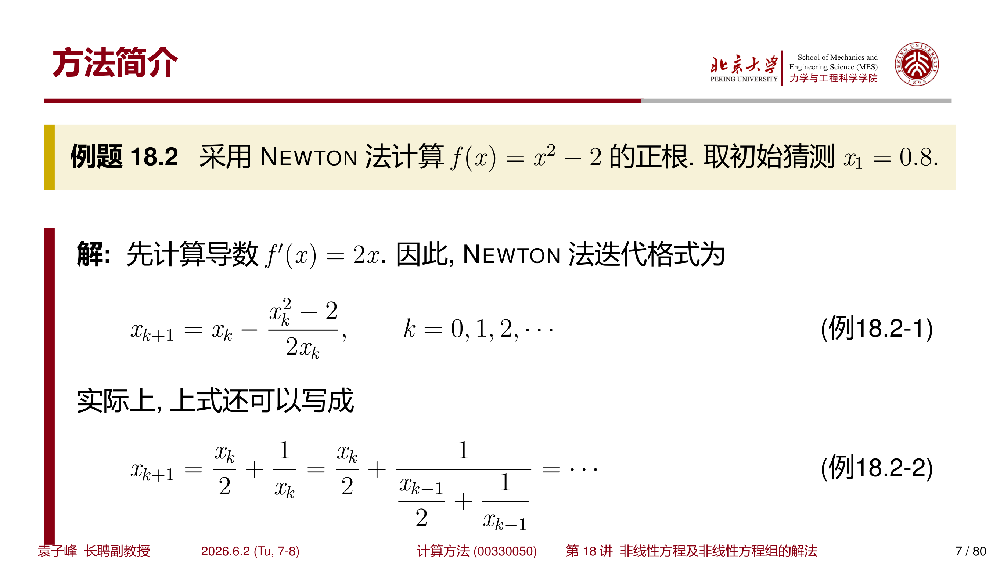
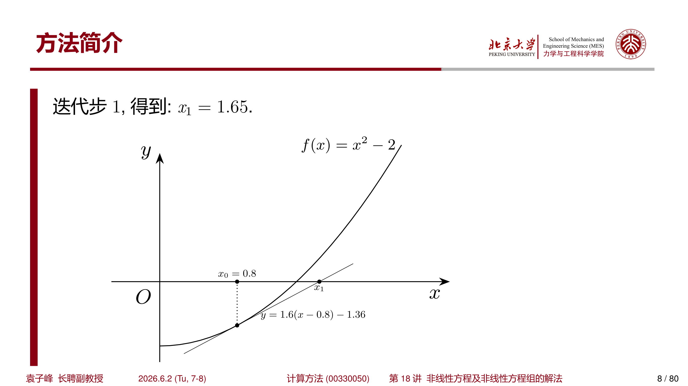
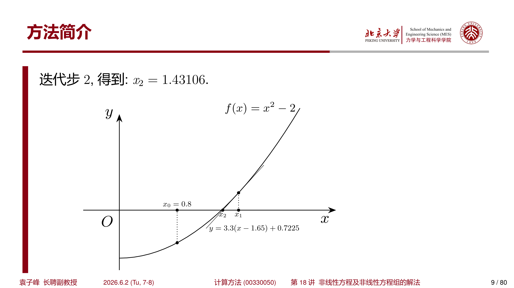
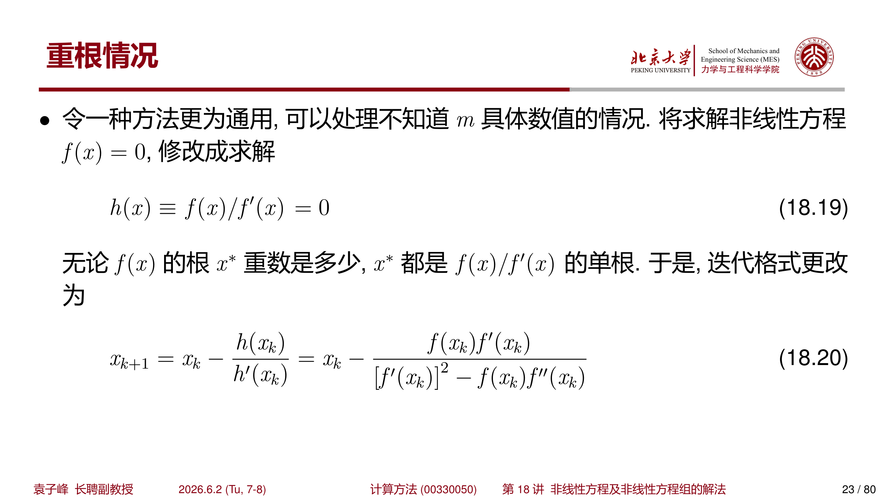

## 1 问题简介

### 1.1 根与重根

!!! abstract "定义 1.1（根与重根）"
    若存在 $x^*$ 使得

    $$
    f(x^*)=0
    $$

    则称 $x^*$ 为方程 $f(x)=0$ 的根，或函数 $f(x)$ 的零点。

    若

    $$
    f(x)=(x-x^*)^m g(x),\qquad g(x^*)\neq0
    $$

    其中 $m$ 为正整数，则称 $x^*$ 为 $m$ 重根。

### 1.2 根的存在性

!!! abstract "定理 1.1（介值定理）"
    设 $f(x)$ 在 $[a,b]$ 上连续，且

    $$
    f(a)f(b)<0
    $$

    则方程 $f(x)=0$ 在 $(a,b)$ 内至少存在一个根。

这一定理是二分法的基础：只要区间两端异号，就可以不断缩小含根区间。

---

## 2 二分法

### 2.1 方法思想

设 $f(x)$ 在 $[a,b]$ 上连续，且 $f(a)f(b)<0$。令

$$
p=\frac{a+b}{2}
$$

若 $f(p)=0$，则 $p$ 就是根；否则根据符号选择新的含根区间：

- 若 $f(a)f(p)<0$，根在 $[a,p]$；
- 若 $f(p)f(b)<0$，根在 $[p,b]$。

重复这个过程，直到区间长度小于指定阈值。

### 2.2 算法

#### 算法 2.1（二分法）

$$
\begin{aligned}
&\textbf{输入: } f,\ [a,b],\ f(a)f(b)<0,\ \varepsilon\\
&\textbf{输出: } x_0\\
&1.\quad \textbf{while } b-a>\varepsilon \textbf{ do}\\
&2.\quad\quad p\leftarrow a+\frac{b-a}{2}\\
&3.\quad\quad \textbf{if } \operatorname{sign}(f(p))=\operatorname{sign}(f(a)) \textbf{ then}\\
&4.\quad\quad\quad a\leftarrow p\\
&5.\quad\quad \textbf{else}\\
&6.\quad\quad\quad b\leftarrow p\\
&7.\quad\quad \textbf{end if}\\
&8.\quad \textbf{end while}\\
&9.\quad x_0\leftarrow a+\frac{b-a}{2}
\end{aligned}
$$

### 2.3 收敛性与稳定性

经过 $k$ 次二分后，区间长度为

$$
\frac{b-a}{2^k}
$$

因此若希望误差不超过 $\varepsilon$，只需

$$
k\geq \log_2\frac{b-a}{\varepsilon}
$$

二分法稳定、可靠，但收敛速度只有线性，且要求初始区间两端异号。

!!! warning "停止条件"
    不能把 $\varepsilon$ 设置得任意小。浮点计算中常取

    $$
    \varepsilon=\max\{|a|,|b|\}\cdot 2\varepsilon_{\mathrm{mach}}
    $$

    量级的下界，否则可能因为浮点精度限制导致迭代无法有效终止。

???+ example "例 2.1：二分法求根"
    求

    $$
    f(x)=\frac18x^3-\frac14x^2-1
    $$

    在 $[0.2,3.6]$ 中的根。

    有

    $$
    f(0.2)=-1.009,\qquad f(3.6)=1.592
    $$

    首次中点 $p=1.9$，$f(1.9)=-1.045125$，故根在 $[1.9,3.6]$。继续取中点 $2.75$、$3.175$、$2.9625$，不断缩小区间，最终收敛到约

    $$
    x^*\approx 2.93114
    $$

---

## 3 不动点迭代法

### 3.1 不动点

!!! abstract "定义 3.1（不动点）"
    若

    $$
    \phi(x^*)=x^*
    $$

    则称 $x^*$ 为函数 $\phi(x)$ 的不动点。

将方程 $f(x)=0$ 改写成等价形式

$$
x=\phi(x)
$$

即可构造迭代格式

$$
x_{k+1}=\phi(x_k),\qquad k=0,1,2,\cdots
$$

若 $x_k\to x^*$，则 $x^*$ 是不动点，也对应原方程的根。

### 3.2 算法

#### 算法 3.1（不动点迭代法）

$$
\begin{aligned}
&\textbf{输入: } \phi(x),\ x_0,\ N,\ \varepsilon\\
&\textbf{输出: } x_f\\
&1.\quad k\leftarrow0,\ x\leftarrow x_0\\
&2.\quad \textbf{while } k<N \textbf{ do}\\
&3.\quad\quad y\leftarrow \phi(x)\\
&4.\quad\quad \textbf{if } |y-x|<\varepsilon \textbf{ then break}\\
&5.\quad\quad k\leftarrow k+1\\
&6.\quad\quad x\leftarrow y\\
&7.\quad \textbf{end while}\\
&8.\quad x_f\leftarrow y
\end{aligned}
$$

### 3.3 收敛定理

!!! abstract "定理 3.1（压缩映射条件）"
    设 $\phi(x)$ 在 $[a,b]$ 上连续可导，并满足：

    $$
    a\leq \phi(x)\leq b,\qquad x\in[a,b]
    $$

    且存在常数 $0<L<1$，使得

    $$
    |\phi'(x)|\leq L,\qquad x\in[a,b]
    $$

    则：

    - $\phi(x)$ 在 $[a,b]$ 上存在唯一不动点 $x^*$；
    - 对任意 $x_0\in[a,b]$，迭代 $x_{k+1}=\phi(x_k)$ 都收敛到 $x^*$；
    - 误差满足

    $$
    |x_k-x^*|\leq L^k|x_0-x^*|
    $$

!!! tip "判断迭代格式好坏"
    同一个方程可以改写成多个不动点格式。收敛性主要取决于根附近 $|\phi'(x^*)|$ 的大小：小于 1 通常收敛，越小越快；大于 1 往往发散。

???+ example "例 3.1：不同迭代格式"
    对

    $$
    \frac18x^3-\frac14x^2-1=0
    $$

    可构造多种等价格式，例如

    $$
    x=\phi_1(x)=\frac18x^3-\frac14x^2+x-1
    $$

    $$
    x=\phi_2(x)=\sqrt[3]{2x^2+8}
    $$

    $$
    x=\phi_3(x)=2+\frac{8}{x^2}
    $$

    初值取 $x_0=1$ 时，课件数值结果显示 $\phi_1$ 发散，而 $\phi_2,\phi_3$ 收敛到同一根附近。这说明“方程等价”不代表“迭代行为等价”。

---

## 4 收敛阶与误差分析

### 4.1 收敛阶

设迭代序列 $x_k\to x^*$，误差 $e_k=x_k-x^*$。若存在 $p\geq1$ 和 $C>0$，使得

$$
\lim_{k\to\infty}\frac{|e_{k+1}|}{|e_k|^p}=C
$$

则称该迭代具有 $p$ 阶收敛。

- $p=1$：线性收敛；
- $p=2$：二阶收敛；
- $p>1$：超线性收敛。

### 4.2 不动点迭代的局部误差

由 Taylor 展开

$$
x_{k+1}-x^*
=\phi(x_k)-\phi(x^*)
=\phi'(x^*)e_k+\frac12\phi''(x^*)e_k^2+\cdots
$$

若 $\phi'(x^*)\neq0$ 且 $|\phi'(x^*)|<1$，则通常为线性收敛：

$$
e_{k+1}\approx \phi'(x^*)e_k
$$

若 $\phi'(x^*)=0$ 且 $\phi''(x^*)\neq0$，则通常为二阶收敛：

$$
e_{k+1}\approx \frac12\phi''(x^*)e_k^2
$$

---

## 5 松弛法

### 5.1 松弛迭代

对方程 $f(x)=0$，可构造

$$
x_{k+1}=x_k-\omega f(x_k)
$$

其中 $\omega$ 为松弛因子。它也可看成不动点迭代：

$$
\phi(x)=x-\omega f(x)
$$

在根 $x^*$ 附近，

$$
\phi'(x^*)=1-\omega f'(x^*)
$$

若希望局部收敛，需要

$$
|1-\omega f'(x^*)|<1
$$

即当 $f'(x^*)>0$ 时，通常要求

$$
0<\omega<\frac{2}{f'(x^*)}
$$

### 5.2 最优局部选择

若能取

$$
\omega=\frac1{f'(x^*)}
$$

则 $\phi'(x^*)=0$，局部收敛阶可由线性提升到二阶。这正是 Newton 法的思想来源：用当前点的导数近似根处导数。

---

## 6 Newton 法

### 6.1 迭代格式

对 $f(x)=0$，在 $x_k$ 处作一阶 Taylor 展开：

$$
f(x)\approx f(x_k)+f'(x_k)(x-x_k)
$$

令右端为 0，得到 Newton 迭代：

$$
x_{k+1}=x_k-\frac{f(x_k)}{f'(x_k)}
$$

### 6.2 几何意义

Newton 法用曲线在当前点的切线与 $x$ 轴的交点作为下一次近似。因此若初值足够靠近单根且 $f'(x^*)\neq0$，通常收敛非常快。

用几何语言描述，第 $k$ 步迭代时，点 $(x_{k+1}, 0)$ 是曲线 $y=f(x)$ 在点 $(x_k, f(x_k))$ 处的切线

$$
y-f(x_k)=f'(x_k)(x-x_k)
$$

与 $x$ 轴的交点，如下图所示。

{ width="600" }

{ width="600" }

{ width="600" }

从图中可以看到，Newton 法迭代迅速逼近真实根 $x^*=\sqrt{2}\approx1.4142$。

### 6.3 收敛性分析

!!! abstract "定理 6.1（Newton 法局部二阶收敛）"
    假设 $f(x)$ 二阶可导，如果 $x_0$ 充分接近 $f(x)$ 的一个单根 $x^*$，并且 $f'(x)\neq0$ 在根附近成立，那么 Newton 法收敛于 $x^*$，并且收敛速度为 **二阶**。即存在常数

    $$
    c=\frac{f''(x^*)}{2f'(x^*)}
    $$

    使得

    $$
    \lim_{k\to\infty}\frac{|x_{k+1}-x^*|}{|x_k-x^*|^2}=c
    $$

??? note "证明"
    根据 $f(x)$ 在 $x=x_k$ 处的 Taylor 展开：

    $$
    f(x)=f(x_k)+(x-x_k)f'(x_k)+\frac{(x-x_k)^2}{2}f''(\xi_k)
    $$

    其中 $\xi_k$ 是 $x$ 与 $x_k$ 之间的某个数。令 $x=x^*$，并根据 $f(x^*)=0$，得到

    $$
    0=f(x_k)+(x^*-x_k)f'(x_k)+\frac{(x^*-x_k)^2}{2}f''(\xi_k)
    $$

    假设 $f'(x_k)\neq0$，整理得

    $$
    x^*=x_k-\frac{f(x_k)}{f'(x_k)}-\frac{(x^*-x_k)^2f''(\xi_k)}{2f'(x_k)}
    $$

    将 Newton 迭代格式 $x_{k+1}=x_k-\dfrac{f(x_k)}{f'(x_k)}$ 代入上式，得到误差关系：

    $$
    x_{k+1}-x^*=\frac{f''(\xi_k)}{2f'(x_k)}(x^*-x_k)^2
    $$

    因此，对上式求极限，并根据 $\xi_k$ 介于 $x_k$ 与 $x^*$ 之间，可以得到 $\lim_{k\to\infty}\xi_k=x^*$。于是定理得证。$\square$

!!! tip "直观理解"
    Newton 法之所以能达到二阶收敛，本质上是利用了一阶 Taylor 展开来局部逼近函数。在单根附近，线性近似足够好，因此误差平方衰减。

???+ example "例 6.1：Newton 法求解 $f(x)=x^2-2$"
    采用 Newton 法计算 $f(x)=x^2-2$ 的正根，取初始猜测 $x_0=0.8$。

    导数 $f'(x)=2x$，因此 Newton 迭代格式为

    $$
    x_{k+1}=x_k-\frac{x_k^2-2}{2x_k}=\frac{x_k}{2}+\frac{1}{x_k}
    $$

    各阶迭代结果及与真实解 $x^*=\sqrt{2}$ 的误差如下：

    | $k$ | $x_k$ | $|e_k|$ |
    | --- | --- | --- |
    | 0 | 0.80000000 | $6.14\times10^{-1}$ |
    | 1 | 1.65000000 | $2.36\times10^{-1}$ |
    | 2 | 1.43106061 | $1.68\times10^{-2}$ |
    | 3 | 1.41431273 | $9.92\times10^{-5}$ |
    | 4 | 1.41421357 | $3.48\times10^{-9}$ |
    | 5 | 1.41421356 | $2.22\times10^{-16}$ |

    可以看到误差从 $10^{-1}$ 量级迅速降到 $10^{-16}$，每步有效数字约翻倍，充分展示了二阶收敛的速度。

### 6.4 重根情况

若 $f(x)$ 在 $x=x^*$ 处有 $m$ 重根 $(m>1)$，即

$$
f(x)=(x-x^*)^m g(x)
$$

其中 $g(x^*)\neq0$，并假设 $g(x)$ 有二阶导数。此时

$$
f'(x^*)=0,\quad f''(x^*)=0,\quad\cdots,\quad f^{(m-1)}(x^*)=0
$$

Newton 法的标准迭代格式在重根处的收敛性会发生变化。从误差入手：

$$
e_{k+1}=x_{k+1}-x^*=x_k-\frac{f(x_k)}{f'(x_k)}-x^*=e_k-\frac{f(x_k)}{f'(x_k)}
$$

于是

$$
\frac{e_{k+1}}{e_k}=1-\frac{f(x_k)-f(x^*)}{f'(x_k)(x_k-x^*)}=1-\frac{\frac{1}{m!}f^{(m)}(\xi_k)(x_k-x^*)^m}{\frac{1}{(m-1)!}f^{(m)}(\eta_k)(x_k-x^*)^{m-1}\cdot(x_k-x^*)}=1-\frac{f^{(m)}(\xi_k)}{mf^{(m)}(\eta_k)}
$$

其中 $\xi_k$ 和 $\eta_k$ 为介于 $x_k$ 与 $x^*$ 之间的两个数。令 $k\to\infty$ 求极限，得到收敛阶为 $1-\dfrac{1}{m}$。于是，在重根的情况下，Newton 法不再是平方收敛。

!!! warning "重根使 Newton 法降阶"
    当 $m=2$（二重根）时，Newton 法的收敛阶降为 $1-\dfrac{1}{2}=0.5$，这甚至比线性收敛还要慢（误差比趋于 1），实际表现为次线性收敛。

#### 改善重根收敛性的方法

**方法一**：已知重数 $m$

将迭代格式更换成

$$
x_{k+1}=x_k-\frac{mf(x_k)}{f'(x_k)}
$$

此时误差比为

$$
\frac{e_{k+1}}{e_k}=1-\frac{mf(x_k)-mf(x^*)}{f'(x_k)(x_k-x^*)}=1-\frac{f^{(m)}(\xi_k)}{f^{(m)}(\eta_k)}\to0
$$

恢复了二阶收敛。

**方法二**：未知重数 $m$

令

$$
h(x)\equiv\frac{f(x)}{f'(x)}=0
$$

无论 $f(x)$ 的根 $x^*$ 重数是多少，$x^*$ 都是 $h(x)$ 的 **单根**。于是对 $h(x)=0$ 应用 Newton 法，迭代格式为

$$
x_{k+1}=x_k-\frac{h(x_k)}{h'(x_k)}=x_k-\frac{f(x_k)f'(x_k)}{[f'(x_k)]^2-f(x_k)f''(x_k)}
$$

这种方法不需要预先知道重数 $m$，同样能恢复二阶收敛。

???+ example "例 6.2：重根处的收敛对比"
    考虑 $f(x)=(x-1)^2(x+1)$，在 $x^*=1$ 处有二重根。分别采用标准 Newton 法、改进方法 1（已知 $m=2$）和改进方法 2（$h(x)$ 方法）进行迭代。

    三种方法的迭代格式依次为：

    **标准 Newton 法**：

    $$
    x_{k+1}=x_k-\frac{x_k^3-x_k^2-x_k+1}{3x_k^2-2x_k-1}
    $$

    **改进方法 1**：

    $$
    x_{k+1}=x_k-\frac{2(x_k^3-x_k^2-x_k+1)}{3x_k^2-2x_k-1}
    $$

    **改进方法 2**：

    $$
    x_{k+1}=x_k-\frac{(x_k^3-x_k^2-x_k+1)(3x_k^2-2x_k-1)}{(3x_k^2-2x_k-1)^2-(x_k^3-x_k^2-x_k+1)(6x_k-2)}
    $$

    数值实验得到的绝对误差随迭代次数的变化如下图所示。

    { width="600" }

    从图中可以清楚看到：标准 Newton 法收敛极慢（次线性），而两种改进方法都快速达到机器精度。

### 6.5 收敛域的改善

Newton 法要求初始值 $x_0$ 足够接近方程的根 $x^*$；否则，Newton 法可能不收敛。

???+ example "例 6.3：Newton 法发散的例子"
    验证 Newton 法计算非线性方程

    $$
    f(x)=-x^4+3x^2+2=0
    $$

    取初值 $x_0=1$。迭代格式为

    $$
    x_{k+1}=x_k-\frac{-x_k^4+3x_k^2+2}{-4x_k^3+6x_k}
    $$

    计算得到迭代序列：

    $$
    x_1=-1,\quad x_2=1,\quad x_3=-1,\quad x_4=1,\quad\cdots
    $$

    迭代在 $-1$ 和 $1$ 之间震荡，永不收敛。

    { width="500" }

#### 阻尼 Newton 法

为了扩大 Newton 法的收敛域，一种常见的改进称为 **阻尼 Newton 法**。在阻尼 Newton 迭代中，增加参数 $\alpha_k$：

$$
x_{k+1}=x_k-\alpha_k\frac{f(x_k)}{f'(x_k)},\quad k=0,1,2,\cdots
$$

其中参数 $\alpha_k$ 使得不等式

$$
|f(x_{k+1})|<|f(x_k)|
$$

成立。通常 $\alpha_k$ 可以通过线搜索（line search）来确定，例如从 $\alpha_k=1$ 开始，若不满足下降条件则不断减半，直到满足条件为止。

!!! tip "阻尼 Newton 法的意义"
    阻尼因子 $\alpha_k$ 的作用是在 Newton 方向上寻找一个更保守的步长，避免"跨过"真实根导致发散。当接近根时，通常 $\alpha_k\to1$，恢复标准 Newton 法的二阶收敛速度。

---

## 7 Aitken 加速

### 7.1 线性收敛序列的加速

设序列 $x_k\to x^*$ 线性收敛，并近似满足

$$
\frac{x_{k+2}-x^*}{x_{k+1}-x^*}
\approx
\frac{x_{k+1}-x^*}{x_k-x^*}
$$

解这个关系可得对极限的加速估计：

$$
\hat{x}_k
=x_k-\frac{(x_{k+1}-x_k)^2}{x_{k+2}-2x_{k+1}+x_k}
$$

这称为 **Aitken** $\Delta^2$ **加速法**。

### 7.2 适用条件

Aitken 法适合近似线性收敛的序列。如果分母

$$
x_{k+2}-2x_{k+1}+x_k
$$

接近 0，则加速结果可能数值不稳定。

???+ example "例 7.1：Aitken 加速"
    对线性收敛序列

    $$
    a_k=\frac1{2^k}+\frac1{3^k}
    $$

    有 $a_k\to0$，且主导误差约为 $2^{-k}$。Aitken 加速可以显著消去主导线性误差项，使新序列更快靠近 0。

---

## 8 Steffensen 方法

### 8.1 从 Aitken 到 Steffensen

对不动点迭代 $x_{k+1}=\phi(x_k)$，有

$$
x_{k+2}=\phi(\phi(x_k))
$$

将 Aitken 加速直接写成只依赖当前点的迭代函数：

$$
\hat{\phi}(x)
=x-\frac{[\phi(x)-x]^2}{\phi(\phi(x))-2\phi(x)+x}
$$

等价地，

$$
\hat{\phi}(x)
=\frac{x\phi(\phi(x))-\phi^2(x)}
{\phi(\phi(x))-2\phi(x)+x}
$$

于是 Steffensen 迭代为

$$
x_{k+1}=\hat{\phi}(x_k)
$$

### 8.2 特点

Steffensen 法不显式使用导数，却常能达到类似 Newton 法的二阶收敛效果。代价是每步通常需要计算两次 $\phi$。

???+ example "例 8.1：Steffensen 加速"
    求

    $$
    e^x+10x-2=0
    $$

    可写为不动点格式

    $$
    x_{k+1}=0.2-0.1e^{x_k}
    $$

    初值取 $x_0=0$。普通迭代约十几步收敛到

    $$
    x^*\approx0.090525101307255
    $$

    Steffensen 加速后，只需少量迭代即可达到相近精度。

---

## 9 Ramanujan 迭代法

### 9.1 基本形式

Ramanujan 迭代法用于处理形如

$$
f(x)=1-(a_1x+a_2x^2+\cdots)=0
$$

的方程。构造级数

$$
\frac1{f(x)}=\sum_{n=0}^{\infty}b_nx^n
$$

比较系数可得递推：

$$
b_0=1
$$

$$
b_n=a_nb_0+a_{n-1}b_1+\cdots+a_1b_{n-1}
$$

若极限

$$
\lim_{n\to\infty}\frac{b_n}{b_{n+1}}=c
$$

存在，则 $c$ 对应方程中模最小的根。

### 9.2 例子

???+ example "例 9.1：二次方程"
    对

    $$
    f(x)=1-x-2x^2
    $$

    有 $a_1=1,\ a_2=2,\ a_n=0\ (n\geq3)$。递推生成的比值

    $$
    \frac{b_n}{b_{n+1}}
    $$

    逐渐趋近于 $0.5$，对应方程的模最小根。

???+ example "例 9.2：超越方程"
    对

    $$
    f(x)=1-\frac{x}{10}e^x
    $$

    展开得

    $$
    a_n=\frac1{10(n-1)!},\qquad n=1,2,\cdots
    $$

    递推计算 $b_n$ 后，比值 $b_n/b_{n+1}$ 收敛到

    $$
    1.74552800\cdots
    $$

    这给出了该超越方程的一个根。

---

## 10 弦位法（割线法）

弦位法是一系列与 Newton 迭代法类似、但 **不用计算函数导数** $f'(x)$ 的算法。本节介绍两种弦位法：双点弦位法与单点弦位法。

### 10.1 双点弦位法

双点弦位法将函数的导数近似成差商：

$$
f'(x_k)\approx\frac{f(x_k)-f(x_{k-1})}{x_k-x_{k-1}}
$$

代入 Newton 迭代格式，得到双点弦位法的迭代格式：

$$
x_{k+1}=x_k-\frac{x_k-x_{k-1}}{f(x_k)-f(x_{k-1})}\cdot f(x_k)
$$

!!! tip "几何意义"
    双点弦位法用曲线在 $(x_{k-1},f(x_{k-1}))$ 与 $(x_k,f(x_k))$ 两点之间的 **割线** 与 $x$ 轴的交点作为下一次近似，因此也称为 **割线法**。

???+ example "例 10.1：双点弦位法求 $f(x)=x^2-2$ 的正根"
    取初值 $x_0=0.8,\ x_1=2$。

    第一次迭代：

    $$
    x_2=x_1-\frac{x_1-x_0}{f(x_1)-f(x_0)}\cdot f(x_1)=2-\frac{2-0.8}{2-(-0.36)}\cdot2\approx1.30508
    $$

    { width="500" }

    第二次迭代：

    $$
    x_3=x_2-\frac{x_2-x_1}{f(x_2)-f(x_1)}\cdot f(x_2)\approx1.40254
    $$

    { width="500" }

#### 算法

$$
\begin{aligned}
& \textbf{算法: } \text{双点弦位法} \\
& \textbf{输入: } f(x),\ x_0,\ x_1,\ N,\ \varepsilon \\
& \textbf{输出: } x \approx x^* \\
& 1. \quad k \leftarrow 0 \\
& 2. \quad \textbf{while } k < N \textbf{ do} \\
& 3. \quad \quad x_2 \leftarrow x_0 - f(x_0) \cdot \frac{x_1 - x_0}{f(x_1) - f(x_0)} \\
& 4. \quad \quad \textbf{if } |x_2 - x_1| < \varepsilon \textbf{ then} \\
& 5. \quad \quad \quad \textbf{return } x_2 \\
& 6. \quad \quad \textbf{end if} \\
& 7. \quad \quad x_0 \leftarrow x_1;\quad x_1 \leftarrow x_2 \\
& 8. \quad \quad k \leftarrow k + 1 \\
& 9. \quad \textbf{end while} \\
& 10. \quad \textbf{return } x_1
\end{aligned}
$$

#### 收敛性分析

!!! abstract "定理 10.1（双点弦位法的收敛阶）"
    假设 $f(x)$ 在某个根 $x=x^*$ 的邻域内两次可导且 $f'(x)\neq0$。如果初值 $x_0, x_1$ 足够接近 $x^*$，则双点弦位法收敛至 $x^*$，并且收敛阶为

    $$
    p=\frac{1+\sqrt{5}}{2}\approx1.618
    $$

    即黄金分割比，且

    $$
    \lim_{k\to\infty}\frac{x^*-x_{k+1}}{(x^*-x_k)^p}=\frac{f''(x^*)}{2f'(x^*)}
    $$

??? note "证明"
    对于 $x_{k-1}$ 与 $x_k$，定义线性插值函数：

    $$
    s_k(x)\equiv f(x_k)+(x-x_k)\frac{f(x_k)-f(x_{k-1})}{x_k-x_{k-1}}
    $$

    则有 $s_k(x_k)=f(x_k)$，$s_k(x_{k-1})=f(x_{k-1})$。双点弦位法中 $s_k(x_{k+1})=0$。

    考察 $s_k(x)$ 与 $f(x)$ 的误差项 $f(x)-s_k(x)$。构造辅助函数：

    $$
    g(x;t)=f(x)-s_k(x)-\frac{(x-x_k)(x-x_{k-1})}{(t-x_k)(t-x_{k-1})}(f(t)-s_k(t)),\quad t\in(x_{k-1},x_k)
    $$

    根据罗尔定理，存在 $\eta\in(x_{k-1},t)$ 及 $\zeta\in(t,x_k)$，使得 $g'(\eta;t)=0$，$g'(\zeta;t)=0$。再次使用罗尔定理，存在 $\xi_k\in(\eta,\zeta)$ 使得 $g''(\xi_k;t)=0$，即

    $$
    f''(\xi_k)-\frac{2(f(t)-s_k(t))}{(t-x_k)(t-x_{k-1})}=0
    $$

    于是

    $$
    f(x)-s_k(x)=\frac{1}{2}(x-x_k)(x-x_{k-1})f''(\xi_k)
    $$

    考虑到 $f(x^*)=0$，于是有

    $$
    -s_k(x^*)=\frac{1}{2}(x^*-x_k)(x^*-x_{k-1})f''(\xi_k)
    $$

    同时双点弦位法要求 $s_k(x_{k+1})=0$，于是上式可改写成

    $$
    s_k(x_{k+1})-s_k(x^*)=\frac{1}{2}(x^*-x_k)(x^*-x_{k-1})f''(\xi_k)
    $$

    根据微分中值定理，存在 $\omega_k$ 使得

    $$
    s_k(x_{k+1})-s_k(x^*)=s_k'(\omega_k)(x_{k+1}-x^*)
    $$

    于是得到

    $$
    x_{k+1}-x^*=(x_k-x^*)(x_{k-1}-x^*)\frac{f''(\xi_k)}{2s_k'(\omega_k)}
    $$

    根据收敛阶的定义，假设

    $$
    \lim_{k\to\infty}\frac{x^*-x_{k+1}}{(x^*-x_k)^p}=c,\quad
    \lim_{k\to\infty}\frac{x^*-x_k}{(x^*-x_{k-1})^p}=c
    $$

    比较上式的阶数，得到 $p^2=p+1$，因此 $p=\dfrac{1+\sqrt{5}}{2}$。$\square$

### 10.2 单点弦位法

单点弦位法将 $f'(x_k)$ 近似成

$$
f'(x_k)\approx\frac{f(x_k)-f(x_0)}{x_k-x_0}
$$

即始终固定一个端点 $x_0$，迭代格式为

$$
x_{k+1}=x_k-\frac{x_k-x_0}{f(x_k)-f(x_0)}\cdot f(x_k)
$$

!!! tip "与双点弦位法的区别"
    双点弦位法每次迭代更新两个最近的点，而单点弦位法固定一个端点 $x_0$ 不变，只更新另一个端点。这导致两者的收敛阶不同。

!!! abstract "定理 10.2（单点弦位法的收敛阶）"
    假设 $f(x)$ 在某个根 $x=x^*$ 的邻域内两次可导且 $f'(x)\neq0$。如果初值 $x_0, x_1$ 足够接近 $x^*$，则单点弦位法收敛至 $x^*$，并且收敛阶为 **一阶** （$p=1$），且

    $$
    \lim_{k\to\infty}\frac{x^*-x_{k+1}}{x^*-x_k}=(x_0-x^*)\frac{f''(x^*)}{2f'(x^*)}
    $$

??? note "证明"
    类似双点弦位法的证明，对于固定的 $x_0$ 与 $x_k$，定义线性插值函数：

    $$
    s_k(x)\equiv f(x_k)+(x-x_k)\frac{f(x_k)-f(x_0)}{x_k-x_0}
    $$

    重复证明过程，存在介于 $x_0$ 与 $x_k$ 的 $\xi_k$，使得

    $$
    f(x)-s_k(x)=\frac{1}{2}(x-x_k)(x-x_0)f''(\xi_k)
    $$

    考虑到 $f(x^*)=0$ 以及单点弦位法要求 $s_k(x_{k+1})=0$，于是有

    $$
    s_k(x_{k+1})-s_k(x^*)=\frac{1}{2}(x^*-x_k)(x^*-x_0)f''(\xi_k)
    $$

    根据微分中值定理，存在 $\omega_k$ 使得

    $$
    s_k(x_{k+1})-s_k(x^*)=s_k'(\omega_k)(x_{k+1}-x^*)
    $$

    于是得到

    $$
    x_{k+1}-x^*=(x_k-x^*)(x_0-x^*)\frac{f''(\xi_k)}{2s_k'(\omega_k)}
    $$

    由于 $x_0-x^*$ 为常数（不趋于 0），比较阶数得到 $p=1$。$\square$

---

## 11 Müller 法（抛物线法）

弦位法采用当前两个近似解进行迭代。将这个思路推广，即采用当前 **三个** 近似解来确定下一个迭代近似解，这个方法就是 **Müller 法**，也称为 **抛物线法**。

### 11.1 方法思想

当前三个插值点记作 $(x_{k-2},f(x_{k-2}))$、$(x_{k-1},f(x_{k-1}))$ 与 $(x_k,f(x_k))$。一个简单直接的想法就是将这三个点插值得到 Lagrange 多项式 $L_k(x)$，然后求解 $L_k(x)=0$ 获得 $x_{k+1}$。

为了方便计算，将迭代格式记为

$$
x_{k+1}=x_k+\lambda_{k+1}(x_k-x_{k-1})
$$

同样也就有

$$
x_k=x_{k-1}+\lambda_k(x_{k-1}-x_{k-2}),\quad\Rightarrow\quad\lambda_k=\frac{x_k-x_{k-1}}{x_{k-1}-x_{k-2}}
$$

于是二次方程 $L_k(x_{k+1})=0$ 可以整理成关于 $\lambda_{k+1}$ 的二次方程：

$$
a\lambda_{k+1}^2+b\lambda_{k+1}+c=0
$$

其中

$$
\begin{cases}
a=f(x_{k-2})\lambda_k^2-f(x_{k-1})\lambda_k(1+\lambda_k)+f(x_k)\lambda_k\\[6pt]
b=f(x_{k-2})\lambda_k^2-f(x_{k-1})(1+\lambda_k)^2+f(x_k)(2\lambda_k+1)\\[6pt]
c=f(x_k)(1+\lambda_k)
\end{cases}
$$

求解 $L_k(\lambda_{k+1})=0$，并选取 **绝对值较小** 的 $\lambda_{k+1}$（保证收敛），更新 $x_{k+1}$。

!!! info "两种 Müller 法"
    上述 Müller 法用 $y=L_k(x)$ 形式的抛物线，不能保证实根的存在性。因此也可以通过构造形如 $x=ay^2+by+c$ 的开口向 $x$ 轴正（负）方向的抛物线来保证解的存在性。只要 $f(x_{k-2}), f(x_{k-1}), f(x_k)$ 不全相等，就可以保证抛物线构造成功。

    两种 Müller 法的收敛率都是 $p\approx1.839$，介于双点弦位法（$p\approx1.618$）和 Newton 法（$p=2$）之间。

---

## 12 非线性方程组的 Newton 法

解单个非线性方程的方法可以进一步推广至求解非线性方程组

$$
\begin{cases}
f_1(x_1,x_2,\cdots,x_n)=0\\
f_2(x_1,x_2,\cdots,x_n)=0\\
\quad\vdots\\
f_n(x_1,x_2,\cdots,x_n)=0
\end{cases}
$$

或者简写成向量形式

$$
\boldsymbol{f}(\boldsymbol{x})=\boldsymbol{0}
$$

### 12.1 从极值问题到方程组

从多变量标量函数的极值问题

$$
\min_{\boldsymbol{x}\in\mathbb{R}^n}\phi(\boldsymbol{x})
$$

如果 $\phi(\boldsymbol{x})$ 满足一定可导性，那么极值问题对应于找到驻点 $\boldsymbol{x}$ 使得

$$
\nabla\phi(\boldsymbol{x})=\boldsymbol{0}
$$

这正是一个非线性方程组求零点的问题（注意极大值/极小值问题还需要判断 Hessian 的正定/负定性质）。

### 12.2 Newton 迭代格式

非线性方程组同样可以通过 Newton 迭代法求解。对 $\boldsymbol{f}(\boldsymbol{x})$ 在点 $\boldsymbol{x}^{(0)}$ 处做 Taylor 展开，并只保留线性部分：

$$
\boldsymbol{f}(\boldsymbol{x})\approx\boldsymbol{f}(\boldsymbol{x}^{(0)})+\boldsymbol{J}(\boldsymbol{x}^{(0)})(\boldsymbol{x}-\boldsymbol{x}^{(0)})
$$

其中 $\boldsymbol{J}$ 为 Jacobi 矩阵：

$$
\boldsymbol{J}(\boldsymbol{x})=
\begin{bmatrix}
\dfrac{\partial f_1}{\partial x_1} & \dfrac{\partial f_1}{\partial x_2} & \cdots & \dfrac{\partial f_1}{\partial x_n}\\[8pt]
\dfrac{\partial f_2}{\partial x_1} & \dfrac{\partial f_2}{\partial x_2} & \cdots & \dfrac{\partial f_2}{\partial x_n}\\[8pt]
\vdots & \vdots & \ddots & \vdots\\[8pt]
\dfrac{\partial f_n}{\partial x_1} & \dfrac{\partial f_n}{\partial x_2} & \cdots & \dfrac{\partial f_n}{\partial x_n}
\end{bmatrix}
$$

令线性近似等于 $\boldsymbol{0}$，得到线性方程组：

$$
\boldsymbol{J}(\boldsymbol{x}^{(0)})\Delta\boldsymbol{x}^{(0)}=-\boldsymbol{f}(\boldsymbol{x}^{(0)})
$$

当 Jacobi 矩阵可逆时，解出 $\Delta\boldsymbol{x}^{(0)}$，于是下一个迭代解更新为

$$
\boldsymbol{x}^{(1)}=\boldsymbol{x}^{(0)}+\Delta\boldsymbol{x}^{(0)}
$$

一般地，非线性方程组的 Newton 迭代格式为

$$
\boldsymbol{x}^{(k+1)}=\boldsymbol{x}^{(k)}-\left[\boldsymbol{J}(\boldsymbol{x}^{(k)})\right]^{-1}\boldsymbol{f}(\boldsymbol{x}^{(k)})
$$

实际计算中不直接求逆矩阵，而是解线性方程组 $\boldsymbol{J}(\boldsymbol{x}^{(k)})\Delta\boldsymbol{x}^{(k)}=-\boldsymbol{f}(\boldsymbol{x}^{(k)})$ 得到修正量 $\Delta\boldsymbol{x}^{(k)}$。

!!! tip "计算代价"
    每步 Newton 迭代需要：计算 $n$ 个函数值、计算 $n^2$ 个偏导数（或数值差分近似）、求解一个 $n\times n$ 线性方程组。因此非线性方程组的 Newton 法计算量较大，但具有局部二阶收敛性。

---

## 13 拓展：Halley 迭代法

Edmund Halley（1656-1742）不仅以预测哈雷彗星轨道闻名，在数学上也有重要贡献。他在 1684 年提出了两种利用 **二阶导数** 获得高阶收敛率的迭代法。

### 13.1 第一种形式

令 Taylor 展开保留到二阶：

$$
0=f(x_k)+(x_{k+1}-x_k)f'(x_k)+\frac{1}{2}(x_{k+1}-x_k)^2f''(x_k)
$$

解这个关于 $x_{k+1}$ 的二次方程，得到

$$
x_{k+1}=x_k-\frac{2f(x_k)}{f'(x_k)\pm\sqrt{[f'(x_k)]^2-2f(x_k)f''(x_k)}}
$$

分母上的 $\pm$ 选择使分母绝对值更大的符号。

### 13.2 第二种形式（有理函数逼近）

定义有理函数

$$
R(x)=\frac{a-x}{bx+c}
$$

计算 $a, b, c$ 使得 $R(x)$ 与 $f(x)$ 在 $x_k$ 处具有相同的函数值和一阶、二阶导数值。利用 $R(x)=0$ 的根 $x=a$ 作为下一次近似，得到迭代格式：

$$
x_{k+1}=x_k-\frac{2f(x_k)f'(x_k)}{2[f'(x_k)]^2-f(x_k)f''(x_k)}
$$

!!! info "Halley 法的收敛阶"
    Halley 迭代法利用了三阶信息（函数值、一阶导、二阶导），收敛阶可达 **三阶** （立方收敛），但每步需要计算二阶导数，实际应用不如 Newton 法广泛。

---

## 14 拓展：快速平方根求解法（Quake III 中的 InvSqrt）

### 14.1 一段传奇代码

在 2003 年，论坛 gamedev.net 上出现了一段传奇代码：

```c
float InvSqrt(float x) {
    float xhalf = 0.5f * x;
    int i = *(int*)&x;
    i = 0x5f3759df - (i >> 1);
    x = *(float*)&i;
    x = x * (1.5f - xhalf * x * x);
    return x;
}
```

这段代码计算的是 $1/\sqrt{x}$，据称比标准库 `(float)(1.0/sqrt(x))$ 快约 4 倍。代码中神秘的十六进制常数 `0x5f3759df` 引起了许多人的关注。

### 14.2 背后的 Newton 迭代

对于给定实数 $x>0$，定义非线性函数：

$$
f(y)=\frac{1}{y^2}-x
$$

于是 $f(y)=0$ 的根即为 $1/\sqrt{x}$（正根）。Newton 迭代格式为

$$
y_{k+1}=y_k-\frac{f(y_k)}{f'(y_k)}=y_k-\frac{\frac{1}{y_k^2}-x}{-\frac{2}{y_k^3}}=\frac{1}{2}y_k(3-xy_k^2)
$$

与代码中的

```c
x = x * (1.5f - xhalf * x * x);
```

完全一致！

### 14.3 魔法常数的来源

这段代码的精髓在于：**只进行了一次 Newton 迭代**，但初始猜测值 `0x5f3759df - (i >> 1)` 极其精确。

利用 IEEE 754 单精度浮点数的存储格式：

$$
x=(-1)^s(1+M)\cdot2^{E-127}
$$

其中 $s$ 为符号位，$E$ 为指数位，$M$ 为尾数位。对于 $x>0$，有 $s=0$，即

$$
x=(1+M)\cdot2^{E-127}
$$

于是

$$
y=\frac{1}{\sqrt{x}}=\frac{1}{\sqrt{1+M}}\cdot2^{-(E-127)/2}
$$

通过将浮点数 reinterpret 为整数、右移一位、再减去魔法常数，本质上是在对指数和尾数同时做近似，使得初始猜测的相对误差极小。随后一次 Newton 迭代即可将误差降到可接受范围。

!!! tip "工程智慧"
    这个例子展示了数值方法在实际工程中的巧妙应用：利用 IEEE 浮点数的位级表示来构造超精确的初始猜测，结合一次 Newton 迭代，实现了极快的平方根倒数计算。这种方法在图形渲染（如法线归一化）中被大量使用。

---

## 15 小结

不同求根方法的侧重点不同：

| 方法 | 优点 | 局限 | 收敛阶 |
| --- | --- | --- | --- |
| 二分法 | 稳定可靠、必收敛 | 需要异号区间，速度慢 | 线性（$p=1$） |
| 不动点迭代 | 形式简单，可分析性强 | 收敛依赖 $\phi$ 的构造 | 通常线性 |
| 松弛法 | 易实现，可调节收敛 | 松弛因子选择敏感 | 通常线性 |
| Newton 法 | 局部二阶收敛，速度快 | 需要导数，对初值敏感 | $p=2$（单根） |
| 阻尼 Newton 法 | 扩大收敛域 | 每步需线搜索 | 接近根时 $p\to2$ |
| 双点弦位法 | 不用导数，超线性收敛 | 需要两个初值 | $p\approx1.618$ |
| 单点弦位法 | 不用导数，实现简单 | 收敛慢 | $p=1$ |
| Müller 法 | 不用导数，收敛较快 | 需要三个初值，解二次方程 | $p\approx1.839$ |
| 非线性方程组 Newton 法 | 局部二阶收敛 | 需 Jacobi 矩阵，计算量大 | $p=2$ |
| Aitken 加速 | 加速线性收敛序列 | 分母小时不稳定 | — |
| Steffensen 法 | 不用导数，常具二阶效果 | 每步函数计算更多 | $p=2$ |
| Ramanujan 法 | 可处理特定级数型方程 | 适用范围较特殊 | — |
| Halley 法 | 三阶收敛 | 需二阶导数 | $p=3$ |
| 快速 InvSqrt | 极快，适合工程应用 | 精度有限 | 近似 $p=2$（一次迭代） |
